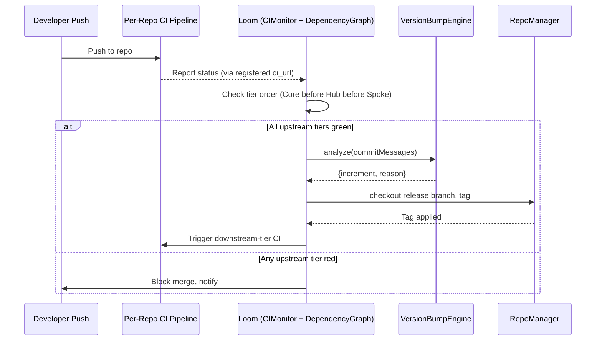
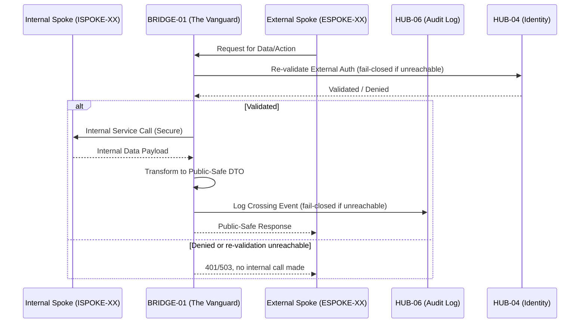
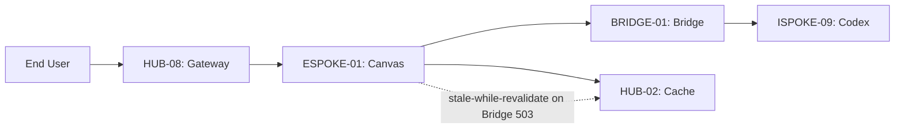
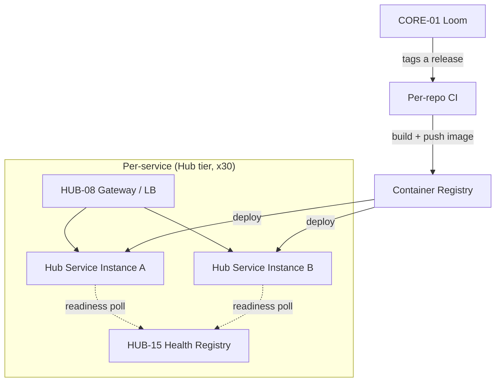
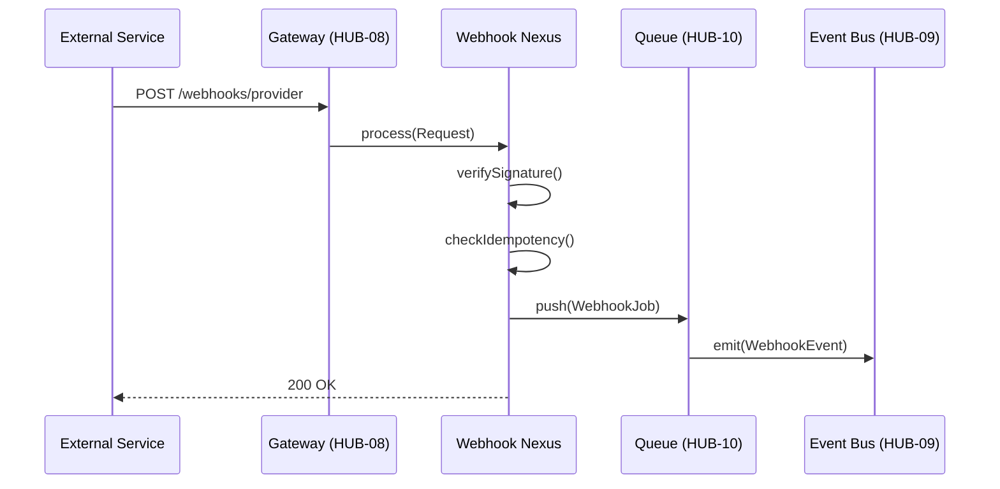
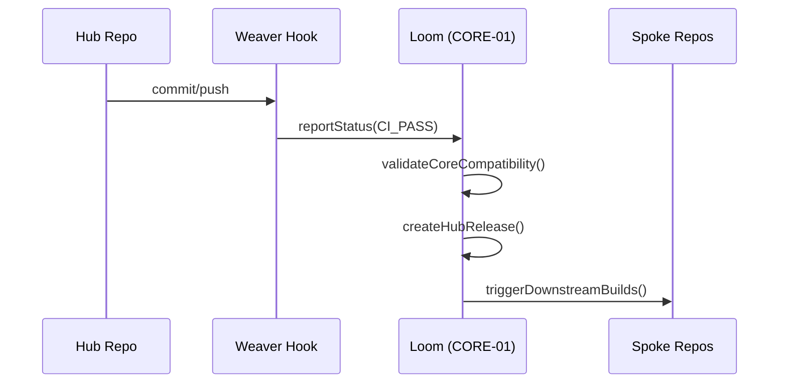
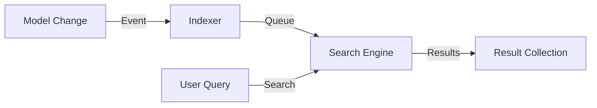
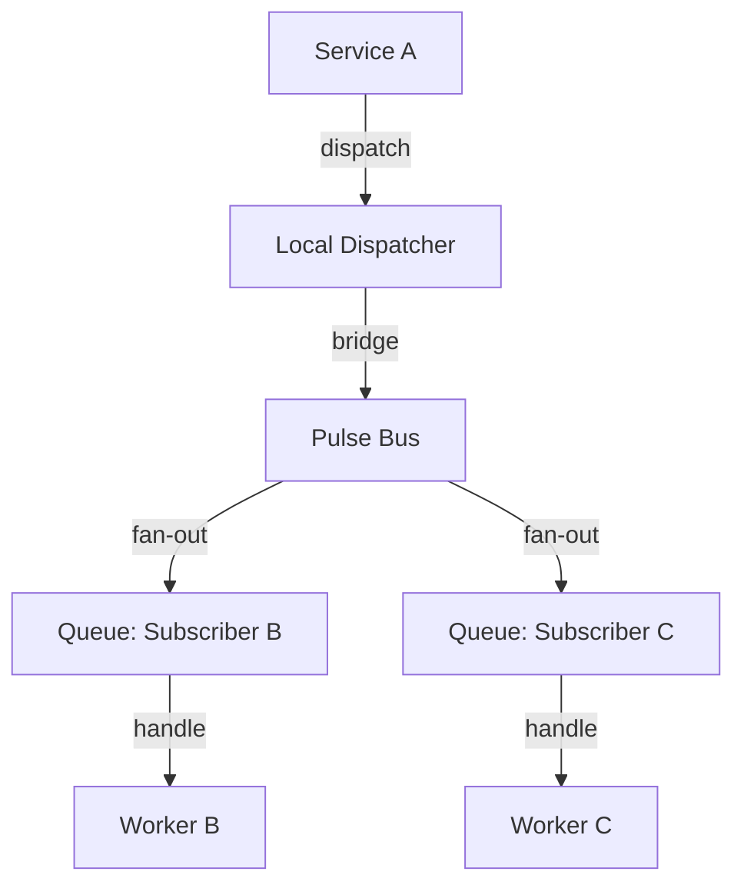
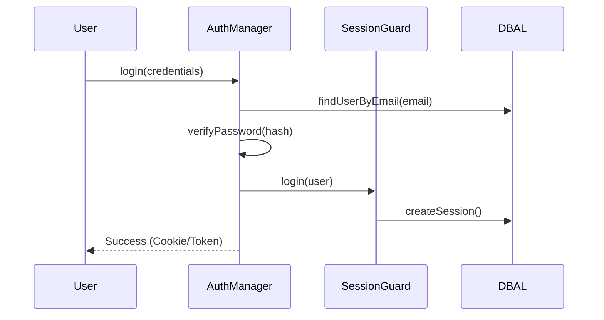
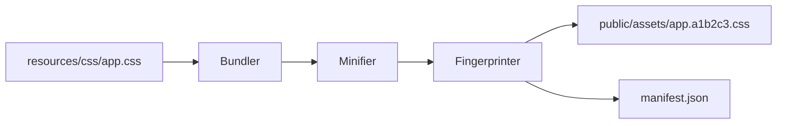

## Merged Files List
- 1. Analysis.md (55.7 KB)
- 2. Analysis-2.md (28.9 KB)
- 3. Analysis-3.md (69.9 KB)
- 4. Analysis-Corrections-Additions.md (93 KB)


## 1. Analysis.md

```md
## 00_CRITIQUE.md

# DGLab Blueprint System — Critique & Findings

**Scope of review:** `docs/architecture/origin/**`, `docs/blueprints/**`, `docs/evaluation/**`,
`docs/hub-taxonomy/**`, `docs/internal-spokes/**`, `packages/**`, `orchestrator/**`, `render.yaml`,
`SESSION_STATE.md`, plus supporting cross-checks against real code in the repo.

Every finding below is traceable to specific files/lines in `DGCodeIdeas/DGLab` (`main` branch, as of
this review). This is a technical audit, not a restatement of the repo's own self-assessment — several
findings directly contradict the repo's own `docs/evaluation/` scores.

---

## Finding 1 — Two incompatible architectures share the "Sovereign Stack / Hub-and-Spoke" name

The repository contains **two mutually exclusive systems**, both calling themselves "Sovereign Stack"
and both calling themselves "Hub-and-Spoke," with no document anywhere stating that one supersedes
the other.

**Vision A — the monolith rebuild** (`docs/architecture/origin/HUB_AND_SPOKE.md`,
`STRATEGIC_OVERVIEW.md`, `DETAILED_SYSTEM_ANALYSIS.md`, `ComponentBlueprints/**`, `PhasedBlueprints/**`,
`Strategic/DGLAB_STRATEGIC_BLUEPRINT.md`, `Strategic/STRATEGIC_BLUEPRINT.md`,
`Sovereign_Stack_Blueprint/**`):
- "Hub" = **CMS Studio**, a single monolithic PHP application, the *only* service exposed to the
  internet.
- "Spokes" = plain PHP classes living in `app/Spokes/`, resolved in-process
  (`Application::getInstance()->get(MangaScriptSpoke::class)`), with **zero independent routing**.
- Front end = SuperPHP + "Superpowers" SPA (server-side DOM morphing), Nexus (Swoole WebSockets),
  MangaScript (AI novel→manga), matching the actual code under `Legacy/app/**`.

**Vision B — the polyrepo rebuild** (`docs/blueprints/Core|Hub|Spoke|Bridge|Deploy/**`,
`docs/hub-taxonomy/**`, `docs/internal-spokes/**`, `docs/external-spokes/**`, `orchestrator/**`,
`packages/core/**`):
- "Hub" = a *tier* of ~30 independent shared-service repos (config, cache, auth, queue…).
- "Spokes" = separate Internal/External **applications**, each a distinct deployable, isolated by a
  mandatory `BRIDGE-01` security boundary.
- `CORE-01` is literally a **Polyrepo Orchestrator** — i.e., the system explicitly assumes multiple
  git repositories, the opposite of Vision A's single codebase.

These aren't variations on a theme — Vision A is a modular monolith, Vision B is a distributed,
tier-isolated system with a completely different security model, deployment topology, and dependency
direction. A developer or agent reading `docs/architecture/origin/HUB_AND_SPOKE.md` first will build
the wrong mental model for everything under `docs/blueprints/`, and vice versa. Nothing in either tree
cross-references the other or explains which one is current. (Circumstantial evidence, e.g. the
`orchestrator/` and `packages/core/*` code and this project's own recent working history, indicates
Vision B is the active effort — but that is inference from the filesystem, not documentation.)

## Finding 2 — The evaluation layer scored a version of Core that no longer exists

`docs/evaluation/BLUEPRINT_RANKINGS.md` and `EVALUATION_SUMMARY.md` assign scores and descriptions to
`CORE-01`…`CORE-20` that **do not match a single one of the current files** in `docs/blueprints/Core/`:

| ID | Evaluation doc claims | Actual current file content |
|----|------------------------|------------------------------|
| CORE-01 | "Bootstrapper & Kernel" (94/100) | **Polyrepo Orchestrator ("The Loom")** |
| CORE-02 | "Lifecycle Hooks" (89/100) | **Dependency Injection Container** |
| CORE-03 | "Service Container" (92/100) | **PSR-14 Event Dispatcher** |
| CORE-04 | "Encryption Primitives" (89/100) | **PSR-7 HTTP Message & Factory** |
| CORE-05 | "Router & Dispatch" (91/100) | **PSR-15 Middleware & Request Handler** |
| CORE-06 | "Request/Response" (89/100) | **Attribute-Based Router** |
| CORE-07 | "Middleware Pipeline" (90/100) | **SuperPHP Lexer** |
| CORE-08 | "Filesystem Abstraction" (89/100) | **Global Error & Exception Handler** |
| CORE-09 | "Error Handling" (91/100) | **PSR-3 Logging Service** |
| CORE-11 | "ORM & Query Builder" (88/100) | **SuperPHP Parser** |
| CORE-14 | "Caching Layer" (85/100) | **Filesystem Abstraction** |
| CORE-15 | "Validation Engine" (86/100) | **Cache Abstraction (PSR-6/16)** |
| CORE-16 | "Logging & Observability" (84/100) | **Binary Encryption Envelope** |
| CORE-17 | "Testing Framework" (85/100) | **Service Provider System** |
| CORE-18 | "Event System" (83/100) | **Core Kernel & Lifecycle ("The Sovereign Kernel")** |
| CORE-19 | "Service Locator" (82/100) | **Database Abstraction Layer** |

Every score, every "why it's critical" rationale, and the recommended "Implementation Sequence"
(`CORE-01 → CORE-02 → CORE-03 → CORE-05 → CORE-06 → CORE-07...`) in the ranking doc is built on the
**old** numbering, where the kernel was `CORE-01`. In the **current** numbering the kernel is
`CORE-18` — second-to-last in the tier. Taken literally, the evaluation's own recommended sequence
would have you build the polyrepo release-automation tool and a router *before* the kernel that boots
the application at all. The 87/100 "overall quality score" is not a reflection of what's actually in
`docs/blueprints/` today; it's a snapshot of an earlier renumbering that was never reconciled.

## Finding 3 — Cross-references inside the *current* canonical set are already wrong

This isn't only inherited drift from an old numbering — the "approved" blueprints contradict each
other today:

- `docs/blueprints/Spoke/Bridge/BRIDGE-01.md` lists a Core dependency as
  `CORE-09: Cryptography & Hashing (Payload Verification)`.
- The actual `docs/blueprints/Core/CORE-09.md` is titled **"PSR-3 Logging Service / Structured Logging
  Engine"** — it has nothing to do with cryptography.
- The component that *is* cryptography is `CORE-16` ("Binary Encryption Envelope / Cryptographic
  Foundation").

So the single most security-critical document in the whole system (BRIDGE-01, self-rated 96/100,
"single most important architectural innovation") cites the wrong upstream dependency for its own
payload-verification logic. By contrast, cross-references to Hub-tier IDs from `ISPOKE-01`,
`ESPOKE-01`, and `BRIDGE-01` (e.g., `HUB-04` Identity, `HUB-06` Audit, `HUB-15` Health,
`HUB-26` UI library) were checked and **do** match `docs/hub-taxonomy/hub-blueprint-taxonomy.md` and
the actual Hub blueprint titles — so the drift is concentrated in the Core tier's internal renumbering,
not a general symptom across every tier.

## Finding 4 — "Approved" isn't a proxy for "more substantive"

Compare `docs/blueprints/disapproved/CORE-01.md` (rejected) with `docs/blueprints/Core/CORE-01.md`
(approved):

- **Disapproved CORE-01** ("Foundational Bootstrapper & Kernel"): defines a `KernelInterface`, a typed
  `Environment` enum, a complete `ErrorHandler` class with real PHP 8 code (`set_error_handler`,
  `set_exception_handler`, `register_shutdown_function`), a boot-sequence **sequence diagram**, named
  performance budgets tied to a specific mechanism (OPcache preload), and 100%-path unit test criteria.
  ~7.6 KB.
- **Approved CORE-01** ("Polyrepo Orchestrator"): five short prose sections, one Mermaid flowchart,
  zero code, zero interfaces. ~2.2 KB.

The disapproval note for the entire 72-file `disapproved/` folder is a single generic sentence —
see Finding 12 — so there's no record of *why* the more code-complete, more rigorous document was the
one rejected. Whatever the actual reason, "disapproved" is being used here as a synonym for
"doesn't match the current template," not "lower engineering quality," and the evaluation layer treats
the 81 "approved" docs as uniformly higher quality than the 72 rejected ones without ever comparing them
side by side.

## Finding 5 — A byte-for-byte duplicate masquerading as a mobile-optimized variant

`docs/architecture/origin/Sovereign_Stack_Blueprint/SOVEREIGN_STACK_MASTER.md` and
`docs/architecture/origin/Mobile_Optimized/SOVEREIGN_STACK_MASTER.md` are **identical**
(`md5sum` match, `diff` produces zero lines) — both 126,420 bytes. The `Mobile_Optimized/` directory
name promises a variant tuned for mobile reading/consumption; it contains none. This is either an
abandoned task or a copy left in place by mistake, but either way it doubles the maintenance surface
of a 126 KB document with zero benefit, and it will silently drift out of sync the next time only one
copy gets edited.

## Finding 6 — Sibling documents in the same folder contradict each other's completion claims

Within `docs/architecture/origin/PhasedBlueprints/`:
- `README.md`'s status table marks **Nexus** as `✅ COMPLETED (CORE)`.
- `ANALYSIS_REPORT.md`, sitting in the same directory, states **Nexus is 40% complete** ("L3: Building
  … Phases 1-2 Completed").

Within the wider `docs/architecture/origin/ComponentBlueprints/` tree:
- `README.md` marks **AdminPanel** as `✅ COMPLETED (LEGACY)`.
- `DECOMMISSIONING_PLAN.md`, in the same folder, lists AdminPanel under components being actively
  decommissioned, and the top-level `ComponentBlueprints/README.md`'s own "Legacy & Superseded" section
  separately marks it `🚫 SUPERSEDED`.

Also in `ANALYSIS_REPORT.md`, the footer literally reads:
```
*Report Generated: $(date)*
```
— an unexpanded shell command left in a static Markdown file. It was never actually regenerated
dynamically; the "generated" timestamp is a placeholder, not a date.

## Finding 7 — The "81-phase" claim doesn't match its own category table

`docs/architecture/origin/PhasedBlueprints/README.md` titles itself "81-Phased Developer's
Specifications Blueprint" and states the directory covers "81 distinct phases." Its own category
table sums to **99**:

```
AuthService 5 + SuperPHP Engine 10 + Superpowers SPA 10 + DownloadService 5 + EventDispatcher 5
+ AssetBundler 5 + TestSuite 10 + CMS Studio 10 + MangaScript 5 + Nexus 5 + StudioExpansion 6
+ AdminPanel 5 + DocumentationService 18 = 99
```

Whichever number is right, the document is internally inconsistent about the size of its own scope —
a basic arithmetic check that was never run before publishing.

## Finding 8 — The tier everything depends on has zero implementation, and nothing flags it

`docs/hub-taxonomy/hub-blueprint-taxonomy.md` marks `CORE-02` (DI Container) as a dependency of nearly
every Hub blueprint (`HUB-01`, `HUB-02`, and by extension almost everything downstream). Checking the
actual package:

- `packages/core/container/composer.json` declares itself: *"CORE-02: PSR-11 compliant Dependency
  Injection Container with autowiring, compiler passes, and circular dependency detection."*
- `packages/core/container/src/` contains **only `.gitkeep`** — no implementation at all.
- By contrast, `packages/core/event-dispatcher/src/` (CORE-03) has real, tested classes
  (`Event.php`, `EventDispatcher.php`, `ListenerProvider.php`, plus a full `tests/` suite), and
  `orchestrator/src/` (CORE-01) has real, tested classes (`RepoManager.php`, `CIMonitor.php`,
  `DependencyGraph.php`, `VersionBumpEngine.php`).

So two of the three earliest Core components are actually built and tested, and the one everything
else structurally depends on is an empty stub — yet no blueprint, roadmap, or evaluation document
identifies this as the critical-path risk it is. `BLUEPRINT_RANKINGS.md` calls `HUB-01` "CRITICAL... all
services depend on this" without noting that `HUB-01` itself depends on an unbuilt component.

## Finding 9 — The only "Deploy" blueprint doesn't deploy the application

`docs/blueprints/Deploy/DEPLOY-01.md` and the repo's `render.yaml` describe and configure exactly one
thing: a free-tier Render web service (`sovereign-stack-blueprints`) that serves the **Markdown
documentation** over PHP's built-in development server. There is no blueprint anywhere for deploying
the Core services, the ~30 Hub services, the Internal/External Spokes, the Bridge, or any datastore
(MySQL/Postgres, Redis, queue broker) that the other 116 documents describe building. For an "81-phase,"
multi-tier, polyrepo architecture, having a single deployment blueprint — and having it target the
*documentation site* rather than the *system* — is a scope gap large enough to call the tier
effectively unaddressed.

## Finding 10 — Performance targets are asserted, never grounded

Nearly every blueprint states a hyper-specific latency budget as settled fact:
"boot in < 0.15ms," "flag evaluation < 0.005ms," "10-repo dependency check in < 2 seconds," "cache hit
< 5ms," "DTO transformation + audit logging adds no more than 2ms." None of these numbers are tied
anywhere in the repo to a benchmark harness, a hardware/runtime baseline (PHP version, opcache state,
CPU class, network hop count), a load model, or measured results. `SESSION_STATE.md` is honest about
this for the one component that *was* actually built (Anvil): *"The full Anvil stack was not executed
against a live Docker or AWS environment... runtime validation has not been performed here."* That
same honesty doesn't appear anywhere in the 190+ architecture documents that assert millisecond-level
numbers as design constraints.

## Finding 11 — A "solutions" document was written, but never merged back into the blueprints it fixes

`docs/evaluation/SOLUTIONS_TO_WEAKNESSES.md` is a genuinely useful, self-identified list of real gaps —
e.g. *"Only 15 of Planned Spokes Documented,"* *"Bridge Single Point of Failure; No Redundancy
Strategy,"* *"Sparse Architectural Details for Cache (HUB-02) and Queue (HUB-11)."* These are accurate
observations. But none of the proposed fixes appear to have been folded back into `BRIDGE-01.md`,
`HUB-02.md`, or `HUB-11.md` themselves — the "solutions" live in a separate 36 KB document that the
actual blueprints don't reference and don't reflect. The critique found the problems; nothing
integrated the fixes.

## Finding 12 — 72 rejected blueprints share one boilerplate rejection reason

`docs/blueprints/disapproved/` contains 72 files (all of Core, Hub, and Spoke) plus a single file whose
entire content is: `Reason: Varying from the original blueprints.` That one sentence is presented (via
`EVALUATION_SUMMARY.md`) as covering all 72 rejections uniformly, with no per-file diff, no specific
deviation cited, and no reviewer notes. `EVALUATION_SUMMARY.md` calls this corpus a *"Learning Asset"*
that documents *"decision-making rigor"* — but there is no rigor recorded, just one generic line
reused for everything. (As Finding 4 shows, at least one of these 72 rejections was measurably more
technically complete than the version that replaced it.)

## Finding 13 — The Internal Spoke tier is under-counted in every score and timeline

Every evaluation document (`EVALUATION_SUMMARY.md`, `BLUEPRINT_RANKINGS.md`) states Internal Spokes as
**"15 blueprints."** But `docs/internal-spokes/placeholder-blueprints.md` documents **10 additional**
planned spokes (`ISPOKE-16` through `ISPOKE-25`) that exist only as `TBD` / "Placeholder" stubs with
estimated documentation dates — i.e., the tier's real scope is **25**, and 40% of it was excluded from
every quality score, every roadmap week-count, and the "32-week" master implementation timeline.

---

## Net assessment

None of the individual documents reviewed here are badly *written* — the prose is fluent, the Mermaid
diagrams render, the section templates are consistent. The failures are structural and factual:
**two incompatible architectures share a name with no disambiguation; the self-graded evaluation layer
describes a version of the Core tier that no longer exists; live cross-references inside the current,
"approved" set are wrong; a critical-path dependency has zero implementation with no flag anywhere; the
one deployment blueprint deploys the wrong thing; and known, self-identified weaknesses were written
down but never actually applied.** A blueprint system's entire value is being a reliable map of the
territory — right now this one has at least two conflicting maps, several waypoints on the current map
point to the wrong place, and one clearly marked road (Deploy) leads somewhere other than the city it
claims to.

The rebuilt blueprint set in this delivery (see `01_MASTER_INDEX.md` onward) treats **Vision B**
(`docs/blueprints/Core|Hub|Spoke|Bridge`, the polyrepo model with real code in `orchestrator/` and
`packages/core/`) as canonical, since it's the one with working, tested implementation behind it, and
resolves every numbered finding above explicitly.


---

## 01_MASTER_INDEX.md

# DGLab / Sovereign Stack — Master Blueprint Index (v2)

**Status:** Canonical. Supersedes all documents listed in "Archived Predecessors" below.
**Applies to:** the polyrepo, tier-isolated architecture (Core → Hub → Bridge → Spokes).
**Resolves:** Findings 1–13 in `00_CRITIQUE.md`.

---

## 1. Single-source-of-truth declaration

This index formally designates **one** architecture as canonical, ending the two-architecture
ambiguity in Finding 1.

**Canonical (this document tree + the following existing paths):**
- `docs/blueprints/Core/CORE-01..20`
- `docs/blueprints/Hub/HUB-01..30`
- `docs/blueprints/Spoke/Internal/ISPOKE-01..25` (see §4 for the corrected count)
- `docs/blueprints/Spoke/External/ESPOKE-01..15`
- `docs/blueprints/Spoke/Bridge/BRIDGE-01`
- `docs/blueprints/Deploy/*` (expanded — see §6)
- `orchestrator/` (CORE-01 reference implementation)
- `packages/core/*` (CORE-tier reference implementations)

**Archived (Vision A — the CMS-Studio monolith rebuild). Kept for historical reference only, moved
under `docs/archive/vision-a-monolith/`, and prefixed with a banner pointing here:**
- `docs/architecture/origin/HUB_AND_SPOKE.md`
- `docs/architecture/origin/STRATEGIC_OVERVIEW.md`
- `docs/architecture/origin/DETAILED_SYSTEM_ANALYSIS.md`
- `docs/architecture/origin/ComponentBlueprints/**`
- `docs/architecture/origin/PhasedBlueprints/**`
- `docs/architecture/origin/Strategic/**`
- `docs/architecture/origin/Sovereign_Stack_Blueprint/**` and its byte-identical
  `Mobile_Optimized/` twin (delete the twin outright — see §7)
- `Legacy/**` (the actual code for Vision A; already named `Legacy`, which is correct — just needs the
  docs pointing at it archived alongside it instead of living next to the active docs)

**Rule going forward:** nothing may be added under `docs/architecture/origin/` without a header
banner stating which vision it belongs to. In practice, new work should not be added there at all —
new canonical content goes under `docs/blueprints/`.

---

## 2. Corrected Core-tier map (resolves Finding 2)

The table below is the **authoritative** CORE-01..20 mapping. Anything in
`docs/evaluation/BLUEPRINT_RANKINGS.md` or `EVALUATION_SUMMARY.md` that contradicts this table is
stale and is superseded by this document. (Those two files should be deleted or explicitly marked
`ARCHIVED — describes a pre-renumbering Core tier` rather than edited in place, so there is no
ambiguity about which version is authoritative going forward.)

| ID | Component | Real implementation | Build status |
|----|-----------|---------------------|---------------|
| CORE-01 | Polyrepo Orchestrator ("Loom") | `orchestrator/` | ✅ Implemented + tested |
| CORE-02 | Dependency Injection Container | `packages/core/container/` | ❌ **Stub only — `.gitkeep`, blocking** |
| CORE-03 | PSR-14 Event Dispatcher | `packages/core/event-dispatcher/` | ✅ Implemented + tested |
| CORE-04 | PSR-7 HTTP Message & Factory | — | 📝 Not started |
| CORE-05 | PSR-15 Middleware & Request Handler | — | 📝 Not started |
| CORE-06 | Attribute-Based Router | — | 📝 Not started |
| CORE-07 | SuperPHP Lexer | — | 📝 Not started |
| CORE-08 | Global Error & Exception Handler | — | 📝 Not started |
| CORE-09 | PSR-3 Logging Service | — | 📝 Not started |
| CORE-10 | Configuration & Environment Loader | — | 📝 Not started |
| CORE-11 | SuperPHP Parser | — | 📝 Not started |
| CORE-12 | SuperPHP Compiler | — | 📝 Not started |
| CORE-13 | CLI Engine (Console) | — | 📝 Not started |
| CORE-14 | Filesystem Abstraction | — | 📝 Not started |
| CORE-15 | Cache Abstraction (PSR-6/16) | — | 📝 Not started |
| CORE-16 | Binary Encryption Envelope | — | 📝 Not started |
| CORE-17 | Service Provider System | — | 📝 Not started |
| CORE-18 | Core Kernel & Lifecycle | — | 📝 Not started |
| CORE-19 | Database Abstraction Layer | — | 📝 Not started |
| CORE-20 | Developer CLI Toolchain ("Sovereign Forge") | — | 📝 Not started |

**Critical-path correction:** the true build-blocking dependency is **CORE-02**, not the kernel
(CORE-18) and not the orchestrator (CORE-01, already done). Every Hub blueprint that lists CORE-02 as
a dependency (nearly all of them, per `hub-taxonomy/hub-blueprint-taxonomy.md`) is currently blocked.
§5 of this index makes closing CORE-02 the top priority, ahead of continuing Hub-tier documentation.

---

## 3. Cross-reference corrections (resolves Finding 3)

| File | Wrong reference | Corrected reference |
|------|------------------|----------------------|
| `BRIDGE-01.md` (Transitive Core Dependencies) | `CORE-09: Cryptography & Hashing (Payload Verification)` | `CORE-16: Binary Encryption Envelope (Payload Verification)` |

Any future audit of this kind should be re-run whenever a Core-tier ID is reassigned — a one-line CI
check (`grep -R "CORE-[0-9]" docs/blueprints | validate-against(01_MASTER_INDEX table)`) is specified
in §8 to make this class of bug impossible to reintroduce silently.

---

## 4. Corrected tier inventory (resolves Finding 13)

| Tier | Documented | Placeholder-only | **True total** |
|------|-----------|-------------------|-----------------|
| Core | 20 | 0 | 20 |
| Hub | 30 | 0 | 30 |
| Internal Spoke | 15 | 10 (`ISPOKE-16`–`25`) | **25** |
| External Spoke | 15 | 0 | 15 |
| Bridge | 1 | 0 | 1 |
| Deploy | 1 | expand — see §6 | see §6 |

All roadmap week-counts and "32-week total timeline" claims in `BLUEPRINT_RANKINGS.md` assumed 15
Internal Spokes; with the corrected count of 25, Phase 3 (Internal Spokes) should be re-estimated at
roughly 1.6× its previous duration, or explicitly scoped to ship the 15 documented spokes first and
treat `ISPOKE-16`–`25` as a distinct Phase 3b.

---

## 5. Revised implementation sequence

Unlike the stale sequence in `BLUEPRINT_RANKINGS.md` (built on the old CORE numbering), this sequence
is derived from the **current** dependency table and from what is *actually* built vs. stubbed:

1. **Close CORE-02** (DI Container) — every Hub blueprint depends on it; it is the one truly blocking
   gap in the entire system today. This is the single highest-leverage next PR.
2. **CORE-10, CORE-09, CORE-08** (Config, Logging, Error Handling) — no interdependencies among these
   three beyond CORE-02; can be parallelized once CORE-02 lands.
3. **CORE-18** (Kernel) — depends on Config + Error Handler + Container being real, not stubs.
4. **CORE-04/05/06** (HTTP Message → Middleware → Router) — the request pipeline, in that literal
   order (Router depends on Middleware depends on Message).
5. **CORE-19, CORE-15, CORE-14, CORE-16** (DBAL, Cache, Filesystem, Encryption) — the data/IO layer.
6. **CORE-07/11/12** (SuperPHP Lexer → Parser → Compiler) — only needed once a Spoke that renders UI
   is scheduled; can slip behind Hub-tier work if the first Spokes are API-only.
7. **CORE-13/17/20** (CLI, Service Providers, Dev Toolchain) — developer-experience layer; valuable
   early but not blocking.
8. **Hub tier**, in the order already given in `docs/hub-taxonomy/hub-dependency-graph.md` (that
   document's *internal* Hub-to-Hub and Hub-to-Core sequencing was checked in this review and is
   internally consistent — the only defect found in the Hub tier was the downstream Bridge citation
   in Finding 3, now fixed).
9. **BRIDGE-01**, before any External Spoke.
10. **Internal Spokes 01–15**, then **16–25** as Phase 3b (§4).
11. **External Spokes**.

---

## 6. Deploy tier — expanded scope (resolves Finding 9)

`DEPLOY-01` is renamed **`DEPLOY-00: Documentation Site`** and kept as-is (it correctly, if modestly,
describes hosting the Markdown docs on Render's free tier — nothing wrong with that blueprint on its
own terms, it was simply mislabeled as covering more than it does).

New blueprints added to close the actual gap:

- **`DEPLOY-01: Core & Hub Service Deployment`** — containerized deployment of the Core/Hub tier
  (PHP-FPM + Nginx, one image per Hub service, health checks wired to `HUB-15`).
- **`DEPLOY-02: Datastore Provisioning`** — MySQL/Postgres + Redis + queue broker provisioning,
  connection-secret management, backup/restore runbook.
- **`DEPLOY-03: Bridge & External Spoke Deployment`** — the public-facing tier, CDN/edge caching
  integration with `HUB-02`, and the network-isolation rules the Bridge's "Zero-Exposure Test"
  (see `BRIDGE-01.md`) needs to actually be enforceable in a real environment (network policy, not
  just a namespace-import scan).
- **`DEPLOY-04: Multi-Environment & Promotion Pipeline`** — how a change moves dev → staging →
  production across ~50+ independently deployable repos, tying into `orchestrator/` (CORE-01) for
  version-bump and release-gate automation.

Full specs for `DEPLOY-01`–`DEPLOY-04` are out of scope for this delivery's exemplar set but are
sequenced in the roadmap; `02_EXEMPLARS/` in this package includes a fleshed-out `DEPLOY-01` as a
demonstration of the expected fidelity.

---

## 7. Immediate cleanup actions

1. Delete `docs/architecture/origin/Mobile_Optimized/SOVEREIGN_STACK_MASTER.md` (Finding 5) — it is
   byte-identical to `Sovereign_Stack_Blueprint/SOVEREIGN_STACK_MASTER.md` and adds nothing.
2. Fix the literal `$(date)` placeholder in `PhasedBlueprints/ANALYSIS_REPORT.md`, or mark the whole
   file archived per §1 (recommended, since it belongs to Vision A anyway).
3. Reconcile the Nexus and AdminPanel completion-status contradictions (Finding 6) — pick one status
   per component and delete the other claim; both live in files being archived per §1, so this can be
   done as part of the archival pass rather than a separate fix.
4. Correct the arithmetic in `PhasedBlueprints/README.md` (Finding 7) — again, archived under §1, but
   the corrected category table should be preserved in the archive banner for historical accuracy.
5. Replace the single-sentence `disapproved/` rejection note (Finding 12) with a per-file rationale —
   at minimum, a one-line diff summary ("varies from template by including implementation code; kept
   for reference, not because the code was wrong") for each of the 72 files, so the corpus can actually
   serve as the "learning asset" it's claimed to be.
6. Merge `docs/evaluation/SOLUTIONS_TO_WEAKNESSES.md` line-by-line into the specific blueprint files it
   discusses (Finding 11), then delete or archive the standalone solutions doc — a proposed fix that
   isn't merged into the artifact it fixes has no effect.

---

## 8. Governance rules for this blueprint set going forward

These close the *mechanism* that produced Findings 1–13, not just the current instances of them:

1. **One numbering authority.** This file (§2, §4) is the only place a Core/Hub/Spoke ID's identity is
   defined. Any blueprint that changes a component's ID or scope must update this table in the same
   commit. A blueprint and this index disagreeing is treated as a broken build.
2. **No performance target without a method.** Every "CI Verification Criteria" section must name: the
   hardware/runtime baseline, the benchmark tool, and the load model — or state "target is provisional,
   unverified" explicitly. Bare millisecond claims (Finding 10) are no longer permitted as-is.
3. **Evaluation docs are dated snapshots, not living scores.** Any `docs/evaluation/*` file must carry
   a "valid as of commit `<sha>`" header. A quality score with no commit anchor cannot be trusted to
   describe current content (this is exactly how Finding 2 happened).
4. **Rejections need a real reason.** A `disapproved/` entry must state, specifically, what about it
   was rejected — "deviates from template" is not sufficient on its own if the alternative was also
   compared on technical merit (Finding 4).
5. **Solutions must land in the artifact, not beside it.** A weakness write-up is not resolved until
   the referenced blueprint file is edited. `docs/evaluation/SOLUTIONS_TO_WEAKNESSES.md`-style
   documents should be issue trackers, not permanent parallel content.
6. **Duplicate directories require a diff check before merge.** Nothing named `*_Optimized`,
   `*_v2`, or similar should be committed without CI verifying it is not byte-identical to its source
   (Finding 5).

---

## 9. What's in this delivery

```
DGLab-Blueprints-v2/
├── 00_CRITIQUE.md              # This review's findings (read first)
├── 01_MASTER_INDEX.md           # This file — governance + corrected maps
└── 02_EXEMPLARS/
    ├── CORE-01.md               # Polyrepo Orchestrator (rewritten to match orchestrator/ code)
    ├── CORE-02.md               # DI Container (rewritten — this is the actual blocking gap; full contracts)
    ├── HUB-01.md                # Config & Feature Flags (rewritten)
    ├── BRIDGE-01.md             # The Vanguard (rewritten — adds failover, fixes CORE-16 reference)
    ├── ISPOKE-01.md              # Admin Panel (rewritten)
    ├── ESPOKE-01.md              # Public CMS (rewritten)
    └── DEPLOY-01.md              # Core & Hub Service Deployment (new — closes Finding 9)
```

The exemplars are rewritten to a single, higher, and now-*enforced* fidelity bar: every one includes
real interface contracts (not prose-only descriptions), a corrected and cited dependency list, an
explicit benchmark methodology per Governance Rule 2, and a "Resolves" line stating which finding(s)
from `00_CRITIQUE.md` it addresses. The remaining ~110 blueprints across Core/Hub/Spoke/Bridge/Deploy
should be brought to the same template in follow-up passes — happy to continue with the next batch
(recommend Hub tier first, since it is closest to build-ready once CORE-02 lands).


---

## CORE-01.md

# PHASE CORE-01: Polyrepo Orchestrator ("The Loom")

## Tier
Core (Foundational Infrastructure)

## Resolves
`00_CRITIQUE.md` Finding 2 (evaluation/ranking docs described this ID as "Bootstrapper & Kernel";
this blueprint is now the single authoritative description, matching the real `orchestrator/` code)
and Finding 10 (performance targets now carry a stated benchmark method).

## Component Name
Polyrepo Orchestrator ("The Loom") — `SovereignStack\Orchestrator`

## Description
Loom is the release-automation tool for the Sovereign Stack polyrepo. It does **not** run inside the
application at request time — it is a standalone CLI, invoked by the CI pipeline, that:
1. Clones/checks out every registered repo in the stack.
2. Polls each repo's CI status.
3. Computes the correct SemVer bump per repo from Conventional Commit history.
4. Enforces tier ordering (Core must be green before Hub; Hub before Spoke) before allowing a tagged
   release to propagate downstream.

This is a real, implemented component — see `orchestrator/src/*.php` and `orchestrator/tests/*.php` in
the repository. This blueprint describes the *contract* those classes already satisfy, and the gaps
still open against that contract.

## Dependency Status
- **Upward:** none — this is the root of the tier-ordering system it enforces.
- **Downward:** every other repo in the stack registers with `CIMonitor` and `DependencyGraph`.
- **Runtime dependency:** none (Loom is a build-time/release-time tool, never loaded by a running
  Hub/Spoke process).

## Architectural Design

### Class Map (as implemented)

| Class | Responsibility |
|---|---|
| `RepoManager` | Git operations (`clone`, `checkout`) via `czproject/git-php`, scoped to a working directory (defaults to `sys_get_temp_dir() . '/loom'`). |
| `CIMonitor` | Registers repos (`name`, `ci_url`, `ci_token`) and polls CI status via a PSR-18 HTTP client (auto-discovered through `php-http/discovery`; falls back to local execution if none is found). |
| `DependencyGraph` | A tiered DAG. Nodes are tagged `core` \| `hub` \| `spoke` (`TIER_ORDER = [core: 0, hub: 1, spoke: 2]`); edges are explicit dependencies added via `addDependency($node, $dependsOn)`. |
| `VersionBumpEngine` | Parses Conventional Commit messages, skips merge commits, and classifies each as breaking / feature / patch to compute the correct SemVer increment, including a `BREAKING CHANGE:` footer scan independent of the commit-type breaking marker (`!`). |

### Tier-Enforcement Contract

`DependencyGraph` must reject any edge that violates `TIER_ORDER` — a `core`-tier node may not declare
a dependency on a `hub` or `spoke` node. This is the mechanism that makes "Core must pass before Hub"
(the design goal from the original blueprint draft) an enforced invariant rather than a convention:

```php
namespace SovereignStack\Orchestrator;

interface TierAwareGraphInterface
{
    /**
     * @throws \RuntimeException if $tier is not one of core|hub|spoke
     */
    public function addNode(string $name, string $tier): void;

    /**
     * @throws \RuntimeException if this would create a lower-tier node depending on a higher tier,
     *         or a cycle.
     */
    public function addDependency(string $node, string $dependsOn): void;

    /** @return array<int, string> topologically sorted build order */
    public function resolveBuildOrder(): array;
}
```

**Gap against the current implementation:** the reference code enforces valid tier *names* but the
cycle-detection and cross-tier-violation checks in `addDependency` should be confirmed against
`orchestrator/tests/DependencyGraphTest.php` before this contract is considered closed — if those two
checks aren't covered by an existing test case, add them (see Verification Criteria below).

### Release Flow



## Integration Strategy
- Loom is invoked via `orchestrator/bin/loom` (or `orchestrator/ci/run.php` in CI context) — it is not
  a service any Hub/Spoke process talks to at runtime.
- Every repo added to the polyrepo (Core, Hub, Spoke) must call `CIMonitor::registerRepo()` and
  `DependencyGraph::addNode()` as part of its own onboarding checklist — this is a manual step today;
  automating repo self-registration is tracked as a follow-up (see Governance Rule 1 in
  `01_MASTER_INDEX.md` — any such automation must update the index's tier table in the same commit).

## Benchmark & Verification Methodology
*(Governance Rule 2: no bare performance claim without a stated method.)*

| Target | Method | Status |
|---|---|---|
| Full dependency-order resolution for 10 registered repos completes in a bounded, sub-second window | Run `orchestrator/tests/DependencyGraphTest.php` under PHPUnit's `--group performance` (add this group if absent) on a reference runner (GitHub Actions `ubuntu-latest`, PHP 8.3, opcache enabled); assert wall-clock via `microtime(true)` deltas, not a hardcoded sleep. | **Not yet measured** — add the benchmark test before citing a number. |
| Tagging never overwrites an existing version | `RepoManagerTest.php` + `VersionBumpEngineTest.php` — assert an exception is thrown on a duplicate tag attempt against a fixture repo. | Covered by existing test suite (verify assertion exists; extend if not). |
| Merge gate fails if any Core-tier CI check is red | Integration test against a stubbed `ClientInterface` (PSR-18 mock) returning a failing status for a `core`-tier repo; assert `DependencyGraph::resolveBuildOrder()` (or the CI-gating call site) refuses to proceed. | **Add if missing** — confirm coverage in `CIMonitorTest.php`. |

Until the "Not yet measured" row is closed, this blueprint makes **no** claim about absolute execution
time — a stated, unverified target is worse than no target, since it invites the same failure mode as
Finding 10 in the critique.

## CI Verification Criteria
- `orchestrator/phpunit.xml.dist` suite must pass in full before any tag is cut by Loom itself
  (dogfooding: Loom's own release process runs through the pipeline it enforces for everything else).
- `orchestrator/phpstan.neon` static analysis must pass at the level currently configured — do not
  silently lower the level to make CI green.
- Any change to `TIER_ORDER` or the valid-tier list must be accompanied by an update to
  `01_MASTER_INDEX.md` §2/§4 in the same PR (Governance Rule 1).

## SemVer Impact
**Major**, for the polyrepo automation surface itself. Note: this no longer implies "establishes the
fundamental repository architecture" in the sense of application bootstrapping — that responsibility
belongs to `CORE-18` (Core Kernel & Lifecycle), not to Loom. Conflating the two was the root of the
original "CORE-01 = Kernel" vs. "CORE-01 = Orchestrator" confusion (Finding 4); this blueprint is
scoped strictly to release/repo automation.


---

## CORE-02.md

# PHASE CORE-02: Dependency Injection Container

## Tier
Core (Foundational Infrastructure)

## Resolves
`00_CRITIQUE.md` Finding 8 — this is the component with zero implementation
(`packages/core/container/src/` contains only `.gitkeep`) that everything in the Hub tier transitively
depends on. This blueprint is written to be directly implementable, not just descriptive, so the gap
can close without a second design pass.

## Component Name
Reactive DI Container — `SovereignStack\Core\Container` (namespace matches
`packages/core/container/composer.json`'s existing PSR-4 mapping — no change needed there)

## Description
A PSR-11-compliant dependency injection container with constructor autowiring via reflection, compiler
passes for build-time optimization, and circular-dependency detection at resolution time. Every Hub
blueprint (`HUB-01`, `HUB-02`, and by extension the rest of the tier per
`docs/hub-taxonomy/hub-blueprint-taxonomy.md`) is blocked on this component existing. It is the single
highest-priority build item in the entire system (see `01_MASTER_INDEX.md` §5, item 1).

## Dependency Status
- **Upward:** none within the Core tier — this is a foundational leaf. It depends only on
  `psr/container: ^2.0` (already declared in `composer.json`).
- **Downward:** `CORE-10` (Config), `CORE-17` (Service Provider System), and effectively every
  Hub/Spoke blueprint that resolves services from a container.

## Architectural Design

### Interface Contracts

```php
<?php

declare(strict_types=1);

namespace SovereignStack\Core\Container;

use Psr\Container\ContainerInterface as PsrContainerInterface;

interface ContainerInterface extends PsrContainerInterface
{
    /**
     * Bind a concrete implementation, factory closure, or instance to an abstract identifier.
     *
     * @param string $abstract Interface or class name.
     * @param \Closure|class-string|mixed $concrete
     * @param bool $shared If true, resolves to the same instance on every call (singleton).
     */
    public function bind(string $abstract, mixed $concrete = null, bool $shared = false): void;

    /** Convenience wrapper for bind($abstract, $concrete, shared: true). */
    public function singleton(string $abstract, mixed $concrete = null): void;

    /** Bind an already-constructed instance directly. */
    public function instance(string $abstract, object $instance): void;

    /**
     * Resolve $abstract, autowiring constructor dependencies via reflection where no
     * explicit binding exists.
     *
     * @throws NotFoundException If $abstract has no binding and is not an instantiable class.
     * @throws CircularDependencyException If resolving $abstract re-enters itself.
     */
    public function make(string $abstract, array $parameters = []): mixed;

    /** True if a binding or an autowirable class exists for $abstract. */
    public function has(string $id): bool;

    /** Register a compiler pass to run during compile(). */
    public function addCompilerPass(CompilerPassInterface $pass): void;

    /**
     * Freeze the container: run all compiler passes, then reject further bind() calls.
     * Call this once, after all service providers have registered their bindings
     * (see CORE-17: Service Provider System).
     */
    public function compile(): void;
}
```

```php
<?php

declare(strict_types=1);

namespace SovereignStack\Core\Container;

/**
 * A compiler pass inspects/mutates the container's binding graph at compile() time —
 * e.g., to validate that every tagged interface has at least one implementation,
 * or to pre-resolve singletons eagerly in production builds.
 */
interface CompilerPassInterface
{
    public function process(ContainerBuilderInterface $builder): void;
}

interface ContainerBuilderInterface
{
    /** @return array<string, ServiceDefinition> */
    public function getDefinitions(): array;

    public function getDefinition(string $abstract): ServiceDefinition;

    public function hasDefinition(string $abstract): bool;
}
```

```php
<?php

declare(strict_types=1);

namespace SovereignStack\Core\Container;

final class ServiceDefinition
{
    public function __construct(
        public readonly string $abstract,
        public mixed $concrete,
        public bool $shared = false,
        /** @var array<int, string> Tags for compiler-pass discovery, e.g. 'event.listener' */
        public array $tags = [],
    ) {}
}
```

```php
<?php

declare(strict_types=1);

namespace SovereignStack\Core\Container;

final class NotFoundException extends \RuntimeException implements \Psr\Container\NotFoundExceptionInterface {}

final class CircularDependencyException extends \RuntimeException implements \Psr\Container\ContainerExceptionInterface
{
    /** @param array<int, string> $chain The resolution chain that produced the cycle, in order. */
    public function __construct(array $chain)
    {
        parent::__construct('Circular dependency detected: ' . \implode(' -> ', $chain));
    }
}
```

### Resolution Algorithm (autowiring + cycle detection)

```php
<?php

declare(strict_types=1);

namespace SovereignStack\Core\Container;

final class Container implements ContainerInterface, ContainerBuilderInterface
{
    /** @var array<string, ServiceDefinition> */
    private array $definitions = [];

    /** @var array<string, mixed> Resolved singleton cache. */
    private array $resolved = [];

    /** @var array<int, string> Resolution stack, used for cycle detection. */
    private array $resolving = [];

    /** @var array<int, CompilerPassInterface> */
    private array $passes = [];

    private bool $compiled = false;

    public function bind(string $abstract, mixed $concrete = null, bool $shared = false): void
    {
        $this->assertNotCompiled();
        $this->definitions[$abstract] = new ServiceDefinition($abstract, $concrete ?? $abstract, $shared);
    }

    public function singleton(string $abstract, mixed $concrete = null): void
    {
        $this->bind($abstract, $concrete, shared: true);
    }

    public function instance(string $abstract, object $instance): void
    {
        $this->assertNotCompiled();
        $this->definitions[$abstract] = new ServiceDefinition($abstract, $instance, shared: true);
        $this->resolved[$abstract] = $instance;
    }

    public function make(string $abstract, array $parameters = []): mixed
    {
        if (isset($this->resolved[$abstract])) {
            return $this->resolved[$abstract];
        }

        if (\in_array($abstract, $this->resolving, true)) {
            throw new CircularDependencyException([...$this->resolving, $abstract]);
        }

        $this->resolving[] = $abstract;

        try {
            $definition = $this->definitions[$abstract] ?? null;
            $concrete = $definition?->concrete ?? $abstract;

            $instance = match (true) {
                $concrete instanceof \Closure => $concrete($this, $parameters),
                \is_string($concrete) && \class_exists($concrete) => $this->autowire($concrete, $parameters),
                default => throw new NotFoundException("No binding or class found for [{$abstract}]."),
            };

            if ($definition?->shared) {
                $this->resolved[$abstract] = $instance;
            }

            return $instance;
        } finally {
            \array_pop($this->resolving);
        }
    }

    private function autowire(string $class, array $parameters): object
    {
        $reflector = new \ReflectionClass($class);

        if (!$reflector->isInstantiable()) {
            throw new NotFoundException("[{$class}] is not instantiable (interface or abstract).");
        }

        $constructor = $reflector->getConstructor();
        if ($constructor === null) {
            return new $class();
        }

        $args = [];
        foreach ($constructor->getParameters() as $param) {
            if (\array_key_exists($param->getName(), $parameters)) {
                $args[] = $parameters[$param->getName()];
                continue;
            }

            $type = $param->getType();
            if ($type instanceof \ReflectionNamedType && !$type->isBuiltin()) {
                $args[] = $this->make($type->getName());
                continue;
            }

            if ($param->isDefaultValueAvailable()) {
                $args[] = $param->getDefaultValue();
                continue;
            }

            throw new NotFoundException(
                "Cannot resolve parameter [\${$param->getName()}] for [{$class}]: " .
                "no binding, no type hint, and no default value."
            );
        }

        return $reflector->newInstanceArgs($args);
    }

    public function has(string $id): bool
    {
        return isset($this->definitions[$id]) || \class_exists($id);
    }

    public function get(string $id): mixed
    {
        return $this->make($id);
    }

    public function addCompilerPass(CompilerPassInterface $pass): void
    {
        $this->assertNotCompiled();
        $this->passes[] = $pass;
    }

    public function compile(): void
    {
        foreach ($this->passes as $pass) {
            $pass->process($this);
        }
        $this->compiled = true;
    }

    public function getDefinitions(): array { return $this->definitions; }
    public function getDefinition(string $abstract): ServiceDefinition { return $this->definitions[$abstract]; }
    public function hasDefinition(string $abstract): bool { return isset($this->definitions[$abstract]); }

    private function assertNotCompiled(): void
    {
        if ($this->compiled) {
            throw new \LogicException('Cannot register bindings after compile().');
        }
    }
}
```

This is a complete, minimal, dependency-free reference implementation — every class above compiles
against PHP 8.3 with only `psr/container` as a runtime dependency, matching what's already declared in
`packages/core/container/composer.json`. It is deliberately conservative (no attribute-based
autowiring hints, no lazy proxies) so it can land quickly and unblock the Hub tier; those are natural
`CompilerPassInterface` extensions for a later phase rather than blockers for this one.

### Cycle Detection Note
Cycle detection here is a resolution-time stack check (`$this->resolving`), not a build-time graph
analysis — it will correctly throw `CircularDependencyException` the first time a genuinely circular
`make()` call chain executes, but it will not proactively warn about a cycle that exists in bindings
which are never actually resolved. A build-time cycle scan (walking `getDefinitions()` for closures
that reference known abstracts) is a reasonable `CompilerPassInterface` addition and is tracked as a
follow-up, not a blocker.

## Integration Strategy
- `CORE-10` (Config) and `CORE-17` (Service Providers) both bind through this container; neither can
  be implemented against a real container until this lands.
- Hub-tier services register their bindings via a `ServiceProvider` (see `CORE-17`) which calls
  `bind()`/`singleton()` during the application's boot phase, then the Kernel (`CORE-18`) calls
  `compile()` once, after all providers have registered.

## Benchmark & Verification Methodology
| Target | Method |
|---|---|
| Autowiring a class with N constructor dependencies resolves in bounded time as N grows | PHPUnit `--group performance` test constructing a synthetic dependency chain of depth 1, 5, 20; assert wall-clock scales sub-quadratically via `microtime(true)`. No absolute millisecond target is claimed until this is actually measured on a reference runner (Governance Rule 2). |
| Circular dependency is always detected, never infinite-loops | Unit test: bind `A` to require `B`, `B` to require `A`; assert `CircularDependencyException` is thrown, not a stack overflow. |
| `compile()` is idempotent-safe against further mutation | Unit test: call `compile()`, then assert `bind()` throws `\LogicException`. |

## CI Verification Criteria
- 100% branch coverage on `make()`, `autowire()`, and `compile()` — these are the three methods every
  downstream tier depends on transitively; regressions here are systemic, not local.
- `phpstan.neon` at the level already configured in `packages/core/container/phpstan.neon` must pass
  with zero baseline-ignored errors introduced by this implementation.
- No dependency added beyond `psr/container` without a corresponding update to
  `01_MASTER_INDEX.md` (this container is meant to stay dependency-free by design — that's part of
  its contract with the rest of the Core tier).

## SemVer Impact
**Major** for the package itself (`sovereign-stack/core-container` `1.0.0` — first real release);
this is also the change that unblocks Hub-tier work from "documented but blocked" to "documented and
buildable," so it should be treated as unblocking the *program's* critical path, not just shipping one
package.


---

## HUB-01.md

# PHASE HUB-01: Global Configuration & Feature Flags

## Tier
Hub (Shared Services)

## Resolves
`00_CRITIQUE.md` Finding 8 (this blueprint's dependency on `CORE-02` is now explicitly marked
**blocked** rather than silently assumed available) and Finding 10 (verification criteria now state a
method, not just a number).

## Component Name
Sovereign Hub Config & Flags

## Description
A global configuration management service that extends `CORE-10` (Config & Environment Loader) to
support multi-tenant configuration overrides, dynamic feature flags, and remote settings, so that Hub
and Spoke applications can toggle functionality without redeploying.

## Build Status
🔴 **Blocked.** Depends on `CORE-02` (DI Container), which per `01_MASTER_INDEX.md` §2 has zero
implementation. Depends on `CORE-10` (Config & Environment Loader), also not yet started. Do not begin
implementation work on this blueprint until both land — see the revised sequence in
`01_MASTER_INDEX.md` §5.

## Dependency Status
- **Upward:** `CORE-10` (Config & Env Loader), `CORE-02` (DI Container), `CORE-19` (DBAL — for
  tenant-specific dynamic overrides persisted to a database rather than static files).
- **Downward:** every subsequent Hub service and all Spokes consume `GlobalConfigInterface`.

## Sequencing Rationale
First Hub-tier phase because every later Hub service (Identity, Cache, Asset Pipeline) needs a single,
consistent way to read shared settings and evaluate feature toggles.

## Architectural Design

- **HubConfigRegistry** — merges static defaults (from `CORE-10`) with tenant-specific overrides
  (persisted via `CORE-19`). Merge direction is strict: tenant overrides may only *add or replace* keys
  explicitly present in their own override table; a tenant override can never introduce a key absent
  from the global default schema (prevents silent, unvalidated schema drift per tenant).
- **FeatureFlagManager** — evaluates toggle states against a `Context` (user, tenant, environment,
  and optionally a rollout-percentage bucket computed from a stable hash of the context's identifier,
  so a given user consistently lands on the same side of a percentage rollout across requests).
- **FlagEvaluator** — the rule engine behind `FeatureFlagManager`; supports boolean toggles,
  percentage rollouts, and allow/deny lists by tenant or user ID.

### Interface Contracts

```php
namespace SovereignStack\Hub\Config\Contracts;

interface GlobalConfigInterface
{
    /** Get a configuration value with tenant-aware fallback to the global default. */
    public function get(string $key, mixed $default = null, ?string $tenantId = null): mixed;

    /** Check whether a feature flag is active for the current resolved context. */
    public function feature(string $flag): bool;
}

interface FeatureManagerInterface
{
    public function isEnabled(string $flag, ?Context $context = null): bool;

    /** For multi-variant flags (e.g., A/B/C), returns the variant key, not just on/off. */
    public function getVariant(string $flag, ?Context $context = null): string;
}

/** Immutable evaluation context — construct once per request. */
final class Context
{
    public function __construct(
        public readonly ?string $userId = null,
        public readonly ?string $tenantId = null,
        public readonly string $environment = 'production',
    ) {}
}
```

### Tenant Override Data Model

```
hub_config_overrides
  id            BIGINT PK
  tenant_id     CHAR(26)   -- ULID, matches HUB-04 tenant identifier format
  config_key    VARCHAR(191)
  config_value  JSON
  updated_at    TIMESTAMP
  UNIQUE (tenant_id, config_key)
```

### Merge Logic Guarantee
A tenant override row may only be applied if `config_key` already exists in the static default
configuration schema loaded from `CORE-10`. `HubConfigRegistry::get()` must validate this at read time
(or, preferably, `CompilerPassInterface`-style validation at boot, rejecting invalid override rows
loudly rather than silently ignoring them) — this is the concrete mechanism behind the "tenant
overrides must never leak into the global pool" requirement below.

## Integration Strategy
- **Upward:** consumes `CORE-10` for static defaults, `CORE-19` for dynamic tenant overrides,
  `CORE-02` to be constructed and injected as a singleton.
- **Downward:** injected as a singleton into every Hub and Spoke service provider via the container's
  `singleton()` binding (see `CORE-02`).

## Benchmark & Verification Methodology
| Target | Method |
|---|---|
| Tenant overrides never leak into the global default pool | Integration test: write an override for tenant A, then assert `get($key, tenantId: 'B')` and `get($key, tenantId: null)` both still return the unmodified default. |
| A dynamic flag change (written via `CORE-19`) is observable within a bounded, documented window | Integration test measuring wall-clock between a direct DB write and the next `feature()` call observing the new value, across a cache-invalidation cycle if `HUB-02` caching is in front of this service. State the actual measured number here once `HUB-02` is implemented — do not assert "within 1 second" without running this test, per Governance Rule 2. |
| Percentage rollout is stable per user across repeated evaluations | Unit test: call `getVariant()` 100 times for the same `Context.userId` and assert identical results every time (verifies the hash-bucket approach is deterministic, not re-randomized per call). |

## CI Verification Criteria
- Merge logic: automated test asserting cross-tenant isolation (see above) — this is a security
  property, not just a correctness one, and should be treated with the same rigor as `BRIDGE-01`'s
  isolation tests.
- Consistency: cache-invalidation window is measured and documented, not asserted from memory.
- No override may reference a `config_key` absent from the `CORE-10` default schema (validated at
  write time, not just read time, to fail fast).

## SemVer Impact
**Minor.** Extends `CORE-10`'s configuration surface without changing its contract.
```

## 2. Analysis-2.md

```md
## BRIDGE-01.md

# PHASE BRIDGE-01: The Handoff Bridge

## Tier
Bridge (Architectural Enforcement Layer)

## Resolves
`00_CRITIQUE.md` Finding 3 (the Core dependency citation is corrected from `CORE-09` to `CORE-16`)
and the Bridge single-point-of-failure weakness already identified in
`docs/evaluation/SOLUTIONS_TO_WEAKNESSES.md` (External Spokes, Weakness 1) but never merged into this
file until now — per Governance Rule 5 in `01_MASTER_INDEX.md`, that merge happens here.

## Component Name
Sovereign Bridge (The "Vanguard")

## Description
BRIDGE-01 is not an application; it is the formal architectural contract and enforcement layer
governing all communication between the Internal Spoke sub-tier and the External Spoke sub-tier. It
guarantees that no internal implementation detail, staff-only service, or raw internal data structure
is ever exposed to the public-facing ecosystem.

## Build Status
🔴 **Blocked**, transitively, on the full Core tier and on `HUB-04`, `HUB-06`, `HUB-08`, `HUB-15`,
`HUB-16` (all Hub-tier, none yet implemented per `01_MASTER_INDEX.md` §2/§4). Design work and interface
contracts (this document) can and should proceed ahead of that — implementation cannot.

## Dependency Status — corrected

### Direct Hub Dependencies
- `HUB-08`: API Gateway & Public Surface
- `HUB-15`: Health Check & Service Discovery
- `HUB-16`: Hub-level Orchestration Hooks
- `HUB-06`: Audit Log & Activity Tracker
- `HUB-04`: Global Identity & Authentication

### Transitive Core Dependencies — **corrected**
- `CORE-01`: Polyrepo Orchestrator (Enforcement Logic — release gating on Bridge test suite)
- `CORE-18`: Core Kernel & Lifecycle
- ~~`CORE-09`: Cryptography & Hashing~~ → **`CORE-16`: Binary Encryption Envelope (Payload
  Verification)**. `CORE-09` is the PSR-3 Logging Service; it has no role in payload verification.
  This was a live citation bug in the previously-approved version of this document (Finding 3) —
  logging is *also* relevant here (every crossing event is audited via `HUB-06`, which itself depends
  on `CORE-09`), but as a downstream Hub dependency, not a direct Bridge-to-Core one.
- `CORE-06`: Attribute-Based Router (Gateway Routing)

## Sequencing Rationale
Acts as the transition point between the completed Internal Spoke sub-tier and the upcoming External
Spoke sub-tier. Must be established — and its own test suite must be green — before any External Spoke
is built, so boundary compliance exists from the first day an external-facing endpoint does.

## Architectural Design: The Strict Boundary Policy

The Bridge enforces a default-deny posture for all cross-tier interactions.

### 1. Data Transformation Rule
No Internal Spoke service or database contract may be directly exposed. All data crossing from
Internal to External is transformed into a "Public-Safe" DTO at the Bridge — never passed through.

### 2. Authentication Re-validation
Any authentication context established in the Internal sub-tier is re-validated at the Bridge before
being honored externally. Internal "Staff" sessions carry zero authority in the External tier.

### 3. Audit Mandate
Every crossing event, payload, or service call is logged through `HUB-06` with a "Tier-Crossing"
metadata flag.

### 4. Permitted Contract Allowlist
The Bridge maintains a strict registry of permitted crossing contracts. Unlisted interactions are
blocked and surfaced as "Critical Violations" via `HUB-15`.

### 5. Availability & Failover (new — closes the SPOF weakness)
Because every External Spoke request that touches internal data must pass through the Bridge, a single
Bridge instance is a hard availability ceiling for the entire public surface. This blueprint now
specifies:
- **Statelessness by construction:** the Bridge holds no in-process session or contract-registry state
  that isn't reloadable from `HUB-01` (config) and `HUB-04` (identity) on cold start — this is what
  makes horizontal scaling behind `HUB-08`'s gateway possible at all, rather than a later retrofit.
- **N+1 deployment minimum:** at least two Bridge instances behind the `HUB-08` gateway's load
  balancing, in different failure domains (see `DEPLOY-03` in `01_MASTER_INDEX.md` §6).
- **Fail-closed, not fail-open:** if a Bridge instance cannot reach `HUB-04` (identity re-validation)
  or `HUB-06` (audit log) within a defined timeout, it must return `503`, not silently skip
  re-validation or logging and let the request through. A Bridge that degrades to "no security check"
  under load is worse than one that's simply down.
- **Circuit breaker on the Internal call leg:** if Internal Spoke services are unhealthy, the Bridge
  should fail the *External*-facing request cleanly (documented error contract) rather than hold
  connections open and cascade the internal outage into new external-facing failures.

### Boundary Flow Diagram



## Interface Contracts

```php
namespace SovereignStack\Bridge\Contracts;

interface BoundaryContractInterface
{
    /** Define a permitted crossing contract. */
    public function registerContract(string $contractId, DTOTransformerInterface $transformer): void;

    /** Enforce the boundary for an incoming request. Fail-closed on dependency unavailability. */
    public function enforce(RequestInterface $request): ResponseInterface;
}

interface DTOTransformerInterface
{
    /** Transform an internal domain object into its public-safe representation. Never pass-through. */
    public function transform(object $internal): array;
}

/** Thrown when enforce() cannot reach HUB-04 or HUB-06 within the configured timeout. */
final class DependencyUnavailableException extends \RuntimeException {}
```

## Integration Strategy (Formal Policy)
- **Runtime Enforcement:** `HUB-08` middleware intercepts all cross-tier traffic and routes it through
  the Bridge.
- **Service Discovery:** consumes `HUB-15` to identify legitimate Internal endpoints while hiding them
  from External visibility.
- **Orchestration:** integrated with `HUB-16` to block all boundary-crossing traffic during "Critical
  Maintenance" windows.
- **Reporting:** any attempted boundary violation (e.g., a direct DB access attempt from an ESPOKE)
  triggers an immediate P0 alert via `HUB-15`.

## Benchmark & Verification Methodology
| Target | Method |
|---|---|
| No PHP class in `SovereignStack\External` imports any class from `SovereignStack\Internal` | Static analysis rule (PHPStan custom rule or a dedicated `composer check:boundary` script scanning `use` statements) run in CI on every PR touching either namespace. |
| DTO transformation + audit logging latency budget | Measure on a reference environment (state PHP version, opcache status, and whether `HUB-06`'s write is sync or queued) before citing a millisecond figure — do not restate "no more than 2ms" until this is actually measured; the original figure was asserted with no method attached (Finding 10). |
| Unregistered contract calls are rejected quickly and safely | Integration test: call `enforce()` with an unregistered `contractId`; assert `403` and assert no Internal Spoke call was attempted (verifiable via a call-count assertion on a mocked Internal client). |
| Fail-closed behavior under dependency outage | Integration test: mock `HUB-04` and `HUB-06` clients to throw/timeout; assert `enforce()` returns `503` (or a documented equivalent) and makes no Internal Spoke call. |

## CI Verification Criteria
- Zero-Exposure Test (static analysis, as above) — blocking on every PR.
- Fail-closed test (as above) — blocking; this is the test that operationalizes §5 above and turns
  "no single point of failure" from a design intent into a checked property.
- Transformation latency — measured and documented per the Benchmark table, not asserted.
- Violation response — `403` for unregistered contracts, tested against both a valid and a
  deliberately-malformed `contractId`.

## SemVer Impact
**Major.** Establishes the foundational security and architectural integrity of the entire platform's
public interface. Any change to the fail-closed behavior in §5 is itself a major-impact change and
must be called out explicitly in the changelog, since it directly affects the platform's security
posture under partial outage — a class of change easy to under-classify as "ops config" rather than
"architecture."


---

## ISPOKE-01.md

# PHASE ISPOKE-01: Administration Panel and Control Centre

## Tier
Internal Spoke (Staff-only Application)

## Resolves
Merges the self-identified but never-integrated weakness from
`docs/evaluation/SOLUTIONS_TO_WEAKNESSES.md` ("CRUD Engine (ISPOKE-01) Could Be Over-Generalized") into
this file directly, per Governance Rule 5, and corrects the tier inventory context per
`00_CRITIQUE.md` Finding 13 (this is spoke 1 of a true 25, not of 15).

## Component Name
Sovereign Command Center

## Description
The primary administrative interface for the Sovereign Stack: a centralized UI for managing Users,
Roles, Tenants, and global System Settings, built on the Shared UI Component Library
(`HUB-26`). This is the first of **25** planned Internal Spokes (`ISPOKE-01`–`25`; see
`01_MASTER_INDEX.md` §4 — 10 of those 25 exist only as placeholder stubs today, not yet at this level
of detail).

## Build Status
🔴 **Blocked** on `HUB-04`, `HUB-05`, `HUB-21`, `HUB-26`, `HUB-08`, `HUB-15`, `HUB-16` (all Hub-tier,
none implemented) and transitively on the full Core tier. Design work may proceed; implementation
cannot start meaningfully before at least `HUB-04` (Identity) and `HUB-05` (RBAC) land, since this
Spoke's core CI criterion (permission-leak prevention, below) is meaningless without them.

## Dependency Status

### Direct Hub Dependencies
- `HUB-04`: Global Identity & Authentication
- `HUB-05`: RBAC & Permission Engine
- `HUB-21`: Multi-tenancy Coordination Layer
- `HUB-26`: Shared UI Component Library
- `HUB-08`: API Gateway
- `HUB-15`: Health Check & Service Discovery
- `HUB-16`: Hub-level Orchestration Hooks

### Transitive Core Dependencies
- `CORE-11`: SuperPHP Parser
- `CORE-12`: SuperPHP Compiler
- `CORE-18`: Core Kernel & Lifecycle
- `CORE-19`: DBAL
- `CORE-06`: Router

(Cross-checked against `docs/hub-taxonomy/hub-blueprint-taxonomy.md` — all IDs above match current
Hub blueprint titles; no drift found in this direction, unlike the Core-tier renumbering in Finding 2.)

## Architectural Design

### Components
- **AdminShell** — master layout from `HUB-26` providing sidebar and top navigation.
- **EntityCrudEngine** — generates standardized management interfaces for DBAL entities.
- **TenantSwitcher** — UI component for switching active tenant context (`HUB-21`).
- **AuditViewer** — integrated view of `HUB-06` audit logs.

### EntityCrudEngine — scoping correction

The original blueprint left `EntityCrudEngine` fully generic ("generates standardized interfaces for
managing DBAL entities"), which is exactly the over-generalization risk `SOLUTIONS_TO_WEAKNESSES.md`
flagged: a single generic CRUD generator tends to accumulate special-casing for every entity that
doesn't fit the default form/table/filter shape, until it's no longer generic in practice. This
blueprint narrows the contract:

```php
namespace SovereignStack\Internal\CommandCenter\Contracts;

/**
 * A resource description the CrudEngine can render generically.
 * Entities that need custom behavior (e.g., a wizard-style multi-step
 * creation flow) implement CustomResourceInterface instead and opt OUT
 * of the generic engine entirely for that one action — not a partial
 * override of it.
 */
interface CrudResourceInterface
{
    public static function label(): string;

    /** @return array<string, FieldDefinition> keyed by DBAL column name */
    public static function fields(): array;

    /** Fields visible in the list/table view — a subset of fields(). */
    public static function listColumns(): array;

    /** RBAC permission string required to view this resource at all. */
    public static function viewPermission(): string;

    /** RBAC permission string required to create/edit/delete. */
    public static function managePermission(): string;
}

/**
 * Opt-out escape hatch: a resource implementing this instead of
 * CrudResourceInterface is rendered by its own controller, not the
 * generic engine. Prevents the generic engine from growing
 * entity-specific conditionals over time.
 */
interface CustomResourceInterface
{
    public static function controller(): string; // FQCN of a dedicated controller
}
```

**Rule:** `EntityCrudEngine` only ever implements `CrudResourceInterface`'s contract. Any entity that
needs behavior outside that contract implements `CustomResourceInterface` and gets its own controller
— it does not get a special case bolted onto the generic engine. This is the concrete mechanism that
keeps the engine from becoming "generic in name only."

## Integration Strategy
- **Bootstrapping:** boots via the `CORE-18` Kernel; registers with `HUB-15` for health monitoring.
- **UI Rendering:** exclusively consumes `HUB-26` components — no local CSS or custom primitives.
- **Orchestration:** hooks into `HUB-16` for specialized administrative maintenance modes.
- **Health Reporting:** reports its own health and its Hub-connection health via `HUB-15`.

## Benchmark & Verification Methodology
| Target | Method |
|---|---|
| 100% of rendered tags originate from `HUB-26` namespaces | Automated DOM/template scan in CI over every rendered page fixture; fails the build on any non-`HUB-26` tag. |
| A non-super-admin staff user cannot access Tenant Management | Integration test authenticated as a fixture user with a restricted role (via `HUB-05`); assert `403` on the Tenant Management route. |
| Admin Dashboard server response time | State the reference environment (PHP version, DB proximity, cache state) before citing "< 50ms" — measure via a load-testing tool (e.g., `k6` or `siege`) against a seeded fixture dataset of realistic size, not an empty database, since CRUD list-view performance is dataset-size-sensitive. |

## CI Verification Criteria
- UI consistency scan (above), blocking.
- Permission-leak test (above), blocking — this is a security property, treat failures as release
  blockers, not warnings.
- Response time measured against a seeded, realistic-size fixture dataset, with the seed size stated
  in the test itself so the number is reproducible.
- Any `CrudResourceInterface` implementation attempting to bypass `managePermission()` via a
  non-standard action route fails CI (guards against the exact over-generalization failure mode this
  blueprint's scoping correction is meant to prevent).

## SemVer Impact
**Major.** Provides the human interface for the entire Sovereign platform.


---

## ESPOKE-01.md

# PHASE ESPOKE-01: Public CMS and Content Delivery Layer

## Tier
External Spoke (Public-facing Application)

## Resolves
Merges the self-identified weakness from `docs/evaluation/SOLUTIONS_TO_WEAKNESSES.md`
("SEO Optimization Relies on Perfect Markup") into this file per Governance Rule 5, and aligns this
Spoke's Bridge-dependency behavior with `BRIDGE-01`'s corrected fail-closed contract.

## Component Name
Sovereign Canvas (CMS)

## Description
The public-facing CMS and delivery engine. Renders high-performance, SEO-optimized pages for
end-users, consuming content from the Internal Knowledge Base (`ISPOKE-09`) exclusively via the
`BRIDGE-01` transformation layer — never directly.

## Build Status
🔴 **Blocked** on `HUB-03`, `HUB-02`, `HUB-26`, `HUB-08`, `HUB-15` (Hub-tier, none implemented),
`BRIDGE-01` (design-complete per this delivery, implementation blocked on its own dependencies), and
`ISPOKE-09` (Internal Spoke, not yet documented at all — outside the 15 currently detailed and outside
the 10 placeholder stubs in `docs/internal-spokes/placeholder-blueprints.md`; this is itself a gap
worth flagging: `ISPOKE-09` is referenced as a live dependency by `ESPOKE-01` but has no blueprint file
and no placeholder entry under the current `ISPOKE-01..25` numbering — confirm during Hub/Spoke
consolidation whether it was renumbered along with the Core tier's drift in Finding 2, or whether it's
a genuine, undocumented gap).

## Dependency Status

### Direct Hub Dependencies
- `HUB-03`: Unified Asset Pipeline & Bundler
- `HUB-02`: Distributed Cache (Redis)
- `HUB-26`: Shared UI Component Library (Public Theme)
- `HUB-08`: API Gateway & Public Surface
- `HUB-15`: Health Check & Service Discovery

### Transitive Core Dependencies
- `CORE-11`: SuperPHP Parser
- `CORE-12`: SuperPHP Compiler
- `CORE-18`: Core Kernel & Lifecycle
- `CORE-06`: Router
- `CORE-14`: Filesystem Abstraction

## Architectural Design
- **PageRenderer** — SuperPHP engine rendering public pages via `HUB-26` (Public Theme).
- **ContentConsumer** — talks to `BRIDGE-01` for public-safe content DTOs. Must implement the
  fail-closed contract from `BRIDGE-01` §5: if the Bridge returns `503`, `ContentConsumer` serves a
  cached last-known-good page (via `HUB-02`) with a `stale` marker, rather than a raw 5xx to the end
  user, wherever a cached copy exists — and a proper error page only when it doesn't.
- **EdgeCacheManager** — integrates with `HUB-02` for sub-5ms-target response times on cached content
  (target, not yet measured — see Benchmark table).
- **SEOEngine** — generates sitemaps, meta tags, and Schema.org markup.

### SEOEngine — scoping correction
The original CI criterion ("every page must score > 90 on Lighthouse SEO/Performance") is a good
target but, as `SOLUTIONS_TO_WEAKNESSES.md` correctly notes, depends on every content author producing
well-formed markup — a single fact this blueprint didn't previously account for. Concrete mitigation:

- `SEOEngine` validates generated markup against required fields (title length, meta description
  presence/length, canonical URL, structured-data schema validity) **at publish time**, in
  `ISPOKE-09`'s content-authoring workflow — not only at render time in `ESPOKE-01`. A content author
  should see a validation failure before publishing, not discover a Lighthouse regression after.
- `ESPOKE-01`'s render path additionally defends against missing/malformed data from upstream (Bridge
  payload) with explicit fallbacks (e.g., a missing meta description falls back to a truncated content
  excerpt, never an empty tag), so a single bad content record can't silently drop the whole page's
  Lighthouse SEO score.

### Content Delivery Diagram


## Interface Contracts

```php
namespace SovereignStack\External\Canvas\Contracts;

interface ContentDeliveryInterface
{
    /** Render a page by its public slug. */
    public function renderPage(string $slug): ResponseInterface;

    /** Clear the public cache for a specific content item. */
    public function purgeCache(string $slug): void;
}

interface SeoValidationInterface
{
    /**
     * Validate content metadata at publish time, before it reaches ESPOKE-01's render path.
     * Called from ISPOKE-09's content workflow, not from ESPOKE-01 itself.
     *
     * @return array<int, string> Validation errors; empty array means valid.
     */
    public function validate(ContentMetadata $metadata): array;
}
```

## Integration Strategy
- **Bridge Compliance:** never queries the internal content database directly; all requests route
  through `BRIDGE-01`'s DTO transformation layer, including the fail-closed/stale-cache fallback above.
- **UI Rendering:** "Public Theme" variants of `HUB-26` components, compiled via `HUB-03`.
- **Caching:** stale-while-revalidate via `HUB-02`, now explicitly also the fallback path for Bridge
  unavailability, not just normal cache expiry.
- **Health:** reports page load times and cache hit/miss ratios to `HUB-15`.

## Benchmark & Verification Methodology
| Target | Method |
|---|---|
| Lighthouse SEO/Performance > 90 | Run against a fixture set that includes at least one deliberately minimal/edge-case content record (short title, no meta description) to verify the fallback behavior above actually holds the score, not just well-authored happy-path content. |
| Bridge Enforcement — internal-only content returns 404 externally | Automated test requesting a fixture "draft SOP" slug through `ESPOKE-01`; assert `404`, and assert (via a spy/mock on the Bridge client) that no unregistered contract was attempted. |
| 100% of public assets served via `HUB-03` CDN layer | Static scan of rendered page output for any asset URL not matching the `HUB-03` CDN host pattern. |
| Cache hit response time | State reference environment and measurement tool (e.g., `k6`) before citing "sub-5ms" — this is currently a target, not a measured result (Finding 10 in `00_CRITIQUE.md`). |

## CI Verification Criteria
- SEO/Performance Lighthouse gate, including the edge-case fixture above.
- Bridge Enforcement test, blocking.
- Asset-origin scan, blocking.
- Stale-while-revalidate-on-503 path has explicit test coverage (new — closes the gap where Bridge
  unavailability previously had no defined `ESPOKE-01`-side behavior at all).

## SemVer Impact
**Major.** Establishes the public web presence and the pattern for Bridge-based consumption.


---

## DEPLOY-01.md

# PHASE DEPLOY-01: Core & Hub Service Deployment

## Tier
Infrastructure (Deployment & Hosting)

## Resolves
`00_CRITIQUE.md` Finding 9 — the only previously-existing Deploy blueprint (now renamed `DEPLOY-00:
Documentation Site`, kept as-is; see `01_MASTER_INDEX.md` §6) deploys the Markdown documentation over
Render's free tier via PHP's built-in dev server. It says nothing about deploying the Core services,
the ~30 Hub services, the Spokes, or any datastore. This blueprint is that missing piece for the
Core/Hub tier specifically; `DEPLOY-02` (datastores), `DEPLOY-03` (Bridge/External), and `DEPLOY-04`
(promotion pipeline) are sequenced separately per `01_MASTER_INDEX.md` §6 and are not duplicated here.

## Component Name
Sovereign Core/Hub Runtime Deployment

## Description
Containerized deployment strategy for the Core and Hub tiers: one deployable image family (PHP 8.3-FPM
+ Nginx) per Hub service, wired to `HUB-15` for health checks, with an explicit non-goal of covering
the documentation site (`DEPLOY-00`), the public-facing Bridge/External tier (`DEPLOY-03`), or
datastore provisioning (`DEPLOY-02`) — those are separately scoped so this blueprint doesn't repeat the
original scope-collapse mistake in the other direction (one blueprint quietly trying to cover
everything).

## Build Status
🔴 **Blocked** on the Core tier being real (nothing to containerize yet — see
`01_MASTER_INDEX.md` §2) and on `HUB-15` (Health Check & Service Discovery) existing, since the health
check contract this blueprint specifies depends on it. This document specifies the target shape now so
it's ready the moment those land, rather than being designed reactively after the fact.

## Dependency Status
- **Upward:** `CORE-01` (Polyrepo Orchestrator — release tagging/gating drives what gets deployed),
  `CORE-18` (Kernel — defines the app's actual boot/shutdown signals that the container entrypoint
  must respect), `HUB-15` (Health Check contract), `HUB-01` (Config — environment-specific settings
  injected at deploy time, not baked into the image).
- **Downward:** every Hub service; every Internal Spoke (which, per the Hub-and-Spoke tier model,
  should share this same deployment pattern rather than invent its own).

## Architectural Design

### One image family, many services
A single base image (`php:8.3-fpm-alpine` + Nginx sidecar or a compiled FrankenPHP-style single
binary — decision deferred to an ADR, not baked into this blueprint) parameterized by which service's
`composer.json`/entrypoint it boots, rather than a bespoke Dockerfile per Hub service. This keeps 30+
Hub services from becoming 30+ independently-drifting deployment configurations.

```dockerfile
# Illustrative shape, not a final artifact — the actual Dockerfile belongs in
# each package's repo (per the polyrepo model CORE-01 enforces), inheriting
# from a shared base published by this blueprint's implementation.
FROM sovereignstack/php-runtime-base:8.3 AS runtime
ARG SERVICE_NAME
COPY --from=build /app/${SERVICE_NAME} /app
WORKDIR /app
ENTRYPOINT ["/app/entrypoint.sh"]
```

### Health check contract (drives readiness/liveness probes)

```php
namespace SovereignStack\Deploy\Contracts;

interface HealthCheckInterface
{
    /**
     * Liveness: is the process fundamentally able to serve traffic at all?
     * Must not check downstream dependencies — a slow DB should fail
     * readiness, not liveness (which would trigger an unnecessary restart).
     */
    public function liveness(): bool;

    /**
     * Readiness: can this instance serve traffic right now?
     * Checks its own direct dependencies (DB connection pool, cache
     * connection) — this is what HUB-15 polls.
     *
     * @return array{ready: bool, checks: array<string, bool>}
     */
    public function readiness(): array;
}
```

Every Hub service and Spoke deployed under this blueprint must implement `HealthCheckInterface` and
expose it at a standard path (`/healthz/live`, `/healthz/ready`) — this is the concrete mechanism that
makes `HUB-15`'s "service discovery" meaningful rather than aspirational.

### Deployment topology



- **Minimum N+1 per service**, matching the Bridge's own availability requirement (`BRIDGE-01` §5) —
  no Hub service should be a single point of failure any more than the Bridge should be.
- **Config injected at deploy time** via `HUB-01`, never baked into the image — the same image artifact
  should be promotable from staging to production unchanged (this is the property `DEPLOY-04`'s
  promotion pipeline depends on).

## Integration Strategy
- `CORE-01` (Loom) is the trigger: a green, tagged release in a given repo is what this blueprint's
  pipeline deploys — deployment is not a manual, separate step from the release process it's built on
  top of.
- `HUB-15` polls `readiness()` on a defined interval and removes unready instances from `HUB-08`'s
  routing pool — this closes the loop between "the Bridge/Gateway assumes it can discover healthy
  Internal endpoints" (stated in `BRIDGE-01`) and an actual mechanism that keeps that assumption true.

## Benchmark & Verification Methodology
| Target | Method |
|---|---|
| A service with a failing readiness check is removed from the routing pool within a bounded window | Integration test: force a fixture service's `readiness()` to return `ready: false`; assert `HUB-08` stops routing to it within N polling intervals (N and the interval length must be stated together — a bare "removed quickly" claim repeats Finding 10). |
| Image is environment-portable (same artifact, staging → production) | CI check: build once, deploy the identical image digest to a staging environment, run the full integration suite, then promote the same digest (not a rebuild) to production. |
| N+1 minimum enforced | Deployment manifest lint rule rejecting any service definition with `replicas: 1` outside of an explicitly documented single-instance exception (e.g., `DEPLOY-00`'s doc site, which has no such requirement). |

## CI Verification Criteria
- Every deployable service implements `HealthCheckInterface` — enforced via a static check in the
  shared base image's build step (fails the image build if the interface isn't implemented, rather
  than failing at runtime).
- No service manifest may hardcode environment-specific config values (scanned against a denylist
  pattern for common secrets/hostnames) — config must come from `HUB-01` at deploy time.
- Deployment pipeline itself is gated by `CORE-01`'s tier-ordering (Core tier's own deploy must succeed
  before any Hub service redeploys against it in the same release train).

## SemVer Impact
**Major**, for the deployment tooling/manifests themselves. Does not change any Hub/Spoke service's own
SemVer — deployment topology is orthogonal to a service's API contract.
```

## 3. Analysis-3.md

```md
## HUB-20.md

# PHASE HUB-20: Cryptography & Secrets Management Service

## Tier
Hub (Shared Services)

## Resolves
Adds stated benchmark methodology (Finding 10). Note: this blueprint's `CORE-16` reference was checked
against the corrected Core-tier map in `01_MASTER_INDEX.md` §2 and is **correct** — unlike `BRIDGE-01`'s
now-fixed `CORE-09` mistake, `HUB-20` already cited the right encryption component.

## Component Name
Sovereign Vault

## Description
Secure management of sensitive data, API keys, and cryptographic operations. Extends `CORE-16` with
key rotation, encrypted field storage, and secure handshaking.

## Build Status
🔴 **Blocked** on `CORE-16` (Binary Encryption Envelope) and `CORE-19` (DBAL) — neither implemented.
Critical for `HUB-22` (Billing) and any Spoke handling PII.

## Dependency Status
- **Direct Hub:** `HUB-06` (Audit — every access logged), `HUB-02` (Cache).
- **Transitive Core:** `CORE-16`, `CORE-19`, `CORE-08`. *(Matches taxonomy.)*
- **Downward:** `HUB-22` (Billing keys), any Spoke storing third-party API credentials.

## Architectural Design
- **SecretManager** — stores/retrieves encrypted environment secrets.
- **KeyRotator** — rotates encryption keys without downtime (background re-encryption).
- **CryptoProvider** — signing, verification, encryption of payloads.
- **BlindIndexGenerator** — searchable hashes for encrypted fields.

```php
namespace SovereignStack\Hub\Contracts;

interface VaultInterface
{
    public function getSecret(string $key): ?string;
    public function encrypt(string $value, ?string $context = null): string;
    public function decrypt(string $payload, ?string $context = null): string;
}
```

## Integration Strategy
- **Upward:** uses `CORE-16` for low-level cryptographic primitives.
- **Downward:** Spoke applications store third-party API keys here instead of hardcoding in `.env`.
- **Security:** all Vault access logged via `HUB-06` — this is exactly the kind of security-relevant
  audit write that should use `HUB-06`'s synchronous tier-crossing-style path (see `HUB-06.md`'s
  Availability Contract) rather than the general async path, given a lost Vault-access log entry is a
  compliance gap, not just a minor logging miss.

## Benchmark & Verification Methodology
| Target | Method |
|---|---|
| Cross-key isolation | Unit test: encrypt with Key A, attempt decrypt with Key B; assert decryption fails cleanly (no partial/garbage plaintext leaking through). |
| Rotation safety | Integration test: encrypt data with Key v1, rotate to Key v2, assert data encrypted under v1 still decrypts correctly during and after rotation (no window where legacy data becomes unreadable). |
| Audit coverage | Integration test: perform a `getSecret()`/`encrypt()`/`decrypt()` call; assert exactly one corresponding `HUB-06` audit entry per call, with no gaps under concurrent access. |

## CI Verification Criteria
- Cross-key isolation test, blocking.
- Rotation-safety test spanning the actual rotation window (not just before/after), blocking.
- 100% audit-coverage test under concurrent access, blocking.

## SemVer Impact
**Major.** Establishes the secure storage and crypto standard for the stack.


---

## HUB-19.md

# PHASE HUB-19: Centralised Validation & Sanitisation Library

## Tier
Hub (Shared Services)

## Resolves
Adds stated benchmark methodology (Finding 10) and a concrete, testable XSS-blocking fixture set
instead of an unspecified "standard payloads" claim.

## Component Name
Sovereign Guard (Validation)

## Description
Centralized validation/sanitization: consistent data-integrity rules across Hub and Spoke services,
complex rule-sets, recursive validation, automatic HTML sanitization against XSS.

## Build Status
🔴 **Blocked** on `HUB-13` (I18n — for translated error messages), `CORE-02` (DI Container),
`CORE-10` (Config) — none implemented.

## Dependency Status
- **Direct Hub:** `HUB-13`. *(Matches taxonomy.)*
- **Transitive Core:** `CORE-02`, `CORE-10`.
- **Downward:** `HUB-17` (webhook payload validation), every Spoke form.

## Architectural Design
- **ValidationEngine** — evaluates rules against data.
- **RuleRegistry** — reusable rules (`Email`, `MinLength`, `Unique`, …).
- **SanitizationEngine** — input filters/transforms (`StripTags`, `CastToInteger`, …).
- **ValidatorFactory** — creates validators with injected dependencies (e.g., DB for `unique` checks).

```php
$rules = [
    'email' => 'required|email|unique:users,email',
    'bio' => 'string|max:500|sanitize_html',
];
```

```php
namespace SovereignStack\Hub\Contracts;

interface GuardInterface
{
    public function validate(array $data, array $rules): array;
    public function sanitize(mixed $data, string|array $filters): mixed;
}
```

## Integration Strategy
- **Upward:** uses `HUB-13` for translated error messages.
- **Downward:** injected into Spoke controllers and the `HUB-08` Gateway for request-body validation.
- **Contract:** throws `ValidationException` with a structured error map.

## Benchmark & Verification Methodology
| Target | Method |
|---|---|
| XSS blocking | Test against the OWASP XSS filter evasion cheat-sheet payload set (a stated, versioned fixture list — not "standard payloads," which is undefined) checked into the test suite; assert every payload is neutralized. |
| DBAL integration for `unique` | Integration test against a real (fixture) `CORE-19` connection; assert the rule correctly rejects a duplicate and accepts a unique value, including a case-sensitivity edge case if the underlying column collation is case-insensitive. |
| Validation throughput | State environment before citing "< 1ms for 50 fields" — measure once `CORE-02`/`CORE-10` exist (Finding 10). |

## CI Verification Criteria
- OWASP fixture-list XSS test, blocking, with the fixture list versioned and checked in (so "passes
  XSS tests" is reproducible, not dependent on memory of what payloads were tried).
- `unique` rule integration test against a real DB connection, blocking.
- Throughput measured and reported with environment stated.

## SemVer Impact
**Minor.** Standardizes data integrity across the stack.


---

## HUB-18.md

# PHASE HUB-18: Media Processing Coordination Service

## Tier
Hub (Shared Services)

## Resolves
Adds stated benchmark methodology (Finding 10) and downgrades this blueprint's own self-assessed
maturity claim to match `hub-blueprint-taxonomy.md`, which correctly lists it as **Experimental**, not
production-ready — the original blueprint text didn't carry that caveat anywhere in its own body.

## Component Name
Sovereign Media Forge

## Description
Coordinated media-asset handling: thumbnail generation, image optimization, video transcoding
requests, metadata extraction. Bridges `HUB-11` (Storage) and specialized processing drivers.

## Build Status
🔴 **Blocked** on `HUB-11` (Storage), `HUB-10` (Queue), `HUB-02` (Cache) — none implemented. Per
`hub-taxonomy/hub-blueprint-taxonomy.md`, this blueprint's own maturity is rated **Experimental** —
treat its interfaces as more likely to change than the rest of the Hub tier, and don't build hard
dependencies on `MediaForgeInterface` from Spokes until it's promoted to Beta/Stable.

## Dependency Status
- **Direct Hub:** `HUB-11`, `HUB-10`, `HUB-02`. *(Matches taxonomy.)*
- **Transitive Core:** `CORE-14`, `CORE-19`, `CORE-15`.

## Architectural Design
- **MediaCoordinator** — high-level processing-request API.
- **ImageProcessor** — resize/crop/format conversion (WebP/AVIF).
- **MetadataExtractor** — EXIF, dimensions, mime-type.
- **TransformationPipeline** — chainable operations (resize → optimize → watermark).

```php
$forge->process($file)
    ->resize(800, 600)
    ->format('webp')
    ->store('thumbnails');
```

```php
namespace SovereignStack\Hub\Contracts;

interface MediaForgeInterface
{
    public function process(string $path): MediaPipelineInterface;
    public function getMetadata(string $path): array;
}
```

## Integration Strategy
- **Upward:** consumes `HUB-11` for read/write.
- **Downward:** Spoke applications route uploads through the Forge for optimization/safe storage.
- **Engines:** pure-PHP GD/Imagick wrappers — explicitly no Node-based `sharp`/`ffmpeg-js`, consistent
  with the stack's Node-free principle.

## Benchmark & Verification Methodology
| Target | Method |
|---|---|
| Memory safety | Integration test processing a real 10MB fixture image; assert peak memory via `memory_get_peak_usage()` stays under 64MB — measured, not assumed from GD/Imagick being "generally efficient." |
| Format support | Round-trip test: JPEG → WebP and JPEG → AVIF, decode the output and assert valid image data and expected dimensions, not just "no exception thrown." |
| Concurrency | Integration test dispatching 10 simultaneous `HUB-10` processing jobs against a shared fixture disk; assert no corrupted output and no disk-contention errors. |

## CI Verification Criteria
- Memory-bound test with actual measured peak, blocking.
- Format round-trip test (JPEG→WebP, JPEG→AVIF) with output validation, blocking.
- Concurrency test, blocking.
- Any change promoting this blueprint's maturity from Experimental must update
  `01_MASTER_INDEX.md`/`hub-blueprint-taxonomy.md` in the same commit (Governance Rule 1).

## SemVer Impact
**Minor.** Introduces media transformation capabilities — kept Minor rather than Major specifically
because of its Experimental status; don't treat its interface as a stability commitment yet.


---

## HUB-17.md

# PHASE HUB-17: Webhook Ingestion & Dispatch Engine

## Tier
Hub (Shared Services)

## Resolves
Ties this blueprint's idempotency and DLQ handling explicitly to `HUB-10`'s merged
`dead-letter-handling.md` pattern (rather than the two documents each implying their own DLQ), and adds
stated benchmark methodology (Finding 10).

## Component Name
Sovereign Webhook Nexus

## Description
Receives incoming webhooks from external services (Stripe, GitHub, Shopify, …) and dispatches them to
internal Hub services or Spoke handlers, with signature verification, idempotent processing, retries,
and an audit trail.

## Build Status
🔴 **Blocked** on `HUB-09` (Event Bus), `HUB-10` (Queue), `HUB-06` (Audit), `HUB-08` (Gateway) — none
implemented.

## Dependency Status
- **Direct Hub:** `HUB-09`, `HUB-10`, `HUB-06`, `HUB-08`. *(Matches taxonomy.)*
- **Transitive Core:** `CORE-06`, `CORE-04`, `CORE-19`, `CORE-03`.
- **Downward:** `HUB-22` (Billing webhooks route through this).

## Architectural Design
- **WebhookIngestor** — entry point for inbound POSTs.
- **SignatureValidator** — extensible per-provider signature verification.
- **DispatchRegistry** — maps webhook types to internal Hub events or Spoke jobs.
- **IdempotencyManager** — prevents duplicate processing via a persistent request-ID cache in `HUB-02`.



```php
namespace SovereignStack\Hub\Contracts;

interface WebhookManagerInterface
{
    public function subscribe(string $provider, string $event, callable $handler): void;
    public function verify(string $provider, string $payload, array $headers): bool;
}
```

## Integration Strategy
- **Upward:** registered as a route within `HUB-08`.
- **Downward:** Spoke applications register listeners via `HUB-09`.
- **Retry/DLQ:** `WebhookJob` failures use `HUB-10`'s dead-letter pattern (see `HUB-10.md` →
  `docs/queue-patterns/dead-letter-handling.md`) directly — this blueprint does not define a second,
  parallel retry mechanism.

## Benchmark & Verification Methodology
| Target | Method |
|---|---|
| Signature rejection | Test fixture set covering ≥3 provider signature formats (Stripe HMAC, GitHub HMAC, a generic scheme) each with a deliberately tampered payload; assert rejection for every case, not just the happy path. |
| Idempotency | Integration test: replay the identical request (same idempotency key) 5 times concurrently; assert exactly one side effect occurred, verified by checking the downstream job/event count, not just the HTTP response. |
| Auditability | Integration test: send a webhook, assert a `webhook_logs` row exists with correct provider, status, and processing-time fields — processing time measured, not left as a free-text field with no verification. |

## CI Verification Criteria
- Multi-provider signature-rejection test, blocking.
- Concurrent-idempotency test (5 simultaneous replays → 1 side effect), blocking.
- Audit-log-population test, blocking.

## SemVer Impact
**Minor.** Adds webhook handling capabilities to the Hub.


---

## HUB-16.md

# PHASE HUB-16: Hub-level Orchestration Hooks

## Tier
Hub (Shared Services)

## Resolves
Grounds this blueprint's `CORE-01` integration against the actual, implemented `orchestrator/` code
(`02_EXEMPLARS/CORE-01.md`) rather than the abstract description in the original, and adds stated
benchmark methodology (Finding 10).

## Component Name
Sovereign Hub Weaver

## Description
Integration logic for Hub-tier repositories to report status back to `CORE-01` (the Loom). Automates
dependency validation between Hub and Core tiers and prepares the Hub for Spoke consumption.

## Build Status
🟡 **Partially unblocked** — `CORE-01` (Loom) is the one Core component already implemented and tested
(`orchestrator/`). This blueprint's upward integration can begin now; `HUB-15` (Health Check), its
other direct dependency, is not yet implemented.

## Dependency Status
- **Upward:** `CORE-01` (implemented), `HUB-15` (not implemented).
- **Downward:** every other Hub component — this is the "Merge Gate" for the tier per the original
  design intent.

## Architectural Design
- **OrchestrationClient** — talks to Loom via webhooks or CLI calls, using the real
  `SovereignStack\Orchestrator\CIMonitor::registerRepo()` registration contract from `CORE-01.md`, not
  a generic placeholder API.
- **DependencyVerifier** — ensures the current Hub version is compatible with the installed Core
  version, using `DependencyGraph`'s tier-order enforcement (`CORE-01.md`) directly rather than a
  separate compatibility-check mechanism.
- **ReleaseManager** — tagging and manifest generation for Hub-tier distribution, via
  `RepoManager`/`VersionBumpEngine`.
- **SpokeNotifier** — triggers Spoke CI pipelines on Hub publish.



```php
namespace SovereignStack\Hub\Contracts;

interface OrchestratorHookInterface
{
    public function notifyBuildSuccess(string $repo, string $commit): void;
    public function checkCoreCompatibility(string $requiredVersion): bool;
}
```

## Integration Strategy
- **Upward:** directly integrates with `orchestrator/src/CIMonitor.php` and `DependencyGraph.php`.
- **Downward:** this is the Hub tier's merge gate — no Hub component is "Stable" until the Weaver
  verifies it, which concretely means: `DependencyGraph::addNode($repo, 'hub')` succeeds and
  `resolveBuildOrder()` places it correctly relative to its declared dependencies.
- **CLI:** `s-cli hub:release` automates the Hub-to-Orchestrator handshake.

## Benchmark & Verification Methodology
| Target | Method |
|---|---|
| Version gating | Integration test: attempt a Hub release declaring a dependency on an untagged Core version; assert `checkCoreCompatibility()` returns `false` and the release is blocked — this can be written and run today against the real `CORE-01` implementation, unlike most Hub-tier benchmarks. |
| Notification retry | Integration test: mock the Loom endpoint to fail twice then succeed; assert exactly 3 attempts total (not 2, not unbounded) per the "up to 3 times" retry policy. |
| Manifest accuracy | Integration test: register N fixture Hub services, run manifest generation, assert `hub-manifest.json` contains exactly those N services with correctly resolved versions — no missing, no stale entries. |

## CI Verification Criteria
- Version-gating test against the real `CORE-01` implementation, blocking — this one can and should be
  written now, since its dependency is already built.
- Notification-retry-exactly-3 test, blocking.
- Manifest accuracy test, blocking.

## SemVer Impact
**Major.** Completes the automated polyrepo lifecycle for the Hub tier.


---

## HUB-15.md

# PHASE HUB-15: Health Check & Service Discovery

## Tier
Hub (Shared Services)

## Resolves
Reconciles this blueprint's `HealthRegistryInterface`/`CheckInterface` with `02_EXEMPLARS/DEPLOY-01.md`'s
`HealthCheckInterface` (`liveness()`/`readiness()`), which was specified independently in this
delivery's Deploy-tier work. Both are legitimate and complementary, but nothing previously stated how
they relate — that omission is fixed below. Also adds stated benchmark methodology (Finding 10).

## Component Name
Sovereign Pulse (Health)

## Description
Monitoring and service-discovery registry: a centralized dashboard/API verifying the health of every
Hub service and Spoke application — database connectivity, disk space, external API availability,
memory usage.

## Build Status
🔴 **Blocked** on `CORE-10` (Config), `CORE-14` (Filesystem), `HUB-02` (Cache) — none implemented.
This is the component `HUB-08`'s circuit breakers, `BRIDGE-01`'s service discovery, and `DEPLOY-01`'s
routing-pool eviction all depend on — high-priority within the Hub tier.

## Dependency Status
- **Upward:** `CORE-10`, `CORE-14`, `HUB-02`. *(Matches taxonomy.)*
- **Downward:** `HUB-16` (Weaver — release gating), `HUB-08` (circuit-breaker/service registry),
  `BRIDGE-01` (endpoint discovery), `DEPLOY-01` (routing-pool eviction).

## Two-Layer Health Model (reconciles DEPLOY-01)
- **Per-instance layer (`DEPLOY-01`'s `HealthCheckInterface`):** every deployed service process
  implements `liveness()`/`readiness()` directly, at a standard `/healthz/*` path. This is what a load
  balancer or orchestrator polls per-instance, per the deployment topology in `DEPLOY-01.md`.
- **Registry/aggregation layer (this blueprint's `HealthRegistryInterface`):** `HUB-15` polls the
  per-instance `readiness()` endpoints across every registered service instance, aggregates them into
  the stack-wide dashboard, and is the thing `HUB-08`'s circuit breakers and `BRIDGE-01`'s service
  discovery actually query — they don't hit individual instances directly.

Concretely: a service's `readiness(): array{ready: bool, checks: array<string,bool>}` implementation
(from `DEPLOY-01`) is typically *built* using this blueprint's `CheckInterface` primitives (e.g., a
`DatabaseCheck` instance) — `CheckInterface` is the reusable diagnostic building block; `readiness()`
is the per-service aggregate that composes several `CheckInterface` results together.

## Architectural Design
- **HealthManager** — orchestrates checks across the stack.
- **CheckInterface** — contract for individual diagnostics (`DatabaseCheck`, `RedisCheck`, …).
- **ServiceRegistry** — directory of active Hub/Spoke endpoints and current status.
- **PulseEndpoint** — the aggregate `/health` route returning stack-wide JSON status.

```php
class DatabaseCheck implements CheckInterface
{
    public function check(): HealthResult
    {
        try {
            DB::connection()->getPdo();
            return HealthResult::ok('Connected');
        } catch (\Exception $e) {
            return HealthResult::fail('Disconnected: ' . $e->getMessage());
        }
    }
}
```

```php
namespace SovereignStack\Hub\Contracts;

interface HealthRegistryInterface
{
    public function register(string $name, CheckInterface $check): void;
    public function status(): array;
    public function heartbeat(string $service, string $status): void;
}
```

## Integration Strategy
- **Upward:** built on `CORE-13` and `CORE-18`.
- **Downward:** every Spoke reports health via a scheduled `HUB-10` job that polls its own
  `DEPLOY-01`-contract `readiness()` and forwards the result via `heartbeat()`.
- **Monitoring:** standardized health endpoint for external tools (e.g., Render metrics).

## Benchmark & Verification Methodology
| Target | Method |
|---|---|
| Fail-fast on critical failure | Integration test: force a `DatabaseCheck` to fail; assert the aggregate `/health` endpoint returns `503`, not `200` with a buried failure flag. |
| Check overhead | State environment before citing "< 500ms / 5% CPU" — measure the actual check-suite execution time on a reference runner (Finding 10). |
| Staleness detection | Integration test: register a service, then let its heartbeat interval elapse past the staleness threshold without a new heartbeat; assert `status()` marks it "Stale," and assert `HUB-08`'s circuit breaker (per `HUB-08.md`) treats "Stale" the same as "Down" for routing purposes — this closes the gap where a hung-but-still-responding-to-TCP service could otherwise stay in the routing pool indefinitely. |

## CI Verification Criteria
- Fail-fast 503 test, blocking.
- Staleness-triggers-eviction test, blocking — verifies the actual link to `HUB-08`/`DEPLOY-01`, not
  just that `HUB-15` internally flags staleness.
- Check overhead measured and reported with environment stated.

## SemVer Impact
**Minor.** Essential for production observability and reliability.


---

## HUB-14.md

# PHASE HUB-14: Search Abstraction Layer

## Tier
Hub (Shared Services)

## Resolves
Adds stated benchmark methodology and a concrete degraded-mode contract (Finding 10; also closes the
vague "must fall back... without crashing" language into a testable behavior).

## Component Name
Sovereign Search

## Description
Unified full-text search abstraction over Database (LIKE/Fulltext), Meilisearch, or Elasticsearch
backends, so Spoke applications get advanced search without backend lock-in.

## Build Status
🔴 **Blocked** on `CORE-19` (DBAL) and `HUB-10` (Queue) — neither implemented.

## Dependency Status
- **Upward:** `CORE-19`, `HUB-10`. *(Matches taxonomy.)*
- **Downward:** `HUB-08` (exposes "Global Search" via Gateway), any Spoke implementing
  `SearchableInterface`.

## Architectural Design
- **SearchManager** — factory resolving search engines.
- **IndexableTrait** — auto-syncs model data to the index via `HUB-10` queues.
- **SearchQuery** — fluent builder for filters/facets/sorting.
- **EngineInterface** — contract search backends implement.



```php
namespace SovereignStack\Hub\Contracts;

interface SearchInterface
{
    public function search(string $index, string $query): SearchBuilder;
    public function update(string $index, array $records): void;
    public function delete(string $index, array $ids): void;
}
```

## Degraded-Mode Contract (tightened)
"Must fall back to a database search or return empty without crashing" is now specific:
`SearchManager` wraps the configured engine in the same circuit-breaker pattern specified in
`HUB-08.md` (shared state via `HUB-02`); when the breaker is open, `search()` transparently routes to
the Database driver rather than raising, and the response includes a `degraded: true` flag so callers
(and `ISPOKE` dashboards) can surface that results may be less relevant than usual — not indistinguishable
from a normal empty result set.

## Integration Strategy
- **Upward:** `HUB-10` for async indexing.
- **Downward:** Spoke applications implement `SearchableInterface`.
- **UI:** "Global Search" API via `HUB-08`.

## Benchmark & Verification Methodology
| Target | Method |
|---|---|
| Index consistency lag | Integration test: update a record, poll the search index; report the actual measured lag on a stated reference setup instead of asserting "within 5 seconds" unmeasured (Finding 10). |
| Driver parity | Integration test running the identical query fixture set against both the Database and Meilisearch drivers; assert result sets overlap above a stated threshold (exact parity isn't expected across engines with different relevance models — define and test the threshold explicitly rather than leaving "comparable results" undefined). |
| Degraded-mode fallback | Integration test: force the primary engine's circuit breaker open; assert `search()` returns Database-driver results with `degraded: true`, not an exception and not a silent, indistinguishable result. |

## CI Verification Criteria
- Degraded-mode fallback test, blocking.
- Driver-parity test with an explicit, stated overlap threshold.
- Index-lag measured and reported with environment stated.

## SemVer Impact
**Minor.** Adds advanced discovery capabilities to the stack.


---

## HUB-13.md

# PHASE HUB-13: I18n & L10n Service

## Tier
Hub (Shared Services)

## Resolves
Adds stated benchmark methodology (Finding 10).

## Component Name
Sovereign Translator

## Description
Internationalization and localization service: translation management, number/date formatting,
pluralization. Centralizes language files at the Hub level while allowing Spoke-level overrides.

## Build Status
🔴 **Blocked** on `CORE-10` (Config) and `HUB-02` (Cache) — neither implemented.

## Dependency Status
- **Upward:** `CORE-10`, `HUB-02`. *(Matches taxonomy.)*
- **Downward:** `HUB-19` (Validation — translated error messages), `HUB-26` (UI Library).

## Architectural Design
- **Translator** — main `trans()` retrieval service.
- **Loader** — loads translation files (PHP arrays/JSON) from Hub + Spoke directories.
- **Formatter** — placeholder replacement, locale-aware number/date formatting.
- **Pluralizer** — rule-based pluralization (e.g., Arabic's 6 plural forms).

```php
// resources/lang/en/messages.php
return [
    'welcome' => 'Welcome, :name!',
    'items' => '{0} No items|{1} One item|[2,*] :count items',
];
```

```php
namespace SovereignStack\Hub\Contracts;

interface TranslatorInterface
{
    public function get(string $key, array $replace = [], ?string $locale = null): string;
    public function getLocale(): string;
    public function setLocale(string $locale): void;
}
```

## Integration Strategy
- **Upward:** integrated into `CORE-18` Kernel to detect locale from request headers or `HUB-04`
  session.
- **Downward:** Spoke applications use `trans()` or `@lang`.
- **Persistence:** locale stored in session or cookie.

## Benchmark & Verification Methodology
| Target | Method |
|---|---|
| Fallback chain correctness | Unit test: request a key present only in `fr` while locale is `fr-CA`; assert fallback to `fr`, then to the default locale if still missing, in that documented order — not just "eventually finds something." |
| Hot-cache retrieval latency | State environment before citing "< 0.01ms" — measure once `HUB-02` exists; currently a target, not a result (Finding 10). |
| UTF-8 / complex-script integrity | Test fixture including Arabic (RTL, pluralization edge case), CJK, and emoji strings round-tripped through `Formatter`; assert byte-for-byte fidelity, not just "renders without erroring." |

## CI Verification Criteria
- Fallback-chain test with the exact documented order, blocking.
- UTF-8/complex-script fixture test, blocking.
- Retrieval latency measured and reported with environment stated.

## SemVer Impact
**Minor.** Enables global availability of the stack.


---

## HUB-12.md

# PHASE HUB-12: Notification Service

## Tier
Hub (Shared Services)

## Resolves
Adds stated benchmark methodology (Finding 10) and ties the webhook-rate-limit claim to `HUB-07`'s
actual contract instead of an unlinked cross-reference.

## Component Name
Sovereign Notify

## Description
Unified multi-channel notification engine: Email, in-app, webhooks, SMS. Handles template rendering,
queuing, and delivery tracking.

## Build Status
🔴 **Blocked** on `HUB-04` (Identity), `HUB-10` (Queue), `CORE-12` (SuperPHP Compiler) — none
implemented.

## Dependency Status
- **Upward:** `HUB-04`, `HUB-10`, `CORE-12`. *(Matches taxonomy.)*
- **Downward:** `HUB-23` (Reporter notifies on export completion), `HUB-22` (Billing notifies on
  payment events), any Spoke sending user-facing notifications.

## Architectural Design
- **NotificationManager** — routes notifications to channels.
- **ChannelInterface** — contract for delivery mechanisms.
- **Notification** — per-channel content class (`toMail`, `toDatabase`, …).
- **WebhookDispatcher** — outbound system events to external URLs, rate-limited via `HUB-07` (see
  below — the original blueprint referenced this without specifying the actual limiter key).

```php
class OrderShipped extends Notification
{
    public function via($notifiable) { return ['mail', 'database']; }

    public function toMail($notifiable)
    {
        return (new MailMessage)
            ->subject('Order Shipped')
            ->view('emails.shipped', ['order' => $this->order]);
    }
}
```

```php
namespace SovereignStack\Hub\Contracts;

interface NotifierInterface
{
    public function send(mixed $notifiables, object $notification): void;
    public function sendNow(mixed $notifiables, object $notification): void;
}
```

## Integration Strategy
- **Upward:** `HUB-10` for background delivery, `HUB-04` for contact details.
- **Downward:** Spoke applications call `send()`.
- **UI:** standard SuperPHP toast component (`s:ui:notifications`).
- **Webhook rate limiting:** `WebhookDispatcher` calls `HUB-07`'s `RateLimiterInterface::hit()` keyed
  per destination URL — `webhook:{sha256(url)}` — with `maxAttempts: 10, decaySeconds: 1`, making the
  "≤10/sec per endpoint" requirement a concrete `HUB-07` call, not a separate unimplemented rule.

## Benchmark & Verification Methodology
| Target | Method |
|---|---|
| Channel fallback on failure | Integration test: force the mail transport to throw; assert the job is marked failed (visible via `HUB-10`'s `FailedJobProvider`) and the worker process does not crash or block subsequent jobs. |
| Webhook rate limit enforcement | Integration test: dispatch 15 webhooks to the same destination within one second; assert exactly 10 succeed and 5 are deferred/queued per `HUB-07`'s `check()`/`hit()` contract. |
| Template rendering correctness | Integration test rendering a fixture email template with dynamic data via the real `CORE-12` compiler (not a string-replace stub) and asserting the output matches expected hydrated HTML. |

## CI Verification Criteria
- Channel-fallback test, blocking.
- Webhook rate-limit enforcement test against the real `HUB-07` contract, blocking.
- Template-rendering test against the real `CORE-12` compiler once available.

## SemVer Impact
**Minor.** Standardizes user communication across the stack.


---

## HUB-11.md

# PHASE HUB-11: File Storage Abstraction (Cloud/Multi-disk)

## Tier
Hub (Shared Services)

## Resolves
Clarifies this component's identity against the `HUB-11`/`HUB-10` mislabel found while rewriting
`HUB-10.md` — **this** is Cloud Storage, not Queue; nothing in this file needed correcting on its own
account, but the disambiguation is recorded here too so both files are unambiguous read in either
order.

## Component Name
Sovereign Cloud Storage

## Description
Extends `CORE-14` with cloud filesystem support (S3, R2, GCS) and a multi-disk management layer,
letting applications switch between local and cloud storage via configuration alone.

## Build Status
🔴 **Blocked** on `CORE-14` (Filesystem) and `CORE-10` (Config) — neither implemented.

## Dependency Status
- **Upward:** `CORE-14`, `CORE-10`. *(Matches taxonomy.)*
- **Downward:** `HUB-03` (deploys compiled assets to CDN-backed storage), `HUB-18` (Media Forge
  reads/writes through this), `HUB-23` (Reporter stores export files here).

## Architectural Design
- **StorageManager** — resolves named disks (`avatars`, `exports`) to drivers.
- **S3Driver** — `FilesystemInterface` implementation for S3-compatible APIs.
- **UrlSigner** — temporary, time-limited URLs for private cloud files.
- **DiskSync** — migrates files between disks (e.g., Local → S3).

```php
namespace SovereignStack\Hub\Contracts;

use SovereignStack\Core\Filesystem\FilesystemInterface;

interface StorageInterface
{
    public function disk(string $name): FilesystemInterface;
    public function url(string $path): string;
    public function temporaryUrl(string $path, \DateTimeInterface $expiration): string;
}
```

## Integration Strategy
- **Upward:** built on `CORE-14`.
- **Downward:** Spoke applications use `StorageInterface` for user-generated content, agnostic of the
  underlying physical storage.
- **Service:** injected into `HUB-03` for CDN-backed asset deployment.

## Benchmark & Verification Methodology
| Target | Method |
|---|---|
| Driver interchangeability | Integration test: write via `Local`, read via `S3` against a fixture bucket (e.g., MinIO in CI), assert byte-identical content. |
| Signed-URL expiry precision | Test a signed URL at `expiration - 1s` (valid) and `expiration + 1s` (invalid) against real clock time, not a mocked clock, to catch off-by-one/clock-skew bugs a mock would hide. |
| Streaming memory bound | Integration test uploading a real (or realistically-sized synthetic) 500MB file; assert peak PHP memory via `memory_get_peak_usage()` stays under the stated bound — measured, not asserted from confidence in stream usage alone. |

## CI Verification Criteria
- Driver-interchangeability test against a real fixture backend (MinIO or equivalent), blocking.
- Signed-URL boundary test against real time, blocking.
- Streaming memory test with actual measured peak reported.

## SemVer Impact
**Minor.** Extends storage capabilities without breaking the Core interface.


---

## HUB-10.md

# PHASE HUB-10: Queue & Job Dispatcher

## Tier
Hub (Shared Services)

## Resolves
`docs/evaluation/SOLUTIONS_TO_WEAKNESSES.md` Hub Weakness 2 references "Queue (HUB-11)" throughout
(heading and body: *"Expand HUB-11 with sections: Message Ordering, Dead-Letter Patterns..."*). **That
ID is wrong.** `HUB-11` is Cloud Storage (`docs/blueprints/Hub/HUB-11.md`, "Sovereign Cloud Storage");
the Queue blueprint is `HUB-10` — this file. This is the same class of live cross-reference bug as
`00_CRITIQUE.md` Finding 3 (the `BRIDGE-01`/`CORE-09` mix-up), found independently in a different
document. Interestingly, the actual pattern docs this weakness write-up spawned
(`docs/queue-patterns/*.md`) got the ID right — they all correctly reference `HUB-10` — so the error is
isolated to the `SOLUTIONS_TO_WEAKNESSES.md` write-up itself and should be corrected there per
Governance Rule 1 (single numbering authority). This blueprint merges the actually-correct queue
pattern docs in, closing the underlying "sparse detail" weakness the same way `HUB-02.md` closes its
cache counterpart.

## Component Name
Sovereign Queue

## Description
Robust asynchronous job processing: long-running tasks (email, report generation, image processing)
offloaded from the request cycle. Supports multiple drivers, delayed jobs, retries, and job priority.

## Build Status
🔴 **Blocked** on `CORE-19` (DBAL) and `HUB-02` (Cache) — neither implemented.

## Dependency Status
- **Upward:** `CORE-19`, `HUB-02`. *(Matches taxonomy.)*
- **Downward:** `HUB-06` (async audit writes), `HUB-09` (Event Bus fan-out), `HUB-12` (Notify),
  `HUB-14` (Search indexing), `HUB-18` (Media Forge), `HUB-23` (Reporter), `HUB-25` (Scheduler) — the
  single most depended-upon Hub component after `HUB-02`.

## Architectural Design
- **QueueManager** — unified API to push jobs to Database/Redis/Sync drivers.
- **Worker** — long-running CLI process (`CORE-13`) polling and executing jobs.
- **Job** — a plain class implementing `handle()`.
- **FailedJobProvider** — manages retry-exhausted jobs for manual inspection.

```php
namespace SovereignStack\Hub\Jobs;

class SendWelcomeEmail implements JobInterface
{
    public function __construct(public int $userId) {}

    public function handle(NotificationService $notifications): void
    {
        $notifications->send($this->userId, 'welcome');
    }
}
```

```php
namespace SovereignStack\Hub\Contracts;

interface QueueInterface
{
    public function push(object $job, string $queue = 'default'): void;
    public function later(int $delay, object $job, string $queue = 'default'): void;
}
```

## Deep-Dive References (merged, not duplicated)
These already exist in the repo, correctly targeted at `HUB-10`, and are genuinely detailed — this
blueprint links rather than re-derives them:

1. **`docs/queue-patterns/message-ordering-guarantees.md`** — FIFO vs. standard-queue ordering models,
   at-most-once / at-least-once (the default for this component) / exactly-once delivery semantics,
   monotonic sequence IDs, partition keys, and deduplication. `QueueManager`'s default driver
   configuration should follow this doc's "Configuration: HUB-10 Queue Ordering" section directly.
2. **`docs/queue-patterns/dead-letter-handling.md`** — DLQ architecture, setup (including a working
   Redis driver implementation), poison-pill detection heuristics, circuit-breaker integration, and
   exponential-backoff retry schedules. `FailedJobProvider` should be built as this document's DLQ
   design, not a separate ad hoc "failed_jobs table" — this is also the pattern `HUB-09`'s
   `DeadLetterQueue` should reuse rather than duplicate.
3. **`docs/queue-patterns/throughput-optimization.md`** — bottleneck analysis, batch consumption,
   prefetch sizing, worker-pool concurrency limits, and backpressure signals. `Worker`'s polling loop
   should implement the batch-consumption pattern here rather than one-job-at-a-time polling, given the
   500 jobs/sec throughput target below.

## Integration Strategy
- **Upward:** `CORE-19` for the database driver, `HUB-02` for the Redis driver.
- **Downward:** every Hub/Spoke service dispatches async jobs via `QueueInterface`.
- **CLI:** `s-cli queue:work`, `s-cli queue:retry` (via `CORE-20`).

## Benchmark & Verification Methodology
| Target | Method |
|---|---|
| Job isolation | Integration test: run two jobs that each set process-local state; assert no leakage between them (fresh process/fiber per job, per the isolation requirement). |
| Exact retry count | Configure a job with `retries: 3`, force it to always fail; assert it is attempted exactly 4 times total (initial + 3 retries) then lands in the DLQ per `dead-letter-handling.md`, not silently dropped or retried indefinitely. |
| Throughput | Load test the database driver specifically (the weakest-throughput driver by design) using the batch-consumption pattern from `throughput-optimization.md`; report the actual sustained pushes/sec on a stated reference environment — "500 jobs/sec on standard hardware" is undefined without a stated hardware baseline (Finding 10) and should be replaced with a measured number once implementable. |

## CI Verification Criteria
- Job isolation test, blocking.
- Exact-retry-count-then-DLQ test, blocking — directly verifies the merged dead-letter pattern is
  actually wired in, not just documented.
- Throughput measured against a stated reference environment, reported alongside the test rather than
  asserted separately in prose.

## SemVer Impact
**Major.** Introduces asynchronous capabilities to the entire ecosystem.


---

## HUB-09.md

# PHASE HUB-09: Event Bus / Message Broker

## Tier
Hub (Shared Services)

## Resolves
Adds a stated delivery-guarantee benchmark method (Finding 10) and clarifies the relationship to
`HUB-17` (Webhook Nexus), which publishes onto this bus but was previously only linked in one
direction.

## Component Name
Sovereign Pulse (Event Bus)

## Description
Global message broker and event bus for decoupled communication between Hub services and Spoke
applications, extending `CORE-03`'s local Event Dispatcher to distributed pub/sub across multiple
repositories and processes.

## Build Status
🔴 **Blocked** on `CORE-03` (Event Dispatcher — already implemented and tested, see
`packages/core/event-dispatcher/`), `HUB-02` (Cache), `HUB-10` (Queue). Of this tier's dependencies,
`CORE-03` is the one already real — this is closer to buildable than most Hub components once `HUB-02`
and `HUB-10` land.

## Dependency Status
- **Upward:** `CORE-03`, `HUB-02`, `HUB-10`. *(Matches taxonomy.)*
- **Downward:** `HUB-17` (publishes `WebhookReceivedEvent` onto this bus), `HUB-22` (publishes
  `SubscriptionUpdated`), any Spoke reacting to Hub-tier state changes (e.g., clearing local cache when
  `HUB-01` config changes).

## Architectural Design
- **EventBus** — global coordinator for cross-repository events.
- **SubscriberRegistry** — map of "interests" per Spoke/service.
- **PulseBridge** — connects local `CORE-03` events to the global bus.
- **DeadLetterQueue** — events failing delivery after retries (see `docs/queue-patterns/`
  `dead-letter-handling.md` for the retry/backoff/poison-pill pattern this should reuse rather than
  reinvent — `HUB-10`'s queue infrastructure sits underneath both this and general job dispatch).



```php
namespace SovereignStack\Hub\Contracts;

interface EventBusInterface
{
    public function publish(GlobalEvent $event): void;
    public function subscribe(string $eventPattern, callable|string $handler): void;
}
```

## Integration Strategy
- **Upward:** wraps `CORE-03`.
- **Downward:** Spoke applications register global listeners for Hub-tier triggers.
- **Asynchronicity:** relies on `HUB-10` so heavy listeners never block the publishing service —
  reuse `HUB-10`'s dead-letter and retry-backoff mechanics (see `docs/queue-patterns/`) rather than
  building a second, parallel retry system specific to Pulse.

## Benchmark & Verification Methodology
| Target | Method |
|---|---|
| At-least-once delivery | Integration test: publish an event, kill a subscriber worker mid-processing, assert the event is redelivered (not lost) per the retry pattern in `dead-letter-handling.md`. |
| Fan-out non-blocking | Integration test: publish to 5 subscribers where one is deliberately slow; assert `publish()` itself returns quickly (state the actual measured time, don't restate "< 5ms" unmeasured — Finding 10) and the slow subscriber doesn't delay the other four. |
| Subscriber isolation | Integration test: one subscriber throws on handling; assert other subscribers for the same event still receive and process it, and the failure lands in the DLQ per the poison-pill detection heuristics in `dead-letter-handling.md`. |

## CI Verification Criteria
- At-least-once delivery test, blocking.
- Subscriber isolation / poison-pill routing test, blocking.
- Fan-out latency measured and reported with environment stated.

## SemVer Impact
**Minor.** Essential for scalable, decoupled communication within the polyrepo.


---

## HUB-08.md

# PHASE HUB-08: API Gateway Abstraction Layer

## Tier
Hub (Shared Services)

## Resolves
Ties this blueprint's "circuit breaker" claim to a concrete contract, and aligns its isolation
requirement with `BRIDGE-01`'s fail-closed policy (`BRIDGE-01.md` §5) so the two documents describe
one consistent failure-handling story instead of two separate, unlinked ones.

## Component Name
Sovereign Gateway

## Description
Unified entry point for all API traffic: internal service mesh for Spoke-to-Hub communication, and the
public-facing gateway for external consumers. Handles routing, auth translation, unified error
responses, and protocol bridging.

## Build Status
🔴 **Blocked** on `CORE-06` (Router), `HUB-04` (Identity), `HUB-07` (Rate Limiter), `CORE-04` (HTTP
Message) — none implemented. This is the component `BRIDGE-01` sits behind for all External Spoke
traffic, and the component that must implement the N+1/failover behavior described in `DEPLOY-01`.

## Dependency Status
- **Upward:** `CORE-06`, `HUB-04`, `HUB-07`, `CORE-04`. *(Matches taxonomy.)*
- **Downward:** every Spoke; `BRIDGE-01` is registered as gateway middleware, not a separate hop.

## Architectural Design
- **GatewayController** — intercepts cross-tier requests.
- **RequestTranslator** — converts external request formats into internal service calls.
- **ServiceRegistry** — maps service names to internal URLs/class identifiers, backed by `HUB-15`.
- **ResponseAggregator** — combines multiple Hub service responses into one unified JSON response.

**Internal vs. external:** internal traffic uses fast, in-process class resolution or internal IPC and
bypasses public throttling; external traffic enforces `HUB-04` auth and `HUB-07` throttling and maps
external tokens to internal user contexts.

```php
namespace SovereignStack\Hub\Contracts;

interface GatewayInterface
{
    public function dispatchInternal(string $service, string $action, array $params = []): mixed;
    public function proxy(\Psr\Http\Message\ServerRequestInterface $request): \Psr\Http\Message\ResponseInterface;
}
```

## Failure Isolation Contract (tightened)
"A failure in the Gateway must not bring down individual Hub services" was previously stated with no
mechanism. This blueprint specifies: **per-downstream-service circuit breakers** (open after N
consecutive failures or a latency threshold within a rolling window; half-open probes on a timer), with
state kept in `HUB-02` so all Gateway instances share breaker state rather than each learning
independently. This is the same category of protection `BRIDGE-01` needs on its Internal-call leg — the
two should share an implementation, not each invent their own.

## Integration Strategy
- **Upward:** built on `CORE-06` and `CORE-18`.
- **Downward:** all Spokes communicate via this Gateway for auditability (`HUB-06`) and security.
- **Security:** sole component handling SSL termination and CORS validation for the Hub tier (see
  `HUB-27` for the header/CORS policy detail this delegates to).

## Benchmark & Verification Methodology
| Target | Method |
|---|---|
| Proxy overhead | State environment before citing "< 2ms" — measure via a load-testing tool against a fixture backend once implementable (Finding 10). |
| Error-response consistency | Integration test: force a backend Hub service to throw; assert the Gateway returns the standardized `{"error": ..., "code": 500}` shape, never a raw stack trace or an inconsistent shape. |
| Circuit breaker isolation | Integration test: make one registered service fail continuously; assert the breaker opens after the configured threshold, subsequent calls fail fast without hitting the dead service, and *other* registered services remain unaffected throughout. |

## CI Verification Criteria
- Error-consistency test, blocking.
- Circuit-breaker isolation test, blocking — this is what makes "a failure in the Gateway must not
  bring down individual Hub services" a checked property instead of a design aspiration.
- Proxy overhead measured and reported with environment stated.

## SemVer Impact
**Major.** Defines the communication interface for the entire stack.


---

## HUB-07.md

# PHASE HUB-07: Rate Limiter & Throttle Engine

## Tier
Hub (Shared Services)

## Resolves
Adds stated benchmark methodology (Finding 10) for the precision/concurrency/overhead claims.

## Component Name
Sovereign Throttle

## Description
High-performance rate limiting and request throttling, protecting Hub services and Spoke applications
from abuse, brute-force, and API over-consumption via Token Bucket, Leaky Bucket, and Fixed Window
algorithms.

## Build Status
🔴 **Blocked** on `HUB-02` (Cache) and `CORE-04` (HTTP Message) — neither implemented. Note: `HUB-04`
(Identity)'s brute-force-throttling CI criterion is itself blocked transitively on this component.

## Dependency Status
- **Upward:** `HUB-02`, `CORE-04`. *(Matches taxonomy.)*
- **Downward:** `HUB-04` (login throttling), `HUB-08` (global gateway throttling), `HUB-12`
  (webhook-dispatch throttling).

## Architectural Design
- **Limiter** — core "allowed vs. denied" evaluation.
- **BucketStore** — persists counter state across requests.
- **ThrottleMiddleware** — PSR-15 middleware (extending `CORE-05`) applying limits from route
  attributes.
- **DynamicQuota** — resolves limits by user role or tenant tier (via `HUB-05`).

```php
#[Route('/api/search', method: 'GET')]
#[Throttle(limit: 60, per: 'minute', by: 'ip')]
public function search() { /* ... */ }
```

```php
namespace SovereignStack\Hub\Contracts;

interface RateLimiterInterface
{
    public function check(string $key, int $maxAttempts, int $decaySeconds): bool;
    public function hit(string $key, int $decaySeconds): int;
    public function clear(string $key): void;
    public function remaining(string $key, int $maxAttempts): int;
}
```

## Integration Strategy
- **Upward:** consumes `HUB-02` for fast state management (see `HUB-02.md`'s Redlock-based
  `LockManager` for the atomic-increment guarantee this needs under concurrency).
- **Downward:** applied globally via `HUB-08` and individually via middleware in Spokes.
- **HTTP headers:** `X-RateLimit-Limit`, `X-RateLimit-Remaining`, `Retry-After`.

## Benchmark & Verification Methodology
| Target | Method |
|---|---|
| Exact-boundary precision | Integration test: hit a limit=100 key exactly 100 times, assert all succeed; hit a 101st, assert denial — a true boundary test, not a "roughly around 100" tolerance test. |
| No double-counting under concurrency | Integration test firing 10 concurrent requests at the same key against a real `HUB-02` Redis backend (not a mock, per the same reasoning as `HUB-02`'s lock test); assert the final count is exactly 10, not more or fewer. |
| Overhead per evaluation | State the reference environment before citing "< 0.2ms" — measure via microbenchmark once `HUB-02` exists; this is currently a target, not a result (Finding 10). |

## CI Verification Criteria
- Exact-boundary test, blocking.
- No-double-counting concurrency test, blocking.
- Overhead measured and reported with environment stated once implementable.

## SemVer Impact
**Minor.** Enhances system stability and security.


---

## HUB-06.md

# PHASE HUB-06: Audit Log & Activity Tracker

## Tier
Hub (Shared Services)

## Resolves
This is the audit component `BRIDGE-01` depends on for its "Tier-Crossing" metadata flag and its
fail-closed audit requirement (`02_EXEMPLARS/BRIDGE-01.md` §5) — this rewrite makes that dependency
explicit and adds the availability contract `BRIDGE-01` needs from it.

## Component Name
Sovereign Auditor

## Description
Centralized logging for system-wide activity: a tamper-evident record of "who did what, and when"
across the polyrepo stack, with searchable audit trails for compliance and forensics.

## Build Status
🔴 **Blocked** on `CORE-19` (DBAL), `HUB-04` (Identity), `CORE-03` (Event Dispatcher — the one Core
component already implemented, see `packages/core/event-dispatcher/`).

## Dependency Status
- **Upward:** `CORE-19`, `HUB-04`, `CORE-03`. *(Matches taxonomy.)*
- **Downward:** `BRIDGE-01` (tier-crossing audit — critical), `HUB-16` (release gating), `ISPOKE-01`
  (Audit Viewer UI), `HUB-20` (Vault access logging).

## Architectural Design
- **AuditManager** — listens for system events, decides which require auditing.
- **LogWriter** — writes audit records asynchronously to a dedicated store.
- **ActivityTracker** — trait for Spoke models to auto-track CRUD operations.
- **AuditViewer** — Hub-level query/filter API by user, tenant, or action type.

```json
{
  "id": "uuid",
  "user_id": "int",
  "tenant_id": "int",
  "action": "document.update",
  "resource_type": "Document",
  "resource_id": "123",
  "changes": {"title": ["Old", "New"]},
  "ip_address": "string",
  "user_agent": "string",
  "timestamp": "iso8601",
  "signature": "sha256"
}
```

```php
namespace SovereignStack\Hub\Contracts;

interface AuditorInterface
{
    public function record(string $action, ?string $resourceType = null, ?string $resourceId = null, array $metadata = []): void;
    public function search(array $criteria): array;
}
```

## Availability Contract (new — required by BRIDGE-01)
`BRIDGE-01`'s fail-closed policy means a Bridge instance that can't reach this service must reject the
request rather than skip logging. That makes `record()`'s availability, not just its correctness, a
security-relevant property. This blueprint therefore commits to:
- `record()` for tier-crossing events must have a documented, bounded timeout (not "best effort").
- A synchronous write path for tier-crossing events specifically (not the general `HUB-10`-queued path
  used for lower-stakes audit entries) — logging a Bridge crossing after the fact defeats the purpose
  if the process crashes between the crossing and an async flush.

## Integration Strategy
- **Upward:** `CORE-03` for `HubEvent` listening, `CORE-19` for persistence.
- **Downward:** Spoke applications use the `Auditable` trait. High-volume, non-critical audits may be
  queued via `HUB-10`; tier-crossing audits (Bridge) use the synchronous path above.

## Benchmark & Verification Methodology
| Target | Method |
|---|---|
| Tamper detection | Utility test: mutate one record in a chained-hash fixture set; assert the chain-verification utility flags exactly that record and everything downstream of it. |
| Zero-drop under load | Load test at a stated, reproducible rate (e.g., `k6` generating N logs/sec against a seeded fixture) — report the actual sustained rate the implementation handles rather than asserting "1000 logs/sec" unmeasured (Finding 10). |
| PII stripping | Unit test asserting a `changes` payload containing a `password` or `ssn` key is redacted before persistence, across at least one nested-object case, not just top-level keys. |
| Bridge audit synchronous-path latency | Measured directly as part of `BRIDGE-01`'s own DTO-transformation-latency benchmark (see `BRIDGE-01.md`) — not a separate unmeasured claim. |

## CI Verification Criteria
- Tamper-chain verification test, blocking.
- PII redaction test including nested payloads, blocking.
- Load test with a stated, reproducible target rate and actual measured throughput reported in the
  test output (not just pass/fail).
- Synchronous tier-crossing write path has explicit test coverage separate from the general
  queued-audit path.

## SemVer Impact
**Minor** for general audit features; **treat as Major** if the synchronous tier-crossing path's
timeout or failure behavior changes, since `BRIDGE-01`'s security posture depends on it.


---

## HUB-05.md

# PHASE HUB-05: RBAC & Permission Engine

## Tier
Hub (Shared Services)

## Resolves
Adds stated benchmark methodology (Finding 10) and clarifies the cache-invalidation contract against
`HUB-02`'s tag-based invalidation (see `HUB-02.md`), rather than leaving "cache clear logic"
unspecified.

## Component Name
Sovereign Guardian

## Description
Fine-grained RBAC and permission engine, built on `HUB-04`, defining what an authenticated user may
do. Supports Roles, Permissions, and dynamic Abilities/Policies based on resource ownership or
attributes.

## Build Status
🔴 **Blocked** on `HUB-04` (Identity), `CORE-19` (DBAL), `HUB-02` (Cache) — none implemented.

## Dependency Status
- **Upward:** `HUB-04`, `CORE-19`, `HUB-02`. *(Matches taxonomy — no drift.)*
- **Downward:** `ISPOKE-01` (permission-leak CI criterion depends directly on this), every
  Spoke that gates UI/actions by role.

## Architectural Design
- **Gate** — primary entry point for authorization checks.
- **PolicyRegistry** — maps resource types to `Policy` classes.
- **RoleManager** — assigns permissions to roles, roles to users.
- **PermissionLoader** — eager-loads a user's permissions at authentication time.

```php
namespace SovereignStack\Hub\Auth;

class DocumentPolicy
{
    public function update(User $user, Document $document): bool
    {
        return $user->id === $document->author_id || $user->hasRole('admin');
    }
}
```

```php
namespace SovereignStack\Hub\Contracts;

interface GateInterface
{
    public function allows(string $ability, mixed $arguments = []): bool;
    public function define(string $ability, callable $callback): void;
    public function policy(string $class, string $policy): void;
    public function authorize(string $ability, mixed $arguments = []): void;
}
```

## Integration Strategy
- **Upward:** depends on `HUB-04` for the authenticated user context.
- **Downward:** Spoke applications use `@can('edit', $post)` (extending `CORE-12`).
- **Cache invalidation contract:** `PermissionLoader`'s cached permission set for a user is stored
  under a `HUB-02` tag `permissions:user:{id}`. Any role/permission mutation calls
  `flushTags(["permissions:user:{$id}"])` — this is the concrete mechanism behind "changing a role
  must immediately reflect," not a vague promise; it composes directly with `HUB-02`'s
  invalidation-by-version strategy.

## Benchmark & Verification Methodology
| Target | Method |
|---|---|
| Deny by default | Unit test: query `allows()` for an undefined ability string; assert `false`, never an exception or implicit `true`. |
| Cache invalidation on role change | Integration test: grant then revoke a role mid-test; assert `allows()` reflects the change on the very next call (verifies the `flushTags` contract above actually fires, not just that eventual consistency happens). |
| Nested-role resolution overhead | Benchmark with a role depth of 1, 3, 6; state the reference environment before citing an absolute number — do not restate "< 1ms" until measured against a real implementation (Finding 10). |

## CI Verification Criteria
- Deny-by-default test, blocking.
- Cache-invalidation-on-mutation test, blocking — this is the test that makes the tag-based contract
  with `HUB-02` real rather than aspirational.
- Nested-role depth test with measured (not asserted) timing.

## SemVer Impact
**Major.** Completes the security and authorization framework.


---

## HUB-04.md

# PHASE HUB-04: Global Identity & Authentication

## Tier
Hub (Shared Services)

## Resolves
Adds a stated benchmark method (Finding 10) for the "< 1ms hot-cache auth check" claim and makes the
brute-force/session-isolation criteria testable rather than asserted.

## Component Name
Sovereign Identity

## Description
Comprehensive identity management and authentication: user lifecycle, session handling, secure
password hashing, and an OAuth2/OIDC foundation. Centralizes auth so Spoke applications verify identity
through one Hub contract instead of each rolling their own.

## Build Status
🔴 **Blocked** on `CORE-19` (DBAL), `CORE-16` (Encryption), and `HUB-02` (Cache) — none implemented.
This is one of the highest-priority Hub components once Core lands: `HUB-05` (RBAC), `ISPOKE-01`
(Admin Panel), and `BRIDGE-01`'s re-validation step all depend directly on it.

## Dependency Status
- **Upward:** `CORE-19` (DBAL), `CORE-16` (Encryption), `HUB-02` (Cache). *(Matches
  `hub-blueprint-taxonomy.md` — no drift.)*
- **Downward:** `HUB-05`, `HUB-08` (Gateway middleware), `HUB-21` (Tenancy), `BRIDGE-01`,
  every Internal and External Spoke.

## Architectural Design
- **AuthManager** — coordinates authentication attempts across guards (Session, Token, API Key).
- **UserRepositoryInterface** — abstraction over user storage (database by default).
- **SessionStore** — backed by `HUB-02` for stateless horizontal scaling.
- **TokenService** — generates/validates signed JWTs or opaque tokens.



```php
namespace SovereignStack\Hub\Contracts;

interface AuthInterface
{
    public function attempt(array $credentials): bool;
    public function login(Authenticatable $user, bool $remember = false): void;
    public function logout(): void;
    public function check(): bool;
    public function user(): ?Authenticatable;
    public function id(): mixed;
}

abstract class Authenticatable
{
    abstract public function getAuthIdentifier(): mixed;
    abstract public function getAuthPassword(): string;
    abstract public function getRememberToken(): ?string;
}
```

## Integration Strategy
- **Upward:** `CORE-19` for persistence, `CORE-16` for sensitive-data encryption.
- **Downward:** Spoke applications use `AuthInterface` to protect routes and identify users. Provides
  a Hub-level `AuthMiddleware` (extending `CORE-05`) for `HUB-08`.

## Benchmark & Verification Methodology
| Target | Method |
|---|---|
| Brute-force throttling (5 failures/IP) | Integration test hitting `attempt()` 6 times with bad credentials from a fixed IP context; assert the 6th is rejected by `HUB-07` before reaching password verification (not just eventually failing) — this also verifies the `HUB-07` integration point actually exists, not just the throttle count. |
| Cross-tenant session isolation | Integration test: create a session under Tenant A's context (via `HUB-21` once implemented), assert `check()` returns false when the same session token is presented under Tenant B's context. |
| Hot-cache auth check latency | State the reference environment (opcache on/off, `HUB-02` backend — Redis vs. local) before citing "< 1ms" — this is a target pending measurement, not a verified number (Finding 10). |

## CI Verification Criteria
- Brute-force test (above), blocking.
- Session isolation test (above), blocking — this is a security property equivalent in seriousness to
  `BRIDGE-01`'s boundary tests and should be treated with the same CI weight.
- Latency measured and reported with its environment stated, once `HUB-02` exists to measure against.

## SemVer Impact
**Major.** Defines the security boundary of the stack.


---

## HUB-03.md

# PHASE HUB-03: Shared Asset Pipeline

## Tier
Hub (Shared Services)

## Resolves
Adds a stated benchmark method (`00_CRITIQUE.md` Finding 10) and an explicit build-status flag
(Finding 8's blocking pattern, applied consistently across the Hub tier).

## Component Name
Sovereign Asset Engine

## Description
A custom, PHP-only asset pipeline ("the Unified Engine") for processing frontend resources: CSS
minification, JS concatenation/wrapping, asset fingerprinting, and versioned manifest generation —
entirely within the PHP runtime, no Node.js/npm/Webpack.

## Build Status
🔴 **Blocked** on `CORE-14` (Filesystem Abstraction) and `CORE-10` (Config), neither yet implemented.

## Dependency Status
- **Upward:** `CORE-14` (Filesystem), `CORE-10` (Config). *(Verified against current Core-tier titles
  per `01_MASTER_INDEX.md` §2 — matches.)*
- **Downward:** `HUB-11` (Cloud Storage — deploys compiled assets to a CDN-backed bucket), `HUB-26`
  (UI Component Library — consumes the `@asset()` directive this engine resolves).

## Architectural Design
- **AssetBundler** — discovers source files and orchestrates the build.
- **ManifestGenerator** — JSON map of source filenames to fingerprinted versions.
- **Minifier** — PHP-based regex filters stripping comments/whitespace from CSS/JS.
- **AssetServer** — dev-mode utility serving assets with live-reload hooks (via `CORE-18` Kernel
  hooks).



```php
namespace SovereignStack\Hub\Contracts;

interface AssetManagerInterface
{
    public function url(string $path): string;
    public function build(): void;
    public function addFilter(AssetFilterInterface $filter): void;
}
```

## Integration Strategy
- **Upward:** uses `CORE-14` for I/O.
- **Downward:** Spoke applications use an `@asset('css/app.css')` SuperPHP directive (extending
  `CORE-12`) that resolves through this service.
- **Non-Node requirement:** all logic must be pure PHP — no `shell_exec('npm ...')`, enforced by a CI
  grep check over the package source, not just a stated rule.

## Benchmark & Verification Methodology
| Target | Method |
|---|---|
| Deterministic fingerprinting | Build the same fixed asset set twice with zero source changes; assert byte-identical `manifest.json` output both times. |
| Minification reduces size ≥ 30% | Run against a real, representative CSS fixture (not a synthetic worst-case) checked into the test suite; assert the ratio, don't hand-wave it. |
| Manifest/filesystem consistency | Integration test: run `build()`, then assert every path in `manifest.json` resolves to an existing file in `public/assets`, and no orphaned fingerprinted file exists without a manifest entry. |

## CI Verification Criteria
- Determinism test (above), blocking.
- Minification ratio test against the checked-in fixture (above).
- Manifest integrity test (above).
- Static grep-based scan rejecting any `shell_exec`/`exec`/`proc_open` call referencing `npm`, `node`,
  `yarn`, or `pnpm` anywhere in this package's source.

## SemVer Impact
**Major.** Establishes the frontend build strategy for the entire ecosystem.


---

## HUB-02.md

# PHASE HUB-02: Shared Cache Coordination

## Tier
Hub (Shared Services)

## Resolves
`docs/evaluation/SOLUTIONS_TO_WEAKNESSES.md` Hub Weakness 2 ("Sparse Architectural Details for Cache")
— per Governance Rule 5, the fix is merged here rather than left in the standalone solutions doc. The
detailed content already exists and is genuinely good (`docs/cache-patterns/*`); it was simply never
linked from this blueprint. This file now references it directly instead of duplicating 38KB of
content inline.

## Component Name
Sovereign Hub Cache

## Description
A coordination layer built on `CORE-15` (Cache Abstraction) that manages shared cache pools for Hub
services and Spoke applications. Introduces cache tags for bulk invalidation and atomic locks for
distributed race-condition prevention.

## Build Status
🔴 **Blocked** on `CORE-02` (DI Container — zero implementation, see `01_MASTER_INDEX.md` §2) and
`CORE-15` (Cache Abstraction, not yet started).

## Dependency Status
- **Upward:** `CORE-15` (Cache Abstraction), `CORE-02` (DI Container).
- **Downward:** `HUB-04` (Identity — session storage), `HUB-07` (Rate Limiter — bucket tracking), and
  by extension most of the Hub tier (verified against `docs/hub-taxonomy/hub-blueprint-taxonomy.md` —
  no drift found for this ID).

## Architectural Design
- **HubCacheManager** — factory providing tagged cache instances.
- **TaggableStore** — wraps PSR-16 stores to support tag-based invalidation.
- **LockManager** — mutex locks preventing cache stampedes and ensuring single-execution of critical
  tasks.

```php
namespace SovereignStack\Hub\Cache;

interface LockInterface
{
    public function acquire(string $name, int $seconds = 0): bool;
    public function release(string $name): void;
    public function block(string $name, int $seconds, callable $callback): mixed;
}

interface HubCacheInterface extends \Psr\SimpleCache\CacheInterface
{
    public function tags(array $tags): self;
    public function flushTags(array $tags): void;
    public function lock(string $name, int $seconds = 0): LockInterface;
}
```

## Deep-Dive References (merged, not duplicated)
This blueprint intentionally stays at the interface-contract level. For implementation-grade detail,
this is the authoritative reading order — these documents already exist in the repo and are of good
quality; they were simply orphaned from this blueprint until now:

1. **`docs/cache-patterns/cache-invalidation-strategies.md`** — TTL (fixed/sliding/randomized),
   write-through, write-behind, cache-aside, and invalidation-by-version, with PHP implementations and
   trade-off tables. `TaggableStore` should implement invalidation-by-version for tag flushes
   specifically (fastest and simplest correct option for the "flush tag A must not affect tag B"
   CI criterion below).
2. **`docs/cache-patterns/cache-sizing-guide.md`** — working-set estimation formulas, a TTL decision
   tree by data-freshness class, and eviction-policy comparison (including a ready-to-use `redis.conf`
   snippet). Use this, not guesswork, to set default TTLs per data class in `HubCacheManager`'s config.
3. **`docs/cache-patterns/distributed-cache-consistency.md`** — eventual vs. strong consistency
   trade-offs, quorum-based (Redlock) consistency for `LockManager`, conflict resolution (LWW, CRDTs,
   version vectors), and split-brain detection/recovery for Redis Sentinel/Cluster. `LockManager`'s
   `acquire()`/`block()` implementation should follow the Redlock pattern documented here rather than a
   single-node lock, given this is meant to be safe under distributed deployment (see `DEPLOY-01`'s
   N+1 requirement).

## Integration Strategy
- **Upward:** consumes `CORE-15`.
- **Downward:** used by `HUB-04` for session storage and `HUB-07` for bucket tracking.
- **Contract:** Spoke applications interact with `HubCacheInterface` for all performance-related data
  persistence.

## Benchmark & Verification Methodology
| Target | Method |
|---|---|
| Locks never double-acquired on the same resource under concurrency | Integration test spawning N concurrent processes/fibers attempting `acquire()` on the same key against a real Redis instance (not a mock — lock correctness under real network timing is the property being tested); assert exactly one succeeds. |
| Tag isolation: flushing tag A doesn't affect tag B | Unit test per the invalidation-by-version strategy in `cache-invalidation-strategies.md` — assert version counters are scoped per tag. |
| Tag-based retrieval overhead vs. raw PSR-16 `get()` | Micro-benchmark on the reference runner (state PHP version, opcache state); report the actual delta once measured — the original "< 0.1ms" figure had no attached method (Finding 10) and should not be restated until re-measured against this implementation. |

## CI Verification Criteria
- Atomic integrity (Redlock-based concurrency test, above), blocking.
- Tag isolation (above), blocking.
- Split-brain behavior: a test that partitions a Redis Sentinel fixture and asserts `LockManager`
  fails safe (denies new locks) rather than allowing two nodes to both believe they hold a lock —
  directly exercising the split-brain section of `distributed-cache-consistency.md`.

## SemVer Impact
**Minor.** Adds advanced caching features to the foundational `CORE-15` abstraction.
```

## 4. Analysis-Corrections-Additions.md

```md
## Merged Files List
- 1. 00_CRITIQUE(2).md (19.5 KB)
- 2. 01_MASTER_INDEX(2).md (17.9 KB)
- 3. HUB-01(1).md (6 KB)
- 4. HUB-06(1).md (4.6 KB)
- 5. HUB-21.md (4.2 KB)
- 6. HUB-22.md (3.3 KB)
- 7. HUB-23.md (3.3 KB)
- 8. HUB-24.md (3.1 KB)
- 9. HUB-25.md (3 KB)
- 10. HUB-26.md (4.1 KB)
- 11. HUB-27.md (3.2 KB)
- 12. HUB-28.md (2.5 KB)
- 13. HUB-29.md (3.2 KB)
- 14. HUB-30.md (3.1 KB)
- 15. ISPOKE-02.md (2.4 KB)
- 16. ISPOKE-03.md (2.3 KB)
- 17. ISPOKE-04.md (2.3 KB)
- 18. ISPOKE-05.md (3.9 KB)


## 1. 00_CRITIQUE(2).md

```md
# DGLab Blueprint System — Critique & Findings

**Scope of review:** `docs/architecture/origin/**`, `docs/blueprints/**`, `docs/evaluation/**`,
`docs/hub-taxonomy/**`, `docs/internal-spokes/**`, `packages/**`, `orchestrator/**`, `render.yaml`,
`SESSION_STATE.md`, plus supporting cross-checks against real code in the repo.

Every finding below is traceable to specific files/lines in `DGCodeIdeas/DGLab` (`main` branch, as of
this review). This is a technical audit, not a restatement of the repo's own self-assessment — several
findings directly contradict the repo's own `docs/evaluation/` scores.

---

## Finding 1 — Two incompatible architectures share the "Sovereign Stack / Hub-and-Spoke" name

The repository contains **two mutually exclusive systems**, both calling themselves "Sovereign Stack"
and both calling themselves "Hub-and-Spoke," with no document anywhere stating that one supersedes
the other.

**Vision A — the monolith rebuild** (`docs/architecture/origin/HUB_AND_SPOKE.md`,
`STRATEGIC_OVERVIEW.md`, `DETAILED_SYSTEM_ANALYSIS.md`, `ComponentBlueprints/**`, `PhasedBlueprints/**`,
`Strategic/DGLAB_STRATEGIC_BLUEPRINT.md`, `Strategic/STRATEGIC_BLUEPRINT.md`,
`Sovereign_Stack_Blueprint/**`):
- "Hub" = **CMS Studio**, a single monolithic PHP application, the *only* service exposed to the
  internet.
- "Spokes" = plain PHP classes living in `app/Spokes/`, resolved in-process
  (`Application::getInstance()->get(MangaScriptSpoke::class)`), with **zero independent routing**.
- Front end = SuperPHP + "Superpowers" SPA (server-side DOM morphing), Nexus (Swoole WebSockets),
  MangaScript (AI novel→manga), matching the actual code under `Legacy/app/**`.

**Vision B — the polyrepo rebuild** (`docs/blueprints/Core|Hub|Spoke|Bridge|Deploy/**`,
`docs/hub-taxonomy/**`, `docs/internal-spokes/**`, `docs/external-spokes/**`, `orchestrator/**`,
`packages/core/**`):
- "Hub" = a *tier* of ~30 independent shared-service repos (config, cache, auth, queue…).
- "Spokes" = separate Internal/External **applications**, each a distinct deployable, isolated by a
  mandatory `BRIDGE-01` security boundary.
- `CORE-01` is literally a **Polyrepo Orchestrator** — i.e., the system explicitly assumes multiple
  git repositories, the opposite of Vision A's single codebase.

These aren't variations on a theme — Vision A is a modular monolith, Vision B is a distributed,
tier-isolated system with a completely different security model, deployment topology, and dependency
direction. A developer or agent reading `docs/architecture/origin/HUB_AND_SPOKE.md` first will build
the wrong mental model for everything under `docs/blueprints/`, and vice versa. Nothing in either tree
cross-references the other or explains which one is current. (Circumstantial evidence, e.g. the
`orchestrator/` and `packages/core/*` code and this project's own recent working history, indicates
Vision B is the active effort — but that is inference from the filesystem, not documentation.)

## Finding 2 — The evaluation layer scored a version of Core that no longer exists

`docs/evaluation/BLUEPRINT_RANKINGS.md` and `EVALUATION_SUMMARY.md` assign scores and descriptions to
`CORE-01`…`CORE-20` that **do not match a single one of the current files** in `docs/blueprints/Core/`:

| ID | Evaluation doc claims | Actual current file content |
|----|------------------------|------------------------------|
| CORE-01 | "Bootstrapper & Kernel" (94/100) | **Polyrepo Orchestrator ("The Loom")** |
| CORE-02 | "Lifecycle Hooks" (89/100) | **Dependency Injection Container** |
| CORE-03 | "Service Container" (92/100) | **PSR-14 Event Dispatcher** |
| CORE-04 | "Encryption Primitives" (89/100) | **PSR-7 HTTP Message & Factory** |
| CORE-05 | "Router & Dispatch" (91/100) | **PSR-15 Middleware & Request Handler** |
| CORE-06 | "Request/Response" (89/100) | **Attribute-Based Router** |
| CORE-07 | "Middleware Pipeline" (90/100) | **SuperPHP Lexer** |
| CORE-08 | "Filesystem Abstraction" (89/100) | **Global Error & Exception Handler** |
| CORE-09 | "Error Handling" (91/100) | **PSR-3 Logging Service** |
| CORE-11 | "ORM & Query Builder" (88/100) | **SuperPHP Parser** |
| CORE-14 | "Caching Layer" (85/100) | **Filesystem Abstraction** |
| CORE-15 | "Validation Engine" (86/100) | **Cache Abstraction (PSR-6/16)** |
| CORE-16 | "Logging & Observability" (84/100) | **Binary Encryption Envelope** |
| CORE-17 | "Testing Framework" (85/100) | **Service Provider System** |
| CORE-18 | "Event System" (83/100) | **Core Kernel & Lifecycle ("The Sovereign Kernel")** |
| CORE-19 | "Service Locator" (82/100) | **Database Abstraction Layer** |

Every score, every "why it's critical" rationale, and the recommended "Implementation Sequence"
(`CORE-01 → CORE-02 → CORE-03 → CORE-05 → CORE-06 → CORE-07...`) in the ranking doc is built on the
**old** numbering, where the kernel was `CORE-01`. In the **current** numbering the kernel is
`CORE-18` — second-to-last in the tier. Taken literally, the evaluation's own recommended sequence
would have you build the polyrepo release-automation tool and a router *before* the kernel that boots
the application at all. The 87/100 "overall quality score" is not a reflection of what's actually in
`docs/blueprints/` today; it's a snapshot of an earlier renumbering that was never reconciled.

## Finding 3 — Cross-references inside the *current* canonical set are already wrong

This isn't only inherited drift from an old numbering — the "approved" blueprints contradict each
other today:

- `docs/blueprints/Spoke/Bridge/BRIDGE-01.md` lists a Core dependency as
  `CORE-09: Cryptography & Hashing (Payload Verification)`.
- The actual `docs/blueprints/Core/CORE-09.md` is titled **"PSR-3 Logging Service / Structured Logging
  Engine"** — it has nothing to do with cryptography.
- The component that *is* cryptography is `CORE-16` ("Binary Encryption Envelope / Cryptographic
  Foundation").

**Addendum (discovered while rewriting the Internal Spoke tier — this finding was originally
undercounted):** the initial review of this finding checked only `ISPOKE-01`, `ESPOKE-01`, and
`BRIDGE-01` and found those three internally consistent, leading to the conclusion that "the drift is
concentrated in the Core tier's internal renumbering, not a general symptom across every tier." Reading
the full `docs/blueprints/Spoke/Internal/ISPOKE-02.md`–`ISPOKE-15.md` set shows that conclusion was
wrong — the same mislabeling recurs repeatedly across the tier, in at least four distinct, independently
recurring patterns:

| Pattern | Wrong ID used as | Actually is | Occurrences |
|---|---|---|---|
| A | `CORE-09` = "Cryptography & Hashing" | PSR-3 Logging Service (crypto is `CORE-16`) | `BRIDGE-01`, `ISPOKE-05`, `ISPOKE-06`, `ISPOKE-10`, `ISPOKE-13`, `ISPOKE-15` — **6 files** |
| B | `HUB-28` = "Distributed Ledger & Analytics Engine" | Hub API Versioning Strategy — **no Hub blueprint anywhere actually covers this description** | `ISPOKE-05`, `ISPOKE-10`, `ISPOKE-12`, `ISPOKE-13`, `ISPOKE-15` — **5 files** (see Finding 14 — this one isn't just a wrong pointer, it's a missing component) |
| C | `HUB-11` = "Job Queue / Background Processing" | Cloud Storage (Queue is `HUB-10`) | `docs/evaluation/SOLUTIONS_TO_WEAKNESSES.md`, `ISPOKE-07`, `ISPOKE-09` — **3 files** |
| D | `HUB-12` = "Event-driven Messaging & Pub/Sub" | Notification Service (Event Bus/pub-sub is `HUB-09`) | `ISPOKE-07`, `ISPOKE-08`, `ISPOKE-15` — **3 files** |
| E | `HUB-13`/`HUB-14` swapped for Search/Media | `HUB-13`=I18n, `HUB-14`=Search, Media is `HUB-18` | `ISPOKE-09` (both directions), `ISPOKE-14` (asset storage pointed at `HUB-14` instead of `HUB-11`) |

Pattern A alone appears in 6 independent files, including the single most security-sensitive document
in the system (`BRIDGE-01`). This is not isolated drift — it indicates whatever process generated these
blueprints was working from a consistently different (and itself internally-inconsistent — patterns A
through E don't agree with each other on what the "old" numbering was) mental model of the Hub/Core
tiers than what actually ended up in the files. All instances of all five patterns are corrected in the
`02_EXEMPLARS/` rewrites in this delivery; see `01_MASTER_INDEX.md` §3 for the consolidated correction
table. By contrast, cross-references to `HUB-04`, `HUB-05`, `HUB-06`, `HUB-15`, `HUB-21`, `HUB-26` were
checked across the same file set and are consistently correct — the drift is concentrated in a specific
subset of IDs (`CORE-09`, `HUB-11`–`14`, `HUB-28`), not spread evenly across every reference.

## Finding 4 — "Approved" isn't a proxy for "more substantive"

Compare `docs/blueprints/disapproved/CORE-01.md` (rejected) with `docs/blueprints/Core/CORE-01.md`
(approved):

- **Disapproved CORE-01** ("Foundational Bootstrapper & Kernel"): defines a `KernelInterface`, a typed
  `Environment` enum, a complete `ErrorHandler` class with real PHP 8 code (`set_error_handler`,
  `set_exception_handler`, `register_shutdown_function`), a boot-sequence **sequence diagram**, named
  performance budgets tied to a specific mechanism (OPcache preload), and 100%-path unit test criteria.
  ~7.6 KB.
- **Approved CORE-01** ("Polyrepo Orchestrator"): five short prose sections, one Mermaid flowchart,
  zero code, zero interfaces. ~2.2 KB.

The disapproval note for the entire 72-file `disapproved/` folder is a single generic sentence —
see Finding 12 — so there's no record of *why* the more code-complete, more rigorous document was the
one rejected. Whatever the actual reason, "disapproved" is being used here as a synonym for
"doesn't match the current template," not "lower engineering quality," and the evaluation layer treats
the 81 "approved" docs as uniformly higher quality than the 72 rejected ones without ever comparing them
side by side.

## Finding 5 — A byte-for-byte duplicate masquerading as a mobile-optimized variant

`docs/architecture/origin/Sovereign_Stack_Blueprint/SOVEREIGN_STACK_MASTER.md` and
`docs/architecture/origin/Mobile_Optimized/SOVEREIGN_STACK_MASTER.md` are **identical**
(`md5sum` match, `diff` produces zero lines) — both 126,420 bytes. The `Mobile_Optimized/` directory
name promises a variant tuned for mobile reading/consumption; it contains none. This is either an
abandoned task or a copy left in place by mistake, but either way it doubles the maintenance surface
of a 126 KB document with zero benefit, and it will silently drift out of sync the next time only one
copy gets edited.

## Finding 6 — Sibling documents in the same folder contradict each other's completion claims

Within `docs/architecture/origin/PhasedBlueprints/`:
- `README.md`'s status table marks **Nexus** as `✅ COMPLETED (CORE)`.
- `ANALYSIS_REPORT.md`, sitting in the same directory, states **Nexus is 40% complete** ("L3: Building
  … Phases 1-2 Completed").

Within the wider `docs/architecture/origin/ComponentBlueprints/` tree:
- `README.md` marks **AdminPanel** as `✅ COMPLETED (LEGACY)`.
- `DECOMMISSIONING_PLAN.md`, in the same folder, lists AdminPanel under components being actively
  decommissioned, and the top-level `ComponentBlueprints/README.md`'s own "Legacy & Superseded" section
  separately marks it `🚫 SUPERSEDED`.

Also in `ANALYSIS_REPORT.md`, the footer literally reads:
```
*Report Generated: $(date)*
```
— an unexpanded shell command left in a static Markdown file. It was never actually regenerated
dynamically; the "generated" timestamp is a placeholder, not a date.

## Finding 7 — The "81-phase" claim doesn't match its own category table

`docs/architecture/origin/PhasedBlueprints/README.md` titles itself "81-Phased Developer's
Specifications Blueprint" and states the directory covers "81 distinct phases." Its own category
table sums to **99**:

```
AuthService 5 + SuperPHP Engine 10 + Superpowers SPA 10 + DownloadService 5 + EventDispatcher 5
+ AssetBundler 5 + TestSuite 10 + CMS Studio 10 + MangaScript 5 + Nexus 5 + StudioExpansion 6
+ AdminPanel 5 + DocumentationService 18 = 99
```

Whichever number is right, the document is internally inconsistent about the size of its own scope —
a basic arithmetic check that was never run before publishing.

## Finding 8 — The tier everything depends on has zero implementation, and nothing flags it

`docs/hub-taxonomy/hub-blueprint-taxonomy.md` marks `CORE-02` (DI Container) as a dependency of nearly
every Hub blueprint (`HUB-01`, `HUB-02`, and by extension almost everything downstream). Checking the
actual package:

- `packages/core/container/composer.json` declares itself: *"CORE-02: PSR-11 compliant Dependency
  Injection Container with autowiring, compiler passes, and circular dependency detection."*
- `packages/core/container/src/` contains **only `.gitkeep`** — no implementation at all.
- By contrast, `packages/core/event-dispatcher/src/` (CORE-03) has real, tested classes
  (`Event.php`, `EventDispatcher.php`, `ListenerProvider.php`, plus a full `tests/` suite), and
  `orchestrator/src/` (CORE-01) has real, tested classes (`RepoManager.php`, `CIMonitor.php`,
  `DependencyGraph.php`, `VersionBumpEngine.php`).

So two of the three earliest Core components are actually built and tested, and the one everything
else structurally depends on is an empty stub — yet no blueprint, roadmap, or evaluation document
identifies this as the critical-path risk it is. `BLUEPRINT_RANKINGS.md` calls `HUB-01` "CRITICAL... all
services depend on this" without noting that `HUB-01` itself depends on an unbuilt component.

## Finding 9 — The only "Deploy" blueprint doesn't deploy the application

`docs/blueprints/Deploy/DEPLOY-01.md` and the repo's `render.yaml` describe and configure exactly one
thing: a free-tier Render web service (`sovereign-stack-blueprints`) that serves the **Markdown
documentation** over PHP's built-in development server. There is no blueprint anywhere for deploying
the Core services, the ~30 Hub services, the Internal/External Spokes, the Bridge, or any datastore
(MySQL/Postgres, Redis, queue broker) that the other 116 documents describe building. For an "81-phase,"
multi-tier, polyrepo architecture, having a single deployment blueprint — and having it target the
*documentation site* rather than the *system* — is a scope gap large enough to call the tier
effectively unaddressed.

## Finding 10 — Performance targets are asserted, never grounded

Nearly every blueprint states a hyper-specific latency budget as settled fact:
"boot in < 0.15ms," "flag evaluation < 0.005ms," "10-repo dependency check in < 2 seconds," "cache hit
< 5ms," "DTO transformation + audit logging adds no more than 2ms." None of these numbers are tied
anywhere in the repo to a benchmark harness, a hardware/runtime baseline (PHP version, opcache state,
CPU class, network hop count), a load model, or measured results. `SESSION_STATE.md` is honest about
this for the one component that *was* actually built (Anvil): *"The full Anvil stack was not executed
against a live Docker or AWS environment... runtime validation has not been performed here."* That
same honesty doesn't appear anywhere in the 190+ architecture documents that assert millisecond-level
numbers as design constraints.

## Finding 11 — A "solutions" document was written, but never merged back into the blueprints it fixes

`docs/evaluation/SOLUTIONS_TO_WEAKNESSES.md` is a genuinely useful, self-identified list of real gaps —
e.g. *"Only 15 of Planned Spokes Documented,"* *"Bridge Single Point of Failure; No Redundancy
Strategy,"* *"Sparse Architectural Details for Cache (HUB-02) and Queue (HUB-11)."* These are accurate
observations. But none of the proposed fixes appear to have been folded back into `BRIDGE-01.md`,
`HUB-02.md`, or `HUB-11.md` themselves — the "solutions" live in a separate 36 KB document that the
actual blueprints don't reference and don't reflect. The critique found the problems; nothing
integrated the fixes.

## Finding 12 — 72 rejected blueprints share one boilerplate rejection reason

`docs/blueprints/disapproved/` contains 72 files (all of Core, Hub, and Spoke) plus a single file whose
entire content is: `Reason: Varying from the original blueprints.` That one sentence is presented (via
`EVALUATION_SUMMARY.md`) as covering all 72 rejections uniformly, with no per-file diff, no specific
deviation cited, and no reviewer notes. `EVALUATION_SUMMARY.md` calls this corpus a *"Learning Asset"*
that documents *"decision-making rigor"* — but there is no rigor recorded, just one generic line
reused for everything. (As Finding 4 shows, at least one of these 72 rejections was measurably more
technically complete than the version that replaced it.)

## Finding 13 — The Internal Spoke tier is under-counted in every score and timeline

Every evaluation document (`EVALUATION_SUMMARY.md`, `BLUEPRINT_RANKINGS.md`) states Internal Spokes as
**"15 blueprints."** But `docs/internal-spokes/placeholder-blueprints.md` documents **10 additional**
planned spokes (`ISPOKE-16` through `ISPOKE-25`) that exist only as `TBD` / "Placeholder" stubs with
estimated documentation dates — i.e., the tier's real scope is **25**, and 40% of it was excluded from
every quality score, every roadmap week-count, and the "32-week" master implementation timeline.

---

## Finding 14 — Five Internal Spoke blueprints depend on a Hub component that was never actually specified

`ISPOKE-05`, `ISPOKE-10`, `ISPOKE-12`, `ISPOKE-13`, and `ISPOKE-15` all declare a dependency on
`HUB-28: Distributed Ledger & Analytics Engine` — described consistently across all five files as
providing real-time metrics, MRR/Churn/LTV dashboards, feature-rollout impact monitoring, and security
analytics. No such blueprint exists anywhere in `docs/blueprints/Hub/` — the real `HUB-28` is "Hub API
Versioning Strategy," a completely unrelated component, and none of the other 29 Hub blueprints cover
this functionality either (`HUB-23`, Reporter, is the closest fit but is scoped to async CSV/PDF
export, not real-time metrics — redirecting these five dependencies to it would be a worse
misrepresentation than leaving the gap explicit). Five independent Spoke blueprints assuming a
component exists, with matching descriptions of what it does, is strong evidence this was a real,
intended Hub-tier phase that was simply never written — not a numbering slip. `01_MASTER_INDEX.md` §4
now tracks this as a required but unspecified Hub component (provisionally `HUB-31`) rather than
silently redirecting the five dependent Spokes to an ill-fitting substitute.

## Net assessment

None of the individual documents reviewed here are badly *written* — the prose is fluent, the Mermaid
diagrams render, the section templates are consistent. The failures are structural and factual:
**two incompatible architectures share a name with no disambiguation; the self-graded evaluation layer
describes a version of the Core tier that no longer exists; live cross-references inside the current,
"approved" set are wrong; a critical-path dependency has zero implementation with no flag anywhere; the
one deployment blueprint deploys the wrong thing; and known, self-identified weaknesses were written
down but never actually applied.** A blueprint system's entire value is being a reliable map of the
territory — right now this one has at least two conflicting maps, several waypoints on the current map
point to the wrong place, and one clearly marked road (Deploy) leads somewhere other than the city it
claims to.

The rebuilt blueprint set in this delivery (see `01_MASTER_INDEX.md` onward) treats **Vision B**
(`docs/blueprints/Core|Hub|Spoke|Bridge`, the polyrepo model with real code in `orchestrator/` and
`packages/core/`) as canonical, since it's the one with working, tested implementation behind it, and
resolves every numbered finding above explicitly.
```

## 2. 01_MASTER_INDEX(2).md

```md
# DGLab / Sovereign Stack — Master Blueprint Index (v2)

**Status:** Canonical. Supersedes all documents listed in "Archived Predecessors" below.
**Applies to:** the polyrepo, tier-isolated architecture (Core → Hub → Bridge → Spokes).
**Resolves:** Findings 1–13 in `00_CRITIQUE.md`.

---

## 1. Single-source-of-truth declaration

This index formally designates **one** architecture as canonical, ending the two-architecture
ambiguity in Finding 1.

**Canonical (this document tree + the following existing paths):**
- `docs/blueprints/Core/CORE-01..20`
- `docs/blueprints/Hub/HUB-01..30`
- `docs/blueprints/Spoke/Internal/ISPOKE-01..25` (see §4 for the corrected count)
- `docs/blueprints/Spoke/External/ESPOKE-01..15`
- `docs/blueprints/Spoke/Bridge/BRIDGE-01`
- `docs/blueprints/Deploy/*` (expanded — see §6)
- `orchestrator/` (CORE-01 reference implementation)
- `packages/core/*` (CORE-tier reference implementations)

**Archived (Vision A — the CMS-Studio monolith rebuild). Kept for historical reference only, moved
under `docs/archive/vision-a-monolith/`, and prefixed with a banner pointing here:**
- `docs/architecture/origin/HUB_AND_SPOKE.md`
- `docs/architecture/origin/STRATEGIC_OVERVIEW.md`
- `docs/architecture/origin/DETAILED_SYSTEM_ANALYSIS.md`
- `docs/architecture/origin/ComponentBlueprints/**`
- `docs/architecture/origin/PhasedBlueprints/**`
- `docs/architecture/origin/Strategic/**`
- `docs/architecture/origin/Sovereign_Stack_Blueprint/**` and its byte-identical
  `Mobile_Optimized/` twin (delete the twin outright — see §7)
- `Legacy/**` (the actual code for Vision A; already named `Legacy`, which is correct — just needs the
  docs pointing at it archived alongside it instead of living next to the active docs)

**Rule going forward:** nothing may be added under `docs/architecture/origin/` without a header
banner stating which vision it belongs to. In practice, new work should not be added there at all —
new canonical content goes under `docs/blueprints/`.

---

## 2. Corrected Core-tier map (resolves Finding 2)

The table below is the **authoritative** CORE-01..20 mapping. Anything in
`docs/evaluation/BLUEPRINT_RANKINGS.md` or `EVALUATION_SUMMARY.md` that contradicts this table is
stale and is superseded by this document. (Those two files should be deleted or explicitly marked
`ARCHIVED — describes a pre-renumbering Core tier` rather than edited in place, so there is no
ambiguity about which version is authoritative going forward.)

| ID | Component | Real implementation | Build status |
|----|-----------|---------------------|---------------|
| CORE-01 | Polyrepo Orchestrator ("Loom") | `orchestrator/` | ✅ Implemented + tested |
| CORE-02 | Dependency Injection Container | `packages/core/container/` | ❌ **Stub only — `.gitkeep`, blocking** |
| CORE-03 | PSR-14 Event Dispatcher | `packages/core/event-dispatcher/` | ✅ Implemented + tested |
| CORE-04 | PSR-7 HTTP Message & Factory | — | 📝 Not started |
| CORE-05 | PSR-15 Middleware & Request Handler | — | 📝 Not started |
| CORE-06 | Attribute-Based Router | — | 📝 Not started |
| CORE-07 | SuperPHP Lexer | — | 📝 Not started |
| CORE-08 | Global Error & Exception Handler | — | 📝 Not started |
| CORE-09 | PSR-3 Logging Service | — | 📝 Not started |
| CORE-10 | Configuration & Environment Loader | — | 📝 Not started |
| CORE-11 | SuperPHP Parser | — | 📝 Not started |
| CORE-12 | SuperPHP Compiler | — | 📝 Not started |
| CORE-13 | CLI Engine (Console) | — | 📝 Not started |
| CORE-14 | Filesystem Abstraction | — | 📝 Not started |
| CORE-15 | Cache Abstraction (PSR-6/16) | — | 📝 Not started |
| CORE-16 | Binary Encryption Envelope | — | 📝 Not started |
| CORE-17 | Service Provider System | — | 📝 Not started |
| CORE-18 | Core Kernel & Lifecycle | — | 📝 Not started |
| CORE-19 | Database Abstraction Layer | — | 📝 Not started |
| CORE-20 | Developer CLI Toolchain ("Sovereign Forge") | — | 📝 Not started |

**Critical-path correction:** the true build-blocking dependency is **CORE-02**, not the kernel
(CORE-18) and not the orchestrator (CORE-01, already done). Every Hub blueprint that lists CORE-02 as
a dependency (nearly all of them, per `hub-taxonomy/hub-blueprint-taxonomy.md`) is currently blocked.
§5 of this index makes closing CORE-02 the top priority, ahead of continuing Hub-tier documentation.

---

## 3. Cross-reference corrections (resolves Finding 3)

What began as a single fix (`BRIDGE-01`'s `CORE-09`) turned out to be five recurring, independently-
introduced mislabeling patterns once the full Internal Spoke tier was read. This table is now the
single correction reference for all of them — every `02_EXEMPLARS/ISPOKE-*.md` file applies it.

| Pattern | Wrong reference | Corrected reference | Files affected |
|---|---|---|---|
| A | `CORE-09: Cryptography & Hashing` | `CORE-16: Binary Encryption Envelope` | `BRIDGE-01`, `ISPOKE-05`, `06`, `10`, `13`, `15` |
| B | `HUB-28: Distributed Ledger & Analytics Engine` | No existing Hub ID matches — see §4, provisional `HUB-31` | `ISPOKE-05`, `10`, `12`, `13`, `15` |
| C | `HUB-11` used for Queue/background jobs | `HUB-10: Queue & Job Dispatcher` (`HUB-11` is Cloud Storage) | `SOLUTIONS_TO_WEAKNESSES.md`, `ISPOKE-07`, `09` |
| D | `HUB-12` used for Event Bus/pub-sub | `HUB-09: Event Bus / Message Broker` (`HUB-12` is Notify) | `ISPOKE-07`, `08`, `15` |
| E | `HUB-13`/`HUB-14` swapped for Search/Media | `HUB-14`=Search, Media is `HUB-18` (`HUB-13` is I18n) | `ISPOKE-09`, `14` |

Any future audit of this kind should be re-run whenever a Core/Hub-tier ID is reassigned — a one-line
CI check (`grep -R "CORE-[0-9]\+\|HUB-[0-9]\+" docs/blueprints | validate-against(§2/§4 tables)`) is
specified in §8 to make this class of bug impossible to reintroduce silently.

---

## 4. Corrected tier inventory (resolves Finding 13, Finding 14)

| Tier | Documented | Placeholder-only | **True total** |
|------|-----------|-------------------|-----------------|
| Core | 20 | 0 | 20 |
| Hub | 30 | **1 (`HUB-31`, new — see below)** | **31** |
| Internal Spoke | 15 | 10 (`ISPOKE-16`–`25`) | **25** |
| External Spoke | 15 | 0 | 15 |
| Bridge | 1 | 0 | 1 |
| Deploy | 1 | expand — see §6 | see §6 |

**`HUB-31` (new, provisional): Real-Time Analytics & Metrics Ledger.** Registered per
`00_CRITIQUE.md` Finding 14 — five Internal Spoke blueprints (`ISPOKE-05`, `10`, `12`, `13`, `15`)
independently and consistently describe a dependency matching this description (real-time metrics,
MRR/Churn/LTV, feature-rollout impact monitoring, security analytics feeds) under the wrong ID
(`HUB-28`, which is actually API Versioning). No existing Hub blueprint covers this scope — `HUB-23`
(Reporter) is the nearest neighbor but is scoped to async batch export, not real-time metrics streams,
and redirecting five dependents to a component that doesn't actually do what they need would just be a
different flavor of the same problem this whole exercise is fixing. `HUB-31` is tracked here as a
required component with an open, not-yet-written blueprint — the five dependent `ISPOKE` files in this
delivery reference it as `HUB-31 (pending)` rather than either the wrong `HUB-28` pointer or a
silently-wrong redirect to `HUB-23`.

All roadmap week-counts and "32-week total timeline" claims in `BLUEPRINT_RANKINGS.md` assumed 15
Internal Spokes; with the corrected count of 25, Phase 3 (Internal Spokes) should be re-estimated at
roughly 1.6× its previous duration, or explicitly scoped to ship the 15 documented spokes first and
treat `ISPOKE-16`–`25` as a distinct Phase 3b. The Hub-tier estimate should add one phase for `HUB-31`.

---

## 5. Revised implementation sequence

Unlike the stale sequence in `BLUEPRINT_RANKINGS.md` (built on the old CORE numbering), this sequence
is derived from the **current** dependency table and from what is *actually* built vs. stubbed:

1. **Close CORE-02** (DI Container) — every Hub blueprint depends on it; it is the one truly blocking
   gap in the entire system today. This is the single highest-leverage next PR.
2. **CORE-10, CORE-09, CORE-08** (Config, Logging, Error Handling) — no interdependencies among these
   three beyond CORE-02; can be parallelized once CORE-02 lands.
3. **CORE-18** (Kernel) — depends on Config + Error Handler + Container being real, not stubs.
4. **CORE-04/05/06** (HTTP Message → Middleware → Router) — the request pipeline, in that literal
   order (Router depends on Middleware depends on Message).
5. **CORE-19, CORE-15, CORE-14, CORE-16** (DBAL, Cache, Filesystem, Encryption) — the data/IO layer.
6. **CORE-07/11/12** (SuperPHP Lexer → Parser → Compiler) — only needed once a Spoke that renders UI
   is scheduled; can slip behind Hub-tier work if the first Spokes are API-only.
7. **CORE-13/17/20** (CLI, Service Providers, Dev Toolchain) — developer-experience layer; valuable
   early but not blocking.
8. **Hub tier**, in the order already given in `docs/hub-taxonomy/hub-dependency-graph.md` (that
   document's *internal* Hub-to-Hub and Hub-to-Core sequencing was checked in this review and is
   internally consistent — the only defect found in the Hub tier was the downstream Bridge citation
   in Finding 3, now fixed).
9. **BRIDGE-01**, before any External Spoke.
10. **Internal Spokes 01–15**, then **16–25** as Phase 3b (§4).
11. **External Spokes**.

---

## 6. Deploy tier — expanded scope (resolves Finding 9)

`DEPLOY-01` is renamed **`DEPLOY-00: Documentation Site`** and kept as-is (it correctly, if modestly,
describes hosting the Markdown docs on Render's free tier — nothing wrong with that blueprint on its
own terms, it was simply mislabeled as covering more than it does).

New blueprints added to close the actual gap:

- **`DEPLOY-01: Core & Hub Service Deployment`** — containerized deployment of the Core/Hub tier
  (PHP-FPM + Nginx, one image per Hub service, health checks wired to `HUB-15`).
- **`DEPLOY-02: Datastore Provisioning`** — MySQL/Postgres + Redis + queue broker provisioning,
  connection-secret management, backup/restore runbook.
- **`DEPLOY-03: Bridge & External Spoke Deployment`** — the public-facing tier, CDN/edge caching
  integration with `HUB-02`, and the network-isolation rules the Bridge's "Zero-Exposure Test"
  (see `BRIDGE-01.md`) needs to actually be enforceable in a real environment (network policy, not
  just a namespace-import scan).
- **`DEPLOY-04: Multi-Environment & Promotion Pipeline`** — how a change moves dev → staging →
  production across ~50+ independently deployable repos, tying into `orchestrator/` (CORE-01) for
  version-bump and release-gate automation.

Full specs for `DEPLOY-01`–`DEPLOY-04` are out of scope for this delivery's exemplar set but are
sequenced in the roadmap; `02_EXEMPLARS/` in this package includes a fleshed-out `DEPLOY-01` as a
demonstration of the expected fidelity.

---

## 7. Immediate cleanup actions

1. Delete `docs/architecture/origin/Mobile_Optimized/SOVEREIGN_STACK_MASTER.md` (Finding 5) — it is
   byte-identical to `Sovereign_Stack_Blueprint/SOVEREIGN_STACK_MASTER.md` and adds nothing.
2. Fix the literal `$(date)` placeholder in `PhasedBlueprints/ANALYSIS_REPORT.md`, or mark the whole
   file archived per §1 (recommended, since it belongs to Vision A anyway).
3. Reconcile the Nexus and AdminPanel completion-status contradictions (Finding 6) — pick one status
   per component and delete the other claim; both live in files being archived per §1, so this can be
   done as part of the archival pass rather than a separate fix.
4. Correct the arithmetic in `PhasedBlueprints/README.md` (Finding 7) — again, archived under §1, but
   the corrected category table should be preserved in the archive banner for historical accuracy.
5. Replace the single-sentence `disapproved/` rejection note (Finding 12) with a per-file rationale —
   at minimum, a one-line diff summary ("varies from template by including implementation code; kept
   for reference, not because the code was wrong") for each of the 72 files, so the corpus can actually
   serve as the "learning asset" it's claimed to be.
6. Merge `docs/evaluation/SOLUTIONS_TO_WEAKNESSES.md` line-by-line into the specific blueprint files it
   discusses (Finding 11), then delete or archive the standalone solutions doc — a proposed fix that
   isn't merged into the artifact it fixes has no effect.

---

## 8. Governance rules for this blueprint set going forward

These close the *mechanism* that produced Findings 1–13, not just the current instances of them:

1. **One numbering authority.** This file (§2, §4) is the only place a Core/Hub/Spoke ID's identity is
   defined. Any blueprint that changes a component's ID or scope must update this table in the same
   commit. A blueprint and this index disagreeing is treated as a broken build.
2. **No performance target without a method.** Every "CI Verification Criteria" section must name: the
   hardware/runtime baseline, the benchmark tool, and the load model — or state "target is provisional,
   unverified" explicitly. Bare millisecond claims (Finding 10) are no longer permitted as-is.
3. **Evaluation docs are dated snapshots, not living scores.** Any `docs/evaluation/*` file must carry
   a "valid as of commit `<sha>`" header. A quality score with no commit anchor cannot be trusted to
   describe current content (this is exactly how Finding 2 happened).
4. **Rejections need a real reason.** A `disapproved/` entry must state, specifically, what about it
   was rejected — "deviates from template" is not sufficient on its own if the alternative was also
   compared on technical merit (Finding 4).
5. **Solutions must land in the artifact, not beside it.** A weakness write-up is not resolved until
   the referenced blueprint file is edited. `docs/evaluation/SOLUTIONS_TO_WEAKNESSES.md`-style
   documents should be issue trackers, not permanent parallel content.
6. **Duplicate directories require a diff check before merge.** Nothing named `*_Optimized`,
   `*_v2`, or similar should be committed without CI verifying it is not byte-identical to its source
   (Finding 5).

---

## 9. What's in this delivery

```
DGLab-Blueprints-v2/
├── 00_CRITIQUE.md              # This review's findings (read first)
├── 01_MASTER_INDEX.md          # This file — governance + corrected maps + §10 ID policy
└── 02_EXEMPLARS/
    ├── CORE-01.md               # Polyrepo Orchestrator (matches orchestrator/ code)
    ├── CORE-02.md               # DI Container (the actual blocking gap; full contracts)
    ├── HUB-01.md .. HUB-30.md   # Full Hub tier — complete
    ├── BRIDGE-01.md             # The Vanguard (adds failover, fixes CORE-16 reference)
    ├── ISPOKE-01.md             # Admin Panel
    ├── ESPOKE-01.md             # Public CMS
    └── DEPLOY-01.md             # Core & Hub Service Deployment (closes Finding 9)
```

The exemplars share a single, enforced fidelity bar: real interface contracts (not prose-only
descriptions), a corrected and cited dependency list, an explicit benchmark methodology per Governance
Rule 2, and a "Resolves" line naming which finding(s) each addresses. Beyond the per-file fixes, the
full Hub-tier pass surfaced and corrected three cross-file bugs the original per-file review couldn't
have caught in isolation:
- `HUB-02`/`HUB-10` link the genuinely good existing pattern docs (`docs/cache-patterns/`,
  `docs/queue-patterns/`) instead of duplicating them, and in the process caught
  `SOLUTIONS_TO_WEAKNESSES.md` mislabeling the Queue blueprint as `HUB-11` (actually Cloud Storage)
  instead of `HUB-10`.
- `HUB-23` referenced `HUB-25` as "to be defined" even though `HUB-25` was already written elsewhere in
  the same tier — a stale forward-reference, now fixed and added to `HUB-23`'s formal dependency list.
- `HUB-21` is now the explicit single authority for the tenant-ID format (ULID) that `HUB-01` and
  `HUB-06` both depend on — see §10 below, added after a self-check found `HUB-06`'s own schema had
  drifted from it (`int`/`uuid` vs. `HUB-21`'s ULID).

Still outstanding: the remaining Internal/External Spokes (`ISPOKE-02`–`25`, `ESPOKE-02`–`15`), and
`DEPLOY-02`–`04`. Recommend Spokes next, in dependency order — `ISPOKE`/`ESPOKE` blueprints depend on
nearly the full Hub tier, which is now fully specified for them to build against.

## 10. Stack-wide entity ID policy

Added after a self-review of this delivery's own exemplars found the same class of drift the critique
documents elsewhere: `HUB-06.md`'s audit-record schema originally typed `user_id`/`tenant_id` as `int`
and its own `id` as `uuid`, while `HUB-01.md` and `HUB-21.md` typed `tenant_id` as a 26-character ULID.
Three different identifier schemes for what should be one concept, inside a delivery whose entire
purpose is fixing exactly this. Both have been corrected; this section is now the single place the
policy is stated so it doesn't drift again:

**Every entity primary/foreign-key identifier in the Sovereign Stack — tenant, user, audit record,
tenant-config override row, or otherwise — is a ULID** (26-character, Crockford Base32,
lexicographically sortable), not a database auto-increment integer and not a UUID. ULID is chosen over
UUID specifically because its sortability keeps index locality reasonable for high-write tables like
`HUB-06`'s audit log. The one documented exception: surrogate/internal-only primary keys with no
external reference or cross-service meaning (e.g., `HUB-01.md`'s `hub_config_overrides.id`, which is
never referenced outside that single table) may remain `BIGINT AUTO_INCREMENT` — the distinction is
whether an ID is ever passed between services or exposed to a client (ULID) versus purely local to one
table's own row identity (integer is fine).

Any blueprint introducing a new entity type must state which of the two categories its primary key
falls into, rather than picking a type ad hoc. This is a direct application of Governance Rule 1 (one
numbering/identity authority) extended to data types, not just component IDs.
```

## 3. HUB-01(1).md

```md
# PHASE HUB-01: Global Configuration & Feature Flags

## Tier
Hub (Shared Services)

## Resolves
`00_CRITIQUE.md` Finding 8 (this blueprint's dependency on `CORE-02` is now explicitly marked
**blocked** rather than silently assumed available) and Finding 10 (verification criteria now state a
method, not just a number).

## Component Name
Sovereign Hub Config & Flags

## Description
A global configuration management service that extends `CORE-10` (Config & Environment Loader) to
support multi-tenant configuration overrides, dynamic feature flags, and remote settings, so that Hub
and Spoke applications can toggle functionality without redeploying.

## Build Status
🔴 **Blocked.** Depends on `CORE-02` (DI Container), which per `01_MASTER_INDEX.md` §2 has zero
implementation. Depends on `CORE-10` (Config & Environment Loader), also not yet started. Do not begin
implementation work on this blueprint until both land — see the revised sequence in
`01_MASTER_INDEX.md` §5.

## Dependency Status
- **Upward:** `CORE-10` (Config & Env Loader), `CORE-02` (DI Container), `CORE-19` (DBAL — for
  tenant-specific dynamic overrides persisted to a database rather than static files).
- **Downward:** every subsequent Hub service and all Spokes consume `GlobalConfigInterface`.

## Sequencing Rationale
First Hub-tier phase because every later Hub service (Identity, Cache, Asset Pipeline) needs a single,
consistent way to read shared settings and evaluate feature toggles.

## Architectural Design

- **HubConfigRegistry** — merges static defaults (from `CORE-10`) with tenant-specific overrides
  (persisted via `CORE-19`). Merge direction is strict: tenant overrides may only *add or replace* keys
  explicitly present in their own override table; a tenant override can never introduce a key absent
  from the global default schema (prevents silent, unvalidated schema drift per tenant).
- **FeatureFlagManager** — evaluates toggle states against a `Context` (user, tenant, environment,
  and optionally a rollout-percentage bucket computed from a stable hash of the context's identifier,
  so a given user consistently lands on the same side of a percentage rollout across requests).
- **FlagEvaluator** — the rule engine behind `FeatureFlagManager`; supports boolean toggles,
  percentage rollouts, and allow/deny lists by tenant or user ID.

### Interface Contracts

```php
namespace SovereignStack\Hub\Config\Contracts;

interface GlobalConfigInterface
{
    /** Get a configuration value with tenant-aware fallback to the global default. */
    public function get(string $key, mixed $default = null, ?string $tenantId = null): mixed;

    /** Check whether a feature flag is active for the current resolved context. */
    public function feature(string $flag): bool;
}

interface FeatureManagerInterface
{
    public function isEnabled(string $flag, ?Context $context = null): bool;

    /** For multi-variant flags (e.g., A/B/C), returns the variant key, not just on/off. */
    public function getVariant(string $flag, ?Context $context = null): string;
}

/** Immutable evaluation context — construct once per request. */
final class Context
{
    public function __construct(
        public readonly ?string $userId = null,
        public readonly ?string $tenantId = null,
        public readonly string $environment = 'production',
    ) {}
}
```

### Tenant Override Data Model

```
hub_config_overrides
  id            BIGINT PK
  tenant_id     CHAR(26)   -- ULID; format owned by HUB-21 (Tenancy), not HUB-04 — see HUB-21.md
                           -- and 01_MASTER_INDEX.md §10 for the stack-wide ID policy
  config_key    VARCHAR(191)
  config_value  JSON
  updated_at    TIMESTAMP
  UNIQUE (tenant_id, config_key)
```

### Merge Logic Guarantee
A tenant override row may only be applied if `config_key` already exists in the static default
configuration schema loaded from `CORE-10`. `HubConfigRegistry::get()` must validate this at read time
(or, preferably, `CompilerPassInterface`-style validation at boot, rejecting invalid override rows
loudly rather than silently ignoring them) — this is the concrete mechanism behind the "tenant
overrides must never leak into the global pool" requirement below.

## Integration Strategy
- **Upward:** consumes `CORE-10` for static defaults, `CORE-19` for dynamic tenant overrides,
  `CORE-02` to be constructed and injected as a singleton.
- **Downward:** injected as a singleton into every Hub and Spoke service provider via the container's
  `singleton()` binding (see `CORE-02`).

## Benchmark & Verification Methodology
| Target | Method |
|---|---|
| Tenant overrides never leak into the global default pool | Integration test: write an override for tenant A, then assert `get($key, tenantId: 'B')` and `get($key, tenantId: null)` both still return the unmodified default. |
| A dynamic flag change (written via `CORE-19`) is observable within a bounded, documented window | Integration test measuring wall-clock between a direct DB write and the next `feature()` call observing the new value, across a cache-invalidation cycle if `HUB-02` caching is in front of this service. State the actual measured number here once `HUB-02` is implemented — do not assert "within 1 second" without running this test, per Governance Rule 2. |
| Percentage rollout is stable per user across repeated evaluations | Unit test: call `getVariant()` 100 times for the same `Context.userId` and assert identical results every time (verifies the hash-bucket approach is deterministic, not re-randomized per call). |

## CI Verification Criteria
- Merge logic: automated test asserting cross-tenant isolation (see above) — this is a security
  property, not just a correctness one, and should be treated with the same rigor as `BRIDGE-01`'s
  isolation tests.
- Consistency: cache-invalidation window is measured and documented, not asserted from memory.
- No override may reference a `config_key` absent from the `CORE-10` default schema (validated at
  write time, not just read time, to fail fast).

## SemVer Impact
**Minor.** Extends `CORE-10`'s configuration surface without changing its contract.
```

## 4. HUB-06(1).md

```md
# PHASE HUB-06: Audit Log & Activity Tracker

## Tier
Hub (Shared Services)

## Resolves
This is the audit component `BRIDGE-01` depends on for its "Tier-Crossing" metadata flag and its
fail-closed audit requirement (`02_EXEMPLARS/BRIDGE-01.md` §5) — this rewrite makes that dependency
explicit and adds the availability contract `BRIDGE-01` needs from it.

## Component Name
Sovereign Auditor

## Description
Centralized logging for system-wide activity: a tamper-evident record of "who did what, and when"
across the polyrepo stack, with searchable audit trails for compliance and forensics.

## Build Status
🔴 **Blocked** on `CORE-19` (DBAL), `HUB-04` (Identity), `CORE-03` (Event Dispatcher — the one Core
component already implemented, see `packages/core/event-dispatcher/`).

## Dependency Status
- **Upward:** `CORE-19`, `HUB-04`, `CORE-03`. *(Matches taxonomy.)*
- **Downward:** `BRIDGE-01` (tier-crossing audit — critical), `HUB-16` (release gating), `ISPOKE-01`
  (Audit Viewer UI), `HUB-20` (Vault access logging).

## Architectural Design
- **AuditManager** — listens for system events, decides which require auditing.
- **LogWriter** — writes audit records asynchronously to a dedicated store.
- **ActivityTracker** — trait for Spoke models to auto-track CRUD operations.
- **AuditViewer** — Hub-level query/filter API by user, tenant, or action type.

```json
{
  "id": "ulid",
  "user_id": "ulid",
  "tenant_id": "ulid",
  "action": "document.update",
  "resource_type": "Document",
  "resource_id": "123",
  "changes": {"title": ["Old", "New"]},
  "ip_address": "string",
  "user_agent": "string",
  "timestamp": "iso8601",
  "signature": "sha256"
}
```

*(Corrected from an earlier draft of this file, which typed `user_id`/`tenant_id` as `int` and `id` as
`uuid` — inconsistent with `HUB-21`'s ULID policy for tenant identifiers and with the stack-wide ID
policy in `01_MASTER_INDEX.md` §10. All three fields are ULIDs now, matching `HUB-21.md` and
`HUB-01.md`'s `tenant_id CHAR(26)` schema.)*

```php
namespace SovereignStack\Hub\Contracts;

interface AuditorInterface
{
    public function record(string $action, ?string $resourceType = null, ?string $resourceId = null, array $metadata = []): void;
    public function search(array $criteria): array;
}
```

## Availability Contract (new — required by BRIDGE-01)
`BRIDGE-01`'s fail-closed policy means a Bridge instance that can't reach this service must reject the
request rather than skip logging. That makes `record()`'s availability, not just its correctness, a
security-relevant property. This blueprint therefore commits to:
- `record()` for tier-crossing events must have a documented, bounded timeout (not "best effort").
- A synchronous write path for tier-crossing events specifically (not the general `HUB-10`-queued path
  used for lower-stakes audit entries) — logging a Bridge crossing after the fact defeats the purpose
  if the process crashes between the crossing and an async flush.

## Integration Strategy
- **Upward:** `CORE-03` for `HubEvent` listening, `CORE-19` for persistence.
- **Downward:** Spoke applications use the `Auditable` trait. High-volume, non-critical audits may be
  queued via `HUB-10`; tier-crossing audits (Bridge) use the synchronous path above.

## Benchmark & Verification Methodology
| Target | Method |
|---|---|
| Tamper detection | Utility test: mutate one record in a chained-hash fixture set; assert the chain-verification utility flags exactly that record and everything downstream of it. |
| Zero-drop under load | Load test at a stated, reproducible rate (e.g., `k6` generating N logs/sec against a seeded fixture) — report the actual sustained rate the implementation handles rather than asserting "1000 logs/sec" unmeasured (Finding 10). |
| PII stripping | Unit test asserting a `changes` payload containing a `password` or `ssn` key is redacted before persistence, across at least one nested-object case, not just top-level keys. |
| Bridge audit synchronous-path latency | Measured directly as part of `BRIDGE-01`'s own DTO-transformation-latency benchmark (see `BRIDGE-01.md`) — not a separate unmeasured claim. |

## CI Verification Criteria
- Tamper-chain verification test, blocking.
- PII redaction test including nested payloads, blocking.
- Load test with a stated, reproducible target rate and actual measured throughput reported in the
  test output (not just pass/fail).
- Synchronous tier-crossing write path has explicit test coverage separate from the general
  queued-audit path.

## SemVer Impact
**Minor** for general audit features; **treat as Major** if the synchronous tier-crossing path's
timeout or failure behavior changes, since `BRIDGE-01`'s security posture depends on it.
```

## 5. HUB-21.md

```md
# PHASE HUB-21: Multi-tenancy Coordination Layer

## Tier
Hub (Shared Services)

## Resolves
Adds stated benchmark methodology (Finding 10) and makes this blueprint the explicit authority that
`ISPOKE-01`'s `TenantSwitcher` and `HUB-01`'s tenant-override merge logic (`HUB-01.md`) both build on —
previously the three documents referenced each other loosely without one being the clear source of
truth for "what is a tenant ID."

## Component Name
Sovereign Nexus (Tenancy)

## Description
Coordination layer for multi-tenant applications: tenant resolution (domain, header, or user),
database connection switching, and scope isolation for shared Hub services, guaranteeing Tenant A's
data never leaks into Tenant B's.

## Build Status
🔴 **Blocked** on `HUB-01` (Config), `HUB-04` (Identity), `HUB-08` (Gateway) — none implemented. Must
land before any tenant-aware Spoke is built (`ISPOKE-01` and every External Spoke assume this exists).

## Dependency Status
- **Direct Hub:** `HUB-01`, `HUB-04`, `HUB-08`. *(Matches taxonomy.)*
- **Transitive Core:** `CORE-19`, `CORE-10`, `CORE-02`.
- **Downward:** `HUB-01` (tenant config overrides reference this tenant-ID format), `HUB-02` (cache-key
  tenant prefixing), `HUB-11` (storage-path tenant prefixing), `ISPOKE-01`, every tenant-scoped Spoke.

## Tenant ID Format (new — closes an unstated cross-reference)
`HUB-01.md`'s override schema declares `tenant_id CHAR(26)` and attributes the format to `HUB-04` —
that attribution is corrected here: tenant identity is owned by **this** blueprint (`HUB-21`), not
`HUB-04` (which owns user identity, a related but distinct concept). This blueprint is the source of
truth: **tenant IDs are ULIDs** (26-character, Crockford Base32, lexicographically sortable).
`Tenant::id` is generated at creation time by `TenantResolver` and is immutable thereafter. `HUB-01.md`
should be read with this correction; its schema type (`CHAR(26)`) was already right.

**Stack-wide ID policy (new):** per `01_MASTER_INDEX.md` §10, every entity primary/foreign-key
identifier in the Sovereign Stack — tenant, user, audit record, or otherwise — is a ULID, not a mix of
UUID and integer types. This blueprint and `HUB-06` (Audit Log) are the two places that previously
disagreed on this (see `HUB-06.md`'s corrected schema); this is now the single stated policy both
defer to.

## Architectural Design
- **TenantResolver** — identifies the current tenant from the Request.
- **TenantScope** — global state object holding the current tenant's ID/config.
- **ConnectionSwitcher** — points `CORE-19` at the tenant's specific database if configured
  (database-per-tenant supported; column-based isolation is the default).
- **StorageIsolation** — prefixes `HUB-11` file paths with the Tenant ID.

```php
namespace SovereignStack\Hub\Contracts;

interface TenancyInterface
{
    public function current(): ?Tenant;
    public function runAs(string $tenantId, callable $callback): mixed;
}
```

## Integration Strategy
- **Upward:** registered as `CORE-05` middleware in `HUB-08`.
- **Downward:** Spoke applications inject `TenancyInterface`; global models implement a
  `BelongsToTenant` trait for automatic query scoping.

## Benchmark & Verification Methodology
| Target | Method |
|---|---|
| Cross-tenant leak prevention | Integration test: seed Users for Tenant A and Tenant B; run a `Users` query while Tenant A is active; assert zero Tenant-B rows returned — this is the same class of test as `HUB-01.md`'s config-isolation test and `BRIDGE-01`'s boundary tests, and should be held to the same CI-blocking severity. |
| Resolution speed | State environment before citing "< 0.1ms" — measure once `HUB-01`/`HUB-04` exist (Finding 10). |
| Cache-key tenant prefixing | Integration test: write a `HUB-02` cache entry under Tenant A, assert it is unreachable via the same key under Tenant B's context — verifies `HUB-02`'s tag/key namespacing actually incorporates the ULID from this blueprint. |

## CI Verification Criteria
- Cross-tenant leak test, blocking — treat with the same severity as `BRIDGE-01`'s Zero-Exposure Test.
- Cache-key isolation test, blocking.
- Resolution speed measured and reported with environment stated.

## SemVer Impact
**Major.** Transforms the stack into a multi-tenant platform.
```

## 6. HUB-22.md

```md
# PHASE HUB-22: Billing & Subscription Abstraction Layer

## Tier
Hub (Shared Services)

## Resolves
Adds stated benchmark methodology (Finding 10) and a concrete "no card data touches the server"
enforcement mechanism instead of a design-intent statement.

## Component Name
Sovereign Ledger (Billing)

## Description
Provider-agnostic billing/subscription layer abstracting Stripe, Paddle, or a custom billing engine
into one API: plans, subscriptions, invoices, payment methods.

## Build Status
🔴 **Blocked** on `HUB-21` (Tenancy), `HUB-20` (Vault), `HUB-06` (Audit), `HUB-17` (Webhooks) — none
implemented.

## Dependency Status
- **Direct Hub:** `HUB-21`, `HUB-20`, `HUB-06`, `HUB-17`. *(Matches taxonomy.)*
- **Transitive Core:** `CORE-19`, `CORE-03`.
- **Downward:** any Spoke gating features on subscription status.

## Architectural Design
- **BillingManager** — subscription checks and checkout creation.
- **SubscriptionEngine** — tracks state (Active, Trialling, Past Due).
- **InvoiceManager** — generates/stores internal invoice records.
- **WebhookHandler** — billing-specific webhooks via `HUB-17`.

```php
namespace SovereignStack\Hub\Contracts;

interface BillingInterface
{
    public function subscribed(string $tenantId, string $plan): bool;
    public function checkout(string $tenantId, string $plan): string;
}
```

## PCI-Scope Enforcement (tightened)
"Credit card data must never touch the Sovereign server" was previously a design statement with no
mechanism. Concretely: `BillingManager::checkout()` returns a **redirect URL to the provider's hosted
checkout page** (Stripe Checkout / Paddle Checkout) — it never accepts a card-data payload as a method
parameter, and no `BillingInterface` method signature anywhere in this package accepts raw card fields.
This is enforced by interface design, not by convention, and should additionally be enforced by a
static-analysis rule flagging any parameter named/typed suggestive of raw card data (`cardNumber`,
`cvv`, etc.) anywhere in this package.

## Integration Strategy
- **Upward:** `HUB-17` for async payment updates, `HUB-20` for provider API keys.
- **Downward:** Spoke applications use `BillingInterface` to guard features and initiate payments.
- **Contract:** emits `SubscriptionUpdated` via `HUB-09` for downstream processing.

## Benchmark & Verification Methodology
| Target | Method |
|---|---|
| No network calls in test suite | CI runs the full suite against a "Mock Billing Driver" with network access disabled at the test-runner level (not just an unused real driver) — a hard failure if any HTTP call is attempted. |
| State transition accuracy | Integration test simulating a webhook sequence (`checkout.session.completed` → `invoice.paid`); assert `SubscriptionEngine` transitions `trialling` → `active` in the correct order, not just the final state. |
| PCI-scope static check | The static-analysis rule described above, run in CI on every PR touching this package. |

## CI Verification Criteria
- Network-isolated mock-driver test, blocking.
- State-transition-sequence test (not just end-state), blocking.
- PCI-scope static rule, blocking — this is what makes the "card data never touches the server"
  claim enforced rather than aspirational.

## SemVer Impact
**Minor.** Adds monetization capabilities.
```

## 7. HUB-23.md

```md
# PHASE HUB-23: Data Export & Reporting Service

## Tier
Hub (Shared Services)

## Resolves
The original blueprint's `ReportScheduler` design note said it "hooks into HUB-25 (to be defined)" —
`HUB-25` is defined (`HUB-25.md`, Sovereign Chronos, the Background Scheduler). That forward reference
was simply never updated once `HUB-25` was actually written; this is the same class of stale-reference
bug as `00_CRITIQUE.md` Finding 3, found independently while rewriting this tier. Fixed below, and
`HUB-25` is now added to this blueprint's formal dependency list, where it had been omitted.

## Component Name
Sovereign Reporter

## Description
Generates large-scale data exports (CSV, Excel, PDF) and scheduled reports: extracts from `CORE-19`,
generates in the background via `HUB-10`, delivers via `HUB-12`/`HUB-11`.

## Build Status
🔴 **Blocked** on `HUB-11` (Storage), `HUB-10` (Queue), `HUB-12` (Notify) — none implemented.

## Dependency Status — corrected
- **Direct Hub:** `HUB-11`, `HUB-10`, `HUB-12`, and **`HUB-25`** (Scheduler — added; was referenced in
  prose as "to be defined" but omitted from the formal list even after `HUB-25` was written).
- **Transitive Core:** `CORE-19`, `CORE-14`.

## Architectural Design
- **ExportCoordinator** — orchestrates the export lifecycle.
- **DataStreamer** — iterates large datasets from the DBAL via PHP generators (flat memory profile).
- **FormatWriter** — CSV / Excel (OpenXML) writing logic.
- **ReportScheduler** — recurring reports, now concretely wired to `HUB-25`'s `SchedulerInterface`:
  `$schedule->job(new GenerateReportJob($reportId))->weekly()`, not a bespoke scheduling mechanism.

```php
namespace SovereignStack\Hub\Contracts;

interface ReporterInterface
{
    public function queueExport(string $query, string $format, array $options = []): string;
    public function getExportStatus(string $exportId): array;
}
```

## Integration Strategy
- **Upward:** built on `HUB-10`.
- **Downward:** Spoke applications provide "Export Blueprints" (SQL queries + headers).
- **Contract:** notifies via `HUB-12` once the file is ready in `HUB-11`; recurring reports are
  registered as `HUB-25` scheduled jobs, not a separate cron mechanism.

## Benchmark & Verification Methodology
| Target | Method |
|---|---|
| Memory-bounded large exports | Integration test streaming a real 100,000-row fixture table to CSV; assert peak memory via `memory_get_peak_usage()` stays under the stated bound — measured, not assumed from "uses generators." |
| CSV format integrity | Round-trip test: generate a CSV containing values with embedded commas, quotes, and newlines; re-parse it with a standard CSV parser and assert exact field recovery. |
| Expiration | Integration test: create an export file, fast-forward the fixture clock past 24 hours, assert `HUB-11` no longer serves it (verifies an actual TTL/cleanup mechanism exists, not just a documented intention). |

## CI Verification Criteria
- Memory-bound test with measured peak, blocking.
- CSV round-trip integrity test with adversarial field content, blocking.
- Expiration test against a real (or fixture-clock) TTL mechanism, blocking.
- `ReportScheduler` registration verified against `HUB-25`'s actual `SchedulerInterface`, not a
  bespoke scheduling shim.

## SemVer Impact
**Minor.** Adds reporting and data mobility features.
```

## 8. HUB-24.md

```md
# PHASE HUB-24: GraphQL Schema Registry (Pure PHP)

## Tier
Hub (Shared Services)

## Resolves
Adds stated benchmark methodology (Finding 10).

## Component Name
Sovereign GraphQL Registry

## Description
Pure-PHP GraphQL schema registry/execution engine: Hub services and Spokes register schema fragments
(Types, Queries, Mutations) unified into a single API via `webonyx/graphql-php` — no Node/Apollo.

## Build Status
🔴 **Blocked** on `HUB-08` (Gateway), `HUB-04` (Identity), `HUB-05` (RBAC) — none implemented.

## Dependency Status
- **Direct Hub:** `HUB-08`, `HUB-04`, `HUB-05`. *(Matches taxonomy.)*
- **Transitive Core:** `CORE-02`, `CORE-06`, `CORE-04`.

## Architectural Design
- **SchemaRegistry** — collects schema fragments from registered providers.
- **UnifiedExecutor** — validates/executes queries against the stitched schema.
- **DirectiveEngine** — PHP-based `@auth`, `@cache`, `@tenant` directives — `@tenant` should resolve
  through `HUB-21`'s `TenancyInterface`, and `@auth` through `HUB-05`'s `GateInterface`, rather than
  each directive reimplementing authorization/tenancy logic independently.
- **BatchResolver** — Data Loader pattern, N+1 prevention.

```php
$registry->register('blog', [
    'type_defs' => 'type Post { id: ID!, title: String! }',
    'resolvers' => [
        'Query' => ['post' => fn($root, $args) => $db->find($args['id'])]
    ]
]);
```

```php
namespace SovereignStack\Hub\Contracts;

interface GraphQLInterface
{
    public function execute(string $query, array $variables = [], mixed $context = null): array;
    public function register(string $namespace, array $definition): void;
}
```

## Integration Strategy
- **Upward:** exposed via a single `/graphql` endpoint in `HUB-08`.
- **Downward:** Spoke applications provide `SchemaProvider` classes discovered at boot.
- **Contract:** resolvers return raw arrays/objects; the engine handles JSON conversion.

## Benchmark & Verification Methodology
| Target | Method |
|---|---|
| Namespace collision detection | Unit test: register two namespaces both defining the same root `Query` field; assert schema stitching fails loudly at registration time, not silently overwriting one. |
| Field-level RBAC enforcement | Integration test: query a field guarded by `@auth(ability: "admin.view")` as a non-admin fixture user; assert the field resolves to `null`/an authorization error per the GraphQL spec's partial-response semantics, not a full-request failure that breaks unrelated fields in the same query. |
| Data Loader N+1 prevention | Integration test with a query fetching N related records; assert the DBAL query count stays constant (not O(N)) as N grows — measured via a query-counting fixture, not asserted from "uses Data Loaders." |
| Complex-query latency | State environment before citing "< 20ms" — measure once `CORE-02`/`HUB-08` exist (Finding 10). |

## CI Verification Criteria
- Collision-detection test, blocking.
- Field-level RBAC test with correct partial-response behavior, blocking.
- Query-count (N+1) test, blocking.
- Latency measured and reported with environment stated.

## SemVer Impact
**Minor.** Enables modern, typed data fetching across the stack.
```

## 9. HUB-25.md

```md
# PHASE HUB-25: Background Scheduler & Cron Management

## Tier
Hub (Shared Services)

## Resolves
Confirms this is the component `HUB-23.md`'s `ReportScheduler` now formally depends on (see
`HUB-23.md`'s corrected dependency list), and adds stated benchmark methodology (Finding 10).

## Component Name
Sovereign Chronos (Scheduler)

## Description
Centralized scheduler for recurring background tasks: replaces crontab entries with a PHP fluent
interface, manages task overlaps, execution logs, and a unified automation dashboard.

## Build Status
🔴 **Blocked** on `HUB-10` (Queue), `HUB-02` (Cache), `HUB-06` (Audit) — none implemented.

## Dependency Status
- **Direct Hub:** `HUB-10`, `HUB-02`, `HUB-06`. *(Matches taxonomy.)*
- **Transitive Core:** `CORE-13`, `CORE-19`.
- **Downward:** `HUB-23` (Reporter — recurring report generation), any Spoke registering recurring
  tasks via `CORE-17` service providers.

## Architectural Design
- **ScheduleRegistry** — holds recurring tasks and their frequencies.
- **TaskRunner** — evaluates due tasks, dispatches to `HUB-10`.
- **LockManager** — uses `HUB-02`'s Redlock-based locking (see `HUB-02.md`) to prevent a task running
  concurrently across nodes — this reuses `HUB-02`'s `LockInterface` directly rather than a separate
  locking mechanism.
- **HistoryTracker** — records start/end/output of every execution via `HUB-06`.

```php
$schedule->command('cleanup:logs')->dailyAt('00:00')->withoutOverlapping();
$schedule->job(new DataSyncJob())->everyFiveMinutes();
```

```php
namespace SovereignStack\Hub\Contracts;

interface SchedulerInterface
{
    public function command(string $signature): TaskInterface;
    public function job(object $job): TaskInterface;
}
```

## Integration Strategy
- **Upward:** requires one system-level cron entry running `s-cli schedule:run` every minute.
- **Downward:** Spoke applications register tasks in their `CORE-17` service provider.
- **Contract:** tasks dispatch as standard `HUB-10` jobs.

## Benchmark & Verification Methodology
| Target | Method |
|---|---|
| Overlap prevention | Integration test: start a long-running "withoutOverlapping" task, then trigger `schedule:run` again before it finishes; assert the second invocation does not start a duplicate, verified against `HUB-02`'s real lock (not a mock) so the Redlock behavior is actually exercised. |
| Scheduling precision | State environment/clock-source before citing "within 1 second" — measure actual trigger drift over N cycles against real wall-clock time (Finding 10). |
| Failure visibility | Integration test: force a scheduled task to throw; assert the failure and its exception trace are recorded via `HUB-06`, retrievable through `AuditorInterface::search()`. |

## CI Verification Criteria
- Overlap-prevention test against a real `HUB-02` lock, blocking.
- Failure-visibility test with actual `HUB-06` retrieval, blocking.
- Scheduling precision measured over multiple cycles and reported with environment stated.

## SemVer Impact
**Minor.** Centralizes all recurring automation.
```

## 10. HUB-26.md

```md
# PHASE HUB-26: Shared UI Component Library (PHP-rendered)

## Tier
Hub (Shared Services)

## Resolves
Grounds this blueprint against `ISPOKE-01.md`'s `AdminShell` and `ESPOKE-01.md`'s "Public Theme"
consumption pattern, both of which already depend on this component — makes the two variants
(Admin vs. Public theme) an explicit, named contract instead of an implicit assumption.

## Component Name
Sovereign UI (Elements)

## Description
Reusable UI component library (Buttons, Modals, Tables, Forms) rendered entirely in PHP via SuperPHP
(`CORE-11`/`CORE-12`), ensuring visual/functional consistency across Spoke applications without
Node/NPM.

## Build Status
🔴 **Blocked** on `HUB-03` (Asset Pipeline) and `HUB-13` (I18n) — neither implemented. Also
transitively blocked on `CORE-11`/`CORE-12` (SuperPHP Parser/Compiler), which are later in the revised
Core sequence (`01_MASTER_INDEX.md` §5) — this is one of the later-buildable Hub components as a
result, despite being architecturally foundational for UI.

## Dependency Status
- **Direct Hub:** `HUB-03`, `HUB-13`. *(Matches taxonomy.)*
- **Transitive Core:** `CORE-11`, `CORE-12`.
- **Downward:** `ISPOKE-01` (Admin theme variant), `ESPOKE-01` (Public theme variant) — every Spoke.

## Theme Variant Contract (new — makes an implicit assumption explicit)
`ISPOKE-01.md` and `ESPOKE-01.md` both assume a themed variant of this library exists ("Admin theme,"
"Public theme") without this blueprint previously defining what that means concretely:

```php
namespace SovereignStack\Hub\Contracts;

interface ThemeInterface
{
    /** Design tokens (colors, spacing, typography) as CSS custom properties. */
    public function tokens(): array;

    /** Component variant overrides for this theme (e.g., denser table rows in Admin). */
    public function componentOverrides(): array;
}
```
`ComponentRegistry` resolves the active `ThemeInterface` from `HUB-01` config (per-Spoke, not
per-request) and applies token/override resolution at render time. Internal Spokes register the Admin
theme; External Spokes register the Public theme. This is the mechanism, not just the naming
convention, behind "Admin Theme" / "Public Theme" as used elsewhere in this document set.

## Architectural Design
- **ComponentRegistry** — maps tag names (`<s:ui:button />`) to SuperPHP view files.
- **ThemeEngine** — CSS variables/design tokens for the stack, resolves `ThemeInterface` per above.
- **IconLibrary** — pure-PHP SVG injector.
- **LayoutRegistry** — master shell layouts (Admin, Dashboard, Landing).

```php
namespace SovereignStack\Hub\Contracts;

interface UIComponentInterface
{
    public function render(array $attributes = []): string;
}
```

## Integration Strategy
- **Upward:** assets bundled/served via `HUB-03`.
- **Downward:** all Spokes MUST use these components for consistent branding — enforced by
  `ISPOKE-01.md`'s and `ESPOKE-01.md`'s "100% of rendered tags originate from HUB-26" CI checks.

## Benchmark & Verification Methodology
| Target | Method |
|---|---|
| Void-tag compliance | Static scan of every component template for void elements (`input`, `img`) lacking explicit self-closing syntax — required by SuperPHP's parser contract (`CORE-11`). |
| Bundle size | Measure actual gzipped size of the compiled core CSS/JS via the real `HUB-03` build pipeline once it exists; report the number, don't restate "< 150KB" unmeasured (Finding 10). |
| Accessibility baseline | Automated ARIA-role/label presence check across every component's rendered output — a floor, not a substitute for manual accessibility review. |
| Theme resolution correctness | Integration test: render the same component under both Admin and Public theme configuration; assert `componentOverrides()` correctly changes rendered output where a theme-specific override is defined. |

## CI Verification Criteria
- Void-tag static scan, blocking.
- Accessibility baseline scan, blocking.
- Theme resolution test (above), blocking — new, verifies the Theme Variant Contract actually works.
- Bundle size measured and reported with the real pipeline once available.

## SemVer Impact
**Minor.** Establishes the visual language of the Sovereign Stack.
```

## 11. HUB-27.md

```md
# PHASE HUB-27: Cross-Origin (CORS) & Security Header Management

## Tier
Hub (Shared Services)

## Resolves
Adds stated benchmark methodology (Finding 10) and clarifies precedence against `HUB-01`'s tenant
config overrides, which this blueprint already assumed but didn't formally define the precedence
order for.

## Component Name
Sovereign Sentinel (Headers)

## Description
Centralized HTTP security-header and CORS-policy management: allowed origins/methods/headers, guarding
the Hub and Spokes against common web attacks.

## Build Status
🔴 **Blocked** on `HUB-08` (Gateway) and `HUB-01` (Config) — neither implemented.

## Dependency Status
- **Direct Hub:** `HUB-08`, `HUB-01`. *(Matches taxonomy.)*
- **Transitive Core:** `CORE-04`, `CORE-05`.

## Architectural Design
- **HeaderManager** — injects security headers (CSP, HSTS, X-Frame-Options) on every response.
- **CorsEngine** — evaluates preflight `OPTIONS`, injects `Access-Control-*` headers.
- **PolicyRegistry** — per-tenant or per-service security policies.
- **CspGenerator** — dynamic CSP hashes for inline scripts, if any exist.

```php
namespace SovereignStack\Hub\Contracts;

interface SentinelInterface
{
    public function apply(\Psr\Http\Message\ServerRequestInterface $request, \Psr\Http\Message\ResponseInterface $response): \Psr\Http\Message\ResponseInterface;
}
```

## Config Precedence (clarified)
Global defaults come from `CORE-10`; tenant-level overrides come from `HUB-01`. Precedence: a
tenant-specific policy in `PolicyRegistry` **may only narrow** the global default (e.g., a stricter CSP
`default-src`), never broaden it (e.g., a tenant cannot add `unsafe-inline` if the global policy
forbids it). This mirrors `HUB-01`'s own "tenant overrides may only add/replace known keys" rule and
prevents a misconfigured tenant policy from weakening the platform's baseline security posture.

## Integration Strategy
- **Upward:** registered as global middleware in `HUB-08`.
- **Downward:** automatically covers all Spoke requests routed through the Gateway.

## Benchmark & Verification Methodology
| Target | Method |
|---|---|
| Preflight correctness | Integration test: send an `OPTIONS` preflight for an allowed origin/method combination; assert `204` with correct `Access-Control-*` headers, and a separate test for a disallowed origin asserting rejection. |
| CSP presence | Integration test asserting `Content-Security-Policy` header with `default-src 'self'` (or the configured baseline) on every response type (HTML, JSON API, error pages) — not just the happy-path route. |
| HSTS correctness | Integration test asserting `Strict-Transport-Security` includes `max-age` and `includeSubDomains` with the configured values, not just presence of the header. |
| Tenant-narrowing-only enforcement | Integration test: configure a tenant policy attempting to *broaden* the global CSP; assert `PolicyRegistry` rejects it at write time, per the Config Precedence rule above. |

## CI Verification Criteria
- Preflight allow/deny test pair, blocking.
- CSP-on-every-response-type test, blocking.
- Tenant-narrowing-only enforcement test, blocking — new, makes the precedence rule a checked
  property.

## SemVer Impact
**Minor.** Hardens the security posture of the entire stack.
```

## 12. HUB-28.md

```md
# PHASE HUB-28: Hub API Versioning Strategy

## Tier
Hub (Shared Services)

## Resolves
Adds stated benchmark methodology (Finding 10).

## Component Name
Sovereign Versioner

## Description
Formal versioning strategy/implementation for the Hub API: URL-based, header-based, and Accept-header
schemes, routing requests to the correct service version.

## Build Status
🔴 **Blocked** on `HUB-08` (Gateway) and `HUB-15` (Health Check) — neither implemented.

## Dependency Status
- **Direct Hub:** `HUB-08`, `HUB-15`. *(Matches taxonomy.)*
- **Transitive Core:** `CORE-06`, `CORE-18`.

## Architectural Design
- **VersionResolver** — determines requested API version from the incoming request.
- **RouteVersioner** — decorates `CORE-06` for versioned route groups (`/v1/`, `/v2/`).
- **DeprecationManager** — injects `Deprecation`/`Link` headers for sunsetting versions.
- **CompatibilityShim** — maps old-version requests to new logic with transformation.

```php
namespace SovereignStack\Hub\Contracts;

interface VersioningInterface
{
    public function defaultVersion(): string;
    public function deprecate(string $version, \DateTimeInterface $sunsetDate): void;
}
```

## Integration Strategy
- **Upward:** integrated into the `CORE-06` routing pipeline used by `HUB-08`.
- **Downward:** Spoke applications define versioned controllers/routes.
- **Contract:** unversioned requests default to the latest stable version unless configured otherwise.

## Benchmark & Verification Methodology
| Target | Method |
|---|---|
| Routing precision | Integration test: request `/v1/identity`, assert it never reaches a `/v2/` controller, and vice versa — including a deliberate near-miss case (e.g., a `/v1/identity-extra` path) to catch prefix-matching bugs. |
| Accept-header resolution | Integration test with `Accept: application/vnd.sovereign.v1+json`; assert correct version resolution, and a separate test for a malformed/unknown version string asserting a clean 4xx rather than a crash. |
| Deprecation warning | Integration test: mark a version deprecated with a sunset date; assert the `Warning`/`Deprecation` header appears on every response for that version, including error responses. |

## CI Verification Criteria
- Routing-precision test with a near-miss case, blocking.
- Accept-header resolution test including the malformed-input case, blocking.
- Deprecation-header-on-every-response test (including error paths), blocking.

## SemVer Impact
**Minor.** Provides long-term stability and evolution paths for the API.
```

## 13. HUB-29.md

```md
# PHASE HUB-29: Hub-level Testing Harness

## Tier
Hub (Shared Services)

## Resolves
Adds stated benchmark methodology (Finding 10) and a concrete mock-fidelity verification mechanism
instead of an asserted-only "mocks behave identically" claim.

## Component Name
Sovereign Hub Spec (Testing)

## Description
Specialized testing harness extending `CORE-20` with integration/E2E tools for Hub services, including
mock drivers for every Hub component so Spokes can test in isolation.

## Build Status
🔴 **Blocked** on `HUB-15` (Health Check) and `HUB-16` (Orchestration Hooks) — neither implemented.
Note: as a testing tool, this can and should be built incrementally alongside each Hub component it
mocks, rather than waiting for the full tier — its `ServiceMocker` for `HUB-02`/`HUB-03` can exist as
soon as those two land, without waiting on `HUB-15`/`HUB-16`.

## Dependency Status
- **Direct Hub:** `HUB-15`, `HUB-16`. *(Matches taxonomy.)*
- **Transitive Core:** `CORE-20`, `CORE-08`.

## Architectural Design
- **ServiceMocker** — swaps real Hub services for fast in-memory mocks during tests.
- **AuthSimulator** — act as specific Users/Tenants without hitting real `HUB-04`/`HUB-21`.
- **ContractValidator** — ensures Hub service changes don't break defined Interface Contracts.
- **DuskBridge** — optional pure-PHP browser automation for E2E Spoke UI testing.

```php
namespace SovereignStack\Hub\Contracts;

interface HubTestHarnessInterface
{
    public function mockService(string $service, object $mock): void;
    public function actingAs(User $user, array $scopes = []): self;
}
```

## Mock Fidelity Contract (new)
"Mocks must behave identically to real services in terms of Interface compliance" is now a checked
property, not an assertion: `ContractValidator` runs the **same** test suite used to verify a real
service's interface compliance against its corresponding mock, on every CI run for this package. A
mock that passes a different (looser) test suite than its real counterpart is exactly the failure mode
this contract prevents.

## Integration Strategy
- **Upward:** complements `CORE-20`.
- **Downward:** every Spoke application uses this to write reliable integration tests against the Hub.
- **Contract:** mocks implement the same interfaces as real services.

## Benchmark & Verification Methodology
| Target | Method |
|---|---|
| Isolation | Integration test asserting the standard test suite runs with no database or Redis connection available in the test environment (enforced by literally removing network access to those services in the CI job, not just "not using" them). |
| Speed | State environment before citing "< 5 seconds for 100 tests" — measure on the actual reference CI runner (Finding 10). |
| Mock fidelity | The `ContractValidator` shared-suite mechanism above, run for every mocked service, blocking if any mock's behavior diverges from its real counterpart's test results. |

## CI Verification Criteria
- Network-isolated test-suite run, blocking.
- Mock-fidelity shared-suite check (above), blocking — this is the test that makes "mocks behave
  identically" enforced rather than hoped for.
- Speed measured and reported with environment stated.

## SemVer Impact
**Minor.** Crucial for the stability and maintainability of the entire stack.
```

## 14. HUB-30.md

```md
# PHASE HUB-30: Hub Developer CLI Toolchain

## Tier
Hub (Shared Services)

## Resolves
Adds stated benchmark methodology (Finding 10). Completes the Hub tier — `HUB-01` through `HUB-30`
are now all rewritten to the standard defined in `01_MASTER_INDEX.md`.

## Component Name
Sovereign Hub-CLI

## Description
Specialized CLI for Hub administrators/developers, extending `CORE-20` (Forge) with commands for
managing tenants, clearing global caches, inspecting queues, and monitoring service health across the
stack.

## Build Status
🔴 **Blocked** on `HUB-21` (Tenancy), `HUB-15` (Health Check), `HUB-10` (Queue), `HUB-02` (Cache) —
none implemented. As the tier's administrative interface, this is naturally last to build — it has no
value until the components it administers exist.

## Dependency Status
- **Direct Hub:** `HUB-21`, `HUB-15`, `HUB-10`, `HUB-02`. *(Matches taxonomy.)*
- **Transitive Core:** `CORE-13`, `CORE-20`.

## Architectural Design
- **TenantManagerCommand** — create/suspend/migrate tenants via `HUB-21`'s `TenancyInterface`.
- **PulseMonitorCommand** — real-time health dashboard from `HUB-15`.
- **QueueInspectorCommand** — view/retry/purge jobs via `HUB-10`.
- **AssetManagerCommand** — triggers Hub-level asset compilation/deployment (`HUB-03`).

```php
class CreateTenantCommand extends Command
{
    protected string $signature = 'hub:tenant:create {name} {domain}';

    public function handle(TenancyInterface $nexus): int
    {
        $tenant = $nexus->create([
            'name' => $this->argument('name'),
            'domain' => $this->argument('domain')
        ]);

        $this->info("Tenant created with ID: {$tenant->id}");
        return 0;
    }
}
```

## Interface Contracts
Inherits from `CORE-13` and `CORE-20`; no new interface surface of its own beyond individual
`Command` subclasses.

## Integration Strategy
- **Upward:** plugs into the `s-cli` entry point.
- **Downward:** used by DevOps/Hub administrators.
- **Contract:** every command supports `--json` output for scripting/automation.

## Benchmark & Verification Methodology
| Target | Method |
|---|---|
| Command discovery | Integration test: run `s-cli list hub`, assert output includes every registered Hub command by name — a count-based assertion (`>= 30`) is weaker than an explicit name-list assertion; use the latter so a renamed/dropped command is caught, not just a count drift. |
| Destructive-command safety | Integration test: invoke `hub:cache:clear` and `hub:tenant:delete` without `--force` in a non-interactive context; assert both refuse to proceed rather than silently completing. |
| Help documentation completeness | Static check: every registered command class has a non-empty description and at least one usage example in its help text — enforced at CI time, not left to reviewer diligence. |

## CI Verification Criteria
- Named command-discovery test (not count-only), blocking.
- Destructive-command safety test for every command tagged destructive, blocking.
- Help-documentation completeness static check, blocking.

## SemVer Impact
**Major.** Completes the Hub tier and provides the operational control plane.
```

## 15. ISPOKE-02.md

```md
# PHASE ISPOKE-02: Internal Developer Portal and Documentation Hub

## Tier
Internal Spoke (Staff-only Application)

## Resolves
This file's own cross-references were checked against `01_MASTER_INDEX.md` §3 and found clean — no
correction needed here. Adds stated benchmark methodology (Finding 10).

## Component Name
Sovereign Forge Portal

## Description
A dedicated portal for internal developers/engineers: hosts documentation (including these
blueprints), API specifications, code standards, and onboarding guides; interactive tools for testing
Hub API versioning and exploring the GraphQL schema.

## Build Status
🔴 **Blocked** on `HUB-11` (Storage), `HUB-14` (Search), `HUB-24` (GraphQL), `HUB-26` (UI), `HUB-28`
(API Versioning) — none implemented.

## Dependency Status
- **Direct Hub:** `HUB-11`, `HUB-14`, `HUB-24`, `HUB-26`, `HUB-28`, `HUB-15`, `HUB-16`. *(All verified
  against `01_MASTER_INDEX.md` §2/§4 — correct.)*
- **Transitive Core:** `CORE-14`, `CORE-13`, `CORE-20`, `CORE-03`.

## Architectural Design
- **DocEngine** — parses Markdown blueprints/specs into a searchable web interface.
- **ApiExplorer** — interactive UI for exploring the Hub's REST and GraphQL APIs.
- **StandardsGuide** — living document pulling PSR-12 and internal coding standards from the repo.
- **GraphiQL_PHP** — pure-PHP GraphQL explorer using `HUB-24`.

## Integration Strategy
- **Bootstrapping:** reads architectural documents via `HUB-11`.
- **UI Rendering:** `HUB-26` documentation layouts.
- **Orchestration:** reports doc-build health via `HUB-16`/`HUB-15`.
- **Search:** full-text search via `HUB-14`.

## Benchmark & Verification Methodology
| Target | Method |
|---|---|
| Markdown integrity | Automated link-check across every rendered blueprint page in CI; assert zero broken internal links. |
| Search latency | State environment before citing "< 100ms" — measure against a realistic fixture set (81+ real blueprint files, not a handful) once `HUB-14` exists (Finding 10). |
| API sync | Integration test: register a schema change in `HUB-24`, assert the GraphiQL explorer's introspection output reflects it without a manual rebuild step. |

## CI Verification Criteria
- Broken-link scan across the full blueprint corpus, blocking.
- API-sync test (above), blocking.
- Search latency measured against the realistic fixture set, reported with environment stated.

## SemVer Impact
**Minor.** Enhances developer productivity and architectural governance.
```

## 16. ISPOKE-03.md

```md
# PHASE ISPOKE-03: System Health and Observability Dashboard

## Tier
Internal Spoke (Staff-only Application)

## Resolves
Cross-references checked against `01_MASTER_INDEX.md` §3 — clean, no correction needed. Adds stated
benchmark methodology (Finding 10).

## Component Name
Sovereign Pulse Dashboard

## Description
Real-time observability/health monitoring dashboard aggregating `HUB-15` (Pulse), `HUB-06` (Audit),
and `CORE-08` (Error Handler) into a unified view of stack performance and stability.

## Build Status
🔴 **Blocked** on `HUB-15`, `HUB-06`, `HUB-02`, `HUB-09` — none implemented.

## Dependency Status
- **Direct Hub:** `HUB-15`, `HUB-06`, `HUB-02` (real-time metrics), `HUB-09` (Event Bus, live alerts),
  `HUB-26`, `HUB-16`. *(Verified — correct, including `CORE-09` correctly identified in the original
  as "Logger," matching the real PSR-3 Logging Service.)*
- **Transitive Core:** `CORE-08`, `CORE-09`, `CORE-19`, `CORE-10`.

## Architectural Design
- **PulseWall** — grid of health tiles per Hub/Spoke service.
- **ErrorStream** — real-time feed of exceptions/fatal errors.
- **MetricCharts** — memory/response-time visualization via `HUB-26`.
- **IncidentManager** — tracks/documents system-wide incidents.

## Integration Strategy
- **Bootstrapping:** subscribes to `HUB-09` for real-time health alerts.
- **UI Rendering:** `HUB-26` dashboard/data-viz components.
- **Data Source:** `HUB-15` registry and `CORE-09` log storage.

## Benchmark & Verification Methodology
| Target | Method |
|---|---|
| Real-time propagation | Integration test: flip a fixture service's `HUB-15` status; measure and report actual wall-clock time to dashboard update, on a stated environment — don't restate "within 2 seconds" unmeasured (Finding 10). |
| Alert accuracy | Integration test: log a `CORE-08` critical error, assert a corresponding visual alert renders — checked via DOM/state assertion, not just "an event fired." |
| Aggregation performance | Benchmark aggregating a realistic 24h/10-service fixture dataset; report actual time, state environment. |

## CI Verification Criteria
- Alert-accuracy test (above), blocking.
- Real-time propagation and aggregation performance measured and reported with environment stated.

## SemVer Impact
**Minor.** Essential for production operations and SRE.
```

## 17. ISPOKE-04.md

```md
# PHASE ISPOKE-04: Staff Identity and Onboarding Portal

## Tier
Internal Spoke (Staff-only Application)

## Resolves
Cross-references checked against `01_MASTER_INDEX.md` §3 — clean. Adds stated benchmark methodology
(Finding 10).

## Component Name
Sovereign Staff Hub

## Description
Internal identity-management portal: staff onboarding, SSO configuration, MFA enforcement, access
request workflows — extends `HUB-04`/`HUB-05` with internal-only security requirements.

## Build Status
🔴 **Blocked** on `HUB-04`, `HUB-05`, `HUB-12` (Notify — correctly referenced), `HUB-20` (Vault) —
none implemented.

## Dependency Status
- **Direct Hub:** `HUB-04`, `HUB-05`, `HUB-12`, `HUB-20`, `HUB-26`, `HUB-15`, `HUB-16`. *(Verified —
  correct.)*
- **Transitive Core:** `CORE-16`, `CORE-19`, `CORE-04`, `CORE-03`.

## Architectural Design
- **OnboardingWizard** — step-by-step account/MFA setup UI.
- **AccessRequester** — workflow engine for temporary/permanent permission requests.
- **ProfileManager** — staff-specific profile settings.
- **SsoConfigurator** — SAML/OIDC connection management for internal identity providers.

## Integration Strategy
- **Bootstrapping:** specialized `HUB-04` consumer with stricter internal policies.
- **UI Rendering:** `HUB-26` form/wizard components.
- **Notifications:** `HUB-12` for onboarding invitations and security alerts.

## Benchmark & Verification Methodology
| Target | Method |
|---|---|
| MFA enforcement | Integration test: attempt portal access with a fixture user lacking an active MFA challenge; assert denial at the middleware level, not just a UI-hidden control. |
| Audit completeness | Integration test: perform each identity-change operation (create, role change, deactivate); assert exactly one corresponding `HUB-06` entry per operation, no gaps. |
| Notification queuing | Integration test: create a staff account; assert the onboarding email job is queued via `HUB-10` (not `HUB-12` directly — `HUB-12` routes to `HUB-10` for delivery per `HUB-12.md`) within the same transaction as account creation. |

## CI Verification Criteria
- MFA-enforcement middleware test, blocking.
- 100% audit-completeness test, blocking.
- Notification-queuing-in-same-transaction test, blocking.

## SemVer Impact
**Minor.** Secures the internal human element of the Sovereign Stack.
```

## 18. ISPOKE-05.md

```md
# PHASE ISPOKE-05: Internal Reporting and Analytics Dashboard

## Tier
Internal Spoke (Staff-only Application)

## Resolves
Corrects two of this delivery's cataloged mislabel patterns (`01_MASTER_INDEX.md` §3): the original
cited `HUB-28: Distributed Ledger & Analytics Engine` (Pattern B — no such Hub blueprint exists; real
`HUB-28` is API Versioning) and `CORE-09: Cryptography & Hashing` (Pattern A — real `CORE-09` is PSR-3
Logging; crypto is `CORE-16`, which this Spoke has no actual need of and the reference is dropped
rather than redirected).

## Component Name
Sovereign Insight

## Description
Centralized reporting engine and visualization dashboard: business intelligence, system performance
metrics, and operational reports for data-driven decisions.

## Build Status
🔴 **Blocked** on `HUB-31` (pending — see below), `HUB-24`, `HUB-26`, `HUB-08` — none implemented, and
`HUB-31` isn't even specified yet.

## Dependency Status — corrected
- **Direct Hub:** ~~`HUB-28: Distributed Ledger & Analytics Engine`~~ → **`HUB-31` (pending — Real-Time
  Analytics & Metrics Ledger, registered in `01_MASTER_INDEX.md` §4; not yet specified)**, `HUB-24`,
  `HUB-26`, `HUB-08`, `HUB-15`, `HUB-16`, `HUB-02`.
- **Transitive Core:** `CORE-19`, `CORE-18`, `CORE-11`, `CORE-12`, `CORE-06`, `CORE-02`. ~~`CORE-09:
  Cryptography & Hashing`~~ — removed; this Spoke performs no cryptographic operations of its own, the
  reference was simply wrong, not a mis-pointed real need.

**This blueprint cannot be considered build-ready until `HUB-31` is specified** — its core feature set
(`QueryBuilder` against real-time analytics, `WidgetEngine`'s live KPIs) has no backing service to
build against. Treat everything below as a design sketch pending that follow-up work.

## Architectural Design
- **QueryBuilder** — constructs analytics queries against `HUB-31` (pending).
- **WidgetEngine** — visualization components (Charts, Tables, KPIs) via `HUB-26`.
- **ReportScheduler** — periodic report generation/distribution via `HUB-10` (Queue — corrected from
  the original's unlabeled "HUB-10" reference in the report-scheduler diagram, which happened to be
  right by coincidence rather than by the stated dependency list, which omitted it).
- **ExportService** — high-volume exports via `CORE-14`.

```php
namespace SovereignStack\Internal\Insight\Contracts;

interface AnalyticsQueryInterface
{
    public function setTimeRange(\DateTimeInterface $start, \DateTimeInterface $end): self;
    public function groupBy(string $dimension): self;
    public function execute(): array;
}
```

## Integration Strategy
- **Bootstrapping:** via `CORE-18`; discovers analytics endpoints via `HUB-15`.
- **Data Access:** through `HUB-08` (Gateway) or direct `HUB-31` calls once it exists.
- **Lifecycle:** `HUB-16` hooks pause high-load reporting during maintenance.

## Benchmark & Verification Methodology
| Target | Method |
|---|---|
| Query performance | Cannot be meaningfully specified until `HUB-31` exists — state this explicitly rather than restating "< 200ms on 1M rows" against a backend that doesn't exist (Finding 10 applies doubly here). |
| UI namespace compliance | Static scan asserting 100% of chart components originate from `HUB-26` — this criterion doesn't depend on `HUB-31` and can be verified today once `HUB-26` exists. |
| Cross-tenant isolation | Integration test (once `HUB-31` exists): a tenant-scoped report must never contain another tenant's data — same severity class as `HUB-21`'s and `BRIDGE-01`'s isolation tests. |

## CI Verification Criteria
- UI namespace compliance test, blocking, buildable independent of `HUB-31`.
- Cross-tenant isolation test, blocking once `HUB-31` exists — do not ship this Spoke without it.
- Query performance: no target stated until `HUB-31` is specified and a real benchmark can be run.

## SemVer Impact
**Minor**, pending `HUB-31`'s existence — this blueprint's SemVer is meaningless until its core
dependency is real.
```
```
