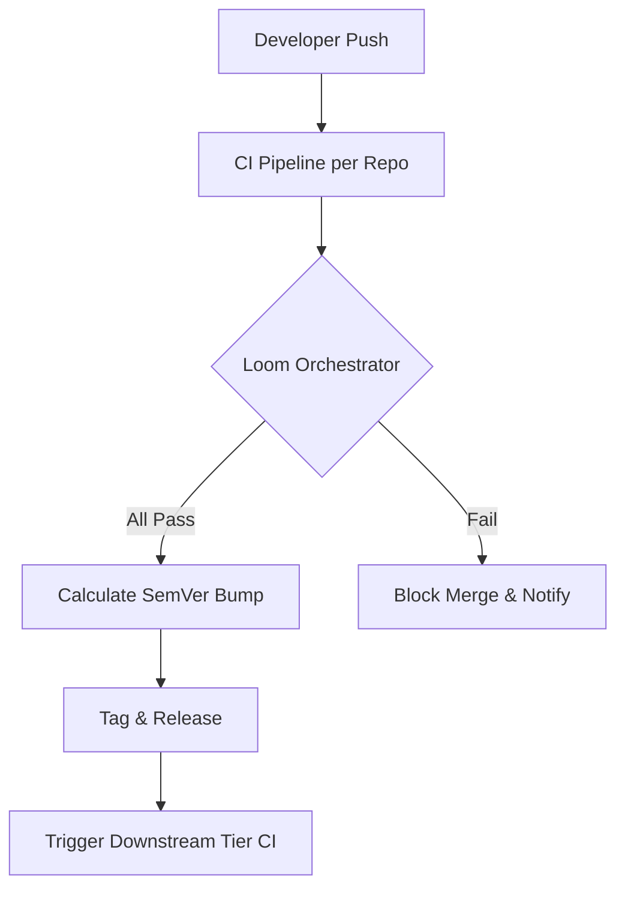

# PHASE CORE-01: Polyrepo Orchestrator

## Tier
Core (Foundational Infrastructure)

## Component Name
Polyrepo Orchestrator (The "Loom")

## Description
A central PHP-driven automation tool that manages the lifecycle of the Sovereign Stack polyrepo. It monitors CI status across distributed repositories, enforces merge gates, calculates Semantic Versioning (SemVer) bumps, and orchestrates unified releases. It eliminates developer overhead by automating the "Core -> Hub -> Spoke" dependency flow.

## Context7 Research
- **PSR Compliance**: Adheres to PSR-12 for CLI output and internal structure.
- **Git Operations**: Utilizes standard `git` binary calls or a PHP Git wrapper (e.g., `czproject/git-php`).
- **SemVer Logic**: Implements the Semantic Versioning 2.0.0 specification.
- **Patterns**: Command Pattern for automation tasks, Observer Pattern for CI monitoring.

## Architectural Design
The Orchestrator is a standalone PHP executable (extending `cli/test.php` patterns).

### Core Components:
- **RepoManager**: Handles git cloning, branching, and tagging.
- **CIMonitor**: Interfaces with GitHub Actions/GitLab CI APIs to verify build health.
- **DependencyGraph**: Resolves the tier hierarchy (Core must pass before Hub).
- **VersionBumpEngine**: Analyzes commit messages (Conventional Commits) to determine Major/Minor/Patch increments.

### Mermaid Diagram

## Integration Strategy
- **Upward**: None (this is the root).
- **Downward**: Every subsequent repository in the stack must register its CI webhook with the Orchestrator.
- **Environment**: Requires PHP 8.3+ CLI and Git 2.40+.

## CI Verification Criteria
- **Execution Speed**: Full dependency check for 10 repos must complete in < 2 seconds.
- **Accuracy**: Tagging must never overwrite an existing version.
- **Safety**: Merge gates must fail if a single test in a "Core" repo is red.

## SemVer Impact
**Major**. This establishes the fundamental repository architecture and automation layer.