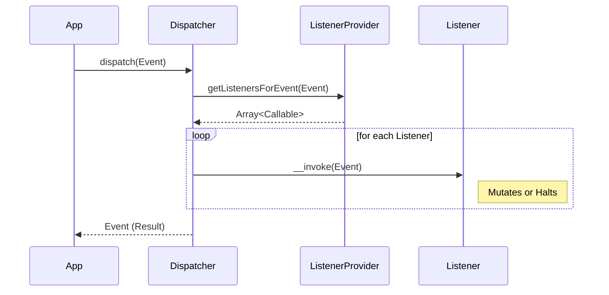

# PHASE CORE-03: Event Dispatcher

## Tier
Core

## Component Name
PSR-14 Event Dispatcher

## Description
A highly performant event management system implementing PSR-14. It decouples core logic from side effects (e.g., logging, auditing, async triggers) using an "Emit and Forget" or "Haltable Pipeline" pattern.

## Context7 Research
- **PSR Compliance**: PSR-14 (Event Dispatcher).
- **Patterns**: Observer Pattern, Mediator Pattern.
- **Reference**: `/thephpleague/event` design patterns for prioritized listeners.

## Architectural Design
- **Dispatcher**: The central hub for emitting events.
- **ListenerProvider**: Maps events to their respective listeners based on type-hinting.
- **StoppableEvent**: Implements `Psr\EventDispatcher\StoppableEventInterface` to allow listeners to halt propagation.

### Sequence Diagram

## Integration Strategy
Depends on `CORE-02` (Container) to resolve listener classes lazily only when an event is triggered.

## CI Verification Criteria
- **Throughput**: Must handle 10,000 event dispatches per second with minimal latency.
- **Isolation**: Listeners must not be able to crash the dispatcher; exceptions must be caught and logged (referencing CORE-08).

## SemVer Impact
**Minor**. Standardizes the internal communication protocol of the framework.