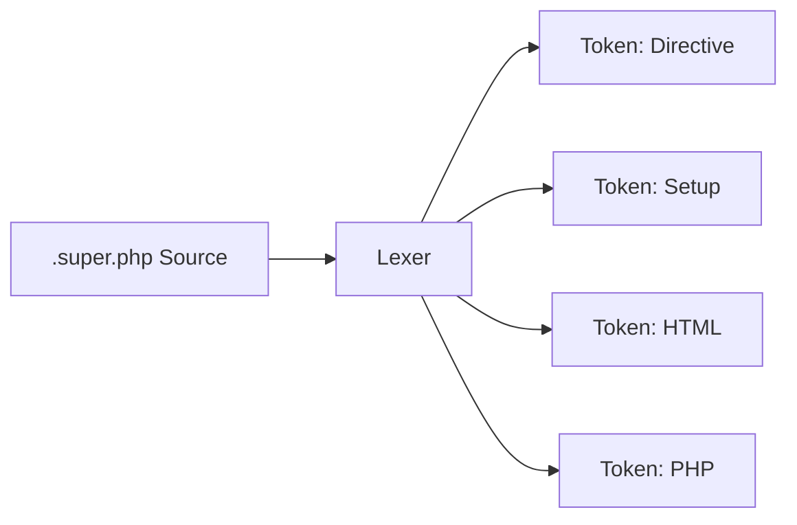

# PHASE CORE-07: SuperPHP Lexer

## Tier
Core

## Component Name
SuperPHP Reactive Lexer

## Description
The first stage of the SuperPHP engine. It tokenizes `.super.php` files, identifying SuperPHP-specific directives (e.g., `@global`, `@persist`, `~setup`) alongside standard HTML and PHP tags.

## Context7 Research
- **Regex Performance**: Optimized PCRE patterns for single-pass tokenization.
- **State Machines**: Implements a Deterministic Finite Automaton (DFA) for context-aware lexing (e.g., distinguishing between a coloned component `<s:ui:button />` and standard HTML).

## Architectural Design
- **Lexer**: Iterates through the source string, producing a stream of `Token` objects.
- **TokenType**: Enum defining tokens like `T_DIRECTIVE`, `T_COMPONENT_OPEN`, `T_SETUP_BLOCK`, etc.
- **PositionTracker**: Maintains line and column numbers for precise error reporting.

### Tokenization Flow

## Integration Strategy
Outputs a `TokenStream` consumed by `CORE-11` (Parser). It is a standalone utility with zero dependencies on other Core tiers.

## CI Verification Criteria
- **Performance**: Must lex 1MB of template source in < 10ms.
- **Accuracy**: 100% coverage on a suite of complex SuperPHP syntax samples (nested components, malformed tags).

## SemVer Impact
**Minor**. Foundation for the template engine; does not affect runtime unless the engine is active.