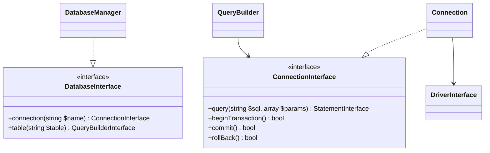

# PHASE CORE-19: Database Abstraction Layer

## Tier
Core (Foundational Infrastructure)

## Component Name
Sovereign DBAL

## Description
A thin, PSR-compliant database abstraction layer (DBAL) built on top of PDO. It provides a unified API for interacting with multiple relational databases (SQLite, MySQL, PostgreSQL) while maintaining minimal overhead. It includes a fluent query builder, schema agnostic connection management, and robust transaction handling.

## Context7 Research
- **Patterns**: Data Mapper (underlying), Gateway, and Fluent Interface for the Query Builder.
- **Drivers**: Utilizes PDO drivers specifically. Supports `pdo_sqlite`, `pdo_mysql`, and `pdo_pgsql`.
- **Transactions**: Implements manual transaction control (`beginTransaction`, `commit`, `rollback`) with support for emulated nested transactions using savepoints (referencing Doctrine DBAL patterns).
- **Security**: Mandatory use of prepared statements and parameter binding to prevent SQL injection.

## Architectural Design
- **ConnectionManager**: Handles the lifecycle of database connections, lazy-loading drivers only when a query is executed.
- **DriverInterface**: Defines the contract for database-specific behavior (e.g., quoting identifiers, pagination syntax).
- **QueryBuilder**: A fluent SQL generator that abstracts the differences between dialects.
- **Statement**: A wrapper around `PDOStatement` to provide unified result fetching and logging.

### Class Relationship Diagram


## Interface Contracts

### DatabaseInterface
```php
namespace Sovereign\Core\Database;

interface DatabaseInterface
{
    public function connection(?string $name = null): ConnectionInterface;
    public function table(string $name): QueryBuilderInterface;
    public function statement(string $query, array $bindings = []): StatementInterface;
    public function transaction(callable $callback): mixed;
}
```

### QueryBuilderInterface
```php
namespace Sovereign\Core\Database;

interface QueryBuilderInterface
{
    public function select(array $columns = ['*']): self;
    public function from(string $table, ?string $alias = null): self;
    public function where(string $column, string $operator, mixed $value = null): self;
    public function join(string $table, string $first, string $operator, string $second): self;
    public function orderBy(string $column, string $direction = 'asc'): self;
    public function limit(int $value, int $offset = 0): self;
    public function get(): array;
    public function first(): ?object;
    public function insert(array $values): bool;
    public function update(array $values): int;
    public function delete(): int;
}
```

## Integration Strategy
- **Upward**: Depends on `CORE-02` (Container) for service resolution and `CORE-10` (Config) for connection parameters.
- **Downward**: Provides the foundational data access layer for Hub-tier services like `HUB-04` (Identity) and `HUB-06` (Audit Log).
- **Events**: Dispatches `query.executed` events to `CORE-03` (Event Dispatcher) for profiling and logging.

## CI Verification Criteria
- **Driver Parity**: The same Query Builder code must produce valid SQL and identical results on both SQLite and MySQL.
- **Leak Detection**: Must verify that `Connection` objects are properly released and do not exceed PDO connection limits under stress (100 concurrent requests).
- **Injection Test**: Must fail a specialized test suite that attempts 50 different SQL injection payloads.

## SemVer Impact
**Major**. Establishes the foundational data access pattern for the entire stack.
