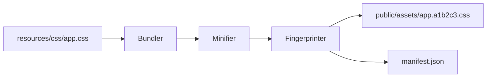

# PHASE HUB-03: Shared Asset Pipeline

## Tier
Hub

## Component Name
Sovereign Asset Engine

## Description
A custom, PHP-only asset pipeline (the "Unified Engine") for processing frontend resources. It handles CSS minification, JavaScript concatenation/wrapping, asset fingerprinting (cache busting), and versioned manifest generation. It operates entirely within the PHP runtime, eliminating the need for Node.js, npm, or Webpack.

## Context7 Research
- **Depends on**: `CORE-14: Filesystem`, `CORE-10: Config`.
- **PHP Libraries**: Evaluates `matthiasmullie/minify` for CSS/JS compression and `leafo/scssphp` if SCSS support is required (recommending sovereign implementation for minification).
- **Patterns**: Pipeline/Filter pattern for asset transformations.

## Architectural Design
- **AssetBundler**: The main engine that discovers source files and orchestrates the build.
- **ManifestGenerator**: Creates a JSON map of source filenames to their fingerprinted versions.
- **Minifier**: A set of PHP-based regex filters that strip comments and whitespace from CSS/JS.
- **AssetServer**: A development utility that serves assets with live-reloading hooks (referencing CORE-18 Kernel hooks).

### Asset Flow


## Interface Contracts

### AssetManagerInterface
```php
namespace Sovereign\Hub\Contracts;

interface AssetManagerInterface
{
    /**
     * Get the URL for a versioned asset.
     */
    public function url(string $path): string;

    /**
     * Build the asset manifest (production only).
     */
    public function build(): void;

    /**
     * Register a new asset transformation filter.
     */
    public function addFilter(AssetFilterInterface $filter): void;
}
```

## Integration Strategy
- **Upward**: Uses `CORE-14` for I/O operations.
- **Downward**: Spoke applications use a `@asset('css/app.css')` SuperPHP directive (extending CORE-12) which resolves through this Hub service.
- **Non-Node Requirement**: All logic must be pure PHP. No `shell_exec('npm ...')` allowed.

## CI Verification Criteria
- **Determinism**: Building the same asset twice with no changes must produce the same fingerprint.
- **Minification**: Final CSS size must be reduced by at least 30% compared to unminified source.
- **Integrity**: The `manifest.json` must always match the files currently present in the `public/assets` directory.

## SemVer Impact
**Major**. Establishes the frontend build strategy for the entire ecosystem.
