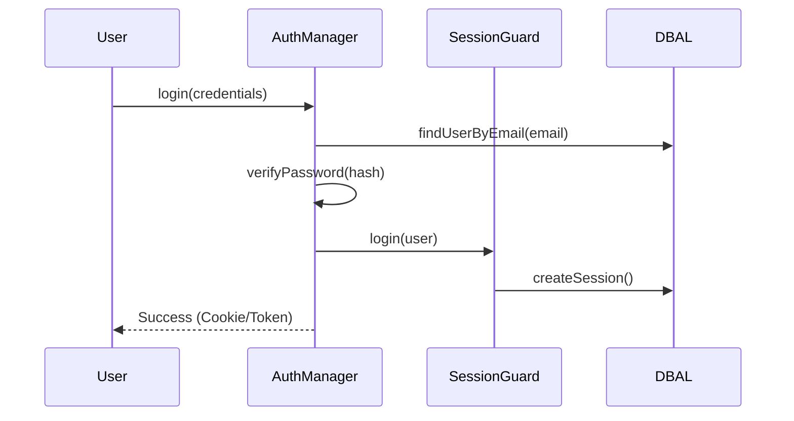

# PHASE HUB-04: Global Identity & Authentication

## Tier
Hub

## Component Name
Sovereign Identity

## Description
A comprehensive identity management and authentication service. It provides user lifecycle management, session handling, secure password hashing, and a foundation for OAuth2/OIDC. It centralizes authentication logic so Spoke applications can verify user identity through a unified Hub contract.

## Context7 Research
- **Depends on**: `CORE-19: DBAL`, `CORE-16: Encryption`, `HUB-02: Cache`.
- **Standards**: RFC 6749 (OAuth 2.0), OpenID Connect.
- **Reference**: Evaluates `league/oauth2-server` but recommends a sovereign implementation for the core session/token logic to ensure sub-5ms verification.

## Architectural Design
- **AuthManager**: Coordinates authentication attempts across multiple guards (Session, Token, API Key).
- **UserRepositoryInterface**: Abstraction for user data storage (database by default).
- **SessionStore**: Managed via `HUB-02` (Cache) to ensure stateless horizontal scaling.
- **TokenService**: Generates and validates cryptographically signed JWTs or opaque tokens.

### Authentication Flow


## Interface Contracts

### AuthInterface
```php
namespace Sovereign\Hub\Contracts;

interface AuthInterface
{
    public function attempt(array $credentials): bool;
    public function login(Authenticatable $user, bool $remember = false): void;
    public function logout(): void;
    public function check(): bool;
    public function user(): ?Authenticatable;
    public function id(): mixed;
}
```

### Authenticatable (Abstract)
```php
namespace Sovereign\Hub\Auth;

abstract class Authenticatable
{
    abstract public function getAuthIdentifier(): mixed;
    abstract public function getAuthPassword(): string;
    abstract public function getRememberToken(): ?string;
}
```

## Integration Strategy
- **Upward**: Consumes `CORE-19` for persistence and `CORE-16` for sensitive data encryption.
- **Downward**: Spoke applications use the `AuthInterface` to protect routes and identify users.
- **Middleware**: Provides a Hub-level `AuthMiddleware` (extending CORE-05) for the API Gateway (`HUB-08`).

## CI Verification Criteria
- **Brute Force Resistance**: Must automatically throttle login attempts after 5 failures per IP (referencing HUB-07).
- **Session Isolation**: A session for Tenant A must never be valid for Tenant B.
- **Performance**: Auth check for a valid session must take < 1ms (hot cache).

## SemVer Impact
**Major**. Defines the security boundary of the stack.
