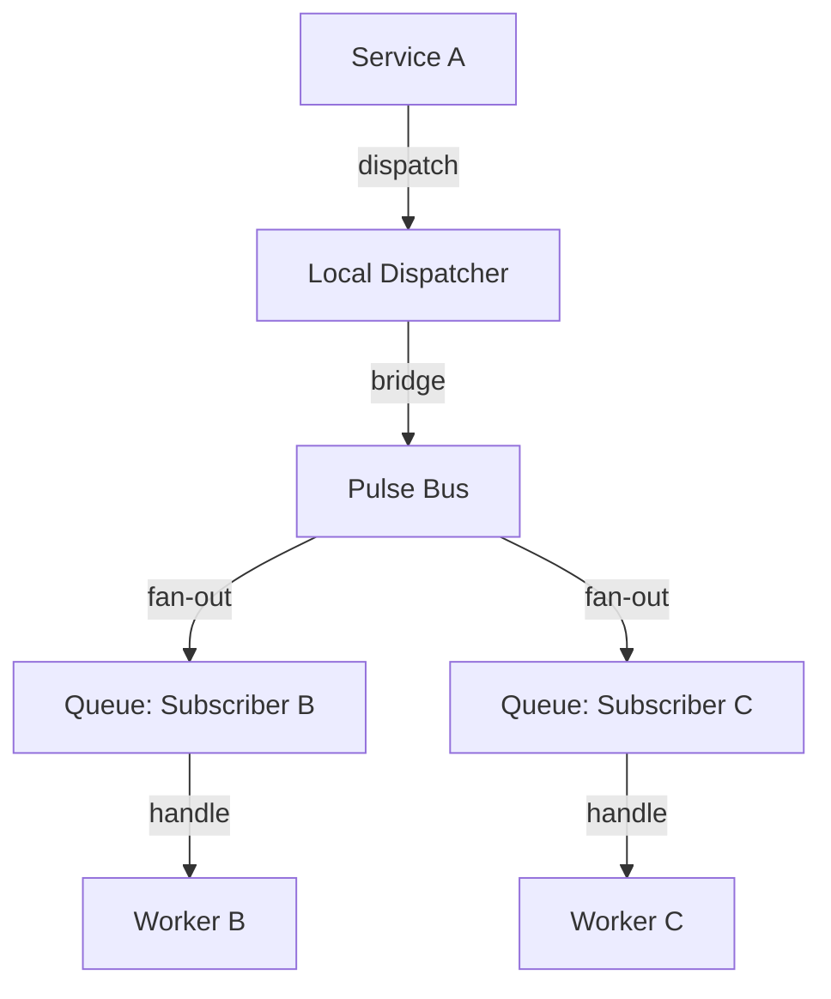

# PHASE HUB-09: Event Bus / Message Broker

## Tier
Hub

## Component Name
Sovereign Pulse (Event Bus)

## Description
A global message broker and event bus for decoupled communication between Hub services and Spoke applications. It extends the `CORE-03` Event Dispatcher to support distributed pub/sub patterns across multiple repositories and processes.

## Context7 Research
- **Depends on**: `CORE-03: Event Dispatcher`, `HUB-02: Cache`, `HUB-10: Queue`.
- **Patterns**: Pub/Sub, Fan-out, Event Streaming.
- **Drivers**: Redis Pub/Sub for real-time, Database for persistent event stores.

## Architectural Design
- **EventBus**: The global coordinator for cross-repository events.
- **SubscriberRegistry**: Maintains a map of "Interests" (e.g., Spoke A is interested in `hub.user.created`).
- **PulseBridge**: Connects local `CORE-03` events to the global `Pulse` bus.
- **DeadLetterQueue**: Handles events that fail to reach their subscribers after multiple retries.

### Pulse Event Lifecycle


## Interface Contracts

### EventBusInterface
```php
namespace Sovereign\Hub\Contracts;

interface EventBusInterface
{
    /**
     * Publish an event to the global bus.
     */
    public function publish(GlobalEvent $event): void;

    /**
     * Subscribe to a specific event pattern.
     */
    public function subscribe(string $eventPattern, callable|string $handler): void;
}
```

## Integration Strategy
- **Upward**: Built as a wrapper around `CORE-03`.
- **Downward**: Spoke applications register "Global Listeners" that respond to Hub-tier triggers (e.g., a Spoke clearing its local cache when a global setting changes in `HUB-01`).
- **Asynchronicity**: Relies on `HUB-10` (Queue) to ensure heavy event listeners do not block the publishing service.

## CI Verification Criteria
- **Delivery Guarantee**: An event published to the bus must reach all registered subscribers at least once.
- **Fan-out Speed**: Publishing an event with 5 subscribers must complete the dispatch in < 5ms (non-blocking).
- **Decoupling**: Subscriber B crashing must not prevent Subscriber C from receiving the event.

## SemVer Impact
**Minor**. Essential for scalable, decoupled micro-architecture within the polyrepo.
