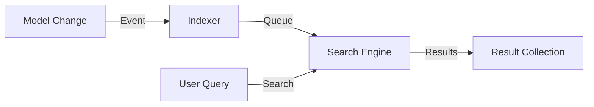

# PHASE HUB-14: Search Abstraction Layer

## Tier
Hub

## Component Name
Sovereign Search

## Description
A unified abstraction for full-text search. It provides a common API for indexing and querying data, supporting multiple backends like Database (LIKE/Fulltext), Meilisearch, or Elasticsearch. It allows Spoke applications to implement advanced search features without coupling to a specific engine.

## Context7 Research
- **Depends on**: `CORE-19: DBAL`, `HUB-10: Queue`.
- **Drivers**: Database (default), Meilisearch (recommended for speed), Algolia (cloud).
- **Patterns**: Indexer, Searcher, Result Transformer.

## Architectural Design
- **SearchManager**: Factory for resolving search engines.
- **IndexableTrait**: A trait for models to automatically sync their data to the search index via `HUB-10` queues.
- **SearchQuery**: A fluent builder for constructing complex search requests (filters, facets, sorting).
- **EngineInterface**: The contract that search backends must implement.

### Search Flow


## Interface Contracts

### SearchInterface
```php
namespace Sovereign\Hub\Contracts;

interface SearchInterface
{
    /**
     * Search an index for the given query.
     */
    public function search(string $index, string $query): SearchBuilder;

    /**
     * Add or update records in the search index.
     */
    public function update(string $index, array $records): void;

    /**
     * Remove records from the search index.
     */
    public function delete(string $index, array $ids): void;
}
```

## Integration Strategy
- **Upward**: Uses `HUB-10` for asynchronous indexing.
- **Downward**: Spoke applications implement `SearchableInterface` on their domain entities.
- **UI**: Hub provides a "Global Search" API via `HUB-08` (Gateway).

## CI Verification Criteria
- **Consistency**: A record updated in the DB must appear in the search index within 5 seconds (asynchronous lag check).
- **Driver Agnostic**: The same search query must return comparable results on both Database and Meilisearch drivers.
- **Error Resilience**: If the search engine is down, the system must fall back to a database search or return an empty result without crashing.

## SemVer Impact
**Minor**. Adds advanced discovery capabilities to the stack.
