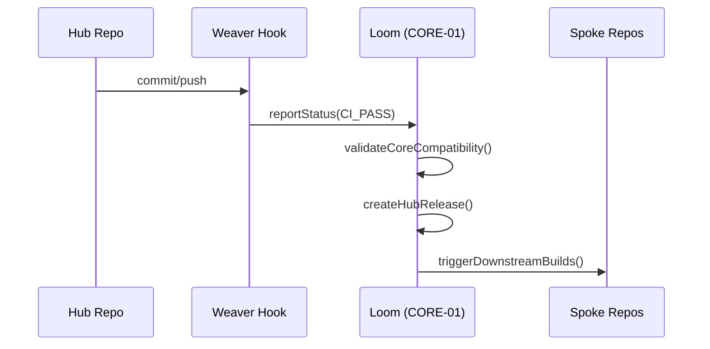

# PHASE HUB-16: Hub-level Orchestration Hooks

## Tier
Hub

## Component Name
Sovereign Hub Weaver

## Description
The "Weaver" provides the integration logic for Hub-tier repositories to report their status back to the `CORE-01` Polyrepo Orchestrator. It automates the dependency validation between Hub and Core tiers and prepares the Hub for Spoke consumption.

## Context7 Research
- **Depends on**: `CORE-01: Polyrepo Orchestrator`, `HUB-15: Health Check`.
- **Patterns**: Hook/Callback, CI Integration.
- **Automation**: Uses `CORE-01` API to register Hub-tier releases and trigger downstream Spoke builds.

## Architectural Design
- **OrchestrationClient**: Communicates with the "Loom" (`CORE-01`) via secure webhooks or CLI calls.
- **DependencyVerifier**: Ensures that the current Hub version is compatible with the installed Core tier version.
- **ReleaseManager**: Handles tagging and manifest generation for Hub-tier distribution.
- **SpokeNotifier**: Triggers CI pipelines in Spoke repositories when a Hub update is published.

### Orchestration Flow


## Interface Contracts

### OrchestratorHookInterface
```php
namespace Sovereign\Hub\Contracts;

interface OrchestratorHookInterface
{
    /**
     * Notify the Orchestrator of a successful build.
     */
    public function notifyBuildSuccess(string $repo, string $commit): void;

    /**
     * Verify compatibility with the Core tier.
     */
    public function checkCoreCompatibility(string $requiredVersion): bool;
}
```

## Integration Strategy
- **Upward**: Directly integrates with the API defined in `CORE-01`.
- **Downward**: This is the "Merge Gate" for the Hub tier. No Hub component can be considered "Stable" until the Weaver has verified it.
- **CLI**: Provides `s-cli hub:release` to automate the entire Hub-to-Orchestrator handshake.

## CI Verification Criteria
- **Version Gating**: Must block a Hub release if it depends on a Core version that is not yet tagged as Stable.
- **Notification Reliability**: Orchestrator notifications must implement a retry policy (up to 3 times) in case of network failure.
- **Manifest Accuracy**: The generated `hub-manifest.json` must include every Hub service and its verified version.

## SemVer Impact
**Major**. Completes the automated polyrepo lifecycle for the Hub tier.
