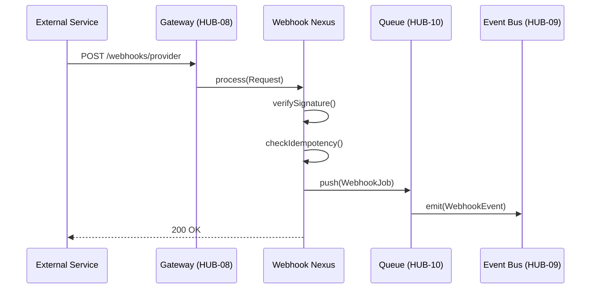

# PHASE HUB-17: Webhook Ingestion & Dispatch Engine

## Tier
Hub (Shared Services)

## Component Name
Sovereign Webhook Nexus

## Description
A centralized engine for receiving incoming webhooks from external services (e.g., Stripe, GitHub, Shopify) and dispatching them to internal Hub services or Spoke handlers. It provides signature verification, idempotent processing, retry logic, and an audit trail for all webhook activity.

## Sequencing Rationale
Depends on the Event Bus (HUB-09) and Queue System (HUB-10) to handle asynchronous processing and the Audit Log (HUB-06) for tracking. It precedes Spoke applications that rely on external event triggers.

## Context7 Research
- **Direct Hub Dependencies**: `HUB-09: Event Bus`, `HUB-10: Queue & Job Dispatcher`, `HUB-06: Audit Log`, `HUB-08: API Gateway`.
- **Transitive Core Dependencies**: `CORE-06: Router`, `CORE-04: HTTP Message`, `CORE-19: DBAL`, `CORE-03: Event Dispatcher`.
- **Security Patterns**: Hmac-based signature verification (SHA-256), IP whitelisting.
- **Resiliency**: Dead Letter Queues (DLQ) for failed dispatches.

## Architectural Design
- **WebhookIngestor**: Entry point for all incoming HTTP POST requests.
- **SignatureValidator**: Extensible validator for different provider signature formats.
- **DispatchRegistry**: Maps incoming webhook types to internal Hub events or Spoke-specific jobs.
- **IdempotencyManager**: Prevents duplicate processing using a persistent cache of request IDs.

### Webhook Dispatch Flow


## Interface Contracts

### WebhookManagerInterface
```php
namespace Sovereign\Hub\Contracts;

interface WebhookManagerInterface
{
    /**
     * Register a webhook handler for a specific provider/event.
     */
    public function subscribe(string $provider, string $event, callable $handler): void;

    /**
     * Verify the signature of an incoming request.
     */
    public function verify(string $provider, string $payload, array $headers): bool;
}
```

## Integration Strategy
- **Upward**: Registered as a route within `HUB-08` (API Gateway).
- **Downward**: Spoke applications register "Webhook Listeners" that hook into the `HUB-09` Event Bus.
- **Contract**: Dispatches standardized `WebhookReceivedEvent` objects containing the verified payload and provider metadata.

## CI Verification Criteria
- **Signature Security**: Must reject requests with invalid signatures for at least 3 major providers (Stripe, GitHub, Generic).
- **Idempotency**: Processing the same request ID twice must result in exactly one side effect.
- **Auditability**: Every received webhook must have an entry in the `webhook_logs` table with status and processing time.

## SemVer Impact
**Minor**. Adds webhook handling capabilities to the Hub.
