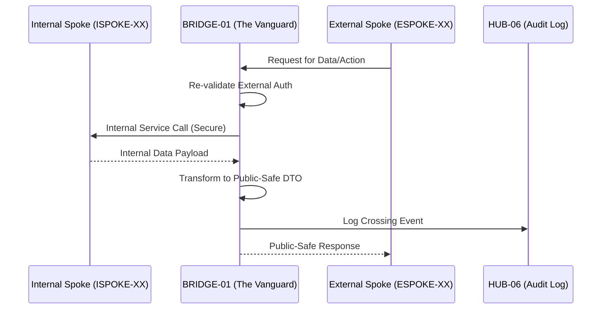

# PHASE BRIDGE-01: The Handoff Bridge

## Tier
Bridge (Architectural Enforcement Layer)

## Component Name
Sovereign Bridge (The "Vanguard")

## Description
BRIDGE-01 is not an application; it is the formal architectural contract and enforcement layer that governs all communication between the Internal Spoke sub-tier and the External Spoke sub-tier. It defines the "Strict Boundary" that ensures no internal implementation details, staff-only services, or raw internal data structures are ever exposed to the public-facing ecosystem.

## Sequencing Rationale
Acts as the transition point between the completed Internal Spoke sub-tier and the upcoming External Spoke sub-tier. It must be established before any External Spoke is built to ensure boundary compliance from day zero.

## Context7 Research
### Direct Hub Dependencies
- `HUB-08: API Gateway & Public Surface`
- `HUB-15: Health Check & Service Discovery`
- `HUB-16: Hub-level Orchestration Hooks`
- `HUB-06: Audit Log & Activity Tracker`
- `HUB-04: Global Identity & Authentication`

### Transitive Core Dependencies
- `CORE-01: Polyrepo Orchestrator (Enforcement Logic)`
- `CORE-18: Core Kernel & Lifecycle`
- `CORE-09: Cryptography & Hashing (Payload Verification)`
- `CORE-06: Router (Gateway Routing)`

## Architectural Design: The Strict Boundary Policy
The Bridge enforces a "Default Deny" posture for all cross-tier interactions.

### 1. Data Transformation Rule
No Internal Spoke service or database contract may be directly exposed. All data crossing from Internal to External must be transformed into a "Public-Safe" Data Transfer Object (DTO) at the Bridge.

### 2. Authentication Re-validation
Any authentication context established within the Internal sub-tier must be re-validated at the Bridge before being honored on the External side. Internal "Staff" sessions have zero authority in the External tier.

### 3. Audit Mandate
Every event, payload, or service call crossing the boundary is logged through `HUB-06` with a specialized "Tier-Crossing" metadata flag.

### 4. Permitted Contract Allowlist
The Bridge maintains a strict registry of permitted crossing contracts. Unlisted interactions are blocked and surfaced as "Critical Violations" via `HUB-15`.

### Boundary Flow Diagram


## Interface Contracts

### BoundaryContractInterface
```php
namespace Sovereign\Bridge\Contracts;

interface BoundaryContractInterface
{
    /**
     * Define a permitted crossing contract.
     */
    public function registerContract(string $contractId, DTOTransformerInterface $transformer): void;

    /**
     * Enforce the boundary for an incoming request.
     */
    public function enforce(RequestInterface $request): ResponseInterface;
}
```

## Integration Strategy (Formal Policy)
- **Runtime Enforcement**: The Bridge uses `HUB-08` middleware to intercept all cross-tier traffic.
- **Service Discovery**: Consumes `HUB-15` to identify legitimate Internal endpoints while hiding them from External visibility.
- **Orchestration**: Integrated with `HUB-16` to block all boundary-crossing traffic during "Critical Maintenance" windows.
- **Reporting**: Any attempted violation of the boundary (e.g., direct DB access attempt from an ESPOKE) triggers an immediate "P0 Violation Alert" in `HUB-15`.

## CI Verification Criteria
- **Zero-Exposure Test**: Automated scans must verify that no PHP class in the `Sovereign\External` namespace imports any class from the `Sovereign\Internal` namespace.
- **Transformation Latency**: DTO transformation and audit logging must add no more than 2ms to the total request lifecycle.
- **Violation Response**: Attempting to call an unregistered contract must return a `403 Forbidden` within 5ms.

## SemVer Impact
**Major**. Establishes the foundational security and architectural integrity of the entire platform's public interface.
