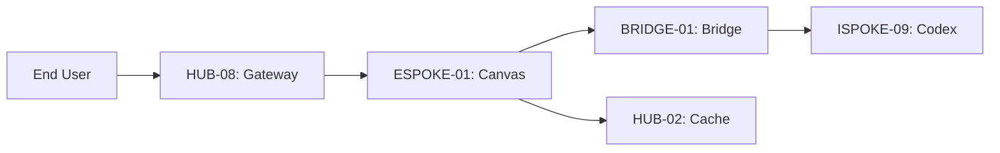

# PHASE ESPOKE-01: Public CMS and Content Delivery Layer

## Tier
External Spoke (Public-facing Application)

## Component Name
Sovereign Canvas (CMS)

## Description
The public-facing Content Management System and delivery engine. It renders high-performance, SEO-optimized web pages for end-users. It consumes content definitions from the Internal Knowledge Base (ISPOKE-09) via the `BRIDGE-01` transformation layer.

## Sequencing Rationale
The first External Spoke. It provides the primary web presence for the platform and establishes the pattern for consuming internal content through the Bridge.

## Context7 Research
### Direct Hub Dependencies
- `HUB-03: Unified Asset Pipeline & Bundler`
- `HUB-02: Distributed Cache (Redis)`
- `HUB-26: Shared UI Component Library (Public Theme)`
- `HUB-08: API Gateway & Public Surface`
- `HUB-15: Health Check & Service Discovery`

### Transitive Core Dependencies
- `CORE-11: SuperPHP Parser`
- `CORE-12: SuperPHP Compiler`
- `CORE-18: Core Kernel & Lifecycle`
- `CORE-06: Router`
- `CORE-14: Filesystem Abstraction`

## Architectural Design
- **PageRenderer**: A high-performance SuperPHP engine that renders public pages using `HUB-26` components.
- **ContentConsumer**: Interacts with `BRIDGE-01` to fetch public-safe content DTOs.
- **EdgeCacheManager**: Integrates with `HUB-02` to provide sub-5ms response times for static content.
- **SEOEngine**: Automatically generates Sitemaps, Meta tags, and Schema.org markup.

### Content Delivery Diagram


## Interface Contracts

### ContentDeliveryInterface
```php
namespace Sovereign\External\Canvas\Contracts;

interface ContentDeliveryInterface
{
    /**
     * Render a page by its public slug.
     */
    public function renderPage(string $slug): ResponseInterface;

    /**
     * Clear the public cache for a specific content item.
     */
    public function purgeCache(string $slug): void;
}
```

## Integration Strategy
- **Bridge Compliance**: Strictly honors `BRIDGE-01`. It never queries the internal content database directly; all requests are routed through the Bridge's DTO transformation layer.
- **UI Rendering**: Uses the "Public Theme" variants of `HUB-26` components, compiled via `HUB-03`.
- **Caching**: Implements aggressive stale-while-revalidate patterns using `HUB-02`.
- **Health**: Reports page load times and cache hit/miss ratios to `HUB-15`.

## CI Verification Criteria
- **SEO Performance**: Every rendered page must score > 90 on Lighthouse SEO and Performance audits.
- **Bridge Enforcement**: Automated tests must verify that an ESPOKE-01 request for "Internal-only" content (e.g., draft SOPs) returns a 404.
- **Asset Loading**: 100% of public assets must be delivered via the `HUB-03` CDN layer.

## SemVer Impact
**Major**. Establishes the public web presence and the pattern for Bridge-based consumption.
