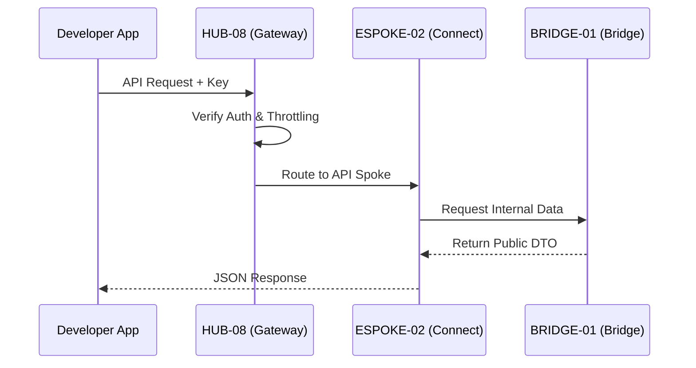

# PHASE ESPOKE-02: Public-Facing REST API Surface

## Tier
External Spoke (Public-facing Service)

## Component Name
Sovereign Connect (API)

## Description
The official public REST API for the Sovereign Stack. It provides developers and third-party integrations with secure access to the platform's capabilities. It sits on top of `HUB-08` and enforces rate limits, versioning, and developer-specific auth contexts.

## Sequencing Rationale
Follows the CMS (ESPOKE-01) to provide programmatic access to the same content and services available via the web UI.

## Context7 Research
### Direct Hub Dependencies
- `HUB-08: API Gateway & Public Surface`
- `HUB-24: GraphQL Schema Registry`
- `HUB-04: Global Identity & Authentication (API Keys)`
- `HUB-06: Audit Log & Activity Tracker`
- `HUB-15: Health Check & Service Discovery`

### Transitive Core Dependencies
- `CORE-07: HTTP Request/Response (PSR-7)`
- `CORE-08: HTTP Client (PSR-18)`
- `CORE-18: Core Kernel & Lifecycle`
- `CORE-09: Cryptography & Hashing`

## Architectural Design
- **VersionController**: Manages API versioning (e.g., `/v1/`, `/v2/`) and deprecation headers.
- **Throttler**: Enforces granular rate limits per API key and endpoint via `HUB-02`.
- **ResponseTransformer**: Ensures all API responses adhere to a consistent JSON:API or Hal+JSON format.
- **DocGenerator**: Automatically updates public API documentation based on `HUB-24` schemas.

### API Request Flow Diagram


## Interface Contracts

### PublicApiInterface
```php
namespace Sovereign\External\Connect\Contracts;

interface PublicApiInterface
{
    /**
     * Handle an incoming public API request.
     */
    public function handle(RequestInterface $request): ResponseInterface;

    /**
     * Register a new API version handler.
     */
    public function registerVersion(string $version, string $handlerClass): void;
}
```

## Integration Strategy
- **Bridge Compliance**: Consumes only `BRIDGE-01` permitted contracts for external data access.
- **Gateway**: Deeply integrated with `HUB-08` for SSL termination and global request filtering.
- **Auditing**: Every public API call is logged in `HUB-06` with developer attribution.
- **Health**: Reports API uptime, average response time, and error rates to `HUB-15`.

## CI Verification Criteria
- **Version Isolation**: Changes in `v2` must not break the behavior or response schema of `v1`.
- **Throttling**: Must correctly block requests once the per-minute limit is reached (verified via load test).
- **Compliance**: 100% of responses must pass a schema validation check against the published `HUB-24` manifest.

## SemVer Impact
**Major**. Establishes the public programmatic interface for the platform.
