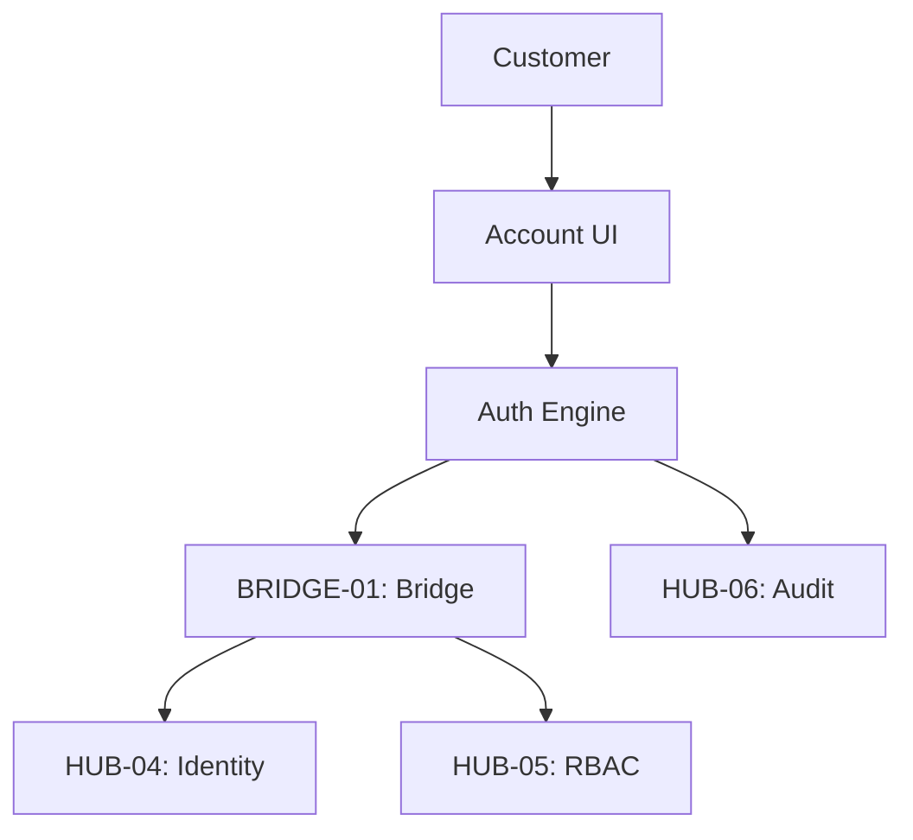

# PHASE ESPOKE-03: Customer Authentication and Account Portal

## Tier
External Spoke (Public-facing Application)

## Component Name
Sovereign Account (Auth)

## Description
The public-facing authentication and user account management portal. It handles customer registration, login, password resets, and profile management. It interfaces with `HUB-04` through the `BRIDGE-01` layer to manage customer identities without exposing the staff identity systems.

## Sequencing Rationale
Critical for the subsequent Search (ESPOKE-04) and Notification (ESPOKE-06) spokes, which require a verified customer identity.

## Context7 Research
### Direct Hub Dependencies
- `HUB-04: Global Identity & Authentication`
- `HUB-05: RBAC & Permission Engine`
- `HUB-26: Shared UI Component Library`
- `HUB-06: Audit Log & Activity Tracker`
- `HUB-08: API Gateway`
- `HUB-15: Health Check & Service Discovery`

### Transitive Core Dependencies
- `CORE-09: Cryptography & Hashing`
- `CORE-18: Core Kernel & Lifecycle`
- `CORE-19: DBAL & Migrations`
- `CORE-11: SuperPHP Parser`
- `CORE-12: SuperPHP Compiler`

## Architectural Design
- **AccountManager**: Handles customer profile updates and account settings.
- **AuthFlowEngine**: Manages OAuth2/OIDC flows, MFA enrollment, and session persistence.
- **SecurityCenter**: UI for customers to view active sessions and security logs.
- **IdentityBridge**: A specialized `BRIDGE-01` contract for mapping public customers to Hub identities.

### Customer Auth Diagram


## Interface Contracts

### CustomerAccountInterface
```php
namespace Sovereign\External\Account\Contracts;

interface CustomerAccountInterface
{
    /**
     * Authenticate a customer and establish a session.
     */
    public function login(string $email, string $password): AuthResult;

    /**
     * Update customer profile data.
     */
    public function updateProfile(string $customerId, array $data): bool;
}
```

## Integration Strategy
- **Bridge Compliance**: Customer identities are strictly isolated from Staff identities at the Bridge level. No customer can ever authenticate against an internal staff service.
- **UI**: Uses `HUB-26` components styled for customer-facing simplicity and security.
- **Auditing**: All login attempts, failed or successful, are logged in `HUB-06`.
- **Health**: Reports auth success/failure rates and MFA latency to `HUB-15`.

## CI Verification Criteria
- **Credential Safety**: Passwords must be hashed using `CORE-09` (Argon2id) before crossing the Bridge.
- **Session Isolation**: A customer session must never have access to any `internal/` or `staff/` routes.
- **GDPR Compliance**: The "Delete My Account" flow must successfully trigger a cascading erasure of customer data across the Hub.

## SemVer Impact
**Major**. Provides the primary identity layer for the external ecosystem.
