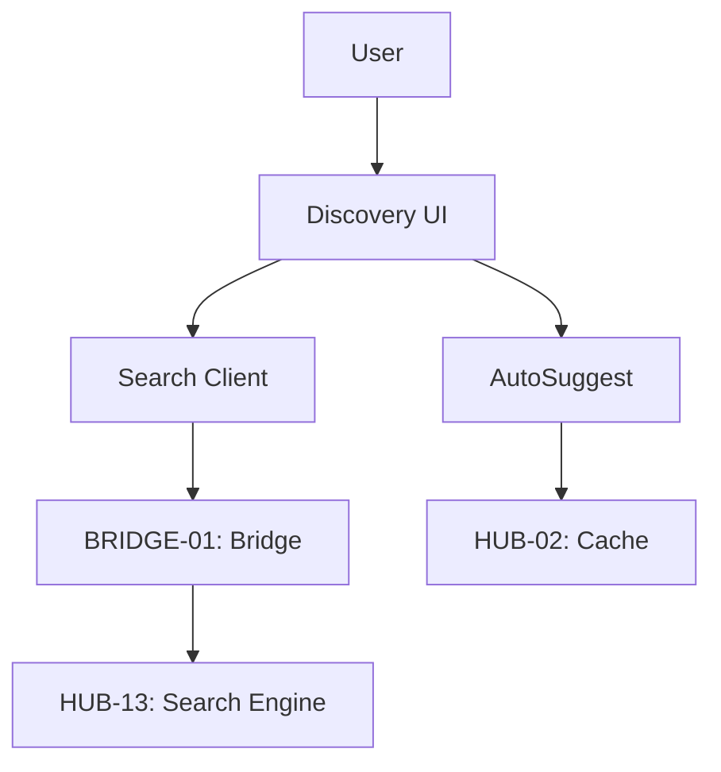

# PHASE ESPOKE-04: Public Search and Discovery Interface

## Tier
External Spoke (Public-facing Application)

## Component Name
Sovereign Discovery (Search)

## Description
A high-performance search and discovery interface for end-users. It allows customers to search across the Public CMS, Products, and Documentation. It leverages `HUB-13` through the `BRIDGE-01` layer to provide filtered, public-safe search results.

## Sequencing Rationale
Relies on ESPOKE-03 for personalized search results (e.g., "My Orders" or "My Documents").

## Context7 Research
### Direct Hub Dependencies
- `HUB-13: Full-text Search & Indexing`
- `HUB-26: Shared UI Component Library`
- `HUB-08: API Gateway`
- `HUB-02: Distributed Cache (Redis)`
- `HUB-15: Health Check & Service Discovery`

### Transitive Core Dependencies
- `CORE-06: Router`
- `CORE-18: Core Kernel & Lifecycle`
- `CORE-11: SuperPHP Parser`
- `CORE-12: SuperPHP Compiler`

## Architectural Design
- **SearchClient**: Executes public-safe search queries against the `HUB-13` engine via the Bridge.
- **FacetManager**: Renders dynamic search filters (e.g., Category, Date, Author) based on search results.
- **AutoSuggest**: Real-time "Type-ahead" service for the search bar.
- **ResultStyler**: Renders search result snippets using `HUB-26` templates.

### Search Interaction Diagram


## Interface Contracts

### PublicSearchInterface
```php
namespace Sovereign\External\Discovery\Contracts;

interface PublicSearchInterface
{
    /**
     * Execute a search query with facets and pagination.
     */
    public function search(string $query, array $filters, int $page): SearchResult;

    /**
     * Get auto-suggest suggestions for a partial query.
     */
    public function suggest(string $partial): array;
}
```

## Integration Strategy
- **Bridge Compliance**: The Bridge ensures that search queries are restricted to "Public" indices only. No internal-only documents can ever appear in search results.
- **UI Rendering**: Renders reactive search interfaces using SuperPHP and `HUB-26` list components.
- **Caching**: Search result pages and auto-suggest responses are cached in `HUB-02` for 5 minutes.
- **Health**: Reports search latency and "No Results Found" frequency to `HUB-15`.

## CI Verification Criteria
- **Search Performance**: The first page of search results must be rendered in < 150ms.
- **Security**: Must verify that a query for `*` (all) does not return any document marked as `internal_only: true`.
- **Load Testing**: Must handle 500 concurrent search requests without increasing latency beyond 500ms.

## SemVer Impact
**Minor**. Enhances user experience and content discoverability.
