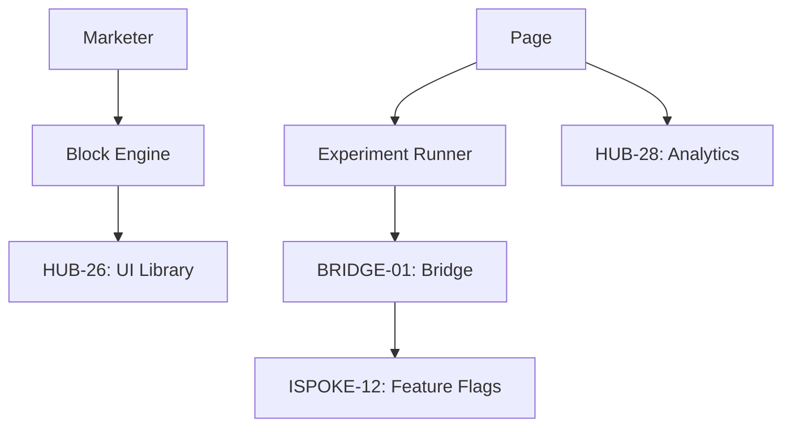

# PHASE ESPOKE-05: Marketing and Landing Page Engine

## Tier
External Spoke (Public-facing Application)

## Component Name
Sovereign Growth (Marketing)

## Description
A specialized engine for building, deploying, and optimizing marketing landing pages. It features a "Block-based" editor (integrated with `HUB-26`), A/B testing support (via `ISPOKE-12`), and deep integration with marketing analytics.

## Sequencing Rationale
Built after the CMS and Search spokes to provide a more flexible, conversion-oriented layer on top of the standard content delivery system.

## Context7 Research
### Direct Hub Dependencies
- `HUB-03: Unified Asset Pipeline & Bundler`
- `HUB-01: Global Configuration & Feature Flags`
- `HUB-28: Distributed Ledger & Analytics Engine`
- `HUB-26: Shared UI Component Library`
- `HUB-08: API Gateway`
- `HUB-15: Health Check & Service Discovery`

### Transitive Core Dependencies
- `CORE-11: SuperPHP Parser`
- `CORE-12: SuperPHP Compiler`
- `CORE-18: Core Kernel & Lifecycle`
- `CORE-14: Filesystem Abstraction`

## Architectural Design
- **BlockEngine**: A library of conversion-optimized UI blocks (Hero, Features, Pricing, Testimonials).
- **CampaignManager**: Manages page variations, UTM tracking, and conversion goals.
- **LandingPageRenderer**: A lightweight SuperPHP renderer optimized for sub-100ms LCP (Largest Contentful Paint).
- **ExperimentBridge**: Interacts with `BRIDGE-01` to fetch A/B test configurations defined in `ISPOKE-12`.

### Marketing Page Diagram


## Interface Contracts

### MarketingPageInterface
```php
namespace Sovereign\External\Growth\Contracts;

interface MarketingPageInterface
{
    /**
     * Render a marketing page with a specific campaign context.
     */
    public function render(string $pageId, array $campaignData): ResponseInterface;

    /**
     * Record a conversion event.
     */
    public function trackConversion(string $pageId, string $goalId): void;
}
```

## Integration Strategy
- **Bridge Compliance**: A/B test variations are served via the Bridge to ensure marketing users can't accidentally expose internal feature flags.
- **Asset Pipeline**: Generates highly optimized, page-specific JS/CSS bundles via `HUB-03`.
- **Analytics**: Pushes real-time conversion and engagement data to `HUB-28` via the Hub API.
- **Health**: Reports page conversion rates and loading performance to `HUB-15`.

## CI Verification Criteria
- **Performance**: Every landing page must achieve a Lighthouse Performance score of 100.
- **Experiment Integrity**: A user must be consistently served the same A/B variation throughout their session.
- **Asset Weight**: The total JS/CSS payload for a standard landing page must not exceed 50KB (gzipped).

## SemVer Impact
**Minor**. Provides the growth and optimization tools for the platform.
