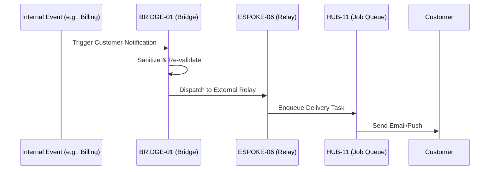

# PHASE ESPOKE-06: Customer Notification and Communication Hub

## Tier
External Spoke (Public-facing Application)

## Component Name
Sovereign Relay (External)

## Description
The final External Spoke for this session. It manages all communications with end-customers, including transactional emails, push notifications, and in-app alerts. It consumes the `ISPOKE-07` messaging infrastructure through a strict `BRIDGE-01` policy.

## Sequencing Rationale
Follows the Account Portal (ESPOKE-03) as it requires customer identity and preference data to deliver messages.

## Context7 Research
### Direct Hub Dependencies
- `HUB-12: Event-driven Messaging & Pub/Sub`
- `HUB-11: Job Queue & Background Processing`
- `HUB-26: Shared UI Component Library (Email Themes)`
- `HUB-08: API Gateway`
- `HUB-06: Audit Log & Activity Tracker`
- `HUB-15: Health Check & Service Discovery`

### Transitive Core Dependencies
- `CORE-18: Core Kernel & Lifecycle`
- `CORE-14: Filesystem Abstraction`
- `CORE-02: DI Container`
- `CORE-11: SuperPHP Parser`
- `CORE-12: SuperPHP Compiler`

## Architectural Design
- **CustomerPreferences**: Manages customer-facing communication settings (Opt-in/Opt-out).
- **PublicRelay**: A Bridge-compliant interface for triggering customer notifications from internal events.
- **ChannelManager**: Integrates with public providers (SendGrid, Twilio, Firebase).
- **NotificationArchive**: Allows customers to view their notification history within the Account Portal.

### External Notification Flow Diagram


## Interface Contracts

### ExternalRelayInterface
```php
namespace Sovereign\External\Relay\Contracts;

interface ExternalRelayInterface
{
    /**
     * Send a public-facing notification to a customer.
     */
    public function notifyCustomer(string $customerId, string $template, array $data): void;

    /**
     * Update customer notification preferences.
     */
    public function updatePreferences(string $customerId, array $preferences): bool;
}
```

## Integration Strategy
- **Bridge Compliance**: All notification requests from the Internal tier must pass through `BRIDGE-01`. The Bridge ensures no internal staff data or sensitive system details are leaked in customer-facing templates.
- **UI**: Integrates a "Notification Center" UI into the `ESPOKE-03` Account Portal using `HUB-26`.
- **Auditing**: Every customer-facing message is logged in `HUB-06` for support and compliance.
- **Health**: Reports delivery success rates and channel latency to `HUB-15`.

## CI Verification Criteria
- **Deliverability**: Must pass a "Template Safety" check ensuring no raw PHP or internal DTO fields are rendered in the final output.
- **Spam Control**: Must enforce global and per-user rate limits on non-transactional notifications.
- **Preference Honor**: A customer who has opted out of "Marketing" notifications must never receive a message tagged as such.

## SemVer Impact
**Minor**. Completes the communication loop between the system and its users.
