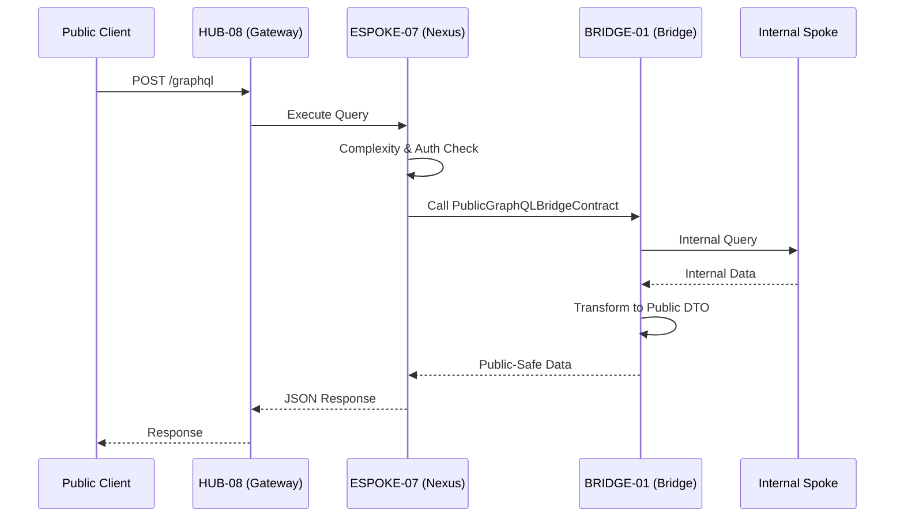

# PHASE ESPOKE-07: Public-Facing GraphQL API Surface

## Tier
External Spoke (Public-facing Application)

## Component Name
Sovereign Nexus (GraphQL API)

## Description
A performant, unified GraphQL API surface for public consumption. It acts as a consumer-facing projection of the Sovereign Stack data model, exposing only "Public-Safe" types and fields. It utilizes the engine provided by `HUB-24` and enforces the strict boundary rules of `BRIDGE-01`.

## Sequencing Rationale
Must be established before ESPOKE-12 (Developer Portal) as that component consumes the schema from this surface. It follows the establishment of basic public web presence (ESPOKE-01) and REST APIs (ESPOKE-02).

## Context7 Research
### Direct Hub Dependencies
- `HUB-24: GraphQL Schema Registry (Engine & Executor)`
- `HUB-08: API Gateway & Public Surface (Routing)`
- `HUB-04: Global Identity & Authentication (Public Auth)`
- `HUB-05: RBAC & Permission Matrix (Field-level Auth)`
- `HUB-15: Health Check & Service Discovery (Status Reporting)`

### Transitive Core Dependencies
- `CORE-02: DI Container (Service Wiring)`
- `CORE-06: Router (Gateway Integration)`
- `CORE-04: HTTP Message (Request/Response)`
- `CORE-18: Core Kernel & Lifecycle (App Boot)`
- `CORE-09: Cryptography & Hashing (Query Hashing/Signing)`

## Architectural Design
- **NexusSchemaManager**: Defines the public-facing GraphQL schema by aggregating types exposed through the Bridge.
- **PublicResolverEngine**: Executes resolvers that call `BRIDGE-01` to fetch data from the Internal tier.
- **ComplexityController**: Implements cost-based query depth and complexity limiting to prevent DoS.
- **TypeProjectionLayer**: Maps internal DTOs received from the Bridge to the public GraphQL Type system.

### Public GraphQL Flow


## Interface Contracts

### PublicGraphQLBridgeContract
```php
namespace Sovereign\External\Nexus\Contracts;

use Sovereign\Bridge\Contracts\BoundaryContractInterface;

/**
 * Specifically governs data crossing for the Public GraphQL surface.
 */
interface PublicGraphQLBridgeContract extends BoundaryContractInterface
{
    /**
     * Fetch a public-safe projection of an internal resource by ID and type.
     */
    public function fetchProjection(string $type, string $id, array $requestedFields): array;

    /**
     * Execute a public-safe search against internal indices.
     */
    public function search(string $query, array $filters): array;
}
```

## Integration Strategy
- **Bridge Enforcement**: Every resolver in ESPOKE-07 MUST interact with the Internal tier via the `PublicGraphQLBridgeContract`. Direct access to Internal Spokes or Hub-tier databases is strictly prohibited.
- **Boundary Rules**: Any attempt by a resolver to request a field not explicitly marked as "Public-Safe" in the Bridge's DTO configuration will trigger a `ViolationException` and return a GraphQL error.
- **Gateway Integration**: Mounted at `/graphql` via `HUB-08` middleware, inheriting rate limiting and WAF protections.
- **Authentication**: Uses `HUB-04` to validate public API keys and JWTs, passing the context to `HUB-24` for field-level authorization.

## CI Verification Criteria
- **Schema Validation**: The unified schema must never expose an "Internal" suffix on any type name.
- **Complexity Limit**: Queries exceeding a complexity score of 1000 or depth of 10 must be rejected with a `400 Bad Request`.
- **Bridge isolation**: Static analysis must confirm that no file in `Sovereign\External\Nexus` includes a `use` statement for `Sovereign\Internal`.
- **Response Time**: 95th percentile query execution (for standard lookups) must be < 50ms.

## SemVer Impact
**Major**. Establishes the primary typed data interface for the public ecosystem.
