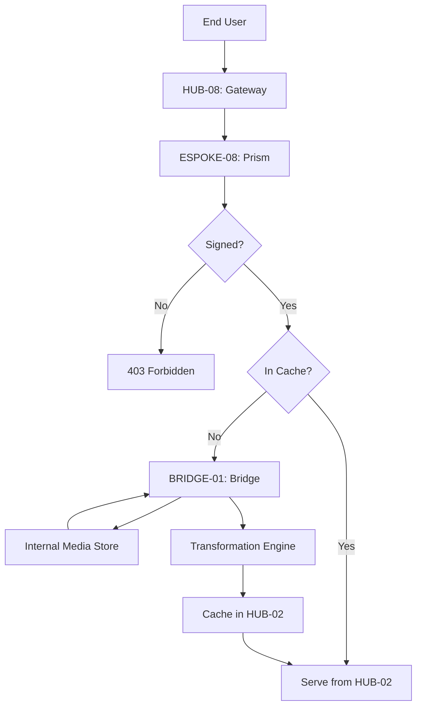

# PHASE ESPOKE-08: Public Media and Asset Delivery Service

## Tier
External Spoke (Public-facing Application)

## Component Name
Sovereign Prism (Media Delivery)

## Description
A specialized delivery service for public media and static assets. It handles image transformation (resizing, format conversion), video streaming metadata, and asset optimization. It serves as the public entry point for media stored in the Internal sub-tier, enforcing privacy and delivery rules via the Bridge.

## Sequencing Rationale
Follows ESPOKE-07. Media assets are required by almost all subsequent public-facing portals (Checkout, Support, etc.) to ensure a consistent and high-performance UI.

## Context7 Research
### Direct Hub Dependencies
- `HUB-03: Unified Asset Pipeline & Bundler (Storage Drivers)`
- `HUB-02: Distributed Cache (Fragment Caching)`
- `HUB-08: API Gateway & Public Surface (URL Routing)`
- `HUB-15: Health Check & Service Discovery (Latency Monitoring)`

### Transitive Core Dependencies
- `CORE-14: Filesystem Abstraction (IO)`
- `CORE-18: Core Kernel & Lifecycle (Runtime)`
- `CORE-06: Router (Path Resolution)`
- `CORE-11: SuperPHP Parser (Template Integration)`

## Architectural Design
- **TransformationEngine**: A PHP-based wrapper around system libraries (GD/Imagick) to perform on-the-fly resizing and optimization.
- **CacheLayer**: Implements high-performance edge-caching patterns using `HUB-02`.
- **SecurityProxy**: Validates signatures for requested assets to prevent "image resizing" DoS attacks.
- **PrismRouter**: Maps public URLs to Bridge-requested internal media IDs.

### Asset Delivery Flow


## Interface Contracts

### MediaDeliveryBridgeContract
```php
namespace Sovereign\External\Prism\Contracts;

use Sovereign\Bridge\Contracts\BoundaryContractInterface;

/**
 * Specifically governs media asset retrieval across the boundary.
 */
interface MediaDeliveryBridgeContract extends BoundaryContractInterface
{
    /**
     * Retrieve a public-safe stream or path for a media asset.
     */
    public function getPublicAsset(string $assetId): array;

    /**
     * Check if a specific media asset is marked as "Public" in the internal registry.
     */
    public function isPubliclyAccessible(string $assetId): bool;
}
```

## Integration Strategy
- **Bridge Compliance**: Interacts with internal storage ONLY through `MediaDeliveryBridgeContract`. No direct filesystem access to internal directories.
- **Signed URLs**: All transformation parameters (width, height, quality) must be signed using a secret from `CORE-09` to prevent abuse.
- **Format Negotiation**: Automatically detects browser support (e.g., WebP, Avif) and serves the most efficient format.
- **SuperPHP Integration**: Provides a `<s:ui:image />` component in `HUB-26` that automatically generates optimized Prism URLs.

## CI Verification Criteria
- **Optimization Ratio**: Transformed images must be at least 30% smaller than originals on average.
- **Signature Security**: Requesting a transformation with an invalid signature MUST return a `403 Forbidden` in < 2ms.
- **Cache Efficiency**: > 90% cache hit rate for repeated asset requests in simulated load tests.
- **Bridge Leak Test**: Automated tests must verify that an "Internal-only" asset ID returns a `404 Not Found` when requested via Prism.

## SemVer Impact
**Minor**. Enhances delivery performance and security for the public web surface.
