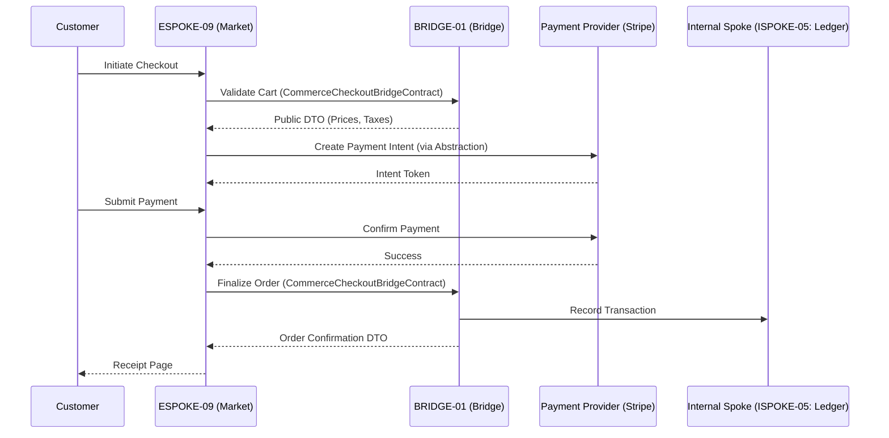

# PHASE ESPOKE-09: E-Commerce and Checkout Portal

## Tier
External Spoke (Public-facing Application)

## Component Name
Sovereign Market (Checkout)

## Description
A secure, high-conversion e-commerce and checkout application. It manages shopping carts, calculates taxes/shipping via the Bridge, and coordinates payment processing through an abstraction layer. It consumes exclusively from `HUB-26` for its UI and honors the `BRIDGE-01` boundary for all transaction processing.

## Sequencing Rationale
Depends on ESPOKE-08 (Prism) for product imagery and ESPOKE-01 (Canvas) for the shopping experience integration. Precedes ESPOKE-10 (Subscription) as the base checkout logic is established here.

## Context7 Research
### Direct Hub Dependencies
- `HUB-26: Shared UI Component Library (Checkout Primitives)`
- `HUB-04: Global Identity & Authentication (Customer Auth)`
- `HUB-08: API Gateway & Public Surface (Secure Routing)`
- `HUB-06: Audit Log & Activity Tracker (Transaction Logging)`
- `HUB-02: Distributed Cache (Cart Storage)`

### Transitive Core Dependencies
- `CORE-09: Cryptography & Hashing (PCI Compliance/Signing)`
- `CORE-18: Core Kernel & Lifecycle (Checkout State Machine)`
- `CORE-11: SuperPHP Parser (Reactive UI)`
- `CORE-02: DI Container (Payment Drivers)`

## Architectural Design
- **CartManager**: A reactive, cache-backed state manager for user shopping sessions.
- **PaymentAbstractionLayer**: A unified interface for interacting with external providers (e.g., Stripe, PayPal). No direct SDK coupling.
- **OrderWorkflowEngine**: Orchestrates the transition from "Cart" to "Pending" to "Complete" states.
- **CheckoutPresenter**: Handles the multi-step checkout UI using `HUB-26` components.

### Checkout Flow Diagram


## Interface Contracts

### CommerceCheckoutBridgeContract
```php
namespace Sovereign\External\Market\Contracts;

use Sovereign\Bridge\Contracts\BoundaryContractInterface;

/**
 * Specifically governs the checkout boundary crossing.
 */
interface CommerceCheckoutBridgeContract extends BoundaryContractInterface
{
    /**
     * Validate a cart and return a public-safe pricing breakdown.
     */
    public function validateCart(array $items, string $promoCode = null): array;

    /**
     * Finalize an order after successful payment.
     */
    public function finalizeOrder(string $paymentToken, array $customerDetails): array;
}
```

### PaymentProviderInterface
```php
namespace Sovereign\External\Market\Contracts;

/**
 * Abstraction to prevent coupling to specific payment SDKs.
 */
interface PaymentProviderInterface
{
    public function createIntent(float $amount, string $currency): string;
    public function capturePayment(string $intentId): bool;
}
```

## Integration Strategy
- **Bridge Compliance**: Never touches internal order or inventory tables directly. Uses `CommerceCheckoutBridgeContract` for all logic verification.
- **UI Consistency**: Strictly uses `HUB-26` checkout components (forms, summary cards, progress bars).
- **Security**: No raw credit card data ever touches the Sovereign Stack. All interactions use provider-issued tokens.
- **Audit**: Every checkout attempt and payment response is logged to `HUB-06` for forensic reconciliation.

## CI Verification Criteria
- **Zero-Coupling Check**: Static analysis must confirm that no Stripe or PayPal namespace is used outside of a `Sovereign\External\Market\Drivers` namespace.
- **Transaction Integrity**: Simulated checkout failures (e.g., network timeout after payment) must result in a consistent "Recoverable" state in the Bridge.
- **Performance**: Checkout UI interactivity (SuperPHP reactivity) must maintain 60FPS on mobile devices.

## SemVer Impact
**Major**. Establishes the revenue-generating engine of the platform.
