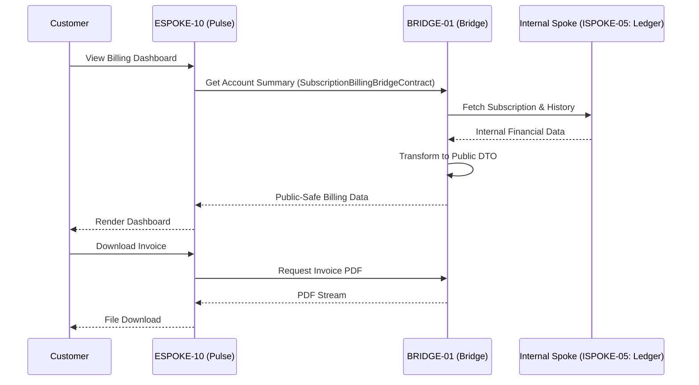

# PHASE ESPOKE-10: Public Subscription and Billing Portal

## Tier
External Spoke (Public-facing Application)

## Component Name
Sovereign Pulse (Billing)

## Description
A dedicated portal for customers to manage their subscriptions, view invoices, and update billing methods. It provides a "Self-Service Billing" experience, interacting with the Internal Spoke sub-tier via the Bridge to ensure that sensitive financial and plan data remains protected.

## Sequencing Rationale
Depends on ESPOKE-09 for shared payment abstraction logic and ESPOKE-03 (Account Portal) for user context.

## Context7 Research
### Direct Hub Dependencies
- `HUB-04: Global Identity & Authentication (Customer Session)`
- `HUB-26: Shared UI Component Library (Billing UI)`
- `HUB-08: API Gateway & Public Surface (Protected Access)`
- `HUB-15: Health Check & Service Discovery (API Latency)`

### Transitive Core Dependencies
- `CORE-09: Cryptography & Hashing (Sensitive Token Handling)`
- `CORE-18: Core Kernel & Lifecycle (Subscription Logic)`
- `CORE-04: HTTP Message (File Downloads - Invoices)`
- `CORE-12: SuperPHP Compiler (Dynamic UI Generation)`

## Architectural Design
- **SubscriptionManager**: Manages plan transitions (upgrades/downgrades) and lifecycle states.
- **InvoiceEngine**: Fetches public-safe invoice data and generates downloadable PDFs via the Bridge.
- **PaymentMethodVault**: A secure interface for managing saved payment tokens (never raw cards).
- **PulseUI**: A customer-facing dashboard built with `HUB-26` components.

### Subscription Management Flow


## Interface Contracts

### SubscriptionBillingBridgeContract
```php
namespace Sovereign\External\Pulse\Contracts;

use Sovereign\Bridge\Contracts\BoundaryContractInterface;

/**
 * Specifically governs subscription and billing boundary crossing.
 */
interface SubscriptionBillingBridgeContract extends BoundaryContractInterface
{
    /**
     * Retrieve a summary of the customer's current plans and status.
     */
    public function getSubscriptionSummary(string $customerId): array;

    /**
     * Retrieve a list of invoices for the customer.
     */
    public function getInvoices(string $customerId): array;

    /**
     * Request a plan change.
     */
    public function changePlan(string $customerId, string $newPlanId): array;
}
```

## Integration Strategy
- **Bridge Compliance**: Sensitive financial records are never exposed. The Bridge only passes DTOs containing "safe" metadata (last 4 digits, expiry, plan names, amounts).
- **Auth Guard**: Every request to Pulse must be verified against `HUB-04` and `HUB-05` to ensure users only access their own billing data.
- **Payment Abstraction**: Shares the `PaymentProviderInterface` defined in ESPOKE-09 to handle recurring payment method updates.
- **PDF Delivery**: Invoices are streamed via the Bridge to ensure they are never stored in a publicly accessible storage bucket.

## CI Verification Criteria
- **Privacy Enforcement**: Automated tests must attempt to fetch an invoice for "Customer A" using "Customer B's" session and verify it returns `403 Forbidden`.
- **Plan Transition Integrity**: Downgrades must trigger appropriate "Entitlement Change" events in the Bridge.
- **UI Performance**: The billing dashboard must load and become interactive in < 1.5s on 4G connections.

## SemVer Impact
**Major**. Completes the customer lifecycle management for the platform.
