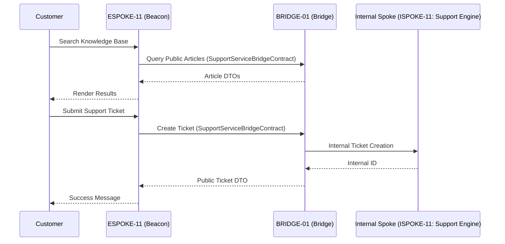

# PHASE ESPOKE-11: Customer Self-Service and Support Centre

## Tier
External Spoke (Public-facing Application)

## Component Name
Sovereign Beacon (Support)

## Description
A unified self-service portal and support ticket management system. It provides a public-facing interface for customers to find answers (via the public knowledge base) and interact with support staff (via tickets) without ever having direct access to internal staff-only support tools.

## Sequencing Rationale
Depends on ESPOKE-01 for page rendering patterns and ESPOKE-03 for customer context. It consumes "Public-Safe" articles from the knowledge base established in ISPOKE-09.

## Context7 Research
### Direct Hub Dependencies
- `HUB-26: Shared UI Component Library (Support UI)`
- `HUB-08: API Gateway & Public Surface (Entry Point)`
- `HUB-04: Global Identity & Authentication (Customer Identity)`
- `HUB-15: Health Check & Service Discovery (Status Check)`

### Transitive Core Dependencies
- `CORE-11: SuperPHP Parser (Dynamic Forms)`
- `CORE-18: Core Kernel & Lifecycle (Session State)`
- `CORE-06: Router (Deep Linking)`
- `CORE-14: Filesystem Abstraction (Attachment Uploads)`

## Architectural Design
- **KnowledgeBaseConsumer**: Fetches and renders public-safe articles via the Bridge.
- **TicketWorkflowEngine**: Handles the public lifecycle of a support ticket (Open, Replied, Resolved).
- **AttachmentProxy**: Manages secure file uploads for tickets, piping them through the Bridge to internal storage.
- **BeaconPresenter**: Renders the support dashboard, search interface, and ticket forms using `HUB-26`.

### Support Interaction Flow


## Interface Contracts

### SupportServiceBridgeContract
```php
namespace Sovereign\External\Beacon\Contracts;

use Sovereign\Bridge\Contracts\BoundaryContractInterface;

/**
 * Specifically governs support and knowledge base boundary crossing.
 */
interface SupportServiceBridgeContract extends BoundaryContractInterface
{
    /**
     * Search and retrieve public-safe knowledge base content.
     */
    public function findArticles(string $query): array;

    /**
     * Submit a new support ticket on behalf of a customer.
     */
    public function createTicket(string $customerId, array $data): array;

    /**
     * Get the public status and history of a specific ticket.
     */
    public function getTicketHistory(string $customerId, string $ticketId): array;
}
```

## Integration Strategy
- **Bridge Compliance**: Beacon never communicates with internal staff-only ticketing systems. All ticket updates are DTO-transformed at the Bridge.
- **Content Filtering**: Only articles explicitly marked for "Public" visibility in ISPOKE-09 are accessible through this spoke.
- **Attachment Security**: Uploaded files are scanned and sanitized at the Bridge before being passed to internal storage.
- **UI Consistency**: Uses the "Support" component variants from `HUB-26`.

## CI Verification Criteria
- **Article Isolation**: Automated tests must verify that "Draft" or "Internal-only" articles are never returned in search results.
- **Ticket Ownership**: Verification that a customer cannot view or reply to a ticket ID belonging to another customer.
- **Upload Integrity**: Malicious file types (e.g., .php, .exe) must be rejected at the Bridge with a `400 Bad Request`.

## SemVer Impact
**Minor**. Extends the customer service capabilities of the platform.
