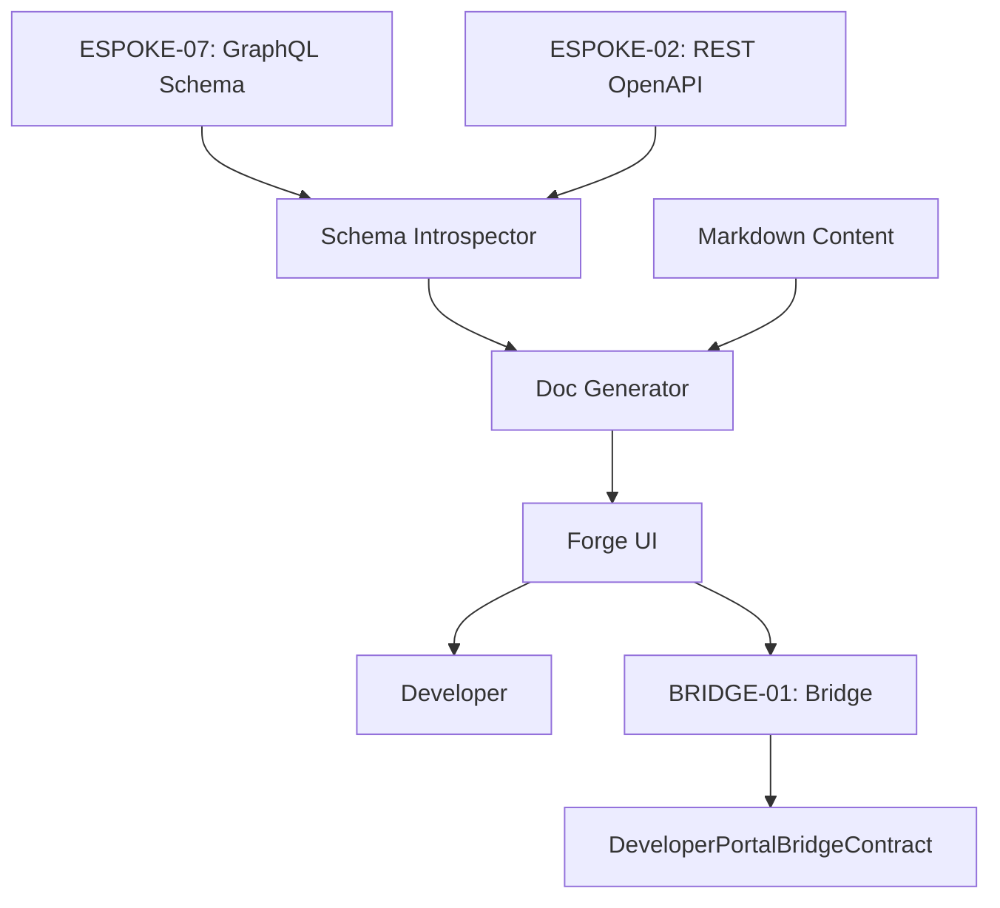

# PHASE ESPOKE-12: Developer-Facing Public API Documentation Portal

## Tier
External Spoke (Public-facing Application)

## Component Name
Sovereign Forge (Dev Portal)

## Description
The primary destination for developers building on the Sovereign Stack. It dynamically generates and hosts documentation for both the Public REST API (ESPOKE-02) and the Public GraphQL API (ESPOKE-07). It provides interactive "Try it now" environments, SDK download links, and API key management.

## Sequencing Rationale
Must follow ESPOKE-02 (REST) and ESPOKE-07 (GraphQL) as it consumes their schemas and metadata to generate documentation.

## Context7 Research
### Direct Hub Dependencies
- `HUB-24: GraphQL Schema Registry (Introspection)`
- `HUB-08: API Gateway & Public Surface (API Metadata)`
- `HUB-26: Shared UI Component Library (Code Blocks/Docs UI)`
- `HUB-04: Global Identity & Authentication (Developer Auth)`

### Transitive Core Dependencies
- `CORE-11: SuperPHP Parser (Interactive Sandboxes)`
- `CORE-12: SuperPHP Compiler (Static Doc Generation)`
- `CORE-18: Core Kernel & Lifecycle (Portal Boot)`
- `CORE-14: Filesystem Abstraction (Markdown Storage)`

## Architectural Design
- **SchemaIntrospector**: Fetches the unified GraphQL schema from ESPOKE-07 and the OpenAPI spec from ESPOKE-02.
- **DocGenerator**: A PHP-based engine that transforms schemas and Markdown files into a searchable documentation site.
- **SandboxManager**: Provides an interactive UI for executing authenticated requests against the public APIs.
- **DeveloperConsole**: A dashboard for developers to manage their public API keys and webhooks.

### Documentation Generation Flow


## Interface Contracts

### DeveloperPortalBridgeContract
```php
namespace Sovereign\External\Forge\Contracts;

use Sovereign\Bridge\Contracts\BoundaryContractInterface;

/**
 * Specifically governs developer account and API key management across the boundary.
 */
interface DeveloperPortalBridgeContract extends BoundaryContractInterface
{
    /**
     * Create or rotate a public API key for a developer.
     */
    public function manageApiKey(string $developerId, string $action): array;

    /**
     * Fetch developer-specific usage quotas and limits.
     */
    public function getApiUsage(string $developerId): array;
}
```

## Integration Strategy
- **Dynamic Discovery**: Forge uses internal Hub-level service discovery (`HUB-15`) to find the active GraphQL and REST endpoints to pull fresh schemas.
- **Bridge Compliance**: Developer API keys and quotas are managed via the `DeveloperPortalBridgeContract`.
- **UI Consistency**: Uses the "Developer" theme of `HUB-26` (high-contrast code blocks, sidebar navigation).
- **Security**: The "Sandbox" environment uses the user's actual API keys (stored in the session via `HUB-04`) to make real calls to the Gateway.

## CI Verification Criteria
- **Doc Synchronization**: Documentation must automatically update within 60 seconds of a schema change in ESPOKE-02 or ESPOKE-07.
- **Sandbox Isolation**: API requests made via the sandbox must be clearly tagged in `HUB-06` audit logs as "Portal Sandbox" requests.
- **Performance**: Doc pages with large schemas (e.g., > 100 types) must render in < 500ms.

## SemVer Impact
**Minor**. Improves developer experience and platform adoption.
