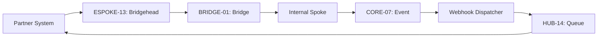

# PHASE ESPOKE-13: Partner and Third-Party Integration Gateway

## Tier
External Spoke (Public-facing Application)

## Component Name
Sovereign Bridgehead (Partner Gateway)

## Description
A specialized gateway for high-priority partner integrations and third-party webhooks. It provides dedicated endpoints, custom authentication logic for legacy partner systems, and an outbound webhook dispatcher to notify third-party systems of events within the Sovereign Stack.

## Sequencing Rationale
Depends on ESPOKE-12 (Developer Portal) for API key management and ESPOKE-02 (REST API) for base routing patterns.

## Context7 Research
### Direct Hub Dependencies
- `HUB-08: API Gateway & Public Surface (Traffic Management)`
- `HUB-06: Audit Log & Activity Tracker (Partner Auditing)`
- `HUB-14: Distributed Task Queue (Webhook Dispatching)`
- `HUB-04: Global Identity & Authentication (Partner Auth)`

### Transitive Core Dependencies
- `CORE-09: Cryptography & Hashing (Webhook Signing)`
- `CORE-18: Core Kernel & Lifecycle (Event Loop)`
- `CORE-04: HTTP Message (Payload Handling)`
- `CORE-07: Event Dispatcher (Internal Event Capture)`

## Architectural Design
- **PartnerAuthManager**: Implements specialized auth strategies (e.g., mTLS, custom header signatures) for specific partner contracts.
- **WebhookDispatcher**: Consumes internal events and pushes them to registered external partner URLs via `HUB-14`.
- **PayloadTransformer**: Normalizes incoming partner data into Sovereign-safe DTOs before passing them to the Bridge.
- **CircuitBreaker**: Protects the Sovereign Stack from slow or failing partner endpoints during webhook delivery.

### Partner Integration Diagram


## Interface Contracts

### PartnerIntegrationBridgeContract
```php
namespace Sovereign\External\Bridgehead\Contracts;

use Sovereign\Bridge\Contracts\BoundaryContractInterface;

/**
 * Specifically governs high-privilege partner interactions across the boundary.
 */
interface PartnerIntegrationBridgeContract extends BoundaryContractInterface
{
    /**
     * Submit a partner-originated batch of data.
     */
    public function ingestPartnerData(string $partnerId, array $payload): array;

    /**
     * Register a partner's interest in specific internal event types.
     */
    public function registerWebhook(string $partnerId, string $url, array $events): void;
}
```

## Integration Strategy
- **Bridge Compliance**: All partner data ingestion must pass through the `PartnerIntegrationBridgeContract` for transformation and policy enforcement.
- **Webhook Security**: All outbound webhooks are signed with a HMAC-SHA256 signature using a partner-specific secret managed in `CORE-09`.
- **Isolation**: Partner traffic is isolated from standard public API traffic via dedicated `HUB-08` route groups.
- **Retry Logic**: Implements exponential backoff for failed webhook deliveries using `HUB-14`.

## CI Verification Criteria
- **Signature Verification**: Every outbound webhook must be verified in tests to contain a valid `X-Sovereign-Signature` header.
- **Circuit Breaking**: Verification that the system stops attempting to call a partner URL after 5 consecutive failures.
- **Payload Sanitization**: Automated tests must confirm that partner payloads containing extra, non-contract fields are stripped at the Bridge.

## SemVer Impact
**Minor**. Enables deep integration with the external business ecosystem.
