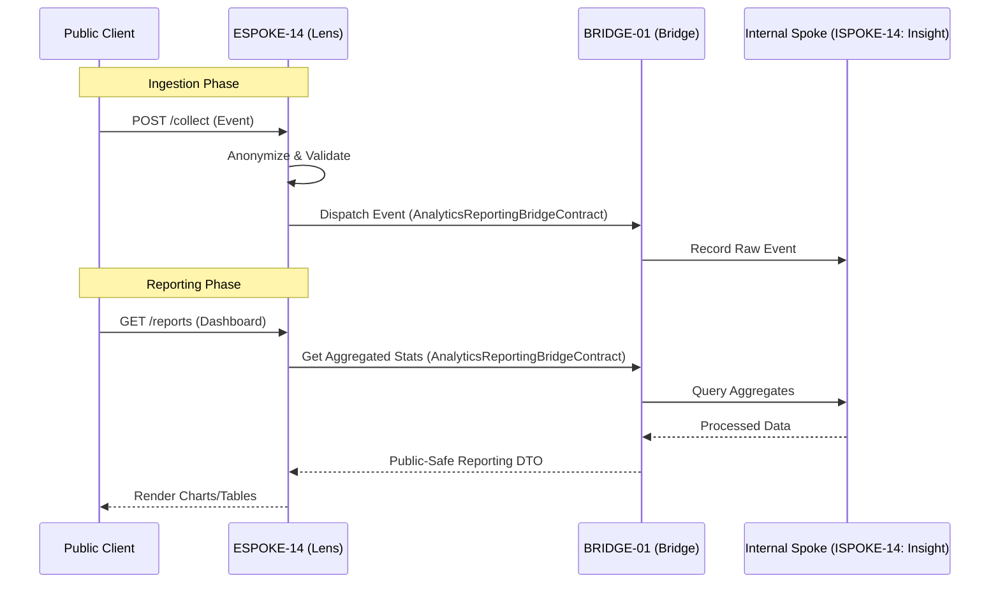

# PHASE ESPOKE-14: Public Analytics and Reporting Endpoint

## Tier
External Spoke (Public-facing Application)

## Component Name
Sovereign Lens (Analytics)

## Description
A dual-purpose analytics engine. It provides an ingestion endpoint for public client events (clicks, views, conversions) and a reporting interface for authenticated customers to view their own performance metrics. It bridges the gap between raw public activity and processed internal reporting data.

## Sequencing Rationale
Depends on almost all other External Spokes as it collects data from them. It uses the reporting patterns established in ISPOKE-14 (Internal Analytics).

## Context7 Research
### Direct Hub Dependencies
- `HUB-08: API Gateway & Public Surface (Ingestion Routing)`
- `HUB-02: Distributed Cache (Real-time Counters)`
- `HUB-26: Shared UI Component Library (Charts/Data Viz)`
- `HUB-06: Audit Log & Activity Tracker (Raw Event Storage)`

### Transitive Core Dependencies
- `CORE-09: Cryptography & Hashing (Anonymization)`
- `CORE-18: Core Kernel & Lifecycle (Processing Pipeline)`
- `CORE-14: Filesystem Abstraction (Log Rotation)`
- `CORE-11: SuperPHP Parser (Dynamic Reporting UI)`

## Architectural Design
- **EventIngestor**: A high-throughput, low-latency endpoint for receiving JSON analytics payloads.
- **AnonymizationLayer**: Strips PII and salts identifiers using `CORE-09` before internal storage.
- **MetricAggregator**: Consumes raw events and updates real-time counters in `HUB-02`.
- **ReportingPresenter**: A customer-facing dashboard for viewing aggregated metrics using `HUB-26` visualization components.

### Analytics Ingestion & Reporting Flow


## Interface Contracts

### AnalyticsReportingBridgeContract
```php
namespace Sovereign\External\Lens\Contracts;

use Sovereign\Bridge\Contracts\BoundaryContractInterface;

/**
 * Specifically governs the analytics ingestion and reporting boundary.
 */
interface AnalyticsReportingBridgeContract extends BoundaryContractInterface
{
    /**
     * Dispatch an anonymized event for internal storage and processing.
     */
    public function dispatchEvent(array $anonymizedData): void;

    /**
     * Fetch aggregated reporting data for a specific customer.
     */
    public function getCustomerReport(string $customerId, string $reportType, array $params): array;
}
```

## Integration Strategy
- **Bridge Compliance**: Raw event ingestion and reporting queries are strictly mediated by the `AnalyticsReportingBridgeContract`.
- **Privacy First**: No raw IP addresses or user-agent strings cross the Bridge; they are anonymized within ESPOKE-14.
- **Visualization**: Uses `HUB-26` primitives for SVG charts and data tables, ensuring consistent UI.
- **Buffering**: High-volume ingestion events are buffered in `HUB-02` before being flushed to the Bridge in batches to protect internal service performance.

## CI Verification Criteria
- **Anonymization Test**: Verify that no PII (email, name, raw IP) is present in the `anonymizedData` payload sent to the Bridge.
- **Ingestion Latency**: The `/collect` endpoint must return `202 Accepted` in < 10ms.
- **Data Isolation**: Ensure Customer A cannot access aggregated reports belonging to Customer B.

## SemVer Impact
**Minor**. Provides transparency and data-driven insights to the public ecosystem.
