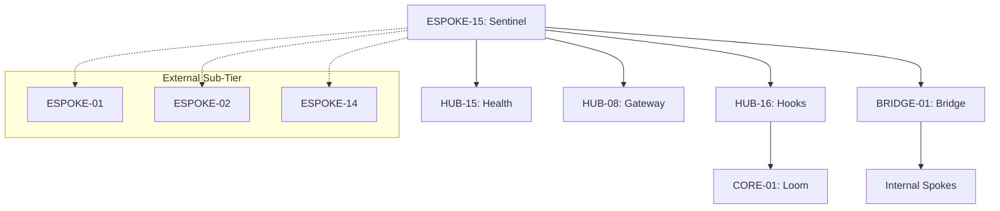

# PHASE ESPOKE-15: External Spoke Orchestration and Health Reporting Layer

## Tier
External Spoke (Management & Orchestration)

## Component Name
Sovereign Sentinel (External Orchestrator)

## Description
The final phase of the External Spoke sub-tier. Sovereign Sentinel is an internal orchestration and health reporting layer that governs the entire public-facing sub-tier. it monitors the lifecycle, deployment state, and operational health of all External Spokes (ESPOKE-01 through ESPOKE-14), reporting back to the Core Orchestrator (CORE-01) and the Hub-level orchestration hooks (HUB-16).

## Sequencing Rationale
The final phase (81 of 81). It must be the last component as its purpose is to oversee and coordinate the completed External sub-tier.

## Context7 Research
### Direct Hub Dependencies
- `HUB-16: Hub-level Orchestration Hooks (Execution Pipeline)`
- `HUB-15: Health Check & Service Discovery (Health Data)`
- `HUB-08: API Gateway & Public Surface (Traffic Control)`
- `HUB-06: Audit Log & Activity Tracker (Deployment Auditing)`

### Transitive Core Dependencies
- `CORE-01: Polyrepo Orchestrator (Upward Reporting)`
- `CORE-18: Core Kernel & Lifecycle (Service Management)`
- `CORE-02: DI Container (Registry)`
- `CORE-07: Event Dispatcher (Health Events)`
- `CORE-15: Process Management (Worker Monitoring)`

## Architectural Design
- **SubTierController**: Coordinates deployment and rollout strategies (e.g., Blue/Green, Canary) for all External Spokes.
- **HealthAggregator**: Consumes health metrics from `HUB-15` specific to the External sub-tier and calculates "Fleet Health".
- **TrafficGovernor**: Interacts with `HUB-08` to shed load or redirect traffic during External sub-tier maintenance or failure.
- **SentinelBridgeAgent**: Communicates with the Bridge to monitor the health of cross-tier contracts.

### External Orchestration Diagram


## Interface Contracts

### ExternalOrchestrationBridgeContract
```php
namespace Sovereign\External\Sentinel\Contracts;

use Sovereign\Bridge\Contracts\BoundaryContractInterface;

/**
 * Specifically governs orchestration and maintenance signals crossing the boundary.
 */
interface ExternalOrchestrationBridgeContract extends BoundaryContractInterface
{
    /**
     * Notify the Internal tier of an External sub-tier deployment state change.
     */
    public function notifyDeployment(string $spokeId, string $version, string $status): void;

    /**
     * Synchronize maintenance mode state between tiers.
     */
    public function syncMaintenanceMode(bool $active): void;
}
```

## Integration Strategy
- **Bridge Compliance**: Sentinel reports sub-tier health and deployment status to the Internal tier via the `ExternalOrchestrationBridgeContract`. It never directly manipulates internal service states.
- **Upward Reporting**: Acts as a "Sub-tier Delegate" for `CORE-01`. When the Core Orchestrator asks for the status of the External tier, Sentinel provides the aggregated response.
- **Gateway Control**: In the event of a critical failure in an ESPOKE (e.g., ESPOKE-09 Checkout is down), Sentinel can signal `HUB-08` to disable the affected routes or serve a graceful "Service Unavailable" page.
- **Automation**: Integrated with `HUB-16` to automate the cleanup of stale caches and assets during a deployment.

## CI Verification Criteria
- **Aggregation Logic**: Verify that a "CRITICAL" health status in any one ESPOKE correctly degrades the overall External Sub-tier health reported by Sentinel.
- **Traffic Interception**: Automated tests must verify that Sentinel can successfully signal `HUB-08` to block traffic to a specific spoke.
- **Zero-Node Check**: Confirmation that the orchestration logic is 100% PHP, with no external Node.js dependencies for deployment or monitoring.

## SemVer Impact
**Major**. Completes the Sovereign Stack and provides the final operational guardrail for the public interface.
