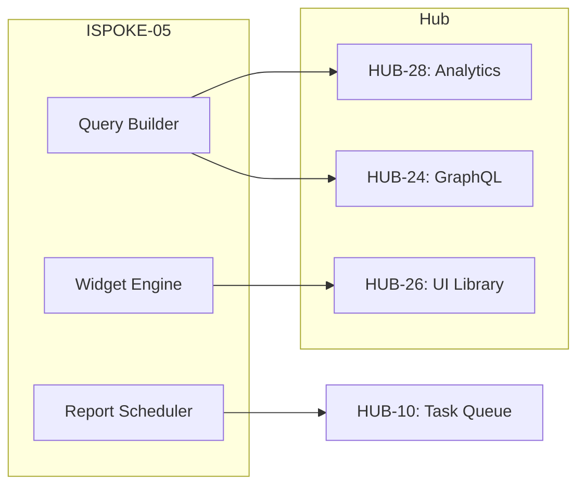

# PHASE ISPOKE-05: Internal Reporting and Analytics Dashboard

## Tier
Internal Spoke (Staff-only Application)

## Component Name
Sovereign Insight

## Description
A centralized reporting engine and visualization dashboard for internal staff. It aggregates data from across the Hub (via HUB-28: Distributed Ledger/Analytics) and provides business intelligence, system performance metrics, and operational reports. It is the primary tool for data-driven decision making within the organization.

## Sequencing Rationale
Follows ISPOKE-04 (Identity) to provide visibility into staff activity and system health as soon as the basic administration portals are established. It serves as a consumer of the analytics services matured in the Hub.

## Context7 Research
### Direct Hub Dependencies
- `HUB-28: Distributed Ledger & Analytics Engine`
- `HUB-24: GraphQL Schema Registry`
- `HUB-26: Shared UI Component Library`
- `HUB-08: API Gateway`
- `HUB-15: Health Check & Service Discovery`
- `HUB-16: Hub-level Orchestration Hooks`
- `HUB-02: Distributed Cache (Redis)`

### Transitive Core Dependencies
- `CORE-19: DBAL & Migrations`
- `CORE-18: Core Kernel & Lifecycle`
- `CORE-11: SuperPHP Parser`
- `CORE-12: SuperPHP Compiler`
- `CORE-06: Router`
- `CORE-02: DI Container`
- `CORE-09: Cryptography & Hashing`

## Architectural Design
- **QueryBuilder**: A specialized interface for constructing complex analytics queries against `HUB-28`.
- **WidgetEngine**: Renders visualization components (Charts, Tables, KPIs) using `HUB-26`.
- **ReportScheduler**: Hooks into `HUB-10` to generate and distribute periodic reports.
- **ExportService**: Handles high-volume data exports (CSV, PDF) using `CORE-14`.

### Component Relationship Diagram


## Interface Contracts

### AnalyticsQueryInterface
```php
namespace Sovereign\Internal\Insight\Contracts;

interface AnalyticsQueryInterface
{
    /**
     * Define the time range for the report.
     */
    public function setTimeRange(\DateTimeInterface $start, \DateTimeInterface $end): self;

    /**
     * Add a metric dimension (e.g., 'tenant_id', 'service_name').
     */
    public function groupBy(string $dimension): self;

    /**
     * Execute the query and return a ResultCollection.
     */
    public function execute(): array;
}
```

## Integration Strategy
- **Bootstrapping**: Initialized via the `CORE-18` Kernel; discovers analytics endpoints via `HUB-15`.
- **Data Access**: Exclusively consumes data through `HUB-08` (API Gateway) or direct internal `HUB-28` service calls.
- **UI**: Renders reactive dashboards using SuperPHP and `HUB-26` visualization primitives.
- **Health**: Reports dashboard availability and query latency to `HUB-15`.
- **Lifecycle**: Utilizes `HUB-16` hooks to pause high-load background reporting during system maintenance.

## CI Verification Criteria
- **Query Performance**: Aggregate queries on 1 million rows must return a result set in < 200ms.
- **UI Integrity**: 100% of chart components must be sourced from the `HUB-26` namespace.
- **Security**: Cross-tenant data leakage check; a tenant-specific report must never contain data from another `tenant_id`.

## SemVer Impact
**Minor**. Adds internal observability and business intelligence capabilities.
