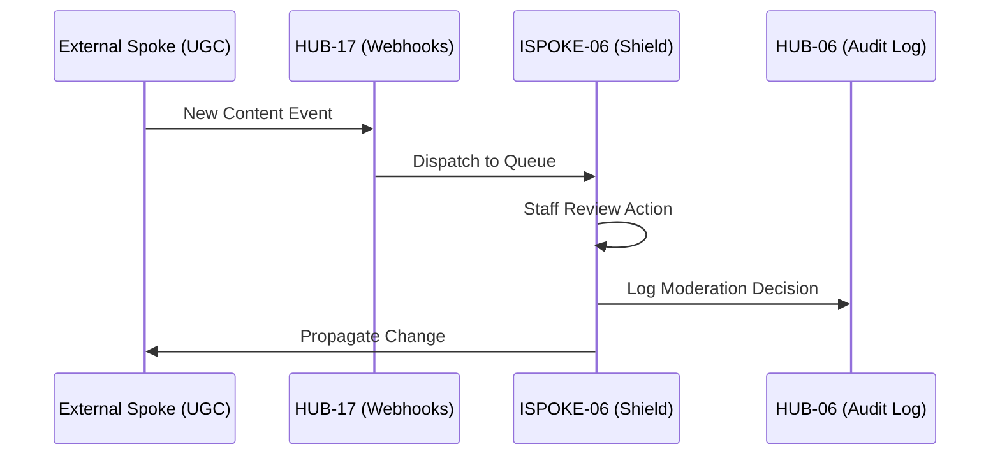

# PHASE ISPOKE-06: Content Moderation and Review Panel

## Tier
Internal Spoke (Staff-only Application)

## Component Name
Sovereign Shield (Moderation)

## Description
A comprehensive interface for staff to review, moderate, and manage user-generated content (UGC). It integrates with automated flagging services (via HUB-24 GraphQL) and provides manual override capabilities, user ban management, and content appeal processing.

## Sequencing Rationale
Follows the Reporting dashboard (ISPOKE-05) to provide staff with the tools to act on the insights and alerts generated by system analytics.

## Context7 Research
### Direct Hub Dependencies
- `HUB-04: Global Identity & Authentication`
- `HUB-05: RBAC & Permission Engine`
- `HUB-26: Shared UI Component Library`
- `HUB-08: API Gateway`
- `HUB-06: Audit Log & Activity Tracker`
- `HUB-17: Webhook Ingestion & Dispatch Engine`
- `HUB-15: Health Check & Service Discovery`

### Transitive Core Dependencies
- `CORE-11: SuperPHP Parser`
- `CORE-12: SuperPHP Compiler`
- `CORE-18: Core Kernel & Lifecycle`
- `CORE-19: DBAL & Migrations`
- `CORE-06: Router`
- `CORE-09: Cryptography & Hashing`

## Architectural Design
- **ModerationQueue**: A reactive list of content pending review, prioritized by risk score.
- **ActionEngine**: Executes moderation decisions (Delete, Hide, Warn, Ban).
- **AppealManager**: Handles user-submitted appeals against moderation actions.
- **EvidenceVault**: Securely stores snapshots of moderated content for audit purposes.

### Moderation Workflow Diagram


## Interface Contracts

### ModerationActionInterface
```php
namespace Sovereign\Internal\Shield\Contracts;

interface ModerationActionInterface
{
    /**
     * Apply a moderation action to a specific piece of content.
     */
    public function apply(string $contentId, string $action, string $reason, string $staffId): bool;

    /**
     * Get the moderation history for a specific user.
     */
    public function getHistory(string $userId): array;
}
```

## Integration Strategy
- **Bootstrapping**: Boots via `CORE-18`; subscribes to content-related webhooks via `HUB-17`.
- **UI Rendering**: Uses `HUB-26` for the review queue and multi-media content players.
- **Auditing**: Every staff action is mandatorily piped to `HUB-06` to prevent internal abuse.
- **Health**: Reports queue depth and "time-to-action" metrics to `HUB-15`.
- **Hooks**: Registers with `HUB-16` to ensure moderation caches are purged during maintenance.

## CI Verification Criteria
- **Action Integrity**: A moderation action must be atomical; the database update and the audit log entry must succeed together or fail together.
- **Privilege Check**: Only staff with `moderator` role (via `HUB-05`) can execute 'Delete' or 'Ban' actions.
- **Load Testing**: The Moderation Queue must handle 10,000 pending items without UI lag.

## SemVer Impact
**Minor**. Essential for community management and legal compliance.
