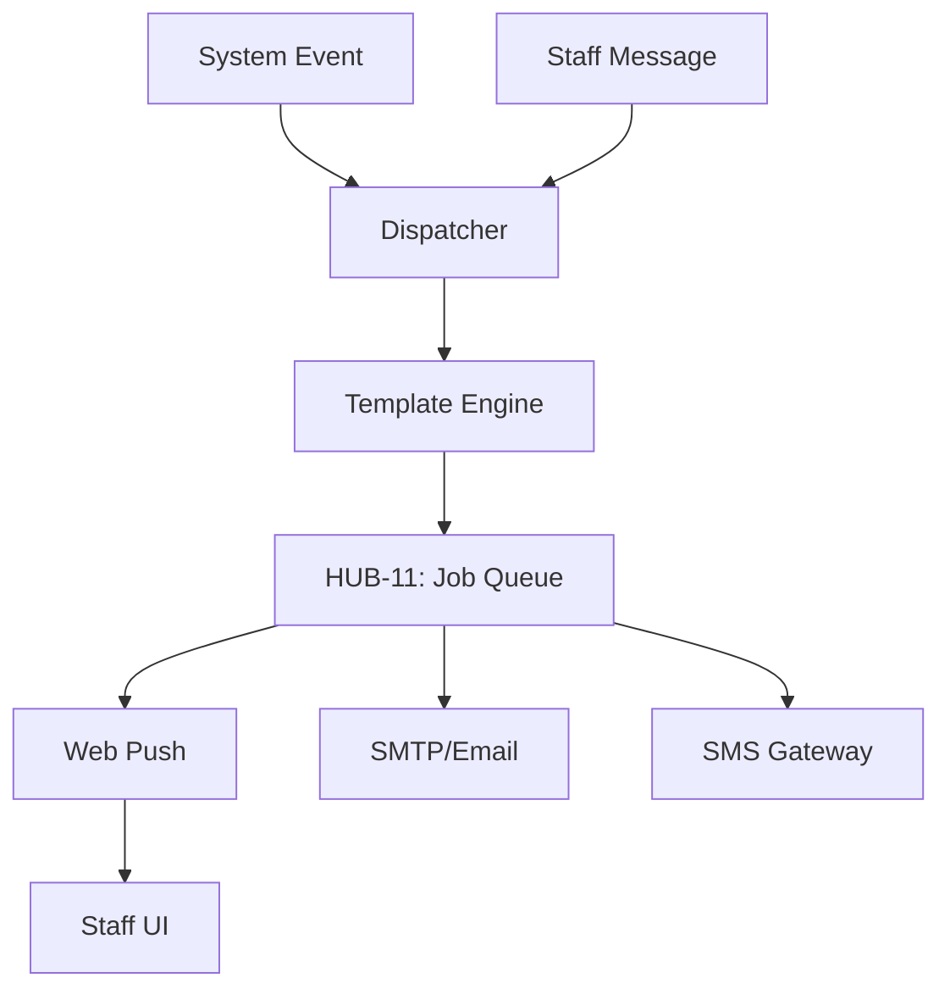

# PHASE ISPOKE-07: Internal Notification and Messaging Centre

## Tier
Internal Spoke (Staff-only Application)

## Component Name
Sovereign Relay (Internal)

## Description
A central hub for managing internal communications between staff members and automated system alerts. It provides real-time messaging, notification templating, and cross-channel delivery (Web, Email, SMS) for staff-facing events.

## Sequencing Rationale
Provides the messaging infrastructure needed by the subsequent Workflow (ISPOKE-08) and Audit (ISPOKE-10) systems to alert staff of pending tasks or compliance violations.

## Context7 Research
### Direct Hub Dependencies
- `HUB-12: Event-driven Messaging & Pub/Sub`
- `HUB-11: Job Queue & Background Processing`
- `HUB-01: Global Configuration & Feature Flags`
- `HUB-26: Shared UI Component Library`
- `HUB-04: Global Identity & Authentication`
- `HUB-15: Health Check & Service Discovery`

### Transitive Core Dependencies
- `CORE-18: Core Kernel & Lifecycle`
- `CORE-06: Router`
- `CORE-14: Filesystem Abstraction`
- `CORE-02: DI Container`
- `CORE-11: SuperPHP Parser`
- `CORE-12: SuperPHP Compiler`

## Architectural Design
- **NotificationDispatcher**: Routes messages to appropriate channels based on staff preferences.
- **TemplateEngine**: Renders localized notification content using `HUB-26` styles.
- **PresenceManager**: Tracks staff online status using `HUB-12` pub/sub.
- **AlertAggregator**: De-duplicates high-volume system alerts to prevent "alert fatigue."

### Notification Flow Diagram


## Interface Contracts

### InternalRelayInterface
```php
namespace Sovereign\Internal\Relay\Contracts;

interface InternalRelayInterface
{
    /**
     * Send a notification to a specific staff member or group.
     */
    public function notify(string $recipientId, string $template, array $data): void;

    /**
     * Broadcast an urgent system alert to all active staff.
     */
    public function broadcast(string $alertLevel, string $message): void;
}
```

## Integration Strategy
- **Bootstrapping**: Registers as a persistent listener on `HUB-12` event topics.
- **UI**: Embeds a "Notification Bell" and real-time chat widget in the `HUB-26` master layout.
- **Processing**: Offloads all delivery logic to `HUB-11` to ensure non-blocking UI interactions.
- **Health**: Monitors delivery success rates and latency, reporting failures to `HUB-15`.
- **Lifecycle**: Respects "Do Not Disturb" flags managed via `HUB-01`.

## CI Verification Criteria
- **Delivery Guarantee**: 100% of messages marked as `urgent` must be dispatched to the job queue within 10ms.
- **Real-time Performance**: Web push notifications must arrive at the client in < 500ms from event ingestion.
- **Template Safety**: Invalid template data must be caught gracefully and logged, preventing worker crashes.

## SemVer Impact
**Minor**. Enhances internal collaboration and system responsiveness.
