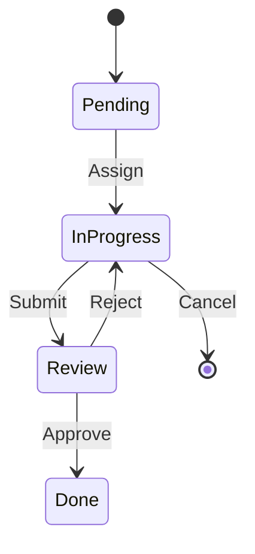

# PHASE ISPOKE-08: Workflow and Task Management System

## Tier
Internal Spoke (Staff-only Application)

## Component Name
Sovereign Flow

## Description
A state-machine driven workflow engine for managing complex internal processes (e.g., staff onboarding, content approval chains, incident response). It provides a UI for task assignment, deadline tracking, and automated transitions based on business rules.

## Sequencing Rationale
Relies on ISPOKE-07 for task notifications. This system becomes the foundational orchestration layer for all human-in-the-loop processes in the stack.

## Context7 Research
### Direct Hub Dependencies
- `HUB-05: RBAC & Permission Engine`
- `HUB-10: Task Queue & Scheduled Jobs`
- `HUB-12: Event-driven Messaging & Pub/Sub`
- `HUB-26: Shared UI Component Library`
- `HUB-08: API Gateway`
- `HUB-15: Health Check & Service Discovery`

### Transitive Core Dependencies
- `CORE-18: Core Kernel & Lifecycle`
- `CORE-19: DBAL & Migrations`
- `CORE-02: DI Container`
- `CORE-11: SuperPHP Parser`
- `CORE-12: SuperPHP Compiler`

## Architectural Design
- **StateMachine**: Defines valid states (e.g., Pending, In Progress, Review, Done) and transitions.
- **TaskRegistry**: Tracks active assignments, priorities, and deadlines.
- **RuleEvaluator**: Automatically triggers transitions based on data conditions or external events.
- **FlowBuilder**: A low-code UI for defining new workflow definitions (stored as Hub Config).

### State Transition Diagram


## Interface Contracts

### WorkflowEngineInterface
```php
namespace Sovereign\Internal\Flow\Contracts;

interface WorkflowEngineInterface
{
    /**
     * Start a new workflow instance for a given entity.
     */
    public function start(string $flowType, string $entityId, array $context = []): string;

    /**
     * Transition a task to the next state.
     */
    public function transition(string $taskId, string $transition, string $staffId): bool;
}
```

## Integration Strategy
- **Bootstrapping**: Loads workflow definitions from `HUB-01` and registers listeners on `HUB-12`.
- **UI**: Provides specialized "Kanban" and "List" view components via `HUB-26`.
- **Notifications**: Automatically triggers `ISPOKE-07` Relay notifications on task assignment or state change.
- **Auditing**: Every transition is logged in `HUB-06` via the Hub API Gateway.
- **Health**: Reports stalled workflows (past deadline) to `HUB-15`.

## CI Verification Criteria
- **Transition Integrity**: Invalid state transitions (e.g., Pending -> Done) must be blocked at the interface level.
- **Atomic Updates**: State changes and transition logging must be transactional.
- **Concurrency**: Must handle 100 simultaneous transition requests on the same workflow type without deadlocks.

## SemVer Impact
**Major**. Introduces a critical coordination layer for all staff-driven operations.
