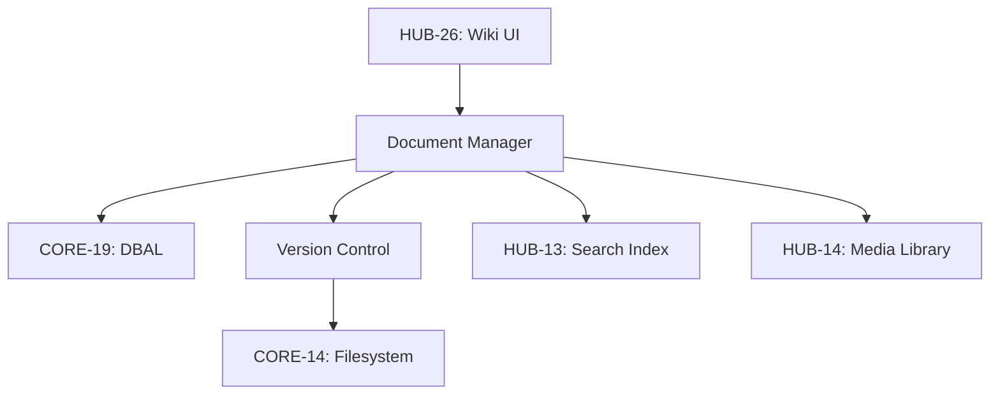

# PHASE ISPOKE-09: Internal Knowledge Base and Wiki

## Tier
Internal Spoke (Staff-only Application)

## Component Name
Sovereign Codex

## Description
A collaborative documentation and knowledge management platform for staff. It serves as the "Sovereign Manual," containing standard operating procedures (SOPs), technical documentation, and organizational policies. It features Markdown editing, version history, and full-text search.

## Sequencing Rationale
Follows the Workflow system (ISPOKE-08) to allow documentation to be linked directly to specific tasks or approval processes.

## Context7 Research
### Direct Hub Dependencies
- `HUB-13: Full-text Search & Indexing`
- `HUB-06: Audit Log & Activity Tracker`
- `HUB-14: Media Library & Asset Management`
- `HUB-26: Shared UI Component Library`
- `HUB-04: Global Identity & Authentication`
- `HUB-05: RBAC & Permission Engine`
- `HUB-15: Health Check & Service Discovery`

### Transitive Core Dependencies
- `CORE-14: Filesystem Abstraction`
- `CORE-18: Core Kernel & Lifecycle`
- `CORE-19: DBAL & Migrations`
- `CORE-11: SuperPHP Parser`
- `CORE-12: SuperPHP Compiler`
- `CORE-06: Router`

## Architectural Design
- **DocumentManager**: Handles CRUD operations for Markdown documents and their metadata.
- **VersionControl**: Tracks document revisions and allows for side-by-side diffing and rollback.
- **SearchProvider**: Integrates with `HUB-13` to provide instant search across all internal documentation.
- **AssetIncluder**: Allows staff to embed media from `HUB-14` directly into articles.

### Document Architecture Diagram


## Interface Contracts

### KnowledgeBaseInterface
```php
namespace Sovereign\Internal\Codex\Contracts;

interface KnowledgeBaseInterface
{
    /**
     * Retrieve a document by slug, including version metadata.
     */
    public function getDocument(string $slug, ?int $version = null): array;

    /**
     * Create or update a document.
     */
    public function saveDocument(string $slug, string $content, string $staffId, string $summary): bool;
}
```

## Integration Strategy
- **Bootstrapping**: Initialized via `CORE-18`; verifies search availability via `HUB-15`.
- **Authoring**: Uses a reactive Markdown editor built with `HUB-26` components.
- **Indexing**: Automatically pushes document updates to `HUB-13` via a background job (`HUB-11`).
- **Permissions**: Respects "Departmental" access levels defined in `HUB-05`.
- **Health**: Reports search latency and indexing backlog to `HUB-15`.

## CI Verification Criteria
- **Search Accuracy**: A document must be searchable via `HUB-13` within 2 seconds of being saved.
- **Version Integrity**: Rollback to any previous version must restore the document content with 100% fidelity.
- **Media Linking**: Breaking a link to an asset in `HUB-14` must be surfaced as a validation error during editing.

## SemVer Impact
**Minor**. Centralizes organizational knowledge and technical documentation.
