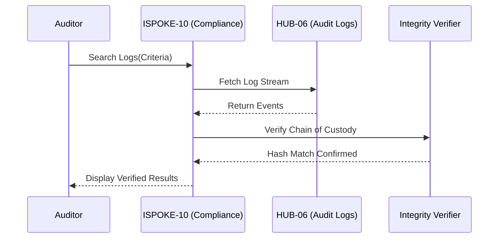

# PHASE ISPOKE-10: Audit and Compliance Review Portal

## Tier
Internal Spoke (Staff-only Application)

## Component Name
Sovereign Compliance (Audit)

## Description
A specialized portal for compliance officers and auditors to review system activity, verify adherence to policies, and investigate security incidents. It provides advanced filtering of the `HUB-06` audit logs, legal hold management, and compliance report generation.

## Sequencing Rationale
Strategically placed after the Workflow (ISPOKE-08) and Knowledge Base (ISPOKE-09) systems to enable auditing of both automated processes and manual documentation changes.

## Context7 Research
### Direct Hub Dependencies
- `HUB-06: Audit Log & Activity Tracker`
- `HUB-28: Distributed Ledger & Analytics Engine`
- `HUB-05: RBAC & Permission Engine`
- `HUB-26: Shared UI Component Library`
- `HUB-08: API Gateway`
- `HUB-15: Health Check & Service Discovery`

### Transitive Core Dependencies
- `CORE-09: Cryptography & Hashing (for Log Verification)`
- `CORE-18: Core Kernel & Lifecycle`
- `CORE-19: DBAL & Migrations`
- `CORE-11: SuperPHP Parser`
- `CORE-12: SuperPHP Compiler`

## Architectural Design
- **AuditExplorer**: A high-performance log viewer with multi-dimensional filtering.
- **ComplianceReporter**: Generates signed PDF reports for regulatory compliance (e.g., GDPR, SOC2).
- **IncidentInvestigator**: Allows for linking multiple audit events into a single "Case."
- **IntegrityVerifier**: Uses cryptographic hashes from `HUB-06` to verify that logs haven't been tampered with.

### Compliance Review Flow Diagram


## Interface Contracts

### ComplianceAuditInterface
```php
namespace Sovereign\Internal\Compliance\Contracts;

interface ComplianceAuditInterface
{
    /**
     * Search the audit trail with strict verification.
     */
    public function search(array $filters): array;

    /**
     * Generate a signed compliance report for a given period.
     */
    public function generateReport(string $type, \DateTimeInterface $start, \DateTimeInterface $end): string;
}
```

## Integration Strategy
- **Bootstrapping**: Boots via `CORE-18`; restricted to high-privileged staff only via `HUB-05`.
- **Data Access**: Reads exclusively from the read-only audit stream provided by `HUB-06`.
- **Visualization**: Uses `HUB-26` data tables and timeline components for log exploration.
- **Reporting**: Offloads PDF generation to `HUB-11` and stores final reports in `HUB-14`.
- **Health**: Reports connectivity to the immutable log storage to `HUB-15`.

## CI Verification Criteria
- **Log Immutability**: Verification must fail if even a single bit of a log entry is altered in the database.
- **Access Control**: Any attempt by non-auditor staff to access this portal must be logged as a "Critical Security Event" in `HUB-06`.
- **Performance**: Searching across 10 million log entries must return the first page of results in < 1 second.

## SemVer Impact
**Major**. Provides the primary mechanism for system accountability and regulatory compliance.
