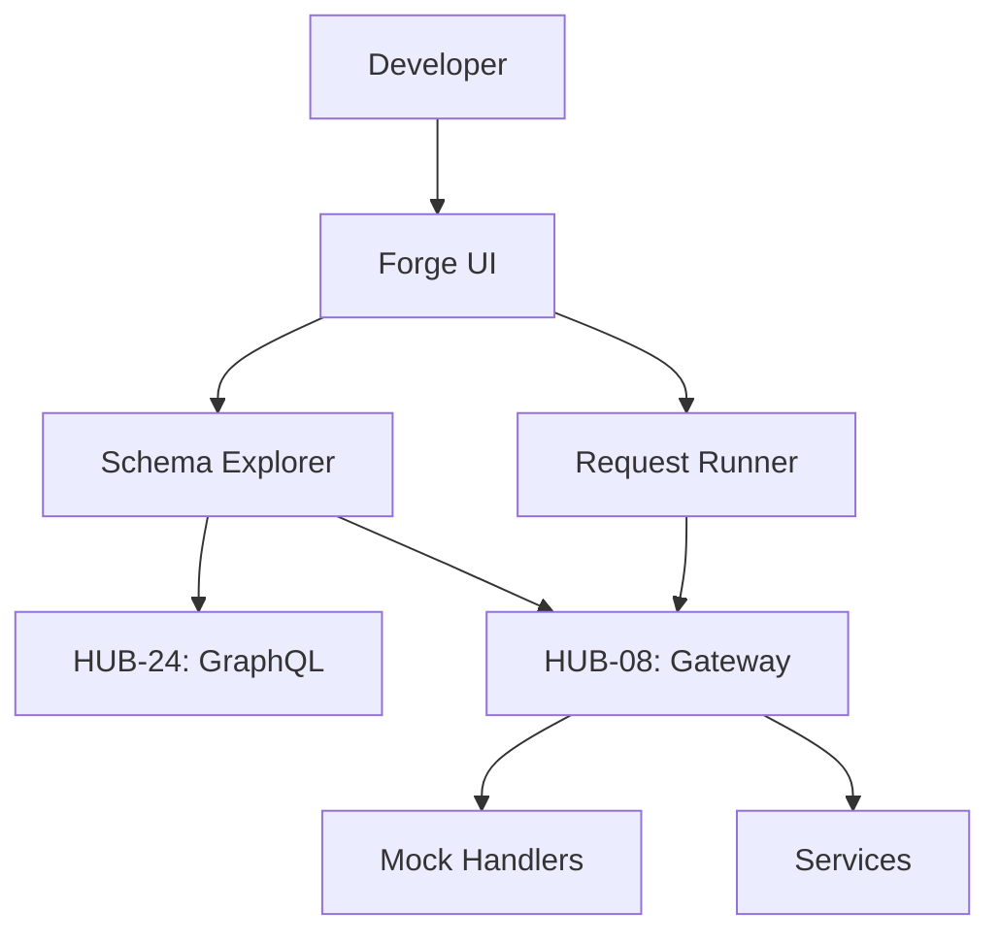

# PHASE ISPOKE-11: Internal API Testing and Sandbox Environment

## Tier
Internal Spoke (Staff-only Application)

## Component Name
Sovereign Forge (Sandbox)

## Description
A developer-centric portal for testing Internal and Hub APIs. It provides an interactive "API Playground" (similar to Swagger/GraphiQL) but specifically tuned for the Sovereign Stack's dual-purpose API Gateway (`HUB-08`). It allows for testing service-to-service communication in a safe, isolated environment.

## Sequencing Rationale
Follows the Compliance Portal to ensure all developer testing activity is properly logged and monitored. This is the primary tool for Internal Spoke developers.

## Context7 Research
### Direct Hub Dependencies
- `HUB-08: API Gateway`
- `HUB-24: GraphQL Schema Registry`
- `HUB-04: Global Identity & Authentication`
- `HUB-26: Shared UI Component Library`
- `HUB-15: Health Check & Service Discovery`
- `HUB-06: Audit Log & Activity Tracker`

### Transitive Core Dependencies
- `CORE-06: Router`
- `CORE-18: Core Kernel & Lifecycle`
- `CORE-02: DI Container`
- `CORE-11: SuperPHP Parser`
- `CORE-12: SuperPHP Compiler`

## Architectural Design
- **SchemaExplorer**: Introspects `HUB-08` and `HUB-24` to provide real-time API documentation.
- **RequestRunner**: Executes test requests against the Gateway with various auth contexts.
- **SandboxManager**: Manages ephemeral test data and mock responses.
- **CollectionManager**: Allows developers to save and share groups of API requests.

### Sandbox Interaction Diagram


## Interface Contracts

### SandboxRunnerInterface
```php
namespace Sovereign\Internal\Forge\Contracts;

interface SandboxRunnerInterface
{
    /**
     * Execute an API request with a specified authentication context.
     */
    public function run(string $method, string $path, array $headers, ?array $body, string $context): array;

    /**
     * Load a saved request collection.
     */
    public function loadCollection(string $collectionId): array;
}
```

## Integration Strategy
- **Bootstrapping**: Boots via `CORE-18`; retrieves active API routes from `HUB-08`.
- **UI**: Renders a reactive API client using `HUB-26` and SuperPHP.
- **Auth Simulation**: Can assume "Staff" or "Service" identities via `HUB-04` for testing permission logic.
- **Logging**: All sandbox requests are tagged and logged in `HUB-06` to distinguish them from production traffic.
- **Health**: Reports Gateway connectivity and schema synchronization status to `HUB-15`.

## CI Verification Criteria
- **Isolation**: Requests executed in the Sandbox must never modify production data (verified via `HUB-08` environment flags).
- **Schema Accuracy**: The documentation rendered must be within 100% sync with the actual Gateway routing table.
- **UI Responsiveness**: Large GraphQL introspections (> 1MB) must not freeze the browser UI.

## SemVer Impact
**Minor**. Enhances developer productivity and API reliability.
