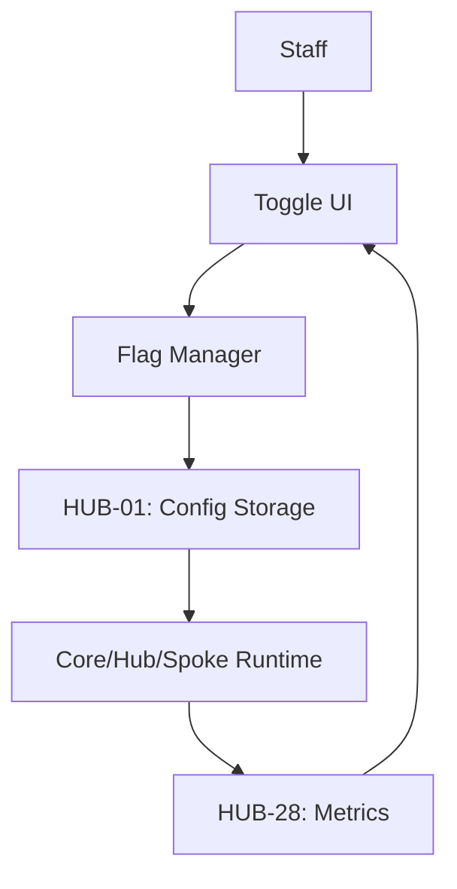

# PHASE ISPOKE-12: Feature Flag and Experimentation Control Panel

## Tier
Internal Spoke (Staff-only Application)

## Component Name
Sovereign Toggle (Feature Control)

## Description
A UI for managing the feature flags and remote configurations established in `HUB-01`. It allows staff to perform "Dark Launches," "Canary Releases," and A/B tests. It features a safe "Blast Radius" control to limit the impact of configuration changes.

## Sequencing Rationale
Follows the API Sandbox (ISPOKE-11) as it provides the UI to manage the flags that developers test in the sandbox.

## Context7 Research
### Direct Hub Dependencies
- `HUB-01: Global Configuration & Feature Flags`
- `HUB-06: Audit Log & Activity Tracker`
- `HUB-28: Distributed Ledger & Analytics Engine`
- `HUB-26: Shared UI Component Library`
- `HUB-04: Global Identity & Authentication`
- `HUB-15: Health Check & Service Discovery`

### Transitive Core Dependencies
- `CORE-02: DI Container`
- `CORE-18: Core Kernel & Lifecycle`
- `CORE-19: DBAL & Migrations`
- `CORE-11: SuperPHP Parser`
- `CORE-12: SuperPHP Compiler`

## Architectural Design
- **FlagManager**: Dashboard for creating and editing feature toggles.
- **RolloutStrategyBuilder**: UI for defining target populations (e.g., "5% of users in Asia").
- **ImpactMonitor**: Integrates with `HUB-28` to show real-time metrics for active experiments.
- **PanicButton**: Global "Kill Switch" to immediately disable a feature stack-wide.

### Rollout Control Diagram


## Interface Contracts

### FeatureControlInterface
```php
namespace Sovereign\Internal\Toggle\Contracts;

interface FeatureControlInterface
{
    /**
     * Update a feature flag state for a specific environment.
     */
    public function updateFlag(string $flagKey, bool $enabled, array $rules = []): bool;

    /**
     * Get real-time health metrics for an active feature rollout.
     */
    public function getRolloutImpact(string $flagKey): array;
}
```

## Integration Strategy
- **Bootstrapping**: Initialized via `CORE-18`; retrieves current flag registry from `HUB-01`.
- **UI**: Uses reactive sliders and percentage gauges from `HUB-26` for rollout control.
- **Auditing**: Every flag change is mandatorily logged in `HUB-06` with "Before/After" state snapshots.
- **Coordination**: Notifies the Orchestrator (`CORE-01`) of significant production configuration changes.
- **Health**: Reports flag propagation latency and evaluation errors to `HUB-15`.

## CI Verification Criteria
- **Atomic Rollback**: The "Panic Button" must successfully disable a flag across all distributed Hub instances in < 500ms.
- **Rule Validation**: Complex targeting rules must be validated against the current user/tenant schema before saving.
- **Permission Check**: Only "Release Managers" (via `HUB-05`) can modify flags in the production environment.

## SemVer Impact
**Minor**. Critical for safe continuous delivery and experimentation.
