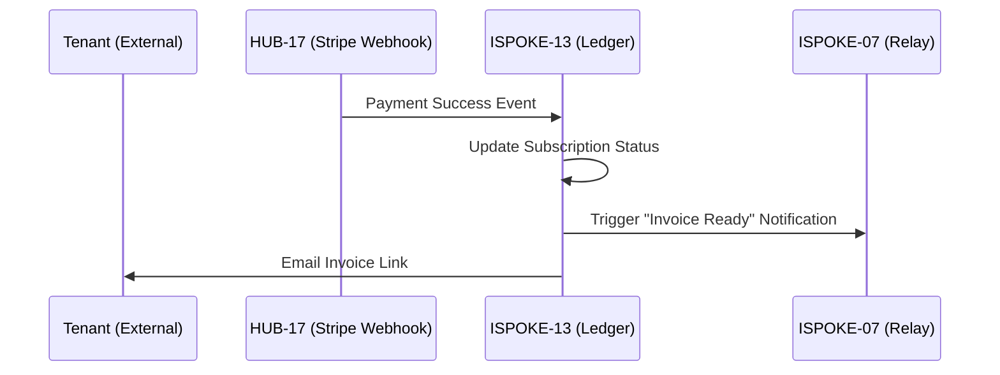

# PHASE ISPOKE-13: Billing and Subscription Management Portal

## Tier
Internal Spoke (Staff-only Application)

## Component Name
Sovereign Ledger (Billing)

## Description
The internal interface for managing customer subscriptions, billing cycles, invoices, and payment methods. It acts as the administrative front-end for the multi-tenancy financial records stored in the Hub.

## Sequencing Rationale
Strategically placed after Feature Flags (ISPOKE-12) because subscription levels often dictate which feature flags are enabled for a specific tenant.

## Context7 Research
### Direct Hub Dependencies
- `HUB-21: Multi-tenancy Coordination Layer`
- `HUB-17: Webhook Ingestion & Dispatch Engine (for Payment Events)`
- `HUB-06: Audit Log & Activity Tracker`
- `HUB-28: Distributed Ledger & Analytics Engine`
- `HUB-26: Shared UI Component Library`
- `HUB-15: Health Check & Service Discovery`

### Transitive Core Dependencies
- `CORE-09: Cryptography & Hashing (for PCI Data Masking)`
- `CORE-18: Core Kernel & Lifecycle`
- `CORE-19: DBAL & Migrations`
- `CORE-11: SuperPHP Parser`
- `CORE-12: SuperPHP Compiler`

## Architectural Design
- **SubscriptionManager**: Tracks tenant plans, trial periods, and renewal dates.
- **InvoiceEngine**: Renders and distributes billing statements via `CORE-14` and `ISPOKE-07`.
- **PaymentProcessorBridge**: Integrates with external gateways (Stripe/PayPal) via `HUB-17` webhooks.
- **RevenueDashboard**: Real-time visualization of MRR, Churn, and LTV using `HUB-28`.

### Billing Flow Diagram


## Interface Contracts

### BillingManagerInterface
```php
namespace Sovereign\Internal\Ledger\Contracts;

interface BillingManagerInterface
{
    /**
     * Change a tenant's subscription plan.
     */
    public function changePlan(string $tenantId, string $planId): bool;

    /**
     * Manually trigger a credit or refund.
     */
    public function adjustBalance(string $tenantId, float $amount, string $reason): bool;
}
```

## Integration Strategy
- **Bootstrapping**: Boots via `CORE-18`; maps tenants via `HUB-21`.
- **UI**: Renders complex financial tables and subscription timelines using `HUB-26`.
- **Data Integrity**: Financial adjustments must be recorded as immutable entries in `HUB-06`.
- **Notifications**: Triggers `ISPOKE-07` for all billing-related alerts to staff and tenants.
- **Health**: Reports payment gateway connectivity and failed billing cycles to `HUB-15`.

## CI Verification Criteria
- **Rounding Accuracy**: All financial calculations must use arbitrary-precision math (BCMath) and pass a 1,000-case test suite.
- **PCI Compliance**: The portal must never store or display raw credit card numbers (verified via code scan).
- **Audit Completeness**: 100% of balance adjustments must be linked to a staff ID and a valid reason code.

## SemVer Impact
**Major**. Provides the commercial engine for the Sovereign platform.
