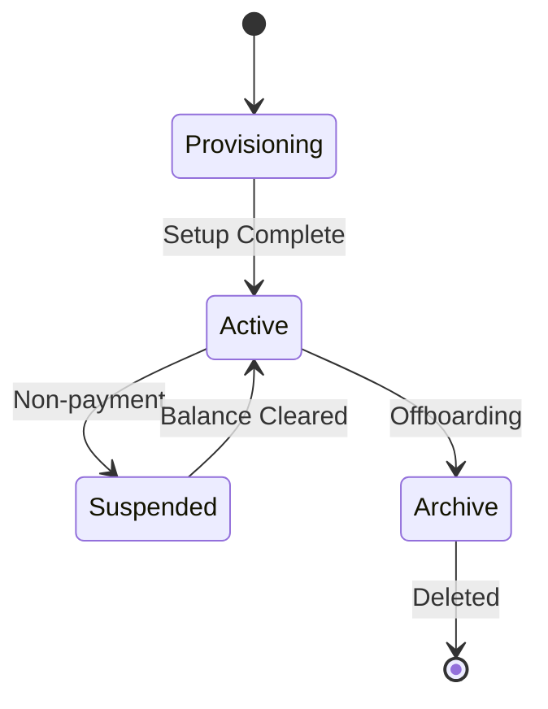

# PHASE ISPOKE-14: Multi-tenancy Administration Console

## Tier
Internal Spoke (Staff-only Application)

## Component Name
Sovereign Nexus (Tenancy)

## Description
A high-level console for managing the lifecycle of tenants within the system. This goes beyond simple CRUD (ISPOKE-01) to include tenant migration, resource quota management, custom domain mapping, and white-labeling configuration.

## Sequencing Rationale
Follows Billing (ISPOKE-13) because tenant quotas and white-labeling features are typically unlocked via specific billing plans.

## Context7 Research
### Direct Hub Dependencies
- `HUB-21: Multi-tenancy Coordination Layer`
- `HUB-01: Global Configuration & Feature Flags`
- `HUB-03: Unified Asset Pipeline & Bundler`
- `HUB-26: Shared UI Component Library`
- `HUB-04: Global Identity & Authentication`
- `HUB-15: Health Check & Service Discovery`

### Transitive Core Dependencies
- `CORE-10: Config & Env Loader`
- `CORE-18: Core Kernel & Lifecycle`
- `CORE-19: DBAL & Migrations`
- `CORE-11: SuperPHP Parser`
- `CORE-12: SuperPHP Compiler`

## Architectural Design
- **TenantProvisioner**: Automates the creation of tenant-specific database schemas and file storage buckets.
- **QuotaManager**: Enforces limits on users, storage, and API calls via `HUB-21`.
- **DomainMapper**: Manages SSL certificates and DNS verification for custom tenant domains.
- **ThemeEngine**: UI for configuring tenant-specific CSS variables and logos (integrated with `HUB-03`).

### Tenant Lifecycle Diagram


## Interface Contracts

### TenantAdminInterface
```php
namespace Sovereign\Internal\Nexus\Contracts;

interface TenantAdminInterface
{
    /**
     * Provision a new tenant environment.
     */
    public function provision(string $tenantName, array $config): string;

    /**
     * Update resource quotas for an existing tenant.
     */
    public function setQuotas(string $tenantId, array $quotas): bool;
}
```

## Integration Strategy
- **Bootstrapping**: Boots via `CORE-18`; interfaces with the multi-tenant DBAL in `CORE-19`.
- **UI**: Renders a "Global Tenant Map" and resource usage charts using `HUB-26`.
- **Asset Pipeline**: Triggers `HUB-03` rebuilds when a tenant's white-labeling theme is updated.
- **Orchestration**: Hooks into `HUB-16` to manage tenant migrations between physical database clusters.
- **Health**: Reports tenant saturation levels and provisioning success rates to `HUB-15`.

## CI Verification Criteria
- **Schema Isolation**: Tenant migrations must be verified to ensure zero data crossover between `tenant_a` and `tenant_b`.
- **Asset Security**: Custom tenant logos/assets must be stored in isolated `HUB-14` buckets with restricted access.
- **Quota Enforcement**: A tenant exceeding its user quota must be blocked from adding new users at the Hub level (`HUB-21`).

## SemVer Impact
**Major**. Enables the scale and customization required for a enterprise-grade SaaS platform.
