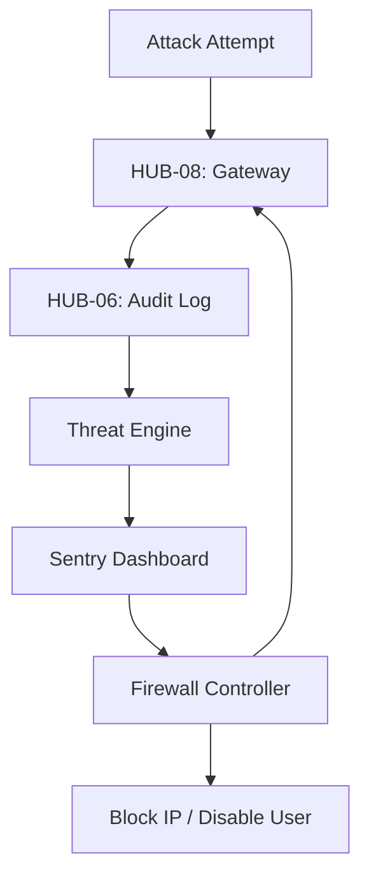

# PHASE ISPOKE-15: Internal Security and Threat Intelligence Dashboard

## Tier
Internal Spoke (Staff-only Application)

## Component Name
Sovereign Sentry (Security)

## Description
The final Internal Spoke. A specialized dashboard for the Security Operations Center (SOC). it aggregates threat intelligence, monitors for suspicious activity (e.g., brute-force, SQL injection attempts), and provides tools for rapid incident response and blocking.

## Sequencing Rationale
The final phase of the Internal Spoke sub-tier. It monitors and protects all preceding spokes and Hub services. It is the "Last Line of Defense" for the internal ecosystem.

## Context7 Research
### Direct Hub Dependencies
- `HUB-06: Audit Log & Activity Tracker`
- `HUB-04: Global Identity & Authentication`
- `HUB-08: API Gateway (WAF Rules)`
- `HUB-28: Distributed Ledger & Analytics Engine`
- `HUB-26: Shared UI Component Library`
- `HUB-15: Health Check & Service Discovery`

### Transitive Core Dependencies
- `CORE-09: Cryptography & Hashing`
- `CORE-18: Core Kernel & Lifecycle`
- `CORE-06: Router`
- `CORE-19: DBAL & Migrations`
- `CORE-11: SuperPHP Parser`
- `CORE-12: SuperPHP Compiler`

## Architectural Design
- **ThreatEngine**: Analyzes the `HUB-06` audit stream in real-time for known attack patterns.
- **FirewallController**: Dynamically updates `HUB-08` WAF rules and IP blocklists.
- **AuthWatch**: Monitors `HUB-04` for anomalous login patterns (e.g., "Impossible Travel").
- **IncidentCommander**: UI for declaring a security incident and triggering automated lockdown protocols.

### Threat Response Diagram


## Interface Contracts

### SecurityOpsInterface
```php
namespace Sovereign\Internal\Sentry\Contracts;

interface SecurityOpsInterface
{
    /**
     * Block a suspicious IP address stack-wide.
     */
    public function blockIP(string $ip, string $reason, int $duration): bool;

    /**
     * Trigger a "Force Password Reset" for all accounts on a compromised tenant.
     */
    public function triggerTenantLockdown(string $tenantId): void;
}
```

## Integration Strategy
- **Bootstrapping**: Boots via `CORE-18`; registers high-priority event listeners on `HUB-12`.
- **Data Stream**: Consumes a low-latency "Security Feed" derived from `HUB-06` and `HUB-08`.
- **UI**: Provides "Red Alert" notifications and a real-time world map of traffic anomalies via `HUB-26`.
- **Response**: Integrates with `HUB-16` to trigger system-wide maintenance modes during active breaches.
- **Health**: Reports "Security Engine" uptime and "Time to Detect" metrics to `HUB-15`.

## CI Verification Criteria
- **Detection Accuracy**: Must correctly identify 99% of simulated "Brute Force" attacks in the test environment.
- **Blocking Speed**: A "Block IP" command must be propagated to the Gateway (`HUB-08`) in < 100ms.
- **Fail-Safe**: If the Sentry engine itself fails, the system must default to the last known "Safe" configuration.

## SemVer Impact
**Major**. Establishes the final security layer for the internal platform.
