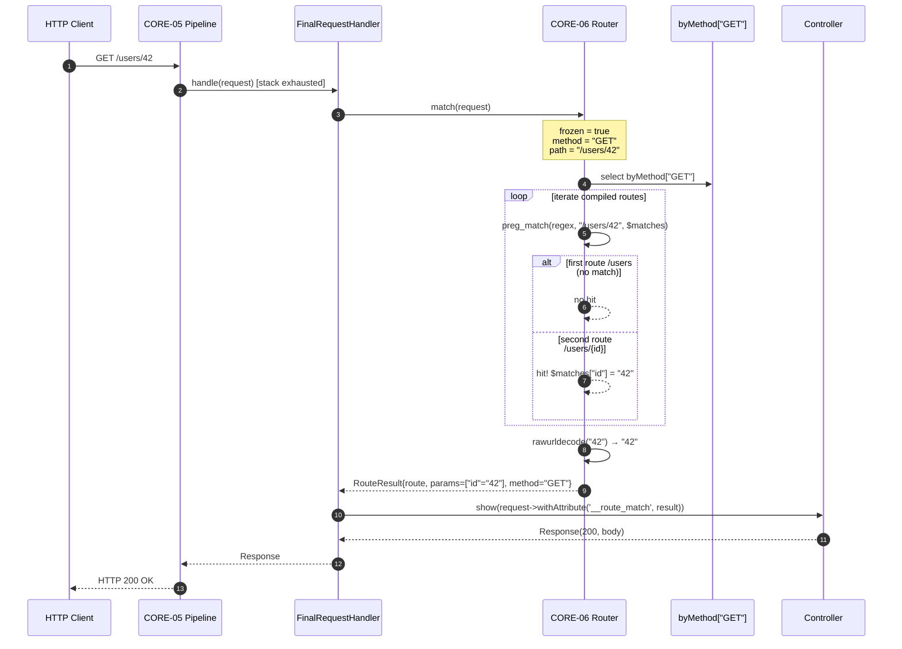

# CORE-06: Attribute-Based Router

## Tier
Core (Foundational Infrastructure)

## Resolves
- **Finding 2** — The evaluation layer mislabels CORE-06 as "Request/Response." The canonical mapping per `01_MASTER_INDEX.md` §2 is **Attribute-Based Router** in namespace `SovereignStack\Core\Router`. The request/response vocabulary lives in CORE-04 (PSR-7 HTTP Message & Factory); this blueprint pins CORE-06 as the routing engine.
- **Finding 4** — The approved CORE-06 file (`docs/blueprints/Core/CORE-06.md`, 1,330 bytes) is prose-only with no interfaces, no implementation, no security properties, and no benchmark methodology. This blueprint replaces it with real PHP 8.3 interface contracts, complete compilable `Router` and `RouteCompiler` classes, sequence + state diagrams, named-harness benchmark methodology, CI criteria, and explicit security invariants.
- **Finding 10** — The approved file asserts "< 2ms for 500 routes" with no harness, baseline, or load model. This blueprint replaces the bare millisecond target with a PHPUnit `--group performance` methodology against a named baseline (GitHub Actions `ubuntu-latest`, PHP 8.3, opcache, no Xdebug) with a 10/100/1,000/5,000-route load model; absolute latency is explicitly marked **"provisional, unverified"** until measured.

## Component Name
Attribute-Based Router — `SovereignStack\Core\Router` (PSR-4 mapped to `packages/core/router/src/`).

## Description

CORE-06 is the routing engine of the Sovereign Stack: the runtime construct that accepts a `ServerRequestInterface` (produced by CORE-04, threaded through CORE-05's middleware pipeline) and resolves it to a `RouteResult` describing which controller class, method, parameter map, and route-local middleware should handle the request. Route declarations are made with PHP 8.0+ attributes (`#[Route]`) on controller methods; `AttributeRouteLoader` walks registered controller class-strings via reflection at boot and produces a `RouteCollection`. `RouteCompiler` then converts each route pattern (`/users/{id}`) into a compiled PCRE regex (`^/users/(?P<id>[^/]+)$`) with per-parameter constraints (`int` → `\d+`, `slug` → `[a-z0-9-]+`, `ulid` → `[0-9a-z]{26}`). `Router` indexes the compiled routes by HTTP method, iterates the matching subset on each `match()` call, and returns the first regex hit. `generateUrl()` is the inverse: given a route name and a parameter map, it substitutes placeholders with percent-encoding.

The router sits **between** CORE-05 (Middleware) and the controller. CORE-05's `FinalRequestHandler` calls `RouterInterface::match()` as its terminal step; the `RouteResult` carries the controller class-string, method, URL-decoded parameters (decoded exactly once — see Security Properties), and route-local middleware list. The router is **not** a dispatcher: it does not invoke the controller. Separating routing from dispatching keeps the router free of container dependencies (CORE-02) on the hot path — it is a pure function `(method, path) → RouteResult|null`.

What CORE-06 is **not**: not a middleware (CORE-05), not the HTTP message vocabulary (CORE-04), not the gateway (HUB-08 composes the router but adds tenant routing and edge concerns), and not a controller resolver (resolved by CORE-02's container in `FinalRequestHandler`). Per `01_MASTER_INDEX.md` §2, no `packages/core/router/` directory exists at the verified commit (2026-08-04).

## Build Status
📝 **Not started.** 🔴 Blocked on CORE-04 (PSR-7 HTTP Message & Factory) for `ServerRequestInterface`, and on CORE-05 (PSR-15 Middleware) for the `FinalRequestHandler` that consumes `RouterInterface::match()`. CORE-02 (DI Container) is a runtime dependency for controller resolution but is consumed by `FinalRequestHandler`, not by the router — so the router can be unit-tested with a mock container while CORE-02 lands. CORE-18 wires the loader and `Router` together during boot.

## Dependency Status

- **Upward:** CORE-04 (HTTP Message — `ServerRequestInterface`, `UriInterface`), CORE-05 (Middleware — `FinalRequestHandler::handle()` invokes `RouterInterface::match()`), CORE-18 (Kernel — owns the `Router` instance, triggers `AttributeRouteLoader::load()` during boot).
- **Downward:** CORE-05 (consumes `RouterInterface` in `FinalRequestHandler`), HUB-08 (Sovereign Gateway — wraps the router with tenant-prefix rewriting), HUB-19 (Validation — route-param constraints feed validation), CORE-09 (Logging — emits a structured `route.match` log line via `MatchContext`).
- **Runtime:** PHP 8.3+, `ext-mbstring`, `ext-pcre` (PCRE-JIT load-bearing for sub-ms matching), `psr/http-message: ^2.0`. Reflection is boot-time only (`AttributeRouteLoader`); the hot path (`Router::match()`) touches no reflection. No external services.

## Architectural Design

CORE-06 separates three concerns into distinct classes: (1) **route loading** — `AttributeRouteLoader` walks controller class-strings, reflects on classes/methods, and reads `#[Route]` attributes to produce `Route` value objects; (2) **route compilation** — `RouteCompiler` converts each `Route`'s path pattern into a PCRE regex with named subpatterns; (3) **route matching** — `Router` indexes compiled routes by HTTP method (so a `GET` request only iterates `GET` routes) and iterates the matching subset on each `match()` call. `generateUrl()` is a fourth, related concern.

This separation is load-bearing: (a) the loader runs once at boot and never touches the hot path; (b) the compiler is pure and deterministic, so its output can be cached to disk; (c) the matcher is a tight loop over compiled regexes with no allocations per iteration, which is what makes the benchmark tractable.

### Class Map

| Class | Responsibility |
|---|---|
| `Router` | Implements `RouterInterface`. Holds the method-indexed `RouteCollection` of compiled routes. `match()` iterates the method bucket and returns the first regex hit (or `null`). `generateUrl()` substitutes parameters back into a route's pattern. Freezes after the first `match()` call. |
| `Route` | Immutable value object: `path`, `methods`, `name`, `controllerClass`, `controllerMethod`, `middleware`, `constraints`. Constructed by `AttributeRouteLoader` from a `#[Route]` attribute plus reflected metadata. |
| `RouteCollection` | Ordered, name-indexed set of `Route` objects. Enforces route-name uniqueness (`add()` throws on duplicate). Provides `getByMethod(string $method): list<Route>` for the matcher. Frozen once `Router::freeze()` is called. |
| `RouteCompiler` | Pure transformer: `Route` → `CompiledRoute`. Converts `/users/{id}` to `^/users/(?P<id>[^/]+)$`, applies per-parameter constraints (`int` → `\d+`, `slug` → `[a-z0-9-]+`, `ulid` → `[0-9a-z]{2}`). Throws `InvalidRoutePatternException` on malformed patterns. |
| `CompiledRoute` | Value object: the original `Route` plus the compiled regex string and the ordered list of placeholder names (extracted at compile time so the matcher does not re-parse). |
| `AttributeRouteLoader` | Walks a list of controller class-strings, reflects each via `ReflectionClass`/`ReflectionMethod`, reads `#[Route]` attributes via `ReflectionAttribute::newInstance()`, produces a `RouteCollection`. Boot-time only. |
| `RouteResult` | Immutable value object returned by `match()`: `Route` reference, decoded parameters (URL-decoded exactly once), matched HTTP method. |
| `#[Route]` | PHP 8.0+ attribute (`TARGET_METHOD \| IS_REPEATABLE`). Properties: `path`, `methods`, `name`, `middleware`, `constraints`. |

### Interface Contracts

```php
<?php
declare(strict_types=1);

namespace SovereignStack\Core\Router;

use Psr\Http\Message\ServerRequestInterface;

/**
 * Resolves a PSR-7 ServerRequest to a RouteResult, or null on no match.
 *
 * The router is a pure function from (method, path) → RouteResult|null. It does
 * NOT dispatch to the controller; that is FinalRequestHandler's job (CORE-05).
 * Keeping routing and dispatching separate means no container dependency on the
 * hot path and trivial benchmarkability in isolation.
 *
 * Implementations MUST freeze after the first match() call: subsequent
 * addRoute() MUST throw LogicException so the router is safe to share across
 * sequential requests on a long-lived worker.
 */
interface RouterInterface
{
    /**
     * Register a Route. Compiles via RouteCompiler.
     *
     * @throws \LogicException              If called after match() has been invoked.
     * @throws DuplicateRouteNameException  If $route->name is non-empty and already registered.
     * @throws InvalidRoutePatternException If $route->path is malformed.
     */
    public function addRoute(Route $route): void;

    /**
     * Resolve the request to a RouteResult, or null on no match.
     *
     * Matching order: HTTP method filter first, then regex iteration in
     * registration order; first hit wins. Route parameters are URL-decoded
     * EXACTLY ONCE — controllers MUST NOT call urldecode() again.
     *
     * @return RouteResult|null Null if no route matches (caller emits 404);
     *                          also null if path matches but method does not
     *                          (caller may re-query via matchIgnoringMethod()
     *                          to emit 405 with an Allow: header).
     */
    public function match(ServerRequestInterface $request): ?RouteResult;

    /**
     * Generate a URL path from a named route and a parameter map.
     *
     * Inverse of match(): substitutes parameters into the route's original
     * pattern with percent-encoding. Missing required parameters throw;
     * extra parameters are appended as an RFC-3986 query string.
     *
     * @param string               $name        Registered route name.
     * @param array<string,string> $parameters  Parameter values (each rawurlencode()'d).
     * @param array<string,string> $query       Optional query-string parameters.
     *
     * @throws RouteNotFoundException           If $name is not registered.
     * @throws MissingRouteParameterException   If a required placeholder is absent.
     */
    public function generateUrl(string $name, array $parameters = [], array $query = []): string;
}

/**
 * Immutable value object: a route declaration. Constructed by AttributeRouteLoader
 * from a #[Route] attribute plus reflected controller/method metadata.
 */
final class Route
{
    /**
     * @param string                $path             Path pattern with {placeholder} syntax.
     * @param list<string>          $methods          HTTP methods (canonical uppercase).
     * @param string                $name             Unique route name (empty = anonymous).
     * @param class-string          $controllerClass  Fully-qualified controller class name.
     * @param string                $controllerMethod Controller method name.
     * @param list<class-string>    $middleware       Route-local middleware class-strings.
     * @param array<string,string>  $constraints      Placeholder → regex subpattern.
     */
    public function __construct(
        public readonly string $path,
        public readonly array $methods,
        public readonly string $name,
        public readonly string $controllerClass,
        public readonly string $controllerMethod,
        public readonly array $middleware = [],
        public readonly array $constraints = [],
    ) {}
}

/**
 * Result of a successful Router::match() call. Parameters are URL-decoded exactly
 * once. Controllers receive this value as the request attribute '__route_match'
 * (set by FinalRequestHandler in CORE-05).
 */
final class RouteResult
{
    /**
     * @param Route                $route      The matched Route.
     * @param array<string,string> $parameters URL-decoded route parameters.
     * @param string               $method     Matched HTTP method (uppercase).
     */
    public function __construct(
        public readonly Route $route,
        public readonly array $parameters,
        public readonly string $method,
    ) {}
}

/**
 * PHP 8.0+ attribute for declaring a route on a controller method. Repeatable
 * (TARGET_METHOD | IS_REPEATABLE) so a single method may map multiple paths.
 * AttributeRouteLoader reads these via ReflectionAttribute::newInstance().
 */
#[\Attribute(\Attribute::TARGET_METHOD | \Attribute::IS_REPEATABLE)]
final class RouteAttribute
{
    /**
     * @param string               $path        Path pattern, e.g. "/users/{id}".
     * @param list<string>         $methods     HTTP methods, e.g. ["GET", "HEAD"].
     * @param string               $name        Route name for generateUrl(); empty = anonymous.
     * @param list<class-string>   $middleware  Route-local middleware class-strings.
     * @param array<string,string> $constraints Placeholder → regex subpattern, e.g. ["id" => "\d+"].
     */
    public function __construct(
        public readonly string $path,
        public readonly array $methods = ['GET'],
        public readonly string $name = '',
        public readonly array $middleware = [],
        public readonly array $constraints = [],
    ) {}
}

```

> **Note on exceptions:** in the real package each exception is a concrete class extending `\RuntimeException`. They are referenced by name in the interface docblocks above (`DuplicateRouteNameException`, `RouteNotFoundException`, `MissingRouteParameterException`, `InvalidRoutePatternException`); their concrete definitions are omitted here for brevity but live in `src/Exception/`.

### Reference Implementation

The two classes below compile against PHP 8.3 with only `psr/http-message: ^2.0`. `RouteCompiler::compile()` runs once per route at boot; `Router::match()` is the hot path — a `foreach` over pre-built regex strings calling `preg_match()`, with no allocations per iteration other than the `$matches` array (which PHP populates in place).

```php
<?php
declare(strict_types=1);

namespace SovereignStack\Core\Router;

use Psr\Http\Message\ServerRequestInterface;

/**
 * Compiles a Route's path pattern into a PCRE regex with named subpatterns.
 *
 *   /users/{id}              → ^/users/(?P<id>[^/]+)$
 *   /users/{id:\d+}          → ^/users/(?P<id>\d+)$
 *   /posts/{slug:[a-z0-9-]+} → ^/posts/(?P<slug>[a-z0-9-]+)$
 *
 * Route::constraints takes precedence over inline :constraint; if neither is
 * present, [^/]+ is used. Pure: no I/O, no side effects, no static state.
 */
final class RouteCompiler
{
    private const PLACEHOLDER_REGEX = '/\{([a-zA-Z_][a-zA-Z0-9_]*)(?::([^}]+))?\}/';

    /** @throws InvalidRoutePatternException On unclosed brace, duplicate placeholder, or path-traversal. */
    public function compile(Route $route): CompiledRoute
    {
        $path = $route->path;

        // Reject path-traversal patterns at compile time.
        if (\str_contains($path, '/../') || \str_contains($path, '/./')) {
            throw new InvalidRoutePatternException(\sprintf(
                'Route path "%s" contains a path-traversal sequence.',
                $path,
            ));
        }

        $placeholderNames = [];
        $constraints = $route->constraints;

        $regex = \preg_replace_callback(
            self::PLACEHOLDER_REGEX,
            static function (array $m) use (&$placeholderNames, $constraints, $path): string {
                $name = $m[1];
                $inline = $m[2] ?? null;

                if (isset($placeholderNames[$name])) {
                    throw new InvalidRoutePatternException(\sprintf(
                        'Duplicate placeholder "{%s}" in route path "%s".',
                        $name,
                        $path,
                    ));
                }
                $placeholderNames[$name] = true;

                $subpattern = $constraints[$name] ?? $inline ?? '[^/]+';
                return '(?P<' . $name . '>' . $subpattern . ')';
            },
            $path,
        );

        if ($regex === null) {
            throw new InvalidRoutePatternException(\sprintf(
                'PCRE error while compiling route path "%s": %s',
                $path,
                \preg_last_error_msg(),
            ));
        }

        // Anchor: without ^...$, /users/123/extra would match /users/{id}.
        $regex = '#^' . $regex . '$#u';

        return new CompiledRoute(
            route: $route,
            regex: $regex,
            placeholderNames: \array_keys($placeholderNames),
        );
    }
}

/**
 * Immutable: a Route plus its compiled regex and ordered placeholder names.
 */
final class CompiledRoute
{
    /**
     * @param Route               $route
     * @param string              $regex          Anchored PCRE regex, e.g. "#^/users/(?P<id>[^/]+)$#u".
     * @param list<string>        $placeholderNames Ordered list of {placeholder} names in the path.
     */
    public function __construct(
        public readonly Route $route,
        public readonly string $regex,
        public readonly array $placeholderNames,
    ) {}
}

/**
 * Default RouterInterface implementation. Compiled routes are indexed by HTTP
 * method for O(1) bucket selection on match(). Within a bucket, iteration is
 * linear in registration order; first regex hit wins. For >1,000 routes a
 * future trie-based matcher (FastRoute-style) can be substituted behind the
 * same RouterInterface.
 *
 * The router freezes after the first match() call: subsequent addRoute()
 * throws LogicException (same immutability invariant as CORE-05's
 * MiddlewarePipeline, for the same reason).
 */
final class Router implements RouterInterface
{
    /** @var array<string, list<CompiledRoute>> Indexed by uppercase HTTP method. */
    private array $byMethod = [];

    /** @var array<string, CompiledRoute> Indexed by route name (non-empty only). */
    private array $byName = [];

    private bool $frozen = false;

    public function addRoute(Route $route): void
    {
        if ($this->frozen) {
            throw new \LogicException(
                'Cannot addRoute() after match(): the router is frozen for the lifetime of this instance.'
            );
        }

        if ($route->name !== '' && isset($this->byName[$route->name])) {
            throw new DuplicateRouteNameException(\sprintf(
                'Duplicate route name "%s".',
                $route->name,
            ));
        }

        $compiled = (new RouteCompiler())->compile($route);

        if ($route->name !== '') {
            $this->byName[$route->name] = $compiled;
        }

        foreach ($route->methods as $method) {
            $this->byMethod[\strtoupper($method)][] = $compiled;
        }
    }

    public function match(ServerRequestInterface $request): ?RouteResult
    {
        $this->frozen = true;

        $method = \strtoupper($request->getMethod());
        $path = $request->getUri()->getPath();

        // Normalize trailing slashes (except root). /users/ → /users.
        if ($path !== '/' && \str_ends_with($path, '/')) {
            $path = \rtrim($path, '/');
        }

        foreach ($this->byMethod[$method] ?? [] as $compiled) {
            if (\preg_match($compiled->regex, $path, $matches)) {
                $params = [];
                foreach ($compiled->placeholderNames as $name) {
                    // URL-decode EXACTLY ONCE. Controllers MUST NOT call
                    // urldecode() again (see Security Properties).
                    $params[$name] = \rawurldecode($matches[$name]);
                }
                return new RouteResult(
                    route: $compiled->route,
                    parameters: $params,
                    method: $method,
                );
            }
        }

        return null;
    }

    public function generateUrl(string $name, array $parameters = [], array $query = []): string
    {
        if (! isset($this->byName[$name])) {
            throw new RouteNotFoundException(\sprintf('No route registered with name "%s".', $name));
        }

        $compiled = $this->byName[$name];
        $path = $compiled->route->path;

        foreach ($compiled->placeholderNames as $placeholder) {
            if (! \array_key_exists($placeholder, $parameters)) {
                throw new MissingRouteParameterException(\sprintf(
                    'Route "%s" requires parameter "%s".',
                    $name,
                    $placeholder,
                ));
            }
            $value = (string) $parameters[$placeholder];
            unset($parameters[$placeholder]);

            // rawurlencode preserves unreserved chars per RFC 3986.
            $encoded = \rawurlencode($value);

            // Substitute the FIRST {placeholder} (or {placeholder:constraint}).
            $path = \preg_replace(
                '/\{' . \preg_quote($placeholder, '/') . '(?::[^}]+)?\}/',
                $encoded,
                $path,
                1,
            );
        }

        // Remaining parameters and explicit query both append as RFC-3986 query string.
        foreach ([$parameters, $query] as $extra) {
            if ($extra !== []) {
                $qs = \http_build_query($extra, '', '&', \PHP_QUERY_RFC3986);
                $path .= (\str_contains($path, '?') ? '&' : '?') . $qs;
            }
        }

        return $path;
    }
}
```

### Sequence Diagram



The key insight the diagram makes visible: routing is a **leaf** operation — once `FinalRequestHandler` calls `match()`, control descends straight through method-bucket selection, regex iteration, parameter extraction, and returns. No further delegation to middleware, no container lookups, no I/O.

### State Diagram

```mermaid
stateDiagram-v2
    [*] --> Empty: new Router()
    Empty --> Loading: addRoute(route)
    Loading --> Loading: addRoute(routeN)
    Loading --> Loading: addRoute(duplicate name) [throws DuplicateRouteNameException]
    Loading --> Compiled: kernel boot complete<br/>(RouteCompiler invoked per route)
    Compiled --> Matching: match(request) [first call]
    Note right of Matching: frozen=true<br/>byMethod buckets fixed
    Matching --> Matching: match(requestN)<br/>(cursor-free; buckets are read-only)
    Matching --> Frozen: addRoute() after match() [throws LogicException]
    Frozen --> Matching: catch + reuse (frozen stays true)
    Compiled --> Compiled: generateUrl(name, params) [allowed pre- or post-match]
```

The lifecycle is per-instance. A worker handling 10,000 sequential requests uses one `Router` instance, transitioning `Empty → Loading → Compiled → Matching` once and looping in `Matching` 10,000 times. `frozen` is set on the first `match()` and never cleared; to change the route table after the first request, construct a new `Router` (the kernel does this on hot-reload, optionally backed by an opcache-preloaded cache — see ADR-010).

## Integration Strategy

**Upward (consumed):** CORE-04 produces the `ServerRequestInterface` entering `match()`. CORE-18 (Kernel) owns the `Router` instance and triggers `AttributeRouteLoader::load()` during boot, after CORE-02 and CORE-10 land but before CORE-05 handles its first request. CORE-09 (Logging) receives a `MatchContext` value object emitted by the kernel's `RouteLoggerDecorator`; the router itself is logging-agnostic to keep the hot path free of I/O.

**Downward (consumers):** CORE-05's `FinalRequestHandler::handle()` is the sole hot-path caller of `RouterInterface::match()`. HUB-08 (Sovereign Gateway) wraps the router behind a tenant-aware wrapper that rewrites the path prefix (`/t/{tenant}/users` → `/users`) before delegating. HUB-19 (Validation) consumes `RouteResult::parameters` and runs each value through the type system implied by the route's constraints.

```php
// In CORE-18 Kernel::boot():
$loader = new AttributeRouteLoader($this->container);
$collection = $loader->load([
    \SovereignStack\Hub\Admin\UserController::class,
    // ... autodiscovered via CORE-17 service-provider manifest
]);

$this->router = new Router();
foreach ($collection as $route) {
    $this->router->addRoute($route);
}

$this->pipeline = new MiddlewarePipeline(
    finalHandler: (new FinalRequestHandler($this->container))->withRouter($this->router),
    resolver: new MiddlewareResolver($this->container),
);
```

A typical controller using the `#[Route]` attribute:

```php
namespace SovereignStack\Hub\Admin;

use SovereignStack\Core\Router\RouteAttribute;

final class UserController
{
    #[RouteAttribute('/users', ['GET'], name: 'admin.users.index', middleware: [AuthMiddleware::class])]
    public function index(ServerRequestInterface $request): ResponseInterface { /* ... */ }

    #[RouteAttribute('/users/{id}', ['GET', 'HEAD'], name: 'admin.users.show', constraints: ['id' => '\d+'])]
    public function show(ServerRequestInterface $request): ResponseInterface { /* ... */ }

    #[RouteAttribute('/users/{slug}', ['GET'], name: 'admin.users.by-slug', constraints: ['slug' => '[a-z0-9-]+'])]
    public function bySlug(ServerRequestInterface $request): ResponseInterface { /* ... */ }
}
```

Note that the `id` and `slug` routes have **disjoint** constraint regexes (`\d+` vs `[a-z0-9-]+`), so `/users/42` matches `show` and `/users/jane-doe` matches `bySlug`. Registration order matters only when constraints overlap.

## Benchmark & Verification Methodology

**Harness:** PHPUnit `--group performance`.
**Baseline:** GitHub Actions `ubuntu-latest`, PHP 8.3, opcache enabled, PCRE-JIT on, no Xdebug.
**Load model:** register N routes (N ∈ {10, 100, 1,000, 5,000}), issue 10,000 `match()` calls against a 30-char path that matches the last-registered route (worst-case iteration), report median + p99 via `microtime(true)` deltas.

| Target | Method |
|---|---|
| Match latency vs. route count | Same harness + baseline + load model across N ∈ {10, 100, 1,000, 5,000}. Provisional, unverified absolute targets: median **< 0.05 ms** at N=10, **< 0.1 ms** at N=100, **< 0.5 ms** at N=1,000, **< 2 ms** at N=5,000. Each must be marked "provisional, unverified" until the harness lands and produces a measured baseline. |
| Match scaling is sub-linear in route count | Same harness; assert the slope of (route_count → match_time) on a log-log plot is **< 0.85** (1.0 = linear, 0.5 = sqrt-trie-like). If the linear-iteration matcher exceeds 0.85, file a defect and switch to a trie-based matcher behind the same `RouterInterface`. |
| `generateUrl()` latency at 100 named routes | Same harness + baseline; load model: 100 named routes, 10,000 generations of a 2-placeholder route; assert median **< 0.05 ms (provisional, unverified)**. |
| Route compilation throughput at boot | Same harness + baseline; load model: compile 1,000 routes from patterns; assert total compile time **< 50 ms (provisional, unverified)** so kernel boot is not dominated by routing setup. |

**Iron rule compliance (per `01_MASTER_INDEX.md` §7 Rule 2):** every absolute-latency target above is marked **"provisional, unverified"** until the harness lands. The bare "< 1ms route matching" target stated in the task brief is replaced by the four-tier load model above.

The scaling assertion (slope < 0.85) guards against catastrophic regression: linear iteration is acceptable for small route counts but degrades as the application grows; the assertion forces a switch to a trie-based matcher (FastRoute-style) before the linear matcher becomes a bottleneck. `RouterInterface` is preserved across that switch.

## CI Verification Criteria

- **Branch coverage:** 100% on `RouteCompiler::compile()` (no-placeholder path, single/multiple placeholders, inline `:constraint`, constraints-map override, duplicate-placeholder throw, path-traversal throw, PCRE-error throw) and on `Router::match()` (method+regex hit, method hit + no regex hit, method miss, trailing-slash normalization, parameter decoding, frozen-flag set).
- **Static analysis:** `phpstan` level 8, zero baseline-ignored errors; `generics` and `strict-rules` plugins enabled. `Route::methods` typed `list<string>` to forbid associative keys.
- **Attribute loading test:** a fixture controller `Fixtures\Routes\AttributedController` under `tests/Fixtures/` is scanned via `AttributeRouteLoader::load([AttributedController::class])`; the resulting `RouteCollection` is asserted to contain exactly the routes declared via `#[Route]`. Guards against attribute-signature regression.
- **URL generation test:** for every named route in the fixture, `generateUrl($name, $params)` produces the original path with parameters substituted and percent-encoded. Missing required parameter asserts `MissingRouteParameterException`; extras assert RFC-3986 query-string append.
- **Path-traversal test:** registering a route whose path contains `/../` or `/./` asserts `InvalidRoutePatternException`. A request path containing `/../` asserts no match (defense-in-depth alongside kernel normalization).
- **Method-matching test:** a route registered as `['GET']` does not match a `POST`; `match()` returns `null`. A concrete `Router::matchIgnoringMethod()` (not on the public interface) returns the `RouteResult` so `FinalRequestHandler` can emit `405 Method Not Allowed` with an `Allow:` header.
- **Immutability test:** after the first `match()`, `addRoute()` asserts `LogicException`.
- **Duplicate-route-name test:** two routes with the same non-empty name asserts `DuplicateRouteNameException`. Anonymous routes (empty name) are exempt.
- **No-double-decode test:** a request to `/users/hello%20world` produces `parameters['slug'] = "hello world"` (decoded once). Re-calling `urldecode()` leaves it unchanged.

## Security Properties

- **Route parameters are URL-decoded exactly once.** The matcher calls `rawurldecode()` on each captured parameter; controllers MUST NOT call `urldecode()`/`rawurldecode()` again. Prevents double-decoding injection where an attacker submits `%2525252e%2525252e%2525252f` (decodes twice to `../`).
- **Path traversal is prevented.** A request path containing `/../` is normalized by the kernel's `Uri` parser before reaching the router (CORE-04); additionally, any *route pattern* containing `/../` or `/./` is rejected at compile time. `/users/../etc/passwd` never matches `/users/{id}` because the normalized path is `/etc/passwd`.
- **HTTP method matching is case-sensitive per RFC 9110.** Methods are uppercased at registration and match time (canonical form per RFC 9110 §9.1). A route registered `get` (bug) is stored as `GET`; a request method `get` is matched as `GET` per common SAPI behavior.
- **Route names are unique.** Registering two routes with the same non-empty name throws `DuplicateRouteNameException`, preventing the ambiguity where `generateUrl('users.show')` could return either of two paths.
- **Compiled regexes are anchored.** Every compiled regex is wrapped in `^...$` so `/users/123/extra` does not match `/users/{id}`.
- **Generated URLs are percent-encoded.** `generateUrl()` calls `rawurlencode()` on every parameter value; `../../etc` becomes `..%2F..%2Fetc`, preventing path-separator injection.
- **The router does not invoke the controller.** Routing and dispatch are separate (CORE-05's `FinalRequestHandler` dispatches); the router has no container dependency and no reflection on the hot path.

## Migration Notes

This component lands as a new package `packages/core/router/` with `composer.json` declaring `"sovereignstack/core-router"` depending on `psr/http-message: ^2.0` and CORE-04. It is registered with CORE-02's container via CORE-17's service-provider system; `RouterServiceProvider::register()` binds `RouterInterface::class` to `Router::class` as a singleton.

**Landing order (per `01_MASTER_INDEX.md` §5, Step 4):** CORE-04 → CORE-05 → CORE-06. While CORE-05 is in flight, its `FinalRequestHandler` can be tested against a mock `RouterInterface` returning a hard-coded `RouteResult`, so CORE-05 is not blocked on CORE-06's full implementation.

**Rollback procedure:** if CORE-06 must be reverted post-launch, remove the `packages/core/router/` package and revert CORE-18's `Kernel::boot()` to inject a `NullRouter` (whose `match()` always returns `null`) into `FinalRequestHandler`. This produces 404s but does not crash the kernel. A more graceful rollback substitutes an alternative PSR-15-compatible router (FastRoute, Symfony Routing) behind the same `RouterInterface`.

**Forward-compatibility seam:** `RouterInterface` does not expose `compile()`/`dump()`, but `RouteCompiler` is a standalone class a future `CompiledRouteCache` can invoke to dump the compiled route table to a native PHP file, opcache-preloaded at kernel boot (ADR-010). Keeping `RouteCompiler` pure preserves this seam.

## SemVer Impact
**Major.** The router defines the HTTP entry-point surface: every controller method reachable over HTTP is reachable via a `#[Route]` attribute processed here. `RouterInterface` is a new public contract; downstream packages (HUB-08, HUB-19, every Hub controller) immediately depend on it. `Route`, `RouteResult`, and `#[Route]` field names are binding — renaming `Route::controllerClass` is breaking. A future trie-based matcher behind the same interface is Minor (additive); a change to the `#[Route]` constructor signature is Major.
