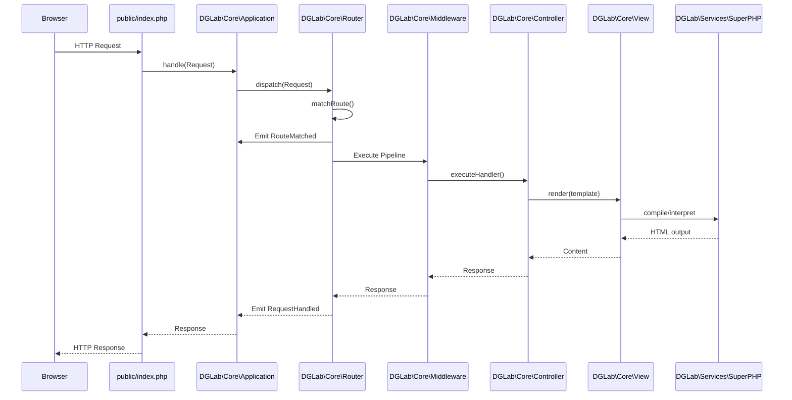

# Core Framework Specification

## 1. Overview
The DGLab Core Framework is a high-performance, Node-free, reactive-first foundation built with PHP 8.2+. It provides the essential infrastructure for routing, dependency injection, event-driven communication, and unified observability.

## 2. Request Lifecycle
The following sequence diagram illustrates the typical lifecycle of an HTTP request within the framework.



## 3. Dependency Injection & Container (`DGLab\Core\Application`)
The `Application` class serves as the central IoC (Inversion of Control) container.

### Low-Level Internal Logic: Reflection Auto-wiring
The `call()` method uses PHP's `ReflectionFunction` or `ReflectionMethod` to inspect parameters and resolve them from the container.

```php
// Core logic for dependency resolution
protected function resolveMethodDependencies(ReflectionFunctionAbstract $reflection): array
{
    $parameters = [];
    foreach ($reflection->getParameters() as $param) {
        $type = $param->getType();
        if ($type instanceof ReflectionNamedType && !$type->isBuiltin()) {
            $parameters[] = $this->get($type->getName());
        } elseif ($param->isDefaultValueAvailable()) {
            $parameters[] = $param->getDefaultValue();
        }
    }
    return $parameters;
}
```

### Usage Sample:
```php
$app = Application::getInstance();

// Register a singleton with a closure
$app->singleton(MyService::class, fn($app) => new MyService($app->get(Config::class)));

// Auto-wired execution
$app->call(function(MyService $service, Request $request) {
    // $service and $request are injected automatically
});
```

## 4. Routing & Middleware
The `Router` provides a regex-based matching engine supporting RESTful verbs, route groups, and nested middleware pipelines.

### Low-Level Internal Logic: Middleware Recursion
The middleware pipeline is implemented using a recursive closure wrap (the "Onion" model).

```php
private function runMiddleware(Route $route, Request $request): mixed
{
    $middleware = array_merge($this->globalMiddleware, $route->getMiddleware());
    $next = function ($request) use ($route) {
        return $this->executeHandler($route->getHandler(), $request);
    };

    foreach (array_reverse($middleware) as $m) {
        $next = function ($request) use ($m, $next) {
            $instance = Application::getInstance()->get($m);
            return $instance->handle($request, $next);
        };
    }
    return $next($request);
}
```

### Infrastructure Considerations
- **PHP Version**: Requires PHP 8.2+ for typed properties and `readonly` support.
- **Extensions**: Requires `mbstring`, `pdo_sqlite` (or `pdo_mysql`), and `json`.
- **Memory Management**: The `Application::flush()` method is critical for preventing memory leaks and state contamination during long-running processes (e.g., unit tests or worker loops).

## 5. Event-Driven Architecture
The `EventDispatcher` facilitates decoupled communication between components using synchronous and asynchronous drivers.

### Wildcard Matching logic
Dot-notation aliases (e.g., `user.*`) are resolved using the `PatternMatcher` utility.
```php
$dispatcher->listen('user.*', function($event) { ... });
```

## 6. History & Evolution
- **Phase 1 (Foundation)**: Initial Router and Request/Response objects.
- **Phase 2 (Container)**: Transitioned from manual instantiation to a central IoC container.
- **Phase 3 (Middleware)**: Implementation of the recursive middleware pipeline.
- **Phase 4 (Events)**: Added the `EventDispatcher` with support for async drivers.
- **Phase 5 (Superpowers)**: Integration of the Superpowers SPA navigation and fragment rendering logic.

## 7. Future Roadmap
- **Phase 6: Compiled Routing**: Implement a route compiler that generates a static PHP file for O(1) matching in production.
  - **Effort**: L
- **Phase 7: Advanced Auto-wiring**: Support for union types and variadic dependencies in the Container.
  - **Effort**: M
- **Phase 8: Telemetry Integration**: Native support for OpenTelemetry to export traces and metrics to external providers.
  - **Effort**: XL

## 8. Validation
### Success Criteria
- **Boot Time**: Core framework initialization under 5ms.
- **Route Matching**: < 1ms for 100+ registered routes.
- **Memory Usage**: < 2MB overhead per request.

### Verification Steps
- [ ] Run `vendor/bin/phpunit --group core` to verify container and router integrity.
- [ ] Verify that `X-Superpowers-Fragment` headers correctly trigger partial rendering.
- [ ] Confirm that `Application::flush()` effectively resets all static state between tests.
