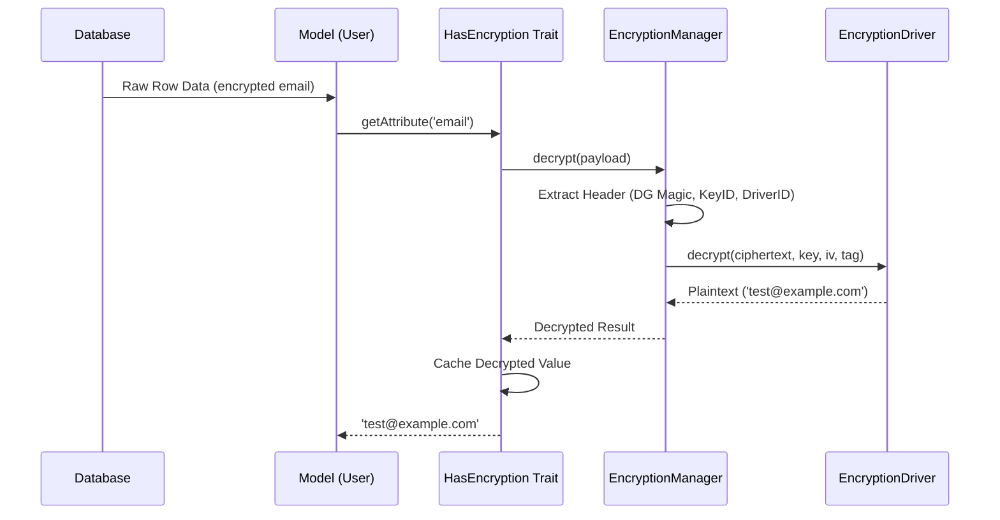

# Phase 9: Model Hydration & Decryption Lifecycle (HasEncryption Trait)

## Objective
Implement a reusable trait that hooks into the Model's getter/setter lifecycle to perform transparent encryption and decryption of attributes.

## Prerequisites
- Phase 1, 2, 8

## Technical Specification

### Sequence Diagram: Model Hydration & Decryption

### Implementation Detail
[... HasEncryption Trait code as defined previously ...]

## Completion Gate
- Trait implemented and sequence flow verified.
