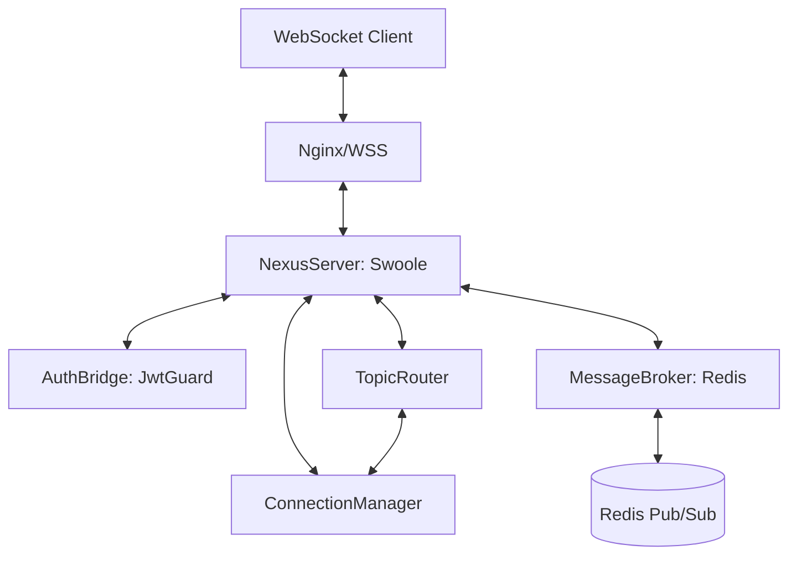

# Nexus: Internal Architecture Specification

Nexus follows a decoupled, event-driven architecture designed to minimize coupling with the main HTTP application while sharing core business logic (Models, Auth rules).

## 1. High-Level Component Interaction



## 2. Component Details

### 2.1 NexusServer (The Loop)
- **Role**: Entry point for all TCP/WebSocket connections.
- **Implementation**: `DGLab\Services\Nexus\NexusServer`.
- **Responsibilities**:
    - Bootstrapping the Swoole `WebSocket\Server`.
    - Routing Swoole events (`onOpen`, `onMessage`, `onClose`) to internal handlers.
    - Providing a coroutine-safe `push()` method for sending messages to clients.

### 2.2 ConnectionManager (Local State)
- **Role**: Tracks active connections on the current instance.
- **Storage**: In-memory Swoole `Table` or coroutine-safe array.
- **Maps**:
    - `fd` (File Descriptor) -> `SessionContext` (User ID, Tenant ID, Roles).
    - `userId` -> Array of `fd`s (for targeted delivery).
    - `tenantId` -> Array of `fd`s (for multi-tenant broadcasts).

### 2.3 AuthBridge (Identity)
- **Role**: Validates identity during the `onHandshake` or `onOpen` event.
- **Mechanism**:
    - Extracts JWT from the `sec-websocket-protocol` header or `token` query parameter.
    - Utilizes `JwtGuard` and `JWTService` to decode and verify.
    - Rejects handshake with 401 if invalid.

### 2.4 MessageBroker (The Grid)
- **Role**: Synchronizes messages across multiple Nexus instances.
- **Channels**:
    - `nexus.global`: Broadcast to all connected clients everywhere.
    - `nexus.tenant.{id}`: Broadcast to all users in a specific tenant.
    - `nexus.user.{id}`: Target specific user across all their devices.
- **Process**:
    - Listens to Redis in a dedicated coroutine.
    - When a message arrives, it queries `ConnectionManager` for local matches and pushes.

### 2.5 TopicRouter (The Filter)
- **Role**: Manages dynamic subscriptions (e.g., specific job progress).
- **Format**: Hierarchical topics (e.g., `job.123.progress`, `console.logs`).
- **Validation**: Checks if a user has permission to subscribe to a topic before adding the `fd` to the topic list.

## 3. The Packet Structure
All messages (Inbound/Outbound) follow a strict JSON envelope:

```json
{
  "type": "event|command|error",
  "topic": "string",
  "payload": {},
  "meta": {
    "timestamp": 123456789,
    "request_id": "uuid"
  }
}
```
