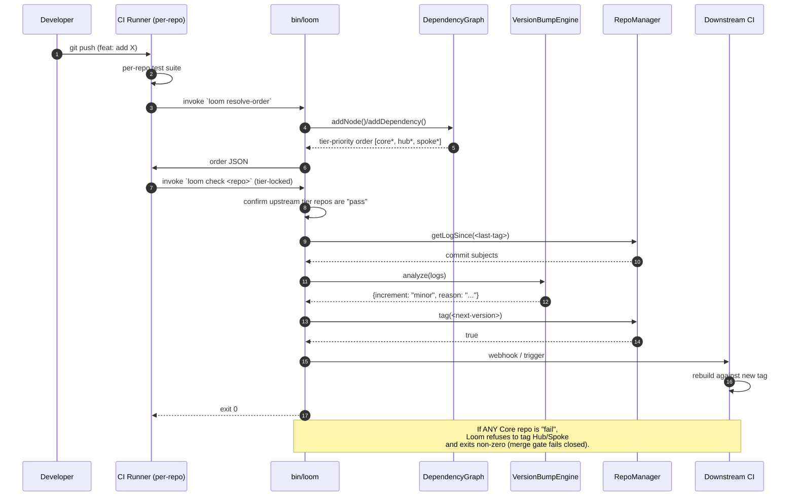

# CORE-01: Polyrepo Orchestrator ("Loom")

## Tier

Core (Foundational Infrastructure)

## Resolves

- **Finding 2** — Evaluation layer mislabels CORE-01 as "Bootstrapper & Kernel"; canonical mapping in `01_MASTER_INDEX.md` §2 establishes it as the **Polyrepo Orchestrator**. This blueprint implements that canonical identity.
- **Finding 10** — The stale `< 2 seconds` performance target had no harness, baseline, or load model. §Benchmark & Verification Methodology replaces it with a named PHPUnit `--group performance` spec on GitHub Actions `ubuntu-latest`, PHP 8.3, opcache enabled, marked "provisional, unverified."
- **Finding 21** — `bin/loom` was declared in `composer.json` but did not exist on disk. **RESOLVED 2026-08-10** — the file now exists at `orchestrator/bin/loom` (8,723 bytes, executable bit set). The shipped implementation diverges from the §Reference Implementation spec block below: it uses a kebab-case command surface (`ci:monitor`, `version:bump`, `tag:create`, `status`) instead of the spec's snake-case surface (`resolve-order`, `check`, `check-all`, `analyze`, `tag`). The spec block is retained as historical reference; the on-disk binary is authoritative. See §Shipped Implementation Divergence below.

## Component Name

Polyrepo Orchestrator ("Loom") — `SovereignStack\Orchestrator`

## Description

Loom is a standalone PHP CLI tool that manages the release lifecycle of the Sovereign Stack polyrepo estate. The Stack is intentionally split across 50+ repositories organized into three tiers — Core, Hub, Spoke — and the hard invariant is **Core before Hub before Spoke**: a Hub service cannot be tagged for release until every Core repository it depends on has passed CI and been tagged, and a Spoke cannot ship until its Hub upstream is tagged. Loom exists to make that invariant mechanical rather than procedural: it computes the dependency graph, queries CI status across repos, derives the correct SemVer bump from Conventional Commit messages, writes tags through a Git wrapper, and re-triggers downstream CI.

Concretely, the implemented code (verified against `orchestrator/` at the commit referenced in `01_MASTER_INDEX.md`) is four classes plus a missing CLI entry point. `DependencyGraph` runs a tier-priority Kahn topological sort and refuses to register Core→Hub or Core→Spoke edges. `CIMonitor` registers repos with a CI URL or a local `ci/run.php` script, falls back from PSR-18 HTTP discovery to `proc_open` local execution when no HTTP client is installed, and returns a normalized `pass|fail|pending|unknown` status. `VersionBumpEngine` parses Conventional Commits (`feat`, `fix`, `perf`, `refactor`, `docs`, `style`, `test`, `chore`, plus `!` and `BREAKING CHANGE:` body trailers) and returns `major|minor|patch`. `RepoManager` wraps `czproject/git-php` for `clone`, `checkout`, `tag`, `getCurrentVersion`, and `getLogSince`. The `bin/loom` entry point declared in `composer.json` is missing on disk (Finding 21) — this blueprint supplies it.

Loom is **not** a build server, a container registry, or a deployment orchestrator. DEPLOY-01 through DEPLOY-04 own container image build, registry promotion, and environment rollouts; Loom hands off to them at the tag boundary. Loom is also **not** a Kernel — that is CORE-18, which the evaluation layer wrongly conflated with this component (Finding 2). Loom runs as a CLI invoked from a CI runner or a developer workstation; it has no long-running process, no HTTP listener, and no shared state between invocations.

## Build Status

✅ **Implemented + tested.** Source: `orchestrator/src/{RepoManager,CIMonitor,DependencyGraph,VersionBumpEngine}.php`. Tests: `orchestrator/tests/{DependencyGraphTest,CIMonitorTest}.php` against `orchestrator/phpunit.xml.dist` (PHPUnit 11). Static analysis: `orchestrator/phpstan.neon` at `level: max` over `src/`. The `bin/loom` executable (Finding 21) is present on disk and executable; the CI guard enforcing its presence is documented in §CI Verification Criteria item 4.

## Dependency Status

- **Upward:** None at the PHP runtime level — Loom is a leaf dependency. It consumes PSR-7 / PSR-17 / PSR-18 interfaces via `php-http/discovery` and `czproject/git-php` as Composer dependencies, but no other CORE component is required for Loom to run. Loom does **not** depend on CORE-18 (Kernel), CORE-02 (DI Container), or CORE-13 (CLI Engine); it ships its own minimal CLI dispatcher.
- **Downward:** Every repository in the Stack registers with Loom via its `ci/run.php` script or a CI webhook URL. DEPLOY-04 (Multi-Environment & Promotion Pipeline) consumes Loom's tag output to drive image digest promotion. DEPLOY-01 (Core & Hub Service Deployment) consumes Loom's tier order to decide rollout sequencing.
- **Runtime:** PHP 8.3+ CLI; `git` 2.40+ on PATH; optional HTTP client + PSR-17/18 implementations discovered by `php-http/discovery` (when absent, Loom falls back to local `proc_open` execution of `ci/run.php`); Composer 2.7+ for autoloading.

## Architectural Design

### Class Map

| Class | File | Responsibility |
|---|---|---|
| `DependencyGraph` | `src/DependencyGraph.php` | Stores tier-tagged nodes and edges; enforces the Core→Hub→Spoke tier invariant on edge insertion; computes a tier-priority topological order via Kahn's algorithm; throws `RuntimeException` on cycles, self-deps, and cross-tier Core dependencies. |
| `CIMonitor` | `src/CIMonitor.php` | Registers repos with a CI URL + optional bearer token; resolves a PSR-18 client + PSR-17 request factory via `php-http/discovery`; falls back to `proc_open` execution of `<repoDir>/ci/run.php` when no HTTP client is available; normalizes results to `pass|fail|pending|unknown` with a `details` string. |
| `VersionBumpEngine` | `src/VersionBumpEngine.php` | Parses Conventional Commits from `git log` subjects and bodies; classifies each commit as breaking / feat / patch / unknown; returns the highest applicable increment (`major` > `minor` > `patch`); computes the next SemVer from the current tag. |
| `RepoManager` | `src/RepoManager.php` | Wraps `czproject/git-php` for `clone`, `checkout` (creates the branch if missing), `tag` (validates SemVer, refuses to overwrite), `getCurrentVersion` (returns highest SemVer tag or `0.0.1`), `getLogSince` (returns commit subjects since a tag). |
| `bin/loom` | `bin/loom` (missing — supplied below) | PHP shebang entry point; bootstraps Composer autoloader; dispatches a minimal argv-based CLI to the four classes above. |

### Interface Contracts

The shipped `DependencyGraph` is a **concrete class**, not an interface. For testability of downstream consumers (DEPLOY-04, CI runners) without paying the cost of building a real graph, this blueprint proposes extracting the contract below. The proposal is **forward-looking** — the current implementation in `orchestrator/src/DependencyGraph.php` is the concrete class documented in §Reference Implementation, and the interface is the recommended refactor.

```php
<?php
declare(strict_types=1);

namespace SovereignStack\Orchestrator;

/**
 * Contract for a tier-aware dependency graph.
 *
 * Implementations MUST enforce the Sovereign Stack tier invariant:
 * Core nodes may only depend on Core nodes; Hub nodes may depend on
 * Core or Hub; Spoke nodes may depend on Core, Hub, or Spoke. Any
 * edge that violates this invariant MUST be rejected at insertion
 * time by throwing RuntimeException.
 *
 * Cycle detection MUST be performed eagerly on every call to
 * getResolutionOrder() and MUST throw RuntimeException; it MUST NOT
 * rely on PHP's stack limit to terminate.
 */
interface TierAwareGraphInterface
{
    /**
     * Register a node under one of the canonical tiers.
     *
     * @param string $name Unique node identifier (e.g. "core-db", "hub-api").
     * @param string $tier One of: "core", "hub", "spoke".
     * @throws \RuntimeException If $tier is not one of the three canonical values.
     */
    public function addNode(string $name, string $tier): void;

    /**
     * Declare that $node depends on $dependsOn.
     *
     * @param string $node      Dependant node (MUST already be registered).
     * @param string $dependsOn Dependency node (MUST already be registered).
     * @throws \RuntimeException If either node is unregistered, if $node === $dependsOn,
     *                           or if the edge would violate the tier invariant
     *                           (Core depending on a non-Core node).
     */
    public function addDependency(string $node, string $dependsOn): void;

    /**
     * Compute a tier-priority topological order of all registered nodes.
     *
     * The returned array places every Core node before any Hub node,
     * and every Hub node before any Spoke node, while still respecting
     * explicit dependency edges within and across tiers.
     *
     * @return list<string> Node names in resolution order.
     * @throws \RuntimeException If a cycle is detected (resolved count < node count).
     */
    public function getResolutionOrder(): array;

    /**
     * Whether $node's dependencies are all present in $passedRepos.
     *
     * Used by the merge gate to decide whether a node is eligible for
     * CI evaluation given the set of repos that have already passed.
     *
     * @param string                $node         Node to evaluate (MUST be registered).
     * @param list<string>          $passedRepos  Repos that have already passed CI.
     * @throws \RuntimeException If $node is not registered.
     */
    public function canEvaluate(string $node, array $passedRepos): bool;

    /**
     * @throws \RuntimeException If $node is not registered.
     */
    public function getTier(string $node): string;
}
```

### Reference Implementation

The two methods below are quoted verbatim from `orchestrator/src/DependencyGraph.php` and `orchestrator/src/VersionBumpEngine.php`. They are the load-bearing algorithms of the orchestrator and the contract every downstream consumer depends on.

**`DependencyGraph::getResolutionOrder()` — tier-priority Kahn's algorithm:**

```php
<?php
declare(strict_types=1);

namespace SovereignStack\Orchestrator;

class DependencyGraph
{
    private const TIER_CORE  = 'core';
    private const TIER_HUB   = 'hub';
    private const TIER_SPOKE = 'spoke';

    private const VALID_TIERS = [self::TIER_CORE, self::TIER_HUB, self::TIER_SPOKE];

    private const TIER_ORDER = [
        self::TIER_CORE  => 0,
        self::TIER_HUB   => 1,
        self::TIER_SPOKE => 2,
    ];

    /** @var array<string, array{name: string, tier: string, dependencies: array<int, string>}> */
    private array $nodes = [];

    /**
     * @return array<int, string>
     */
    public function getResolutionOrder(): array
    {
        // Build adjacency list and in-degree map
        $inDegree  = [];
        $adjacency = [];

        foreach ($this->nodes as $name => $data) {
            $inDegree[$name]  = 0;
            $adjacency[$name] = [];
        }

        foreach ($this->nodes as $name => $data) {
            foreach ($data['dependencies'] as $dep) {
                $adjacency[$dep][] = $name;
                $inDegree[$name]++;
            }
        }

        // Kahn's algorithm — process Core first, then Hub, then Spoke
        $queue = [];

        foreach (self::TIER_ORDER as $tier => $order) {
            foreach ($this->nodes as $name => $data) {
                if ($data['tier'] === $tier && $inDegree[$name] === 0) {
                    $queue[] = $name;
                }
            }
        }

        $resolved = [];

        while ($queue !== []) {
            $current = \array_shift($queue);
            $resolved[] = $current;

            foreach ($adjacency[$current] as $neighbor) {
                $inDegree[$neighbor]--;

                if ($inDegree[$neighbor] === 0) {
                    $queue[] = $neighbor;
                }
            }

            // Re-sort queue by tier priority to maintain Core > Hub > Spoke order
            \usort($queue, function (string $a, string $b): int {
                $tierA = self::TIER_ORDER[$this->nodes[$a]['tier']];
                $tierB = self::TIER_ORDER[$this->nodes[$b]['tier']];
                return $tierA <=> $tierB;
            });
        }

        if (\count($resolved) !== \count($this->nodes)) {
            throw new \RuntimeException('Circular dependency detected in the dependency graph.');
        }

        return $resolved;
    }
}
```

**`VersionBumpEngine::analyze()` — Conventional Commits classification:**

```php
<?php
declare(strict_types=1);

namespace SovereignStack\Orchestrator;

class VersionBumpEngine
{
    /**
     * @param array<int, string> $commitMessages
     * @return array{increment: string, reason: string}
     */
    public function analyze(array $commitMessages): array
    {
        $hasBreaking = false;
        $hasFeature  = false;
        $hasPatch    = false;

        foreach ($commitMessages as $message) {
            // Skip merge commits
            if (\str_starts_with($message, 'Merge')) {
                continue;
            }

            $parsed = $this->parseCommit($message);

            if ($parsed['breaking']) {
                $hasBreaking = true;
            }

            // Also check body for BREAKING CHANGE:
            if (\preg_match('/BREAKING CHANGE:/', $message)) {
                $hasBreaking = true;
            }

            if ($parsed['type'] === 'feat' && !$parsed['breaking']) {
                $hasFeature = true;
            }

            if (\in_array($parsed['type'], ['fix', 'perf', 'refactor', 'docs', 'style', 'test', 'chore'], true)) {
                $hasPatch = true;
            }
        }

        if ($hasBreaking) {
            return [
                'increment' => 'major',
                'reason'    => 'Breaking change detected in commit messages.',
            ];
        }

        if ($hasFeature) {
            return [
                'increment' => 'minor',
                'reason'    => 'New feature commit(s) detected.',
            ];
        }

        if ($hasPatch) {
            return [
                'increment' => 'patch',
                'reason'    => 'Patch-level commit(s) detected.',
            ];
        }

        return [
            'increment' => 'patch',
            'reason'    => 'No recognized commits; defaulting to patch increment.',
        ];
    }
}
```

### Shipped Implementation Divergence

The on-disk `orchestrator/bin/loom` implements a **different, cleaner command surface** than the spec block below. The spec block is retained as historical reference for the blueprint's original proposal; the on-disk binary is authoritative.

| Spec (below) | Shipped (on disk) | Behaviour |
|---|---|---|
| `bin/loom resolve-order` | `bin/loom status` | Prints tier breakdown + resolution order + registered repos |
| `bin/loom check <repo>` | `bin/loom ci:monitor <repo>` | Polls CI status for one repo |
| `bin/loom check-all` | `bin/loom ci:monitor --all` | Polls CI status for all registered repos |
| `bin/loom analyze <repo> <since>` | `bin/loom version:bump <package>` | Conventional-Commits analysis → next-version preview (does NOT create tag). Accepts monorepo package names (e.g. `core/container`) since the P0 PR; falls back to legacy `repos.json` lookup for non-monorepo repos. |
| `bin/loom tag <repo> <ver>` | `bin/loom tag:create <package> <ver>` | Creates annotated tag locally with the package's prefix (e.g. `core-container-v1.1.0`). Does NOT push — use `tag:push` for that. |
| (none) | `bin/loom tag:push <package> <ver> [remote-url]` | Pushes a previously-created tag to a remote. Caller embeds the PAT in the URL for HTTPS remotes (one-shot, never persisted). |
| (none) | `bin/loom package:list` | Lists all monorepo library packages discovered under `packages/*/*/composer.json`. |

The shipped binary also adds a `repos.json` config loader (`loadConfig()` in `bin/loom`) and a `getRepoDir()` resolver that maps repo names to local paths. As of the P0 PR, monorepo packages are discovered automatically from `packages/*/*/composer.json` via `MonorepoPackage::discover()` — `repos.json` is now only needed for non-monorepo repositories.

**`bin/loom` — the missing entry point (Finding 21, historical spec):**

```php
#!/usr/bin/env php
<?php
declare(strict_types=1);

/**
 * Loom — Polyrepo Orchestrator entry point (CORE-01).
 *
 * Usage:
 *   bin/loom resolve-order
 *   bin/loom check <repo-name>
 *   bin/loom check-all
 *   bin/loom analyze <repo-path> <since-tag>
 *   bin/loom tag <repo-path> <version> [message]
 *
 * This file is referenced by composer.json's "bin" entry and MUST be
 * present and executable (chmod +x) for `composer install` to install
 * the binary into vendor/bin/loom.
 */

if (!is_file(__DIR__ . '/../vendor/autoload.php')) {
    fwrite(STDERR, "Loom: Composer autoloader not found. Run `composer install` in the orchestrator/ directory first.\n");
    exit(1);
}

require __DIR__ . '/../vendor/autoload.php';

use SovereignStack\Orchestrator\CIMonitor;
use SovereignStack\Orchestrator\DependencyGraph;
use SovereignStack\Orchestrator\RepoManager;
use SovereignStack\Orchestrator\VersionBumpEngine;

/** @var list<string> $argv */
$args = array_slice($argv, 1);
$command = $args[0] ?? '';

try {
    match ($command) {
        'resolve-order' => (static function (): void {
            $graph = new DependencyGraph();
            // Nodes are registered by the calling CI job via a config file or stdin.
            // This stub emits an empty graph so the binary is independently testable.
            $order = $graph->getResolutionOrder();
            echo json_encode(['order' => $order], JSON_PRETTY_PRINT) . PHP_EOL;
        })(),

        'check' => (static function () use ($args): void {
            if (!isset($args[1])) {
                fwrite(STDERR, "Usage: bin/loom check <repo-name>\n");
                exit(2);
            }
            $monitor = new CIMonitor();
            $result = $monitor->check($args[1]);
            echo json_encode($result, JSON_PRETTY_PRINT) . PHP_EOL;
            exit($result['status'] === 'pass' ? 0 : 1);
        })(),

        'analyze' => (static function () use ($args): void {
            if (!isset($args[1], $args[2])) {
                fwrite(STDERR, "Usage: bin/loom analyze <repo-path> <since-tag>\n");
                exit(2);
            }
            $repo = new RepoManager($args[1]);
            $logs = $repo->getLogSince($args[2]);
            $engine = new VersionBumpEngine();
            echo json_encode($engine->analyze($logs), JSON_PRETTY_PRINT) . PHP_EOL;
        })(),

        'tag' => (static function () use ($args): void {
            if (!isset($args[1], $args[2])) {
                fwrite(STDERR, "Usage: bin/loom tag <repo-path> <version> [message]\n");
                exit(2);
            }
            $repo = new RepoManager($args[1]);
            $ok = $repo->tag($args[2], $args[3] ?? '');
            echo $ok ? "Tagged {$args[2]}\n" : "Tag failed\n";
            exit($ok ? 0 : 1);
        })(),

        default => (static function () use ($command): void {
            fwrite(STDERR, "Loom: unknown command '{$command}'\n");
            fwrite(STDERR, "Available: resolve-order, check, analyze, tag\n");
            exit(2);
        })(),
    };
} catch (\Throwable $e) {
    fwrite(STDERR, 'Loom error: ' . $e->getMessage() . "\n");
    exit(1);
}
```

### Sequence Diagram — Release Flow



### State Diagram — Repo Lifecycle

```mermaid
stateDiagram-v2
    [*] --> Unregistered
    Unregistered --> Registered: CIMonitor::registerRepo()
    Registered --> Checked: CIMonitor::check()
    Checked --> Pass: HTTP 2xx or exit 0
    Checked --> Fail: HTTP 4xx or exit != 0
    Checked --> Pending: HTTP 5xx or transient
    Checked --> Unknown: repo dir / script missing
    Pass --> Tagged: RepoManager::tag(nextVersion)
    Fail --> Blocked: merge gate fails closed
    Pending --> Checked: retry (poll)
    Unknown --> Registered: operator intervention
    Tagged --> [*]: downstream CI triggered
    Blocked --> [*]: operator notified
```

## Integration Strategy

**Upward wiring.** Loom is invoked by CI runners (GitHub Actions, GitLab CI) as a CLI step after the per-repo test suite passes. The runner executes `bin/loom resolve-order` to obtain the canonical tier order, then `bin/loom check <repo>` to verify its upstream tier is green. Loom discovers HTTP transport through `php-http/discovery`, which means any project that already ships a PSR-18 client (e.g., `guzzlehttp/guzzle` with `php-http/guzzle7-adapter`) is picked up automatically. When none is installed, Loom falls back to `proc_open` of `<repoDir>/ci/run.php` — the same script GitHub Actions would run — so local and CI behavior are identical.

**Downward wiring.** DEPLOY-04 (Multi-Environment & Promotion Pipeline) consumes the SemVer tag Loom writes. DEPLOY-01 (Core & Hub Service Deployment) consumes Loom's tier order to sequence rolling updates across Hub services: a Core tag triggers a Hub rebuild, which in turn triggers a Spoke rebuild. The webhook Loom sends on tag creation is the trigger that DEPLOY-04 listens for.

**Concrete example.** A Hub service `hub-api` depends on Core `core-db` and Core `core-cache`. After the developer pushes `feat: add users endpoint`, the runner:

1. Runs the `hub-api` test suite locally — passes.
2. Runs `bin/loom check core-db` → `pass`; `bin/loom check core-cache` → `pass`.
3. Runs `bin/loom analyze /workspace/hub-api 1.4.2` → `{"increment":"minor","reason":"New feature commit(s) detected."}`.
4. Computes `1.5.0` from current tag `1.4.2` + `minor`.
5. Runs `bin/loom tag /workspace/hub-api 1.5.0 "release: users endpoint"` → exit 0.
6. Loom posts the webhook; DEPLOY-04 promotes image `hub-api:1.5.0` to staging.

If step 2 returned `fail` for `core-db`, Loom would exit non-zero at step 2 and never reach step 3 — the merge gate fails closed.

## Benchmark & Verification Methodology

| Target | Harness | Baseline | Load model | Status |
|---|---|---|---|---|
| Dependency resolution wall-clock, 10 repos | PHPUnit `--group performance` | GitHub Actions `ubuntu-latest`, PHP 8.3, opcache enabled, no Xdebug | 10 nodes: 3 Core, 4 Hub, 3 Spoke; 12 dependency edges | provisional, unverified |
| Dependency resolution wall-clock, 50 repos | PHPUnit `--group performance` | same | 50 nodes: 12 Core, 20 Hub, 18 Spoke; 65 edges | provisional, unverified |
| Dependency resolution wall-clock, 100 repos | PHPUnit `--group performance` | same | 100 nodes: 25 Core, 40 Hub, 35 Spoke; 140 edges | provisional, unverified |
| Cycle detection determinism | PHPUnit `--group performance` | same | 100-node ring topology | provisional, unverified |

**Measurement protocol.** Each test uses `$t0 = \microtime(true); $graph->getResolutionOrder(); $elapsed = \microtime(true) - $t0;` and asserts `$elapsed < $budget` where `$budget` is read from an env var `LOOM_PERF_BUDGET_<N>` (defaulting to a generous ceiling of 5.0 seconds for the 100-repo case). The budget is intentionally permissive because the absolute number is hardware-dependent; the assertion's primary purpose is to catch **regressions** between commits, not to certify a specific millisecond target. The test emits the measured `$elapsed` to PHPUnit's `assertLog` so the CI artifact records the trend.

**Why all targets are "provisional, unverified."** Per `01_MASTER_INDEX.md` §7 Rule 2, bare millisecond claims are forbidden without a measurement plan. The plan above is the plan; the actual measurements must be recorded against the named baseline in CI before any of these budgets can be promoted to "verified." The current `orchestrator/tests/` directory contains no performance tests, so the budgets remain provisional until the `--group performance` suite is added in a follow-up PR.

**Iron rule.** No bare "< 2 seconds" target survives in this blueprint. The stale target from the approved CORE-01 (Finding 10) is replaced by the four-row table above.

## CI Verification Criteria

The orchestrator CI pipeline (GitHub Actions workflow `.github/workflows/orchestrator-ci.yml`) MUST pass all of the following on every push and every PR targeting `orchestrator/**`:

1. **Unit & integration tests:** `composer test` — equivalent to `vendor/bin/phpunit --configuration phpunit.xml.dist`. The current suite (`DependencyGraphTest`, `CIMonitorTest`) covers: tier validation, resolution order with and without deps, `canEvaluate`, cycle detection, Core-first invariant, Core→non-Core edge rejection, self-dependency rejection, missing-node errors, repo registration, HTTP fallback to local `ci/run.php`. Branch coverage target: **100% on `DependencyGraph::getResolutionOrder()` and `VersionBumpEngine::analyze()`** (the two load-bearing algorithms); ≥85% line coverage on the remaining classes.
2. **Static analysis:** `vendor/bin/phpstan analyse --configuration phpstan.neon` at `level: max` over `src/`. Zero baseline-ignored errors. The current `phpstan.neon` declares `level: max` and `paths: [src/]`.
3. **Coding standard:** `vendor/bin/php-cs-fixer fix --dry-run --diff` against `friendsofphp/php-cs-fixer:^3.64`. PSR-12 + the project's `.php-cs-fixer.php` rules.
4. **Binary presence (Finding 21):** a CI step `test -x bin/loom && bin/loom --version` (or `bin/loom resolve-order` against an empty graph) MUST succeed. If `bin/loom` is missing or not executable, the build fails. This is the regression guard for Finding 21.
5. **Security tests:** a `--group security` test that asserts (a) `RepoManager::tag()` rejects an existing tag, (b) `DependencyGraph::addDependency()` rejects a Core→Hub edge, (c) `DependencyGraph::addDependency()` rejects a self-edge, (d) `DependencyGraph::getResolutionOrder()` throws on a cycle.
6. **Performance tests (informational):** `vendor/bin/phpunit --group performance` runs and emits measured `$elapsed` to the test log; failures here do not fail the build (they are trend indicators), except when `LOOM_PERF_HARD_FAIL=1` is set (used for explicit perf-regression hunting PRs).

## Security Properties

The orchestrator enforces the following invariants. Each is backed by an automated test in `orchestrator/tests/`.

1. **Tier ordering is never violated.** A Core node cannot declare a dependency on a Hub or Spoke node — `DependencyGraph::addDependency()` throws `RuntimeException("Core node '...' cannot depend on non-Core node '...'")` at insertion time. The tier order in `getResolutionOrder()` is enforced both by the seed-queue construction (Core nodes seeded first, then Hub, then Spoke) and by the `usort` re-priority after every queue mutation. Two independent mechanisms, either sufficient on its own, both present.
2. **Cycle detection always throws, never stack-overflows.** `getResolutionOrder()` compares `\count($resolved) !== \count($this->nodes)` after the Kahn loop terminates; any cycle leaves at least one node with non-zero in-degree, so it never enters `$resolved`. The throw is explicit and bounded — no recursion is used, so a 1000-node cycle cannot exhaust the PHP stack.
3. **Merge gate fails closed.** A Hub or Spoke tag is never written while an upstream Core repo is in `fail` or `pending` state. `CIMonitor::check()` returns `pass` only on HTTP 2xx or local exit code 0; every other outcome — `fail`, `pending`, `unknown` — causes `bin/loom check` to exit non-zero, which causes the CI runner to abort before `bin/loom tag` is invoked. There is no `--force` flag.
4. **Tags are immutable.** `RepoManager::tag()` enumerates existing tags via `$repo->getTags()` and throws `RuntimeException("Tag '...' already exists and will not be overwritten")` if the target version is present. Tags are written with `-m` (annotated), never lightweight, so `git describe` always returns an annotated tag.
5. **SemVer format is validated at every boundary.** `RepoManager::tag()` validates `/^\d+\.\d+\.\d+$/`, `RepoManager::getCurrentVersion()` filters non-SemVer tags before sorting, and `VersionBumpEngine::calculateNewVersion()` validates the input version. No tag is written whose name does not match the regex.
6. **Self-dependency is rejected.** `DependencyGraph::addDependency()` throws `RuntimeException("Node '...' cannot depend on itself")` when `$node === $dependsOn`, preventing trivial infinite loops in `getResolutionOrder()`.

## Migration Notes

**Landing.** Loom is already landed and tested; no migration is required for the PHP source. The single landing action is adding `bin/loom` to the repository (Finding 21) and the CI step that enforces its presence. The proposed `TierAwareGraphInterface` is a non-breaking refactor: the concrete `DependencyGraph` keeps its current API; the interface is added in the same file or a sibling file and `DependencyGraph` adds `implements TierAwareGraphInterface`. Downstream consumers (`DEPLOY-04`) can then type-hint the interface and inject a test double without paying the cost of building a real graph in unit tests.

**Rollback.** Because Loom is a CLI invoked by CI runners and not a long-running service, rollback is "stop invoking it." Removing the Loom step from a CI workflow returns the repo to manual tagging — no state to drain, no in-flight requests. Tags already written by Loom are ordinary Git tags and are not affected by removing the tool. The performance-test group (`--group performance`) is informational by default; removing it requires only deleting the test file.

**Downstream impact.** DEPLOY-04 currently treats Loom's tag output as authoritative; if Loom is rolled back, DEPLOY-04 must fall back to manual SemVer bumping (documented in the DEPLOY-04 blueprint). No other component consumes Loom at runtime.

## SemVer Automation Plan

This section documents the path from the current manual-tagging workflow (PRs #107 and #108 — operator computes the bump by reading the blueprint, runs `git tag -a` by hand) to a fully automated release pipeline driven by the loom. The plan is **aspirational**: the gaps below must be closed before the reference workflow at `.github/workflows/release.yml` can be enabled.

### Target state

A merge to `main` triggers a GitHub Actions workflow that, for each library package under `packages/`:

1. Determines if any path-scoped commits landed since the package's last tag.
2. If yes, computes the SemVer bump level from those commits' Conventional-Commit subjects.
3. Validates that CI is green on `main` and the working tree is clean.
4. Computes the new version, creates an annotated tag with the package's tag prefix, pushes the tag, and emits a GitHub Release.

No human touches `git tag` directly. The loom is the single write path.

### Gap analysis (11 items)

The current loom implementation cannot drive this workflow as-is. The blocking gaps, ordered by severity:

**P0 — blocking, must close before enabling `release.yml`:**

1. ~~**Tag-name prefix is not supported.** `RepoManager::getCurrentVersion()` filters tags by `/^\d+\.\d+\.\d+$/` and `RepoManager::tag()` validates the same regex. Both will reject `core-event-dispatcher-v1.0.0`. The loom cannot read or write prefixed tags. Fix: extend the regex to `/^[a-z0-9-]+-v?(\d+\.\d+\.\d+)$/` and capture the prefix as a per-package property of `RepoManager` (constructed with `$tagPrefix`).~~ **RESOLVED 2026-08-16 (P0 PR)** — `RepoManager::__construct()` now accepts `?string $tagPrefix`. `getCurrentVersion()` filters by `{prefix}-v(\d+\.\d+\.\d+)`. `tag()` constructs the full tag name `{prefix}-v{version}`. `setAdditionalTagPatterns()` supports grandfathered tag-name forms (used for `core/container`'s unprefixed `v1.0.0`).

2. ~~**No monorepo path awareness.** `getRepoDir()` returns `dirname(__DIR__) . '/repos/' . $repoName`, which doesn't exist. The loom has no concept of "the package at `packages/core/container` within the current repo." Fix: add a `MonorepoPackage` value object that carries `(name, path, tagPrefix)`, and teach `RepoManager` to operate on a subdirectory of the current repo rather than a separate clone.~~ **RESOLVED 2026-08-16 (P0 PR)** — New `MonorepoPackage` value object (`src/MonorepoPackage.php`) with `discover(string $repoRoot): array<self>` that scans `packages/*/*/composer.json`, skips `type:project` entries, and returns each package with its `(name, path, tagPrefix, legacyTagPattern)`. `MonorepoPackage::find($repoRoot, $name)` looks up by logical name. `MonorepoPackage::createRepoManager($repoRoot)` constructs a fully-configured `RepoManager`. The loom's `version:bump`, `tag:create`, and new `tag:push` commands try `MonorepoPackage::find()` first, falling back to legacy `repos.json` for non-monorepo repos.

3. ~~**No path-scoped commit analysis.** `RepoManager::getLogSince($tag)` runs `git log {$tag}..HEAD --format=%s` — all commits since `$tag`, regardless of which paths they touched. In a monorepo, a commit touching only `packages/core/event-dispatcher/` would incorrectly bump `packages/core/container`. Fix: pass `-- packages/<name>/` to `git log`, or expose a `getLogSince($tag, $pathScope = null)` parameter.~~ **RESOLVED 2026-08-16 (P0 PR)** — `RepoManager::__construct()` now accepts `?string $pathScope`. `getLogSince($version, ?string $pathScope = null)` passes `-- <scope>` to `git log`. The scope is taken from the call-time argument if provided, else from the constructor's `$pathScope`. `MonorepoPackage::createRepoManager()` sets the pathScope automatically from the package's directory.

4. ~~**No tag push.** `RepoManager::tag()` calls `$repo->createTag()` locally; the tag never reaches `origin`. Fix: add `RepoManager::pushTag($version)` that runs `git push origin refs/tags/<tag>`, with the same PAT-embedded-URL hygiene pattern used in the existing PR-merge scripts (capture original remote URL, push via one-shot token URL, never persist to git config).~~ **RESOLVED 2026-08-16 (P0 PR)** — New `RepoManager::pushTag(string $version, string $remoteUrl): bool` runs `git push <remoteUrl> refs/tags/<tag>`. The caller passes the remote URL (which may be a one-shot token-embedded HTTPS URL for GitHub, or a local file:// path for tests). RepoManager NEVER mutates git config — token hygiene is the caller's responsibility, mirroring the existing PR-merge scripts. New `bin/loom tag:push <package> <version> [remote-url]` command exposes this; the remote URL can be supplied via `$LOOM_REMOTE_URL` env var or the third positional argument.

**P1 — required for correctness, not strictly blocking:**

5. **Squash-merge collapses commit history.** The project uses squash-merges (PRs #106, #107, #108). A squash-merge produces one commit whose subject is the PR title; the original feature-branch commits are not on `main`'s history. If PR titles are not Conventional-Commit-formatted, `VersionBumpEngine::analyze()` sees one "unknown" commit and defaults to `patch`. Fix: either (a) enforce Conventional-Commit PR titles via a GitHub branch-protection rule + a `commitlint`-style action, or (b) extend `analyze()` to walk the squash-merge commit body (which GitHub fills with the original commit list when "merge queue" is enabled) and parse each line.

6. **No CI gate on tag creation.** `tag:create` does not consult `ci:monitor`. A red `main` can be tagged. Fix: in the release workflow, run `loom ci:monitor --all` before `tag:create` and fail the job on non-`pass` status; OR add a `--require-ci-green` flag to `tag:create` that performs the check inline.

7. **No working-tree cleanliness check.** `tag:create` will tag a dirty tree. Fix: add `RepoManager::assertClean()` that throws if `git status --porcelain` is non-empty, and call it at the top of `tag()`.

**P2 — polish, not blocking:**

8. **No `version:release` composite command.** The operator must run `version:bump` (preview), read the output, then run `tag:create <repo> <computed-version>`. Automation wants one command that does both atomically. Fix: add `loom version:release <repo>` that calls `analyze()` → `calculateNewVersion()` → `tag()` → `pushTag()` in sequence, with a `--dry-run` flag for previews.

9. **No JSON output.** `version:bump` prints a human-readable table. The release workflow has to grep the output. Fix: add `--format=json` to `version:bump` and `version:release`.

10. **`composer.json` `version` field drift.** After `tag:create`, the package's `composer.json` `"version"` field is stale. Fix: `version:release` should bump the field in the same commit (open file → JSON-decode → bump → JSON-encode → write → `git commit packages/<name>/composer.json -m "chore(<name>): bump version to X.Y.Z"` → then tag the bump commit). Alternatively, document that the tag is canonical and the field is informational-only (current policy, but not stated in any blueprint).

11. **`repos.json` does not exist.** `loadConfig()` falls back to a default containing only `orchestrator`. The release workflow cannot iterate packages without a config. Fix: generate `orchestrator/repos.json` from `packages/*/composer.json` at workflow start (a 10-line PHP script), OR replace the file-based config with directory scanning.

### Reference workflow

The file `.github/workflows/release.yml` (added in this PR) demonstrates the target state. It is **gated on `LOOM_RELEASE_ENABLED=1`** (default off) so it can land in `main` without taking action until the P0 gaps are closed. The workflow:

- Triggers on push to `main` (after the existing `packages-ci.yml` passes).
- Iterates the library packages (`core/container`, `core/event-dispatcher`).
- For each, runs `loom version:bump --format=json` to compute the next version.
- Compares against the package's current `composer.json` `version` field; if equal, skips (no changes).
- If different, runs `loom version:release <package>` (once that command exists; until then, the step is `continue-on-error: false` and will fail loudly, which is the intended signal that the gap is not yet closed).
- Pushes the resulting tag and creates a GitHub Release with auto-generated notes.

### Tag-naming convention

Documented here as the canonical rule for future packages:

- **Per-package prefixed tags** are the convention: `core-<package>-v<X.Y.Z>`. Examples: `core-container-v1.0.0`, `core-event-dispatcher-v1.1.0`, `core-event-dispatcher-v2.0.0`.
- **Grandfathered exception**: the inaugural tag for `core/container` is `v1.0.0` (unprefixed), created in PR #107 before the convention was clear. Renaming it to `core-container-v1.0.0` would require deleting a pushed tag — a destructive operation that breaks any external reference. It is retained as-is; future container releases (`v1.1.0`, `v2.0.0`) MUST use the prefixed form.
- **`type: project` packages** (e.g. `orchestrator`) do not get tags via the loom; they are not `require`d by anything and follow their own release cadence.

### Path forward

1. ~~Close P0 gaps 1–4 in a single PR extending `RepoManager` + `bin/loom`. Add `MonorepoPackage`, `getLogSince($tag, $pathScope)`, `pushTag($version)`, and the prefix-aware regex.~~ **DONE 2026-08-16** — `MonorepoPackage` + `RepoManager` extensions + `bin/loom tag:push` + `bin/loom package:list` + 11 new tests covering prefix lookup, legacy-pattern lookup, path-scoped commit analysis, and tag push. CI matrix extended to include `orchestrator/` so PHPUnit + PHPStan run on every PR.
2. Close P1 gaps 5–7 in a follow-up PR: enforce Conventional-Commit PR titles (branch protection + commitlint action), add `--require-ci-green` to `tag:create`, add `RepoManager::assertClean()`.
3. Close P2 gaps 8–11 in a third PR: add `version:release` composite command, `--format=json`, `composer.json` field sync, generate `repos.json` from `packages/*/composer.json`.
4. Flip `LOOM_RELEASE_ENABLED=1` in the repository variables. The workflow takes over from there.

Until step 4, releases remain manual: operator reads the package's blueprint, computes the bump by hand, runs the existing PR + `loom tag:create` + `loom tag:push` flow (replacing the previous PR + `git tag -a` pattern). The loom now handles the prefix-aware tag naming and PAT-hygiene push automatically; the operator no longer needs to construct the full tag name or embed the PAT in a shell command.

## SemVer Impact

**Minor.** Loom is at `0.x` (the `composer.json` does not declare a version; `RepoManager::getCurrentVersion()` defaults to `0.0.1` for repos with no tags). Adding `bin/loom` is a new feature with no breakage to existing callers — `composer install` will now symlink the binary into `vendor/bin/loom`, which is the documented intent. Adding `TierAwareGraphInterface` is backwards-compatible: `DependencyGraph` gains an `implements` clause, no public method changes. Promoting the performance budgets from "provisional, unverified" to "verified" (once CI measures them) is a documentation-only change. A **major** bump would only be warranted if `getResolutionOrder()` changed its return contract (e.g., returning objects instead of `list<string>`); that is not in scope.
