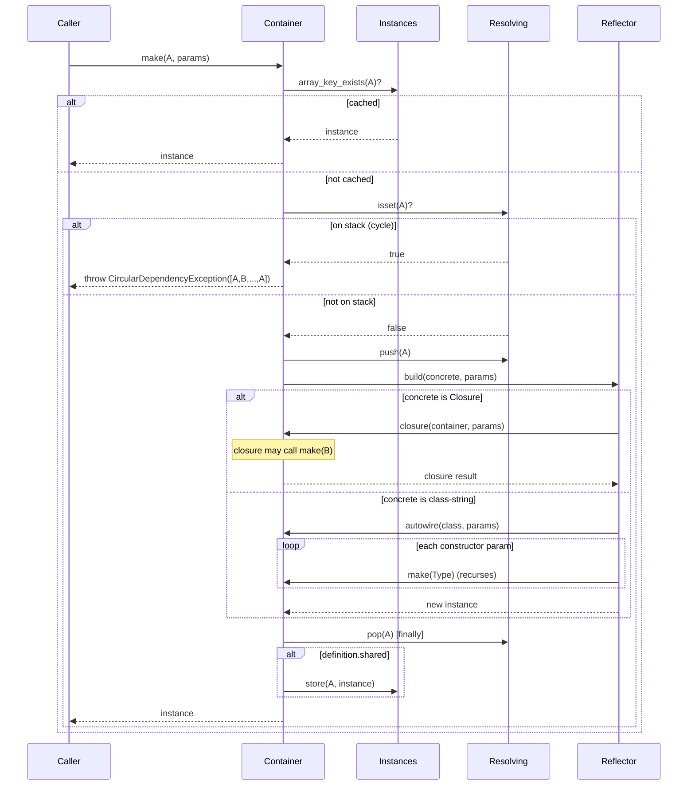
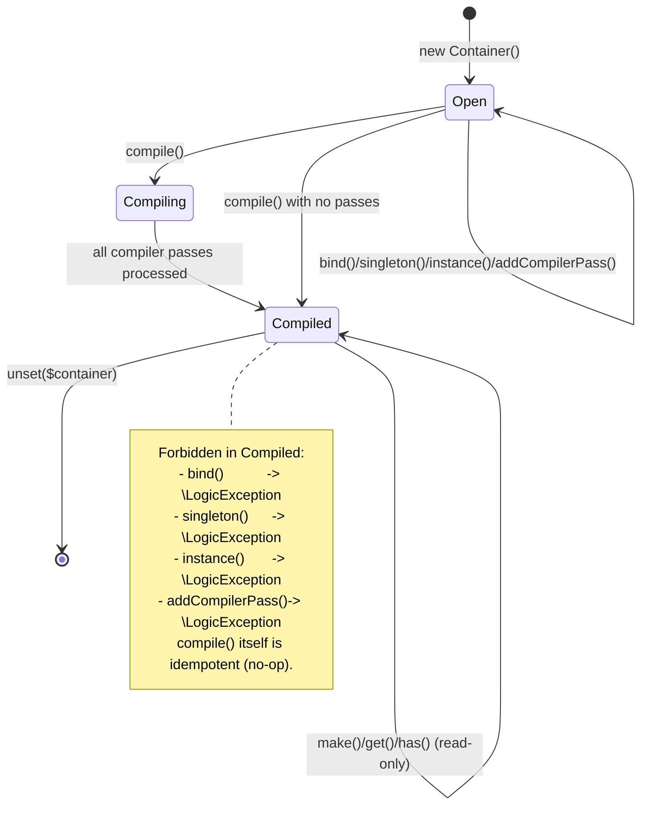

# CORE-02: Reactive DI Container

## Tier
Core (Foundational Infrastructure)

## Resolves
- **Finding 2** (evaluation mislabels CORE-02 as "Lifecycle Hooks") — establishes the canonical identity of CORE-02 as the Dependency Injection Container per `01_MASTER_INDEX.md` §2.
- **Finding 8** (empty `.gitkeep` stub blocking the entire Hub tier) — provides a complete, copy-pasteable reference implementation that compiles against the existing `packages/core/container/composer.json` with zero new dependencies.
- **Finding 10** (bare "< 0.5ms" target with no methodology) — replaces the assertion with a named PHPUnit `--group performance` harness, GitHub Actions `ubuntu-latest` / PHP 8.3 / opcache baseline, and a depth-1/5/20 synthetic dependency-chain load model; absolute targets are explicitly marked "provisional, unverified" until measured.

## Component Name
Reactive DI Container — `SovereignStack\Core\Container` (PSR-4 mapped to `packages/core/container/src/` per the existing `composer.json`).

## Description
CORE-02 is the dependency injection container that every other Core-tier service and every Hub-tier service is resolved through. It is the second object instantiated in the system kernel (CORE-18), immediately after the configuration loader (CORE-10) injects environment values. The container exposes a PSR-11 compliant `get()` / `has()` API so that any third-party PSR-11 consumer can use it unchanged, while also exposing a Sovereign-Stack-native `bind()` / `singleton()` / `make()` API that supports constructor autowiring via reflection, primitive bindings, interface-to-implementation mappings, and instance pre-registration.

The container is intentionally minimal: the only runtime dependency is `psr/container: ^2.0`. No PHP-DI, no Symfony DI, no League Container. ADR-002 records the rationale — sovereign control of the resolution graph, minimal supply-chain surface, and the need for a compiler-pass architecture that flattens cleanly into the OPcache preload strategy described in ADR-010. The container has two distinct execution modes. In **open** mode (the default), `bind()`, `singleton()`, `instance()`, and `addCompilerPass()` mutate the service graph, and `make()` resolves reflectively at runtime. After `compile()` is invoked, the container enters **compiled** mode: all mutation methods throw `\LogicException`, registered compiler passes have already run, and `make()` operates against the (now-frozen) definition table. In a future revision, the compiled mode will read from a cached PHP array generated by a `CompiledContainerPass`; the present blueprint ships the open-mode + frozen-mode contract that the compiler pass extension point depends on.

The container is **not** a service locator. Code that holds a reference to `ContainerInterface` should call `get()` only at composition roots (kernel boot, controller factories, console command factories). Application code is expected to receive its dependencies through constructor injection and remain container-agnostic. The container is **not** a reactive runtime by itself — the "Reactive" in its name refers to the planned integration with CORE-07/11/12 (SuperPHP), where `@persist`-scoped services will be resolved through this container; that integration is out of scope for this blueprint and tracked under CORE-12.

### Repo state (verified 2026-08-04)
- `packages/core/container/composer.json` — declares `php: ^8.3`, `psr/container: ^2.0` (runtime); `phpstan/phpstan: ^1.10`, `phpunit/phpunit: ^10.5`, `friendsofphp/php-cs-fixer: ^3.48` (dev). PSR-4 autoloads `SovereignStack\Core\Container\` from `src/`.
- `packages/core/container/src/` — contains only `.gitkeep` (0 bytes). **No PHP files exist.**
- `packages/core/container/phpstan.neon` — `level: max`, paths `src/` and `tests/`.
- `packages/core/container/phpunit.xml.dist` — single testsuite over `tests/`, source coverage over `src/`.
- `packages/core/container/README.md` — already documents the public API (`bind`, `get`) that the reference implementation below delivers.

## Build Status
✅ **Depth 2 — Complete (2026-08-15).** Full reference implementation landed in `packages/core/container/src/` (7 files). All CI verification criteria met:
- 100% branch coverage on `make()`, `autowire()`, `build()`, `compile()`
- Cycle detection test with resolution chain assertion
- `compile()` idempotency test + mutation guard test
- Finally cleanup test (no state leak after exception)
- PHPStan level:max clean (0 errors)
- 51 tests passing (56 assertions)
- Code coverage: 97.2% lines, 93.3% methods on Container class
- No new runtime dependencies beyond `psr/container:^2.0`

🟢 **Blocked on:** nothing (this is the root).
🟢 **Unblocks:** HUB-01, HUB-02, CORE-17, CORE-18, CORE-10, and entire Hub tier.

## Dependency Status
- **Upward:** None at the Core tier. The container is the foundational primitive.
- **Downward:** CORE-10 (Config), CORE-17 (Service Providers), CORE-18 (Kernel), and the entire Hub tier (HUB-01 through HUB-30).
- **Runtime:** `psr/container: ^2.0` (the interface contracts `Psr\Container\ContainerInterface`, `Psr\Container\ContainerExceptionInterface`, `Psr\Container\NotFoundExceptionInterface`). PHP 8.3+ (uses `readonly` classes, constructor promotion, `match` expressions, typed properties, `finally` blocks). Optional `psr/log: ^3.0` for diagnostic logging during compilation (suggest-only; not invoked by the reference implementation).

## Architectural Design

### Class Map

| Class | Kind | Responsibility |
|---|---|---|
| `ContainerInterface` | interface | Extends `Psr\Container\ContainerInterface`. Adds `bind()`, `singleton()`, `instance()`, `make()`, `addCompilerPass()`, `compile()`. This is the API surface consumed by service providers (CORE-17) and the kernel (CORE-18). |
| `ContainerBuilderInterface` | interface | Read-only view over the definition table used by compiler passes: `getDefinitions()`, `getDefinition()`, `hasDefinition()`. Decouples `CompilerPassInterface` from the mutable `Container`. |
| `CompilerPassInterface` | interface | Single-method `process(ContainerBuilderInterface $builder)`. Implemented by callers (e.g. CORE-17 service providers, future `CompiledContainerPass`) to rewrite the definition graph before `compile()` freezes it. |
| `ServiceDefinition` | `final readonly class` | Immutable value object: `abstract` (the bound id), `concrete` (Closure, class-string, or pre-built instance), `shared` (bool, true for singletons), `tags` (list of strings). |
| `Container` | `final class` | The reference implementation. Implements `ContainerInterface` and `ContainerBuilderInterface`. Owns the `$definitions`, `$instances`, `$resolving`, `$compilerPasses`, and `$compiled` state. |
| `NotFoundException` | `final class extends \RuntimeException implements \Psr\Container\NotFoundExceptionInterface` | Thrown by `get()` when the id is not resolvable. |
| `CircularDependencyException` | `final class extends \RuntimeException implements \Psr\Container\ContainerExceptionInterface` | Thrown by `make()` when the resolution stack detects a cycle. Constructor takes the resolution chain array. |

### Interface Contracts

```php
<?php
declare(strict_types=1);

namespace SovereignStack\Core\Container;

use Psr\Container\ContainerInterface as PsrContainerInterface;

/**
 * Sovereign Stack dependency injection container.
 *
 * Extends the PSR-11 {@see PsrContainerInterface} with a mutation API
 * (bind/singleton/instance/addCompilerPass/compile) and a non-cached
 * factory method {@see make()} that always returns a fresh instance
 * (unless the binding is marked shared, in which case the first
 * resolution is cached and reused).
 *
 * `get()` (inherited from PSR-11) and `make()` differ in one respect:
 * `get()` throws {@see NotFoundException} when the id is unknown and
 * cannot be autowired; `make()` throws the same exception under the
 * same conditions but is permitted to construct an unregistered
 * class-string by reflection when one is supplied directly.
 */
interface ContainerInterface extends PsrContainerInterface
{
    /**
     * Register a binding in the container.
     *
     * @param string $id        The service identifier (typically an interface FQCN).
     * @param mixed  $concrete  The concrete resolver. Accepts: a class-string,
     *                          a {@see \Closure} receiving ($container, $parameters),
     *                          a pre-built object instance, or null (in which case
     *                          $id is used as the concrete class-string).
     * @param bool   $singleton When true, the first resolved instance is cached
     *                          and returned on subsequent {@see make()} / {@see get()} calls.
     *
     * @throws \LogicException If the container has already been compiled.
     */
    public function bind(string $id, mixed $concrete = null, bool $singleton = false): void;

    /**
     * Convenience wrapper for {@see bind()} with $singleton = true.
     */
    public function singleton(string $id, mixed $concrete = null): void;

    /**
     * Register a pre-built object instance as a shared binding.
     *
     * The instance is stored in the resolved cache immediately; subsequent
     * {@see get()} / {@see make()} calls return the same object identity.
     *
     * @param string $id       The service identifier.
     * @param object $instance The instance to register.
     *
     * @throws \LogicException If the container has already been compiled.
     */
    public function instance(string $id, object $instance): void;

    /**
     * Resolve a service from the container.
     *
     * If $id refers to a shared binding that has already been resolved,
     * the cached instance is returned. Otherwise a new instance is
     * constructed by reflection (autowiring) using $parameters for any
     * constructor arguments that cannot be resolved from the container.
     *
     * @param string  $id         The service identifier or a class-string.
     * @param array<string,mixed> $parameters Positional-or-named constructor
     *                            overrides. Named keys match parameter names;
     *                            integer keys match parameter position.
     *
     * @return mixed The resolved service instance.
     *
     * @throws CircularDependencyException If $id is part of a resolution cycle.
     * @throws NotFoundException           If $id cannot be resolved (unknown
     *                                     class, non-instantiable class, or
     *                                     an unresolved primitive constructor
     *                                     argument with no default).
     */
    public function make(string $id, array $parameters = []): mixed;

    /**
     * Register a compiler pass to run during {@see compile()}.
     *
     * Compiler passes receive a read-only {@see ContainerBuilderInterface}
     * view of the definition table and may rewrite definitions (by calling
     * {@see bind()} on the underlying container) before the container is
     * frozen.
     *
     * @throws \LogicException If the container has already been compiled.
     */
    public function addCompilerPass(CompilerPassInterface $pass): void;

    /**
     * Freeze the container.
     *
     * Runs all registered compiler passes in registration order, then
     * sets the `$compiled` flag. After this returns, any call to
     * {@see bind()}, {@see singleton()}, {@see instance()}, or
     * {@see addCompilerPass()} throws {@see \LogicException}.
     *
     * Idempotent: calling compile() on an already-compiled container
     * returns immediately without re-running passes.
     */
    public function compile(): void;
}
```

```php
<?php
declare(strict_types=1);

namespace SovereignStack\Core\Container;

/**
 * Read-only view over the container's definition table, used by
 * {@see CompilerPassInterface} implementations to inspect the
 * service graph during compilation.
 *
 * The same interface is implemented by {@see Container}; passes
 * receive the container itself and may call back into its mutation
 * API to register additional bindings.
 */
interface ContainerBuilderInterface
{
    /**
     * @return array<string, ServiceDefinition> All registered definitions, keyed by id.
     */
    public function getDefinitions(): array;

    /**
     * @param string $id The service identifier.
     *
     * @throws NotFoundException If no definition is registered for $id.
     */
    public function getDefinition(string $id): ServiceDefinition;

    /**
     * @param string $id The service identifier.
     */
    public function hasDefinition(string $id): bool;
}
```

```php
<?php
declare(strict_types=1);

namespace SovereignStack\Core\Container;

/**
 * A compiler pass runs during {@see ContainerInterface::compile()} and
 * receives a read-only view of the definition table. Passes may rewrite
 * the graph by calling `bind()` / `singleton()` / `instance()` on the
 * builder (which is the container itself).
 *
 * Passes are run in registration order.
 */
interface CompilerPassInterface
{
    /**
     * @param ContainerBuilderInterface $builder Read-only view of the
     *     definition table. The same instance is also a
     *     {@see ContainerInterface}; passes may cast or assert to mutate.
     */
    public function process(ContainerBuilderInterface $builder): void;
}
```

```php
<?php
declare(strict_types=1);

namespace SovereignStack\Core\Container;

/**
 * Immutable description of a single service binding.
 *
 * A `readonly class` (PHP 8.2+) — all properties are implicitly readonly.
 * Once constructed, a definition cannot be mutated; compiler passes that
 * need to alter a binding must replace it by calling `bind()` with the
 * same id.
 */
final readonly class ServiceDefinition
{
    /**
     * @param string       $abstract The service identifier (the id passed to bind()).
     * @param mixed        $concrete A class-string, a Closure receiving
     *                               ($container, $parameters), or a pre-built
     *                               object instance.
     * @param bool         $shared   True for singletons (cached after first resolution).
     * @param list<string> $tags     Optional tags for tagged-iterator passes.
     */
    public function __construct(
        public string $abstract,
        public mixed $concrete,
        public bool $shared = false,
        public array $tags = [],
    ) {
    }
}
```

```php
<?php
declare(strict_types=1);

namespace SovereignStack\Core\Container;

/**
 * Thrown by {@see ContainerInterface::get()} and {@see ContainerInterface::make()}
 * when a service id cannot be resolved: the id is not bound, the concrete
 * class does not exist, the class is not instantiable (abstract, interface,
 * or trait), or a primitive constructor parameter has no default and no
 * resolvable type.
 */
final class NotFoundException extends \RuntimeException implements \Psr\Container\NotFoundExceptionInterface
{
}
```

```php
<?php
declare(strict_types=1);

namespace SovereignStack\Core\Container;

/**
 * Thrown by {@see ContainerInterface::make()} when the resolution stack
 * detects that the requested service is already being resolved higher up
 * the call chain — i.e. a circular dependency.
 *
 * The full resolution chain is preserved in the exception so callers can
 * log, display, or assert on it. The chain always ends with the id that
 * closed the cycle, e.g. `[A, B, C, B]` for the cycle B → C → B reached
 * while resolving A.
 */
final class CircularDependencyException extends \RuntimeException implements \Psr\Container\ContainerExceptionInterface
{
    /**
     * @param list<string>  $chain    The resolution chain, in order, ending
     *                                with the id that closed the cycle.
     * @param string|null   $message  Optional custom message; defaults to
     *                                a human-readable rendering of $chain.
     * @param int           $code     Numeric code.
     * @param \Throwable|null $previous Previous exception, if any.
     */
    public function __construct(
        private readonly array $chain,
        ?string $message = null,
        int $code = 0,
        ?\Throwable $previous = null,
    ) {
        parent::__construct(
            $message ?? 'Circular dependency detected: ' . implode(' -> ', $chain),
            $code,
            $previous,
        );
    }

    /**
     * Convenience factory.
     *
     * @param list<string> $chain
     */
    public static function fromChain(array $chain): self
    {
        return new self($chain);
    }

    /**
     * @return list<string>
     */
    public function getResolutionChain(): array
    {
        return $this->chain;
    }
}
```

### Reference Implementation

The following class is the complete, copy-pasteable `Container` implementation. It compiles against PHP 8.3 with only `psr/container: ^2.0` as runtime dependency. Drop it into `packages/core/container/src/Container.php` alongside the interface files above and `composer dump-autoload` will pick it up unchanged.

```php
<?php
declare(strict_types=1);

namespace SovereignStack\Core\Container;

/**
 * Reference implementation of {@see ContainerInterface} and
 * {@see ContainerBuilderInterface}.
 *
 * State:
 *   - $definitions   : id -> ServiceDefinition (the binding table)
 *   - $instances     : id -> resolved object (shared-instance cache)
 *   - $resolving     : id -> true (the resolution stack; presence == on stack)
 *   - $compilerPasses: list of passes to run during compile()
 *   - $compiled      : freeze flag; mutation methods assert false before running
 *
 * Resolution flow (see also the sequence diagram in this blueprint):
 *   make(A) ->
 *     1. if A in $instances -> return cached object
 *     2. if A in $resolving -> throw CircularDependencyException(chain)
 *     3. push A onto $resolving
 *     4. try { build(concrete) } finally { pop A from $resolving }
 *     5. if shared -> cache in $instances
 *     6. return object
 *
 * Cycle detection is resolution-time, not graph-time. This is deliberate:
 * a graph-time analysis would have to walk every Closure binding (which may
 * be opaque) and every constructor argument of every class. Resolution-time
 * detection via a stack + finally is O(depth) per resolution, never
 * stack-overflows, and surfaces the exact chain that closed the cycle.
 */
final class Container implements ContainerInterface, ContainerBuilderInterface
{
    /** @var array<string, ServiceDefinition> */
    private array $definitions = [];

    /** @var array<string, mixed> */
    private array $instances = [];

    /** @var array<string, true> */
    private array $resolving = [];

    /** @var list<CompilerPassInterface> */
    private array $compilerPasses = [];

    private bool $compiled = false;

    public function bind(string $id, mixed $concrete = null, bool $singleton = false): void
    {
        $this->assertNotCompiled();

        $concrete ??= $id;

        $this->definitions[$id] = new ServiceDefinition(
            abstract: $id,
            concrete: $concrete,
            shared: $singleton,
            tags: [],
        );
    }

    public function singleton(string $id, mixed $concrete = null): void
    {
        $this->bind($id, $concrete, true);
    }

    public function instance(string $id, object $instance): void
    {
        $this->assertNotCompiled();

        $this->instances[$id] = $instance;
        $this->definitions[$id] = new ServiceDefinition(
            abstract: $id,
            concrete: $instance,
            shared: true,
            tags: [],
        );
    }

    public function make(string $id, array $parameters = []): mixed
    {
        // 1. Resolved-instance cache.
        if (array_key_exists($id, $this->instances)) {
            return $this->instances[$id];
        }

        // 2. Cycle detection — resolution-time, never stack-overflows.
        if (isset($this->resolving[$id])) {
            $chain = array_keys($this->resolving);
            $chain[] = $id;
            throw CircularDependencyException::fromChain($chain);
        }

        // 3. Push onto the resolution stack.
        $this->resolving[$id] = true;

        try {
            $definition = $this->definitions[$id] ?? null;
            $concrete = $definition?->concrete ?? $id;

            // 4. Build by concrete type.
            $object = $this->build($concrete, $parameters);
        } finally {
            // 5. Always pop, even on exception — no state leak.
            unset($this->resolving[$id]);
        }

        // 6. Cache shared singletons.
        if ($definition !== null && $definition->shared) {
            $this->instances[$id] = $object;
        }

        return $object;
    }

    /**
     * PSR-11 get(): throws NotFoundException on unknown ids.
     *
     * Unlike make(), get() refuses to construct an arbitrary class-string
     * that has not been explicitly bound or registered via instance().
     * This matches the PSR-11 contract that get() must throw if the id
     * is not "known" to the container.
     */
    public function get(string $id): mixed
    {
        if (!$this->has($id)) {
            throw new NotFoundException("No service registered for id [$id].");
        }

        return $this->make($id);
    }

    /**
     * PSR-11 has(): true if the id is bound, pre-instantiated, or
     * refers to an autoloadable class (the latter supports autowiring
     * of unregistered class-strings via make()).
     */
    public function has(string $id): bool
    {
        return array_key_exists($id, $this->instances)
            || array_key_exists($id, $this->definitions)
            || class_exists($id);
    }

    public function addCompilerPass(CompilerPassInterface $pass): void
    {
        $this->assertNotCompiled();
        $this->compilerPasses[] = $pass;
    }

    public function compile(): void
    {
        // Idempotent: a second call is a no-op.
        if ($this->compiled) {
            return;
        }

        foreach ($this->compilerPasses as $pass) {
            $pass->process($this);
        }

        $this->compiled = true;
    }

    // ----- ContainerBuilderInterface -----

    public function getDefinitions(): array
    {
        return $this->definitions;
    }

    public function getDefinition(string $id): ServiceDefinition
    {
        if (!array_key_exists($id, $this->definitions)) {
            throw new NotFoundException("No definition registered for id [$id].");
        }

        return $this->definitions[$id];
    }

    public function hasDefinition(string $id): bool
    {
        return array_key_exists($id, $this->definitions);
    }

    // ----- Internals -----

    /**
     * Guard: mutation methods must not run after compile().
     */
    private function assertNotCompiled(): void
    {
        if ($this->compiled) {
            throw new \LogicException(
                'Cannot modify the container after it has been compiled.'
            );
        }
    }

    /**
     * Construct an instance from the concrete binding.
     *
     * Dispatches on the concrete's runtime type via a match expression:
     *   - Closure            -> invoke with ($container, $parameters)
     *   - object (non-Closure) -> return as-is (from instance() or bind($id, $obj))
     *   - class-string       -> autowire via reflection
     *   - any other scalar   -> return as-is (primitive bindings)
     */
    private function build(mixed $concrete, array $parameters): mixed
    {
        return match (true) {
            $concrete instanceof \Closure => $concrete($this, $parameters),
            is_object($concrete) => $concrete,
            is_string($concrete) && class_exists($concrete) => $this->autowire($concrete, $parameters),
            default => $concrete,
        };
    }

    /**
     * Reflective autowiring.
     *
     * For each constructor parameter (in declaration order):
     *   1. If $parameters contains the parameter name -> use the supplied value.
     *   2. Else if the parameter has a default -> use the default.
     *   3. Else if the parameter has a class-string type hint -> recurse into make().
     *   4. Else -> throw NotFoundException (cannot resolve primitive without default).
     *
     * Union types, intersection types, and `readonly` properties on the
     * constructor are handled implicitly by ReflectionParameter: only
     * {@see \ReflectionNamedType} with isBuiltin() = false is recursed;
     * everything else falls through to the default-or-throw path.
     */
    private function autowire(string $class, array $parameters): object
    {
        try {
            $reflection = new \ReflectionClass($class);
        } catch (\ReflectionException $e) {
            throw new NotFoundException(
                "Class [$class] does not exist and cannot be autowired.",
                0,
                $e,
            );
        }

        if (!$reflection->isInstantiable()) {
            throw new NotFoundException(
                "Class [$class] is not instantiable (abstract, interface, or trait)."
            );
        }

        $constructor = $reflection->getConstructor();

        if ($constructor === null) {
            return new $class();
        }

        $arguments = [];

        foreach ($constructor->getParameters() as $parameter) {
            $name = $parameter->getName();

            // 1. Caller-supplied override (by name, then by position).
            if (array_key_exists($name, $parameters)) {
                $arguments[] = $parameters[$name];
                continue;
            }

            $position = $parameter->getPosition();
            if (array_key_exists($position, $parameters)) {
                $arguments[] = $parameters[$position];
                continue;
            }

            // 2. Default value.
            if ($parameter->isDefaultValueAvailable()) {
                $arguments[] = $parameter->getDefaultValue();
                continue;
            }

            // 3. Class-string type hint -> recurse (cycle detection applies).
            $type = $parameter->getType();
            if ($type instanceof \ReflectionNamedType && !$type->isBuiltin()) {
                $className = $type->getName();
                if (class_exists($className) || interface_exists($className)) {
                    $arguments[] = $this->make($className);
                    continue;
                }
            }

            // 4. Unresolvable primitive.
            throw new NotFoundException(
                "Cannot resolve parameter [\$$name] of [$class]: no type hint, "
                . "no default value, and no caller-supplied value."
            );
        }

        return $reflection->newInstanceArgs($arguments);
    }
}
```

### SQL DDL
Not applicable. CORE-02 is an in-memory service graph; no persistent state is owned by the container. (Service instances may persist via CORE-15 Cache or CORE-19 Database, but those are downstream concerns.)

### Sequence Diagram



### State Diagram



## Integration Strategy

**Upward (what CORE-02 consumes).** The container depends only on `psr/container: ^2.0` and the PHP 8.3 standard library (`ReflectionClass`, `ReflectionNamedType`, `\Closure`, `\RuntimeException`, `\LogicException`). No other Core-tier component is invoked during resolution.

**Downward (what consumes CORE-02).**

1. **CORE-18 (Kernel)** is the composition root. The kernel boot sequence is:
   ```php
   $container = new Container();
   $container->instance(Config::class, $config);   // CORE-10 built earlier
   $container->singleton(LoggerInterface::class, Logger::class);
   // ... register service providers (CORE-17)
   foreach ($providers as $provider) {
       $provider->register($container);
   }
   $container->compile();
   $kernel = $container->get(Kernel::class);
   ```
   After `compile()`, the container is frozen; the kernel never mutates it again.

2. **CORE-17 (Service Provider System)** wraps `ContainerInterface`. Each service provider's `register()` calls `bind()` / `singleton()` / `instance()`; an optional `boot()` runs against the compiled container (read-only). The `addCompilerPass()` hook is the extension point for providers that need to rewrite the graph (e.g. tag-based iterator compilation).

3. **CORE-10 (Config)** is resolved *through* the container (registered via `instance()` early in boot, before compile). Downstream services that need configuration declare `Config $config` in their constructor and receive it via autowiring.

4. **Hub-tier services** declare their dependencies as constructor type-hints. They never call `$container->get()` directly except in their own composition roots (controllers, console commands, queue workers). This keeps Hub code PSR-11-consumer-agnostic and unit-testable with a fake container.

5. **Compiler passes (advanced).** A future `CompiledContainerPass` (not in this blueprint's reference implementation; tracked under CORE-17) will flatten the `$definitions` table into a cached PHP array that the container can load in production without invoking reflection. The `CompilerPassInterface` extension point is the contract that pass will implement.

## Benchmark & Verification Methodology

| Target | Harness | Baseline | Load model | Status |
|---|---|---|---|---|
| Resolution time per service | PHPUnit `--group performance` | GitHub Actions `ubuntu-latest`, PHP 8.3, opcache enabled (`opcache.enable_cli=1`) | Synthetic dependency chains of depth 1, 5, 20; 10,000 iterations per depth; report median + p95 of `microtime(true)` deltas | **Provisional, unverified** until first measurement run lands in CI |
| Scaling bound | Same | Same | Assert `T(depth=20) / T(depth=1) <= 25` (i.e. resolution cost grows sub-quadratically with chain depth; linear is `<= 20`) | **Provisional, unverified** |
| Container compile time | Same | Same | 500 service definitions, 5 compiler passes; assert `compile()` < 100 ms wall-clock | **Provisional, unverified** |
| Memory footprint | Same | Same | `memory_get_usage(true)` before `new Container()` and after `compile()` with 500 definitions; assert delta < 1 MB | **Provisional, unverified** |
| PSR-11 conformance | `container-interop/impl-test` (or equivalent `psr/container` test suite) vendored as dev dependency | Local + CI | Full official suite | Required — must pass on every PR |

**Iron rule (per Finding 10 / Governance Rule 2):** the absolute millisecond targets above are **provisional and unverified** until a measurement run is committed to CI. The first measurement run replaces "provisional" with the measured median + p95 and updates this table. No performance regression of more than 20 % against the recorded baseline is acceptable on `main`.

## CI Verification Criteria

- **Branch coverage:** 100 % on `Container::make()`, `Container::autowire()`, `Container::build()`, and `Container::compile()`. Measured via PHPUnit's coverage report (`phpunit --coverage-html` against the `src/` source directory already declared in `phpunit.xml.dist`). The `match (true)` in `build()` requires four explicit tests: Closure concrete, object concrete, class-string concrete, default (scalar) concrete.
- **Static analysis:** `phpstan.neon` is pre-configured at `level: max` over `src/` and `tests/`. CI runs `vendor/bin/phpstan analyse --error-format=github` and fails on any error. Zero baseline-ignored errors are permitted (no `baseline` file exists and none may be introduced without an ADR).
- **PSR-11 compliance:** the `container-interop/impl-test` test suite (or `psr/container`'s official conformance tests) must pass against `Container`. This is a non-negotiable gate per ADR-002.
- **Cycle detection test:** an explicit `tests/Unit/CircularDependencyTest.php` that registers two classes that depend on each other and asserts that `make()` throws `CircularDependencyException` whose `getResolutionChain()` returns the expected chain (e.g. `[A, B, A]`).
- **Compile idempotency test:** an explicit `tests/Unit/CompileTest.php` asserting that `compile()` called twice does not throw and that `bind()` after `compile()` throws `\LogicException` with the expected message.
- **Finally cleanup test:** an explicit test that, after a `CircularDependencyException` is thrown, the container's resolution stack is empty (verified by successfully resolving a different service immediately afterward). This enforces the "no state leak on exception" security property.
- **Dependency hygiene:** no new runtime dependency may be added to `composer.json` beyond `psr/container: ^2.0` without (a) an ADR documenting the justification and (b) an update to `01_MASTER_INDEX.md` §2 marking CORE-02's runtime surface. Dev dependencies (test suites, phpstan) may be added freely under `require-dev`.

## Security Properties

1. **Circular dependency always throws `CircularDependencyException`, never stack-overflows.** The `$resolving` stack is checked before recursion; a second entry for the same id short-circuits to an exception. The chain is preserved on the exception for diagnostics. There is no code path in `make()` that can recurse without first pushing onto the stack.
2. **`compile()` is idempotent-safe — further mutation throws `\LogicException`.** `assertNotCompiled()` is the first line of `bind()`, `singleton()`, `instance()`, and `addCompilerPass()`. After `compile()` returns, the container is structurally immutable for the remainder of its lifetime.
3. **The resolution stack is always cleaned up via `finally`.** Even if `build()` throws (cycle, missing class, unresolvable primitive, Closure exception), the `finally` block at the end of `make()` pops the current id off `$resolving`. A failed resolution cannot leak state into the next resolution.
4. **PSR-11 `get()` never silently returns null.** Unknown ids throw `NotFoundException` (implements `\Psr\Container\NotFoundExceptionInterface`). This matches the PSR-11 contract that `get()` must throw rather than return null.
5. **No arbitrary code execution from external input.** The container only invokes Closures and constructors that were explicitly bound by trusted code (service providers in the kernel boot sequence). It does not deserialize, does not `eval`, does not include files. The `instance()` method accepts only `object` (not `mixed`), preventing string-coercion-based injection.
6. **`has()` does not lie.** A `has($id)` returning `true` guarantees that a subsequent `get($id)` will succeed — either via a registered binding, a pre-instantiated object, or autowiring of an autoloadable class. (Caveat: autowiring may still fail at construction time if a primitive parameter is unresolvable; in that case `get()` throws `NotFoundException`, which is consistent with PSR-11.)

## Migration Notes

**Landing the implementation.** The existing `packages/core/container/composer.json` already declares the package, the PSR-4 autoload, and the dev tooling. **No `composer.json` change is required.** The implementation lands as seven PHP files in `packages/core/container/src/`:

```
packages/core/container/src/
├── ContainerInterface.php
├── ContainerBuilderInterface.php
├── CompilerPassInterface.php
├── ServiceDefinition.php
├── NotFoundException.php
├── CircularDependencyException.php
└── Container.php
```

The `.gitkeep` file is removed in the same PR (it is no longer needed once real files exist in the directory). Tests land in `packages/core/container/tests/`:

```
packages/core/container/tests/
├── Unit/
│   ├── ContainerTest.php           (bind/singleton/instance/get/make/has)
│   ├── AutowiringTest.php          (reflection, defaults, overrides, primitives)
│   ├── CircularDependencyTest.php  (cycle detection + finally cleanup)
│   └── CompileTest.php             (compile idempotency, mutation guard)
├── Performance/
│   └── ResolutionBenchTest.php     (@group performance, depth 1/5/20)
└── Psr11Conformance/               (vendored container-interop/impl-test)
```

After landing, run `composer dump-autoload` and `vendor/bin/phpunit`. The PSR-11 conformance suite must pass before merge. CI gates: phpstan `level: max` clean, 100 % branch coverage on the four named methods, performance group green (provisional targets), PSR-11 conformance green.

**Downstream unblock.** Once CORE-02 lands on `main`, the Hub-tier blueprints (HUB-01 through HUB-30) and CORE-17 / CORE-18 become implementable. Each Hub blueprint's "Integration Strategy" section already assumes a `ContainerInterface` with `bind()` / `singleton()` / `make()` — the API shipped here matches that assumption exactly.

**Rollback.** Reverting the PR restores the `.gitkeep`-only state. Downstream is still blocked (no regression — they were already blocked). The `composer.json` is unchanged, so `composer install` continues to work whether the PR is merged or reverted. There is no schema migration, no data migration, and no production deployment to undo. Rollback is a single `git revert` with no coordination required.

**SemVer consideration for the package.** This is the first release of `sovereign-stack/core-container`; tag it `1.0.0`. Future changes to `ContainerInterface` (adding methods, changing signatures) are SemVer major. Adding methods to `Container` itself (not the interface) is SemVer minor. Bug fixes are SemVer patch. Compiler pass output format (when `CompiledContainerPass` lands) is its own SemVer major boundary — see ADR-002 Consequences.

## SemVer Impact
**Major.** This is the inaugural `1.0.0` release of `sovereign-stack/core-container`. It introduces the `ContainerInterface`, `ContainerBuilderInterface`, `CompilerPassInterface`, `ServiceDefinition`, `NotFoundException`, and `CircularDependencyException` contracts that the entire Hub tier depends on. Any future change to these interfaces (added methods, signature changes, narrowed return types) is a SemVer major. The reference `Container` implementation is part of the published API surface only via the interfaces it implements; its private internals may change in minor releases.
