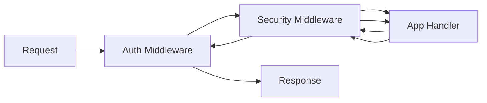

# PHASE CORE-05: HTTP Middleware & Request Handler

## Tier
Core

## Component Name
PSR-15 Middleware Engine

## Description
A "Onion" style request processing engine. It allows the application to wrap the Request/Response cycle with cross-cutting concerns like Authentication, CSRF protection, and Performance tracing in a standardized way.

## Context7 Research
- **PSR Compliance**: PSR-15 (HTTP Handlers).
- **Reference**: `/php-fig/http-message` middleware docs.
- **Design Pattern**: Chain of Responsibility.

## Architectural Design
- **MiddlewareInterface**: Standardized `process(Request, Handler)` method.
- **RequestHandler**: Coordinates the stack, passing the request through each layer.

### Component Diagram

## Integration Strategy
Depends on `CORE-04` (PSR-7). It is the execution bridge between the raw HTTP request and the `CORE-06` (Router).

## CI Verification Criteria
- **Latency**: Middleware stack overhead (10 layers) must be < 1ms.
- **Transparency**: Each layer must be able to modify the request/response without knowledge of other layers.

## SemVer Impact
**Minor**. Enables plug-and-play security and observability features.