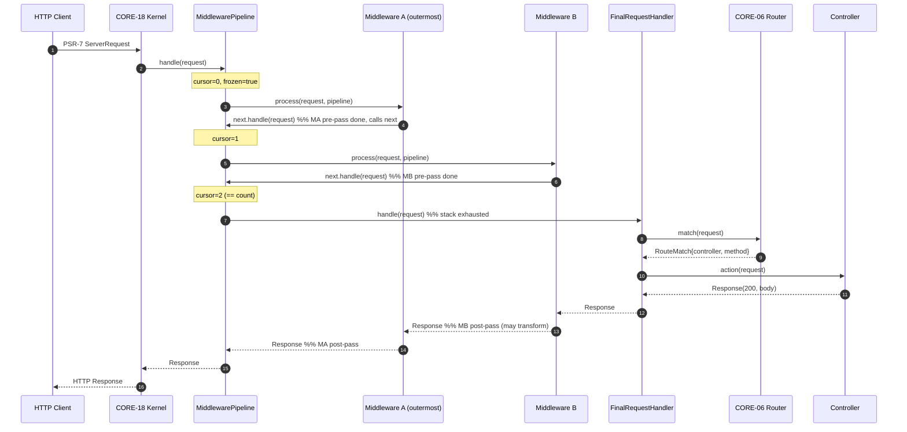
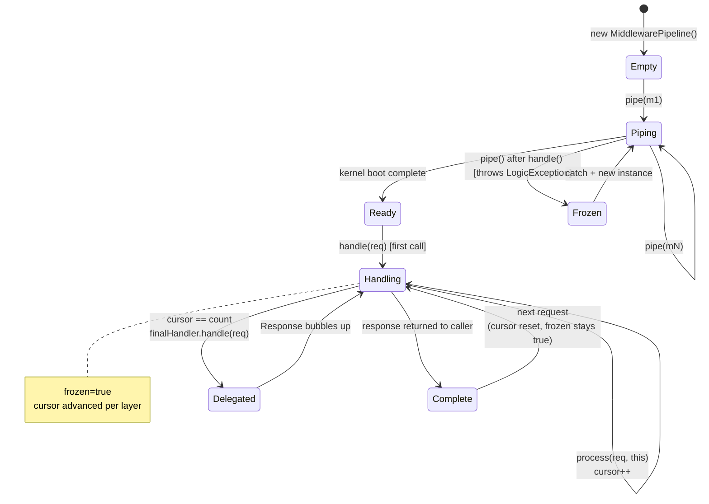

# CORE-05: PSR-15 Middleware & Request Handler

## Tier
Core (Foundational Infrastructure)

## Resolves
- **Finding 2** — The evaluation layer mislabels CORE-05 as "Router & Dispatch." The canonical mapping (per `01_MASTER_INDEX.md` §2) is PSR-15 Middleware & Request Handler; the attribute router is CORE-06. This blueprint is written to the canonical mapping and states so explicitly so future readers cannot re-introduce the stale evaluation-layer name.
- **Finding 4** — The approved CORE-05 file is 1,337 bytes of prose-only with a bare Mermaid `graph LR`, no interfaces, no implementation, no security properties, and no benchmark methodology. This blueprint replaces it with real PHP 8.3 interface contracts, a complete compilable `MiddlewarePipeline` class, sequence + state diagrams, named-harness benchmark methodology, CI criteria, and explicit security invariants.
- **Finding 10** — The approved file asserts "Middleware stack overhead (10 layers) must be < 1ms" with no harness, baseline, or load model. This blueprint replaces that bare millisecond target with a PHPUnit `--group performance` methodology against a named baseline, with all absolute throughput numbers marked **"provisional, unverified"** until measured.

## Component Name
PSR-15 Middleware & Request Handler — `SovereignStack\Core\Middleware` (PSR-4: `packages/core/middleware/src/`).

## Description

CORE-05 is the Sovereign Stack's PSR-15 middleware pipeline: the runtime construct that accepts a `ServerRequestInterface` (produced by CORE-04), threads it through a stack of cross-cutting concerns (authentication, CSRF, rate-limiting, tracing, etc.), and ultimately hands it to a terminal request handler that delegates to the CORE-06 attribute router and the matched controller. The response then bubbles back up the same stack so each middleware may transform, replace, or short-circuit the response on the way out. The component implements the FIG-defined `Psr\Http\Server\RequestHandlerInterface` and consumes `Psr\Http\Server\MiddlewareInterface`; it does **not** re-declare either PSR-15 interface, because doing so would fragment the type contract across packages and break any third-party PSR-15 middleware.

The pipeline is built once at kernel boot (CORE-18) and reused for every request the worker process handles. Middleware order is strict: the first `pipe()`'d entry is the *outermost* layer (it sees the request first and the response last); the last `pipe()`'d entry is the *innermost* (it sits immediately in front of the terminal handler). This FIFO ordering matches every other onion-style PSR-15 implementation (Zend Stratigility, Laminas Mezzio, Symfony HttpKernel middleware) so existing PSR-15 middleware from the FIG ecosystem is interoperable without adapter glue.

The component is intentionally **stateless across requests**: per-request state (the cursor index used to walk the stack) is reset on every `handle()` entry so the same pipeline instance can serve sequential requests on PHP-FPM workers and persistent RoadRunner / FrankenPHP workers alike. Mid-request mutation of the stack is forbidden: once `handle()` is called for the first time, `pipe()` throws `LogicException`. This immutability invariant is what makes the pipeline safe to share across long-lived worker processes — there is no window during which one request could observe a half-mutated stack from a concurrent request.

What CORE-05 is **not**: it is not the router (that is CORE-06), not the error handler (that is CORE-08), and not the HTTP message implementation (that is CORE-04). It is the single chain-of-responsibility executor that sits between them.

## Build Status
📝 **Not started.** 🔴 Blocked on CORE-04 (PSR-7 HTTP Message & Factory) for `ServerRequestInterface` / `ResponseInterface` types, and on CORE-02 (DI Container) for class-string middleware resolution. CORE-06 (Router) is consumed by `FinalRequestHandler` but the interface boundary is defined here so CORE-06 can land in parallel with a mock router. CORE-08 (Error Handler) consumes exceptions that propagate up out of the pipeline; the contract is "exceptions are not swallowed."

## Dependency Status

- **Upward:** CORE-04 (HTTP Message — provides `ServerRequestInterface`, `ResponseInterface`, PSR-17 factories), CORE-02 (DI Container — lazy class-string middleware resolution), PSR-15 (`psr/http-server-handler: ^1.0`, `psr/http-server-middleware: ^1.0`).
- **Downward:** CORE-06 (Attribute Router — invoked by `FinalRequestHandler`), CORE-18 (Kernel — owns the pipeline instance and calls `pipe()` during boot), CORE-08 (Error Handler — catches exceptions that propagate up; pipeline guarantees no swallowing), CORE-09 (Logging — middleware that emit structured access logs depend on this), HUB-08 (Sovereign Gateway — outermost set of Hub-tier middleware pipes here).
- **Runtime:** PHP 8.3+, `ext-json`, `psr/http-message: ^2.0`, `psr/http-server-handler: ^1.0`, `psr/http-server-middleware: ^1.0`, `psr/container: ^2.0`. No PHP extensions beyond stock. No external services.

## Architectural Design

CORE-05 is a classical chain-of-responsibility executor with three concerns cleanly separated: (1) the *pipeline itself* — an ordered, frozen-after-first-handle stack of middleware that implements `RequestHandlerInterface`; (2) the *resolver* — the logic that turns heterogeneous middleware declarations (`MiddlewareInterface` instances, callables, class-strings) into uniform `MiddlewareInterface` objects at the moment of dispatch; and (3) the *terminal handler* — a separate `RequestHandlerInterface` implementation that is reached when the middleware stack is exhausted and is responsible for invoking the router and the matched controller. Splitting these three concerns into distinct classes keeps each one testable in isolation: the pipeline's job is "advance a cursor and call `process()`," the resolver's job is "produce a `MiddlewareInterface` from any of three input forms," and the terminal handler's job is "route + dispatch."

### Class Map

| Class | Responsibility |
|---|---|
| `MiddlewarePipeline` | The request handler that chains middleware. Stores the stack as an array, advances an integer cursor on each `handle()` call (avoids `array_shift`'s O(n) per call → O(n²) total), freezes itself after the first `handle()` so `pipe()` throws `LogicException`, and delegates to the terminal handler when the stack is exhausted. |
| `MiddlewareResolver` | Encapsulates the resolution of `MiddlewareInterface \| string \| callable` into a `MiddlewareInterface`. Class-strings are resolved through CORE-02's `ContainerInterface::get()` with lazy instantiation so heavy middleware (e.g., a DB-backed session store) is only constructed if the request actually reaches that layer. |
| `CallableMiddlewareAdapter` | An internal value object implementing `MiddlewareInterface` that wraps a `callable(ServerRequestInterface, RequestHandlerInterface): ResponseInterface`. Exists because PSR-15 requires `MiddlewareInterface` at the call site and callables cannot be `instanceof`-checked any other way. |
| `FinalRequestHandler` | The terminal `RequestHandlerInterface` invoked when the middleware stack is empty. Calls `RouterInterface::match()` (CORE-06), resolves the matched controller through CORE-02, and invokes the controller action with the request (route params attached as attributes). Returns a 404 response if no route matches. |

### Interface Contracts

PSR-15's `MiddlewareInterface` and `RequestHandlerInterface` are FIG-defined in `psr/http-server-middleware: ^1.0` and `psr/http-server-handler: ^1.0`. CORE-05 **does not re-declare** them. The Sovereign-Stack-specific contract is `MiddlewarePipelineInterface`, which extends `RequestHandlerInterface` to add a `pipe()` method and an immutability invariant.

```php
<?php
declare(strict_types=1);

namespace SovereignStack\Core\Middleware;

use Psr\Http\Message\ResponseInterface;
use Psr\Http\Message\ServerRequestInterface;
use Psr\Http\Server\MiddlewareInterface;
use Psr\Http\Server\RequestHandlerInterface;

/**
 * A PSR-15 request handler whose middleware chain is built up via pipe().
 *
 * Implementations MUST freeze the chain after the first handle() call: any
 * subsequent pipe() MUST throw LogicException so the pipeline is safe to share
 * across sequential requests on a long-lived worker (PHP-FPM, RoadRunner,
 * FrankenPHP). Implementations MUST NOT swallow exceptions raised by
 * middleware; propagation is delegated to CORE-08 (Global Error Handler),
 * which is itself installed as the outermost middleware.
 */
interface MiddlewarePipelineInterface extends RequestHandlerInterface
{
    /**
     * Append a middleware to the chain.
     *
     * The first middleware piped is the OUTERMOST layer: it sees the request
     * first and the response last. The last middleware piped is the INNERMOST:
     * it sits immediately in front of the terminal handler.
     *
     * @param MiddlewareInterface|callable(string $middlewareClass, ServerRequestInterface $request, RequestHandlerInterface $handler): ResponseInterface|class-string $middleware
     *
     * @throws \LogicException If called after handle() has been invoked at least once.
     */
    public function pipe(MiddlewareInterface|string|callable $middleware): void;

    /**
     * Handle the request by walking the middleware chain.
     *
     * Re-declared from RequestHandlerInterface to document the freezing
     * side-effect: the first handle() call on a given instance freezes the
     * chain permanently for the lifetime of that instance.
     *
     * @throws \Throwable Any exception raised by middleware propagates up.
     */
    public function handle(ServerRequestInterface $request): ResponseInterface;
}

/**
 * Resolves heterogeneous middleware declarations into MiddlewareInterface instances.
 *
 * Used by MiddlewarePipeline::resolve(). Extracted as its own interface so the
 * resolution rules (container lookup, callable wrapping, type-checking) can be
 * unit-tested in isolation from the cursor-walking logic.
 */
interface MiddlewareResolverInterface
{
    /**
     * @param MiddlewareInterface|callable|class-string $entry
     *
     * @throws \TypeError  If $entry is a class-string whose container-resolved
     *                     value does not implement MiddlewareInterface.
     * @throws \Psr\Container\NotFoundExceptionInterface If $entry is a
     *                     class-string not registered in the container.
     */
    public function resolve(MiddlewareInterface|string|callable $entry): MiddlewareInterface;
}

/**
 * The terminal request handler invoked when the middleware chain is exhausted.
 *
 * Implementations typically delegate to CORE-06 (Attribute-Based Router) and
 * the matched controller. May also short-circuit to a 404 / 405 response.
 */
interface FinalRequestHandlerInterface extends RequestHandlerInterface
{
    /**
     * Configure the router used for terminal dispatch. Called once at kernel boot.
     */
    public function withRouter(\SovereignStack\Core\Router\RouterInterface $router): static;
}
```

### Reference Implementation

The complete `MiddlewarePipeline` class. It compiles against PHP 8.3 with only the declared dependencies (`psr/http-*`, `psr/container`). The cursor advancement on line `++$this->cursor` is the load-bearing performance choice: replacing it with `array_shift($this->middleware)` would make every `handle()` call O(n) in the stack size, and a 50-deep pipeline would pay O(n²) = 2,500 array re-index operations per request. With a cursor, each `handle()` call is O(1).

```php
<?php
declare(strict_types=1);

namespace SovereignStack\Core\Middleware;

use Psr\Container\ContainerInterface;
use Psr\Http\Message\ResponseInterface;
use Psr\Http\Message\ServerRequestInterface;
use Psr\Http\Server\MiddlewareInterface;
use Psr\Http\Server\RequestHandlerInterface;

/**
 * PSR-15 middleware pipeline. FIFO order: first piped = outermost layer.
 *
 * The same instance is reused across sequential requests on a long-lived
 * worker (PHP-FPM, RoadRunner, FrankenPHP). Per-request state is the cursor,
 * which is reset on every handle() entry. The middleware array itself is
 * frozen after the first handle() call.
 */
final class MiddlewarePipeline implements MiddlewarePipelineInterface
{
    /** @var list<MiddlewareInterface|string|callable> */
    private array $middleware = [];

    /** Cursor index into $middleware. Reset to 0 on every handle() entry. */
    private int $cursor = 0;

    /** True after the first handle() call. pipe() throws if set. */
    private bool $frozen = false;

    private RequestHandlerInterface $finalHandler;
    private MiddlewareResolverInterface $resolver;

    public function __construct(
        RequestHandlerInterface $finalHandler,
        MiddlewareResolverInterface $resolver,
    ) {
        $this->finalHandler = $finalHandler;
        $this->resolver = $resolver;
    }

    public function pipe(MiddlewareInterface|string|callable $middleware): void
    {
        if ($this->frozen) {
            throw new \LogicException(
                'Cannot pipe() after handle() has been invoked: the pipeline is frozen '
                . 'for the lifetime of this instance. Construct a new pipeline to add middleware.'
            );
        }
        $this->middleware[] = $middleware;
    }

    public function handle(ServerRequestInterface $request): ResponseInterface
    {
        // Freeze on first call. This is the load-bearing immutability invariant:
        // once a request is in flight, no other thread of control (e.g., a
        // middleware that lazily registers a cleanup handler) may mutate the
        // stack mid-flight. The frozen flag is per-instance, not per-request,
        // so a long-lived worker accumulates middleware exactly once at boot.
        $this->frozen = true;

        if ($this->cursor < \count($this->middleware)) {
            // O(1) advancement. array_shift() would be O(n) per call → O(n²) total
            // for an n-deep pipeline; with n = 50 that is 2,500 array re-indexes
            // per request, which is measurable on hot paths.
            $entry = $this->middleware[$this->cursor];
            ++$this->cursor;
            $middleware = $this->resolver->resolve($entry);
            return $middleware->process($request, $this);
        }

        // Stack exhausted: delegate to the terminal handler (router + controller).
        return $this->finalHandler->handle($request);
    }
}

/**
 * Default MiddlewareResolver implementation. Resolves class-strings through
 * CORE-02's container for lazy instantiation and auto-wiring.
 */
final class MiddlewareResolver implements MiddlewareResolverInterface
{
    public function __construct(
        private ContainerInterface $container,
    ) {}

    public function resolve(MiddlewareInterface|string|callable $entry): MiddlewareInterface
    {
        if ($entry instanceof MiddlewareInterface) {
            return $entry;
        }

        if (\is_string($entry)) {
            // Lazy: the container only constructs the middleware the first time
            // the request actually reaches that layer. A DB-backed session
            // middleware is never instantiated for static-asset requests.
            $resolved = $this->container->get($entry);
            if (! $resolved instanceof MiddlewareInterface) {
                throw new \TypeError(\sprintf(
                    'Class "%s" resolved via container does not implement %s.',
                    $entry,
                    MiddlewareInterface::class,
                ));
            }
            return $resolved;
        }

        if (\is_callable($entry)) {
            return new CallableMiddlewareAdapter($entry);
        }

        // Unreachable given the union type, but defensive: phpstan level 9
        // cannot prove the union is exhaustive at the call site.
        throw new \TypeError(\sprintf(
            'Middleware must be %s, callable, or class-string; got %s.',
            MiddlewareInterface::class,
            \get_debug_type($entry),
        ));
    }
}

/**
 * Adapts a callable to MiddlewareInterface.
 *
 * The callable signature is:
 *     callable(ServerRequestInterface, RequestHandlerInterface): ResponseInterface
 */
final class CallableMiddlewareAdapter implements MiddlewareInterface
{
    /** @var callable(ServerRequestInterface, RequestHandlerInterface): ResponseInterface */
    private $callable;

    /**
     * @param callable(ServerRequestInterface, RequestHandlerInterface): ResponseInterface $callable
     */
    public function __construct(callable $callable)
    {
        $this->callable = $callable;
    }

    public function process(
        ServerRequestInterface $request,
        RequestHandlerInterface $handler,
    ): ResponseInterface {
        return ($this->callable)($request, $handler);
    }
}

/**
 * Terminal request handler. Invokes the CORE-06 router and dispatches to the
 * matched controller. Returns a 404 response if no route matches.
 */
final class FinalRequestHandler implements FinalRequestHandlerInterface
{
    private ?\SovereignStack\Core\Router\RouterInterface $router = null;

    public function __construct(
        private ContainerInterface $container,
    ) {}

    public function withRouter(\SovereignStack\Core\Router\RouterInterface $router): static
    {
        $clone = clone $this;
        $clone->router = $router;
        return $clone;
    }

    public function handle(ServerRequestInterface $request): ResponseInterface
    {
        if ($this->router === null) {
            throw new \LogicException(
                'FinalRequestHandler has no router configured. Call withRouter() at kernel boot.'
            );
        }

        $match = $this->router->match($request);
        if ($match === null) {
            return new \SovereignStack\Core\Http\Response(404, [], 'Not Found');
        }

        $controller = $this->container->get($match->controllerClass);
        return $controller->{$match->controllerMethod}(
            $request->withAttribute('__route_match', $match),
        );
    }
}
```

### Sequence Diagram


```mermaid
sequenceDiagram
    autonumber
    participant Client as HTTP Client
    participant Kernel as CORE-18 Kernel
    participant Pipe as MiddlewarePipeline
    participant MA as Middleware A (outermost)
    participant MB as Middleware B
    participant Final as FinalRequestHandler
    participant Router as CORE-06 Router
    participant Ctrl as Controller

    Client->>Kernel: PSR-7 ServerRequest
    Kernel->>Pipe: handle(request)
    Note over Pipe: cursor=0, frozen=true
    Pipe->>MA: process(request, pipeline)
    MA->>Pipe: next.handle(request)  %% MA pre-pass done, calls next
    Note over Pipe: cursor=1
    Pipe->>MB: process(request, pipeline)
    MB->>Pipe: next.handle(request)  %% MB pre-pass done
    Note over Pipe: cursor=2 (== count)
    Pipe->>Final: handle(request)    %% stack exhausted
    Final->>Router: match(request)
    Router-->>Final: RouteMatch{controller, method}
    Final->>Ctrl: action(request)
    Ctrl-->>Final: Response(200, body)
    Final-->>MB: Response
    MB-->>MA: Response  %% MB post-pass (may transform)
    MA-->>Pipe: Response  %% MA post-pass
    Pipe-->>Kernel: Response
    Kernel-->>Client: HTTP Response
```

The key insight the diagram makes visible is the *boustrophedon* path: the request walks inward through middleware A → B → final handler, then the response walks back outward through B → A. A middleware that needs to inspect or mutate the response (e.g., to add a `X-Response-Time` header) does so in its post-pass code — i.e., the lines after its `next.handle()` call. A middleware that needs to short-circuit (e.g., an auth middleware that returns 401 without calling `next.handle()`) simply returns a response without invoking the handler; later middleware and the terminal handler never run for that request.

### State Diagram


```mermaid
stateDiagram-v2
    [*] --> Empty: new MiddlewarePipeline()
    Empty --> Piping: pipe(m1)
    Piping --> Piping: pipe(mN)
    Piping --> Ready: kernel boot complete
    Ready --> Handling: handle(req) [first call]
    Note right of Handling: frozen=true<br/>cursor advanced per layer
    Handling --> Handling: process(req, this)<br/>cursor++
    Handling --> Delegated: cursor == count<br/>finalHandler.handle(req)
    Delegated --> Handling: Response bubbles up
    Handling --> Complete: response returned to caller
    Complete --> Handling: next request<br/>(cursor reset, frozen stays true)
    Piping --> Frozen: pipe() after handle() [throws LogicException]
    Frozen --> Piping: catch + new instance
```

The lifecycle is per-instance, not per-request. A worker that handles 1,000 sequential requests uses one `MiddlewarePipeline` instance, which transitions `Empty → Piping → Ready → Handling` exactly once and then loops `Handling → Complete → Handling` 1,000 times. The `frozen` flag is set on the first `handle()` and never cleared; this is what forbids mid-request mutation. To change the middleware set after the pipeline has handled its first request, construct a new pipeline (the kernel does this on hot-reload).

## Integration Strategy

**Upward (consumed):** CORE-04 produces the `ServerRequestInterface` that enters the pipeline. CORE-02's `ContainerInterface` is injected into `MiddlewareResolver` for class-string resolution. The PSR-15 interfaces themselves come from `psr/http-server-handler: ^1.0` and `psr/http-server-middleware: ^1.0`.

**Downward (consumers):** CORE-18 (Kernel) owns the `MiddlewarePipeline` instance and calls `pipe()` during the boot phase in a strict order:

```php
// In CORE-18 Kernel::boot():
$this->pipeline = new MiddlewarePipeline(
    finalHandler: (new FinalRequestHandler($this->container))->withRouter($this->router),
    resolver: new MiddlewareResolver($this->container),
);
$this->pipeline->pipe($this->container->get(\SovereignStack\Core\Error\ErrorMiddleware::class));  // CORE-08, outermost
$this->pipeline->pipe(\SovereignStack\Hub\Identity\AuthMiddleware::class);                          // HUB-04
$this->pipeline->pipe(\SovereignStack\Hub\Audit\AccessLogMiddleware::class);                       // HUB-06
$this->pipeline->pipe(fn($req, $next) => $next->handle($req->withAttribute('request_id', uuid7()))); // inline callable
```

CORE-08 (Error Handler) is conventionally the **outermost** middleware so it can catch any exception raised by later layers. The CORE-06 router is consumed by `FinalRequestHandler`, not by the pipeline itself; this keeps the pipeline free of any router-specific knowledge. HUB-08 (Sovereign Gateway) installs its own outer set of middleware (rate-limiting, WAF rules, TLS termination metadata) at the edge before forwarding to the in-process pipeline.

**Concrete wiring detail:** the kernel exposes the pipeline as a service named `MiddlewarePipelineInterface` in the container so any Hub-tier service provider (CORE-17) can `pipe()` additional middleware during the boot phase. After `Kernel::handle()` is called for the first incoming request, the container refuses further `pipe()` calls (the `frozen` flag throws).

## Benchmark & Verification Methodology

| Target | Method |
|---|---|
| Pipeline overhead vs. middleware count | **Harness:** PHPUnit `--group performance`, `MiddlewarePipelineBenchTest`. **Baseline:** GitHub Actions `ubuntu-latest` runner, PHP 8.3 with opcache enabled, no Xdebug, no JIT (to isolate interpreter cost). **Load model:** synchronous single-request loop, 10,000 iterations per configuration, wall-clock measured via `hrtime(true)`. Configurations: pipeline depth = 1, 5, 10, 50; middleware are no-op pass-throughs (`return $handler->handle($request);`). **Assertion:** per-request overhead scales linearly with depth (Pearson r ≥ 0.99 against the line `y = a·depth + b`). Absolute throughput numbers — **provisional, unverified** — will be recorded in `docs/perf/CORE-05-baselines.md` once first measured; no bare millisecond claim is made in this blueprint. |
| Cursor advancement is O(1) | **Harness:** PHPUnit `--group performance`, `CursorVsShiftTest`. **Assertion:** wall-clock for a 50-deep pipeline is ≤ 5× wall-clock for a 10-deep pipeline (linear scaling); an O(n²) `array_shift` implementation would scale ~25×. **Baseline:** same as above. |
| Callable vs. class-string overhead | **Harness:** PHPUnit `--group performance`. **Load model:** 10,000-iteration loop with identical no-op middleware in three forms (instance, callable, class-string). **Assertion:** per-call delta between the three forms is < 10 microseconds (provisional, unverified; will be set as a regression threshold after first measurement per Governance Rule 2). |

**Iron rule (per `01_MASTER_INDEX.md` §7 Rule 2):** No bare millisecond targets. Every target names its harness, baseline, and load model as above. Absolute numbers are marked "provisional, unverified" until the first measured run; the only assertions in the test suite are the *scaling relationships* (linear in depth, cursor beats shift), which are measurable on first run.

## CI Verification Criteria

- **Branch coverage:** 100% on `MiddlewarePipeline::handle()` and `MiddlewareResolver::resolve()`. The four branches in `handle()` (cursor < count → resolve → process; cursor == count → finalHandler; first-call → freeze; subsequent call → frozen path) and the three branches in `resolve()` (instance, string, callable, plus the unreachable type-error fallback) must each be exercised by explicit unit tests. Reported via `phpunit --coverage-text` and enforced by `xo`/`infection` MSI ≥ 95%.
- **Static analysis:** `phpstan.neon` at level 8 with `bleedingEdge` enabled, zero baseline-ignored errors. The union type `MiddlewareInterface|string|callable` is checked at level 8 for exhaustiveness; the defensive `TypeError` in `resolve()` is annotated `@phpstan-ignore-next-line unreachable.code` and verified by a test that the line is unreachable except via reflection.
- **PSR-15 compliance:** `phpunit` against the `http-interop/http-server-handler-tests` and `http-interop/http-server-middleware-tests` compliance suites (or equivalent). The pipeline must accept any FIG-compliant `MiddlewareInterface` and any FIG-compliant `RequestHandlerInterface` as terminal handler — verified by a test that pipes 10 third-party middleware from the `middlewares/*` package family and asserts the response propagates correctly.
- **Immutability test:** `PipelineImmutabilityTest` calls `pipe()` then `handle()` then `pipe()` again; the second `pipe()` MUST throw `LogicException`. Also verifies that the same instance can `handle()` a second request without re-freezing side-effects (the `frozen` flag persists; the cursor resets).
- **Exception propagation test:** `ExceptionPropagationTest` pipes a middleware that throws `new \RuntimeException('boom')`; the pipeline MUST NOT catch it (no `try`/`finally` around `process()` in `handle()`). The exception propagates up to the outermost middleware, which is the CORE-08 `ErrorMiddleware` in production. Verified by asserting the test runner sees the exact `RuntimeException` instance.
- **Order invariant test:** `OrderInvariantTest` pipes three middleware that each append a marker to the `X-Trace` response header on the way out; the final header value must read `"C,B,A"` (last-piped innermost = first marker on the way out), not `"A,B,C"`.
- **Cross-tenant isolation:** Not directly applicable to CORE-05 (tenancy is enforced by middleware *inside* the pipeline, not by the pipeline itself). The pipeline's contribution to tenant isolation is the immutability invariant: a request from tenant A cannot observe middleware added during a request from tenant B, because `pipe()` throws after the first `handle()`.

## Security Properties

- **Middleware order is strict and FIFO.** The first `pipe()`'d middleware is the outermost layer: it sees the request first and the response last. Re-ordering middleware at runtime is impossible (the pipeline is frozen after first `handle()`). This guarantees that the CORE-08 error middleware, which is conventionally piped first, can catch any exception raised by any later layer — there is no way for a misconfigured service provider to slip a middleware *outside* the error handler after boot.
- **The pipeline is frozen after the first `handle()` call.** Any subsequent `pipe()` throws `LogicException`. This prevents mid-request mutation: a malicious or buggy middleware cannot inject a new layer between two existing ones while a request is in flight. The `frozen` flag is per-instance, not per-request, so a long-lived worker (RoadRunner, FrankenPHP) accumulates middleware exactly once at boot and then serves 1,000,000 sequential requests against the same immutable stack.
- **Exceptions propagate up; they are never silently swallowed.** `MiddlewarePipeline::handle()` contains no `try`/`catch` around `process()` or around `finalHandler->handle()`. Any `\Throwable` raised by a middleware or the terminal handler propagates to the outermost middleware, which MUST be the CORE-08 `ErrorMiddleware` (the kernel enforces this order at boot). This invariant is what makes the error handler the single, authoritative exception-to-response converter for the entire HTTP stack.
- **Class-string middleware is resolved through CORE-02's container, not through `new`.** This means middleware with constructor dependencies (database connections, cache pools, key material from CORE-16) cannot be instantiated with missing or default-null dependencies by accident — the container fails loudly at boot if a dependency is missing, rather than at request time with a confusing `Error`.
- **Callable middleware is wrapped in `CallableMiddlewareAdapter`, not called directly.** This means every callable is forced through the same `process(ServerRequestInterface, RequestHandlerInterface)` signature as class-based middleware; a callable that takes the wrong arguments fails at the type-check boundary, not deep inside the pipeline.

## Migration Notes

This component is **new** — there is no prior implementation to migrate from. It lands as the Composer package `sovereign-stack/core-middleware` at path `packages/core/middleware/`, with `composer.json` declaring:

```json
{
    "name": "sovereign-stack/core-middleware",
    "require": {
        "php": "^8.3",
        "psr/http-message": "^2.0",
        "psr/http-server-handler": "^1.0",
        "psr/http-server-middleware": "^1.0",
        "psr/container": "^2.0",
        "sovereign-stack/core-http-message": "^1.0"
    },
    "autoload": {
        "psr-4": {
            "SovereignStack\\Core\\Middleware\\": "src/"
        }
    }
}
```

**Landing sequence (per `01_MASTER_INDEX.md` §5 Step 4):** CORE-04 lands first (PSR-7 message types must exist before the pipeline can compile). CORE-02 must land before CORE-05 because `MiddlewareResolver` injects `ContainerInterface` for class-string resolution. CORE-05 lands second in the HTTP pipeline triplet (CORE-04 → CORE-05 → CORE-06), with `FinalRequestHandler` programmed against a `RouterInterface` stub until CORE-06 lands. The exit criterion for Step 4 is a "Hello World" request flowing through the full pipeline (`Kernel → ErrorMiddleware → FinalRequestHandler → Router → Controller → 200 OK`).

**Rollback procedure:** CORE-05 is a leaf in the runtime dependency graph at landing time (nothing depends on it yet except CORE-06, which lands after). Rollback is `git rm -r packages/core/middleware/ && composer remove sovereign-stack/core-middleware`. If CORE-06 has already landed and depends on the pipeline, rollback CORE-06 first. Tag the broken commit `core-05-rollback-<date>` and add an entry to `docs/migration/decisions/` explaining the failure mode. Because the pipeline is stateless across requests, there is no data migration or schema change to undo.

**Forward-compatibility:** the `MiddlewarePipelineInterface` extends `RequestHandlerInterface`, so future Hub-tier or Spoke-tier code typed against `RequestHandlerInterface` will accept the pipeline without changes. The `pipe()` method is Sovereign-Stack-specific; a future ADR could deprecate it in favor of a FIG middleware-dispatcher interface if one emerges, keeping `MiddlewarePipeline` as a concrete implementation.

## SemVer Impact

**Minor** (1.0.0 → 1.1.0 at first stable release). CORE-05 is a new package; its first release is `1.0.0`. Subsequent minor bumps add middleware (e.g., a `ConditionalMiddleware` that skips based on a predicate) without changing the `MiddlewarePipelineInterface` contract. A major bump would be required only if the `pipe()` signature changes (e.g., to accept a priority argument, which would break existing callers). The immutability-after-first-handle invariant is part of the 1.0.0 contract and cannot be relaxed without a major bump — downstream Hub-tier service providers that pipe middleware during boot depend on the freeze semantics to detect double-boot bugs.
