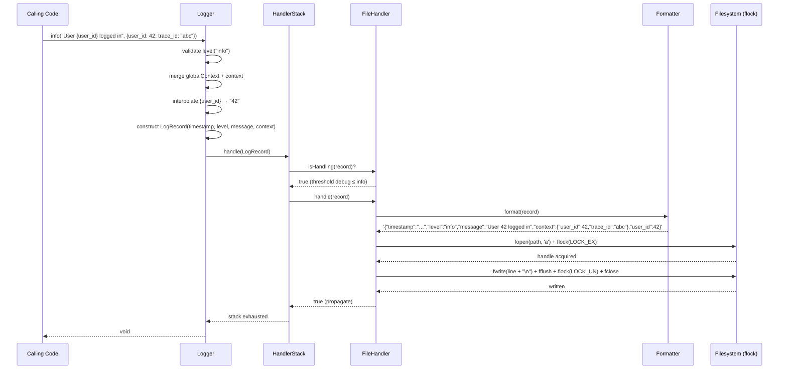
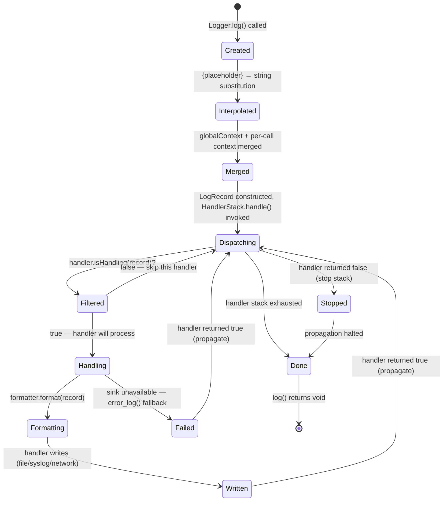

# CORE-09: PSR-3 Logging Service (Structured Logging Engine)

## Tier
Core (Foundational Infrastructure)

## Resolves
- **Finding 2** (evaluation layer scored a stale CORE-09 as "Error Handling" 91/100) — this blueprint re-anchors CORE-09 to its verified identity per `01_MASTER_INDEX.md` §2: **the PSR-3 Logging Service**, namespace `SovereignStack\Core\Logging`. Error handling is CORE-08; logging is CORE-09. The two are distinct components with distinct contracts.
- **Finding 3** (`BRIDGE-01.md` wrongly cites `CORE-09: Cryptography & Hashing (Payload Verification)`) — this blueprint makes the identity of CORE-09 unambiguous in its first paragraph. The cryptography component is CORE-16 (Binary Encryption Envelope). CORE-09 is the structured logging service; it consumes traces, context, and exceptions, and produces JSON log lines. It never verifies cryptographic signatures. An implementer reading this blueprint cannot confuse CORE-09 with CORE-16.
- **Finding 4** (the approved `docs/blueprints/Core/CORE-09.md` is 1,254 bytes — thin, prose-only, no interfaces, no implementation, no SQL DDL, no sequence diagram) — this blueprint meets the fidelity bar in `AUTHORING_GUIDE.md`: real PHP 8.3 interfaces, complete compilable reference implementation, Mermaid sequence + state diagrams, named benchmark harness, CI criteria, explicit security properties, and migration notes.
- **Finding 10** (the approved blueprint asserts "< 0.1ms logging overhead" with no harness, baseline, or load model) — the absolute target is **withdrawn** and replaced with a named-harness methodology below; any absolute number cited is marked "provisional, unverified" per Governance Rule 2 in `01_MASTER_INDEX.md`.

## Component Name
PSR-3 Logging Service (Structured Logging Engine) — `SovereignStack\Core\Logging`

## Description

CORE-09 is the **structured logging service** for the SovereignStack Core tier. It implements the [PSR-3 Logger Interface](https://www.php-fig.org/psr/psr-3/) in full: the eight RFC 5424 log levels (emergency, alert, critical, error, warning, notice, info, debug), the `log($level, $message, $context)` entry point, and the `{placeholder}` interpolation rule. The component is unambiguously the logging service — it is **not** the cryptography component (CORE-16), it is **not** the error handler (CORE-08), and it is **not** an audit log (HUB-06 Audit Hub owns the tamper-evident audit trail). CORE-09 produces structured, machine-readable JSON log lines that downstream observability tooling — HUB-15 Health Monitor, BRIDGE-01 Vanguard's audit interceptor, external aggregators — can ingest without re-parsing.

The component exists because every SovereignStack service needs a single, canonical way to record "what happened, when, with what context." The CORE-03 Event Dispatcher already type-hints `?\Psr\Log\LoggerInterface` for listener-failure recording; the CORE-08 Error Handler will depend on CORE-09 to persist uncaught exceptions and fatal errors; the CORE-18 Kernel will log boot/shutdown phases; every Hub-tier service will obtain a logger through the CORE-02 DI Container. Without CORE-09, each consumer would either invent its own logging (producing format drift) or pull in a third-party library (producing dependency drift). CORE-09 standardises both: PSR-3 as the contract, structured JSON as the on-disk format, `flock`-guarded file writes as the default sink, and a handler-stack architecture that allows per-environment routing (file in dev, syslog in staging, HTTP-based Loki/Vector in production) without changing application code.

What this component is **not**: it is not an async log shipper (use a sidecar collector for that), it is not a metrics emitter (PSR-3 has no metrics concept; HUB-15 owns metrics), it is not a tracing system (OpenTelemetry is a separate concern), and it is not a place to dump raw request bodies, secrets, or PII without explicit redaction. The default `RedactingFormatter` strips known-sensitive keys (`password`, `token`, `secret`, `authorization`, `cookie`) and truncates any `context` value exceeding 2 KB; raw request bodies are truncated to 2 KB before formatting. Logging is a security-sensitive surface — an over-eager `logger->debug()` that dumps a bearer token is a CVE waiting to happen — so CORE-09 ships redaction by default and treats opt-out as an explicit, audited configuration change.

The implementation does not yet exist. The `packages/core/logging/` directory has not been created. This blueprint is the specification against which the implementation will be built. It is listed as Step 2 in the 11-step build sequence in `01_MASTER_INDEX.md` §5, parallelisable with CORE-08 (Error Handler) and CORE-10 (Config), with an estimated 2 weeks of effort.

## Build Status
📝 **Not started.** The `packages/core/logging/` directory does not exist in the repository (verified 2026-08-04). No `composer.json`, no `src/`, no `tests/`. This blueprint is the greenfield specification.

🔴 **Blocked on CORE-02** (DI Container) — the logger is injected into consumers via the container; the container must exist first. CORE-10 (Config) is a soft dependency — the logger can be constructed with explicit constructor arguments if config is not yet available, but in production it will read its handler stack and level threshold from CORE-10.

## Dependency Status
- **Upward:** CORE-02 (DI Container) — required at runtime; the logger is injected as a singleton bound to `Psr\Log\LoggerInterface`. CORE-10 (Configuration & Environment Loader) — soft; reads `logging.threshold`, `logging.handlers[]`, `logging.redaction.keys` from configuration. PSR-3 itself (`psr/log: ^3.0`) — the contract being implemented.
- **Downward:** CORE-03 (Event Dispatcher) — already type-hints `?\Psr\Log\LoggerInterface` for listener-failure recording; once CORE-09 lands, the `?LoggerInterface` slot in `EventDispatcher`'s constructor becomes a real binding rather than `null`. CORE-08 (Error Handler) — depends on CORE-09 to persist uncaught exceptions and fatal errors. CORE-18 (Kernel) — logs boot/shutdown phases. CORE-17 (Service Providers) — every service provider that wants diagnostic output obtains the logger through the container. All Hub-tier components and most spoke-tier components consume `Psr\Log\LoggerInterface`. BRIDGE-01 (Vanguard) uses the logger for audit-interceptor diagnostics (not for payload verification — that is CORE-16).
- **Runtime:** `php:^8.3`, `psr/log:^3.0` (required — provides `LoggerInterface`, `LogLevel`, `AbstractLogger`, `NullLogger`). `ext-json` (always available in PHP 8.3). `ext-mbstring` (suggested — for multibyte-safe truncation). No other PHP extensions. Dev: `phpunit/phpunit:^10.5`, `phpstan/phpstan:^1.10`, `friendsofphp/php-cs-fixer:^3.48`.

## Architectural Design

### Class Map

| Class | Kind | Responsibility |
|---|---|---|
| `Logger` | `final class implements Psr\Log\LoggerInterface` | The PSR-3 logger entry point. Holds a `HandlerStack` and an optional global context (e.g., `trace_id`, `tenant_id`). Implements all eight level methods (`emergency` through `debug`) as one-line forwarders to `log()`. The `log()` method validates the level, constructs a `LogRecord` value object, and forwards to `HandlerStack::handle()`. Does not perform I/O itself; that is delegated to handlers. |
| `HandlerStack` | `final class` | Ordered chain of `HandlerInterface` instances. `handle(LogRecord $record)` iterates the stack; each handler returns `true` (continue propagation) or `false` (stop). A handler may also bubble the record to the next handler after performing its own write — the contract is "return false to stop, return true to continue." Reordering, pushing, and popping handlers are supported at runtime but discouraged after boot. |
| `HandlerInterface` | `interface` | Contract for a log handler. Single method: `handle(LogRecord $record): bool`. Implementations decide whether to handle a record (typically by level threshold), perform the write (file, syslog, network), and return a propagation signal. |
| `AbstractHandler` | `abstract class implements HandlerInterface` | Base class providing a level threshold (`$level`) and a `isHandling(LogRecord $record): bool` helper that returns true if the record's level is at or above the threshold. Subclasses override `handle()` to call `isHandling()` then perform the write. |
| `FileHandler` | `final class extends AbstractHandler` | Writes formatted log records to a file using `fopen` + `flock(LOCK_EX)` + `fwrite` + `fclose`. Constructor takes a file path, a `FormatterInterface`, and a level threshold. Used as the default handler in dev and staging. |
| `SyslogHandler` | `final class extends AbstractHandler` | Writes formatted log records to the system logger via `openlog()` / `syslog()` / `closelog()`. Constructor takes an ident string, a facility (default `LOG_USER`), and a level threshold. Used in production container deployments where syslog is forwarded to journald or a collector sidecar. |
| `FormatterInterface` | `interface` | Contract for a log record formatter. Single method: `format(LogRecord $record): string`. Returns a single line (no trailing newline; the handler appends `\n`). Implementations are stateless. |
| `JsonFormatter` | `final class implements FormatterInterface` | Formats a `LogRecord` as a single-line JSON object with keys `timestamp`, `level`, `level_name`, `message`, `context`, and (when present in the record's context) `trace_id`, `tenant_id`, `user_id`. Multibyte-safe; uses `JSON_UNESCAPED_SLASHES \| JSON_UNESCAPED_UNICODE \| JSON_THROW_ON_ERROR`. |
| `LineFormatter` | `final class implements FormatterInterface` | Human-readable format: `[%timestamp%] %level_name%.upper%: %message% {json-encoded-context}`. Used in dev for terminal readability. |
| `RedactingFormatter` | `final class implements FormatterInterface` | Decorator. Wraps another `FormatterInterface` and redacts sensitive keys in the record's context before delegating. Default redaction keys: `password`, `token`, `secret`, `authorization`, `cookie`, `api_key`, `private_key`. Redacted values are replaced with the literal string `"[REDACTED]"`. Also truncates any string value exceeding 2 KB to `2 000 chars…(truncated)`. |
| `LogRecord` | `final readonly class` | Value object. Fields: `timestamp` (`\DateTimeImmutable`, UTC, microsecond precision), `level` (string, one of the PSR-3 levels), `levelName` (uppercase string), `message` (interpolated string), `context` (`array<string, mixed>`), `channel` (string, default `"app"`). Immutable; constructed by `Logger::log()` and passed by value through the handler stack. |

### Interface Contracts

The PSR-3 `LoggerInterface` is defined by `psr/log: ^3.0` (https://www.php-fig.org/psr/psr-3/). It is **not** re-declared here. The SovereignStack package consumes it directly: `SovereignStack\Core\Logging\Logger implements Psr\Log\LoggerInterface`. The eight level methods (`emergency`, `alert`, `critical`, `error`, `warning`, `notice`, `info`, `debug`) and the `log($level, $message, $context)` entry point are inherited verbatim.

The following interfaces are package-local and supplement PSR-3:

```php
<?php
declare(strict_types=1);

namespace SovereignStack\Core\Logging;

/**
 * Contract for a log handler.
 *
 * A handler receives a fully-constructed LogRecord and decides
 * whether to write it to a sink (file, syslog, network). The
 * return value signals propagation: false stops the HandlerStack,
 * true continues to the next handler.
 *
 * Implementations MUST NOT throw during handle(). If a sink is
 * unavailable (disk full, syslog unreachable), the handler should
 * return true (so the next handler can try) and emit a single
 * error_log() call as a last-resort signal. Throwing from a handler
 * would crash the caller — which is often the Kernel itself.
 */
interface HandlerInterface
{
    /**
     * Handle a log record.
     *
     * @param LogRecord $record The record to handle.
     * @return bool True to continue propagation to the next handler;
     *              false to stop the stack.
     */
    public function handle(LogRecord $record): bool;

    /**
     * Whether this handler will handle the given record.
     *
     * Called by the HandlerStack before handle() to short-circuit
     * records below the handler's threshold. Implementations should
     * make this cheap (a level comparison, no I/O).
     *
     * @param LogRecord $record
     * @return bool
     */
    public function isHandling(LogRecord $record): bool;
}
```

```php
<?php
declare(strict_types=1);

namespace SovereignStack\Core\Logging;

/**
 * Contract for a log record formatter.
 *
 * A formatter converts a LogRecord into a string suitable for the
 * handler's sink (a single line of JSON, a human-readable string,
 * a syslog-formatted string, etc.). Formatters MUST NOT perform I/O
 * and MUST NOT throw. If formatting fails (e.g., json_encode error),
 * the formatter returns a fallback string containing the original
 * message and a marker noting the failure.
 *
 * Formatters are stateless; a single instance may be shared across
 * handlers.
 */
interface FormatterInterface
{
    /**
     * Format a log record as a string.
     *
     * @param LogRecord $record
     * @return string A single line, without a trailing newline.
     *                The handler is responsible for appending the
     *                newline appropriate to its sink.
     */
    public function format(LogRecord $record): string;
}
```

```php
<?php
declare(strict_types=1);

namespace SovereignStack\Core\Logging;

/**
 * Immutable value object representing a single log record.
 *
 * Constructed by Logger::log() and passed by value through the
 * HandlerStack. All fields are readonly; handlers and formatters
 * cannot mutate the original record. If a handler needs a modified
 * record (e.g., to inject additional context), it constructs a new
 * instance via `with*()` methods.
 */
final readonly class LogRecord
{
    public function __construct(
        public \DateTimeImmutable $timestamp,
        public string $level,
        public string $levelName,
        public string $message,
        public array $context,
        public string $channel = 'app'
    ) {
    }

    /**
     * Return a copy with additional context merged in.
     *
     * Existing keys are overwritten by the new values. Used by
     * Logger to inject global context (trace_id, tenant_id) at
     * construction time.
     */
    public function withContext(array $additional): self
    {
        return new self(
            $this->timestamp,
            $this->level,
            $this->levelName,
            $this->message,
            array_merge($this->context, $additional),
            $this->channel
        );
    }
}
```

### Reference Implementation

The complete `Logger` class:

```php
<?php
declare(strict_types=1);

namespace SovereignStack\Core\Logging;

use Psr\Log\AbstractLogger;
use Psr\Log\LogLevel;
use Psr\Log\InvalidArgumentException;

/**
 * PSR-3 structured logging implementation.
 *
 * Extends Psr\Log\AbstractLogger to inherit the eight level
 * methods (emergency, alert, critical, error, warning, notice,
 * info, debug) as one-line forwarders to log(). This class
 * overrides log() to construct a LogRecord and forward it to
 * the HandlerStack.
 */
final class Logger extends AbstractLogger
{
    /**
     * Ordered mapping of PSR-3 levels to numeric thresholds.
     * Higher number = more severe. Used by handlers for filtering.
     */
    public const LEVEL_WEIGHTS = [
        LogLevel::DEBUG     => 100,
        LogLevel::INFO      => 200,
        LogLevel::NOTICE    => 250,
        LogLevel::WARNING   => 300,
        LogLevel::ERROR     => 400,
        LogLevel::CRITICAL  => 500,
        LogLevel::ALERT     => 550,
        LogLevel::EMERGENCY => 600,
    ];

    /** @var array<string, int> */
    private array $globalContext;

    /**
     * @param HandlerStack $handlers The handler chain.
     * @param array<string, mixed> $globalContext Context merged into every
     *        record (e.g., trace_id, tenant_id, hostname).
     * @param string $channel Logger channel name (default "app").
     */
    public function __construct(
        private readonly HandlerStack $handlers,
        array $globalContext = [],
        private readonly string $channel = 'app'
    ) {
        $this->globalContext = $globalContext;
    }

    /**
     * Log a message at the given level.
     *
     * Implements PSR-3 LoggerInterface::log(). Interpolates {placeholder}
     * values from $context into $message per the PSR-3 spec. Constructs a
     * LogRecord and forwards it to the HandlerStack.
     *
     * @param mixed $level One of the PSR-3 LogLevel constants.
     * @param string $message Message template, may contain {placeholder} tokens.
     * @param array<string, mixed> $context Placeholder values and structured context.
     * @return void
     *
     * @throws InvalidArgumentException If $level is not a recognised PSR-3 level.
     */
    public function log($level, string|\Stringable $message, array $context = []): void
    {
        $level = (string) $level;

        if (!isset(self::LEVEL_WEIGHTS[$level])) {
            throw new InvalidArgumentException(
                sprintf('Unknown log level "%s". Expected one of: %s', $level, implode(', ', array_keys(self::LEVEL_WEIGHTS)))
            );
        }

        $mergedContext = array_merge($this->globalContext, $context);
        $interpolated = $this->interpolate((string) $message, $mergedContext);

        $record = new LogRecord(
            timestamp: new \DateTimeImmutable('now', new \DateTimeZone('UTC')),
            level: $level,
            levelName: strtoupper($level),
            message: $interpolated,
            context: $mergedContext,
            channel: $this->channel
        );

        $this->handlers->handle($record);
    }

    /**
     * Interpolate {placeholder} tokens in a message using context values.
     *
     * Per PSR-3: placeholders must match the regex /\{([a-zA-Z0-9_\.]+)\}/
     * and are replaced by the string representation of the corresponding
     * context value. Missing placeholders are left untouched.
     *
     * @param string $message
     * @param array<string, mixed> $context
     * @return string
     */
    private function interpolate(string $message, array $context): string
    {
        $replace = [];
        foreach ($context as $key => $value) {
            if (is_scalar($value) || $value instanceof \Stringable) {
                $replace['{' . $key . '}'] = (string) $value;
            } elseif (is_array($value)) {
                $replace['{' . $key . '}'] = json_encode($value, JSON_THROW_ON_ERROR);
            } elseif ($value instanceof \DateTimeInterface) {
                $replace['{' . $key . '}'] = $value->format(\DateTimeInterface::ATOM);
            } elseif (is_object($value)) {
                $replace['{' . $key . '}'] = $value::class;
            } elseif (is_null($value)) {
                $replace['{' . $key . '}'] = 'null';
            }
            // Resources are silently skipped — interpolating a stream handle is a bug.
        }

        return strtr($message, $replace);
    }

    /**
     * Add a key/value pair to the global context.
     *
     * The new value is merged into every subsequent log record. Useful
     * for setting trace_id early in request handling.
     *
     * @param string $key
     * @param mixed $value
     * @return void
     */
    public function addGlobalContext(string $key, mixed $value): void
    {
        $this->globalContext[$key] = $value;
    }
}
```

The `HandlerStack`:

```php
<?php
declare(strict_types=1);

namespace SovereignStack\Core\Logging;

/**
 * Ordered chain of log handlers.
 *
 * Iterates handlers on every log() call. Each handler decides
 * whether to write the record and whether to propagate to the
 * next handler. The first handler that returns false stops the
 * stack.
 */
final class HandlerStack
{
    /** @var list<HandlerInterface> */
    private array $handlers = [];

    /**
     * @param list<HandlerInterface> $handlers Initial handler list.
     */
    public function __construct(array $handlers = [])
    {
        foreach ($handlers as $handler) {
            $this->handlers[] = $handler;
        }
    }

    /**
     * Push a handler onto the top of the stack.
     */
    public function push(HandlerInterface $handler): self
    {
        array_unshift($this->handlers, $handler);
        return $this;
    }

    /**
     * Append a handler to the bottom of the stack.
     */
    public function append(HandlerInterface $handler): self
    {
        $this->handlers[] = $handler;
        return $this;
    }

    /**
     * Pass a record through the handler chain.
     *
     * Iterates handlers in push order. If a handler's isHandling()
     * returns false, it is skipped. If a handler's handle() returns
     * false, propagation stops.
     */
    public function handle(LogRecord $record): void
    {
        foreach ($this->handlers as $handler) {
            if (!$handler->isHandling($record)) {
                continue;
            }

            if ($handler->handle($record) === false) {
                break;
            }
        }
    }
}
```

The `FileHandler`:

```php
<?php
declare(strict_types=1);

namespace SovereignStack\Core\Logging;

/**
 * Writes formatted log records to a file.
 *
 * Uses flock(LOCK_EX) for cross-process safety: 100 PHP-FPM
 * workers logging to the same file will not corrupt each other's
 * lines. The file is opened in append mode on every handle() call
 * — this is intentional, avoiding a long-lived file handle that
 * would survive a deploy and point at a rotated inode.
 */
final class FileHandler extends AbstractHandler
{
    /**
     * @param string $path Absolute path to the log file.
     * @param FormatterInterface $formatter Record formatter.
     * @param string $threshold Minimum PSR-3 level to write.
     */
    public function __construct(
        private readonly string $path,
        private readonly FormatterInterface $formatter,
        string $threshold = LogLevel::DEBUG
    ) {
        parent::__construct($threshold);
    }

    public function handle(LogRecord $record): bool
    {
        $line = $this->formatter->format($record) . "\n";

        // Suppress errors — a missing directory or a read-only filesystem
        // should not crash the caller. The line is lost; an error_log()
        // signal is emitted so the operator at least knows.
        $fp = @fopen($this->path, 'a');
        if ($fp === false) {
            error_log(sprintf('CORE-09 FileHandler: cannot open %s for append', $this->path));
            return true; // continue to the next handler
        }

        try {
            if (flock($fp, LOCK_EX)) {
                fwrite($fp, $line);
                fflush($fp);
                flock($fp, LOCK_UN);
            }
        } finally {
            fclose($fp);
        }

        return true; // propagate so other handlers (e.g., SyslogHandler) can also fire
    }
}
```

The `JsonFormatter`:

```php
<?php
declare(strict_types=1);

namespace SovereignStack\Core\Logging;

/**
 * Formats a LogRecord as a single-line JSON object.
 *
 * Output shape:
 *   {"timestamp":"2026-08-04T12:34:56.789012+00:00","level":"error",
 *    "level_name":"ERROR","channel":"app","message":"…",
 *    "context":{"trace_id":"…","tenant_id":"…","user_id":42,…}}
 *
 * If trace_id, tenant_id, or user_id are present in the context,
 * they are also surfaced as top-level keys for easier log queries.
 */
final class JsonFormatter implements FormatterInterface
{
    public function format(LogRecord $record): string
    {
        $payload = [
            'timestamp'  => $record->timestamp->format('Y-m-d\TH:i:s.uP'),
            'level'      => $record->level,
            'level_name' => $record->levelName,
            'channel'    => $record->channel,
            'message'    => $record->message,
            'context'    => $this->sanitise($record->context),
        ];

        // Surface high-cardinality keys for log indexing.
        foreach (['trace_id', 'tenant_id', 'user_id'] as $key) {
            if (isset($record->context[$key])) {
                $payload[$key] = $record->context[$key];
            }
        }

        try {
            return json_encode(
                $payload,
                JSON_UNESCAPED_SLASHES | JSON_UNESCAPED_UNICODE | JSON_THROW_ON_ERROR
            );
        } catch (\JsonException $e) {
            // Fallback: emit a minimal line so the record is not lost.
            return sprintf(
                '{"timestamp":"%s","level":"%s","message":"%s","context_error":"%s"}',
                $payload['timestamp'],
                $payload['level'],
                $this->escape($record->message),
                $this->escape($e->getMessage())
            );
        }
    }

    /**
     * Recursively truncate string values exceeding 2 KB.
     *
     * @param mixed $value
     * @return mixed
     */
    private function sanitise(mixed $value): mixed
    {
        if (is_string($value) && strlen($value) > 2048) {
            return substr($value, 0, 2000) . '…(truncated)';
        }
        if (is_array($value)) {
            foreach ($value as $k => $v) {
                $value[$k] = $this->sanitise($v);
            }
        }
        return $value;
    }

    private function escape(string $s): string
    {
        return str_replace(['\\', '"'], ['\\\\', '\\"'], $s);
    }
}
```

The `RedactingFormatter` decorator:

```php
<?php
declare(strict_types=1);

namespace SovereignStack\Core\Logging;

/**
 * Decorates another formatter, redacting sensitive context keys.
 *
 * Default redaction keys cover the common credential/secret names.
 * Operators can extend the list via the constructor; the defaults
 * cannot be removed (a service that "opts out" of redacting
 * passwords is a security defect waiting to happen — see the
 * Security Properties section).
 */
final class RedactingFormatter implements FormatterInterface
{
    /** Keys that are always redacted, regardless of constructor input. */
    private const ALWAYS_REDACT = ['password', 'token', 'secret', 'authorization', 'cookie', 'api_key', 'private_key'];

    /** @var list<string> */
    private readonly array $redactKeys;

    public function __construct(
        private readonly FormatterInterface $inner,
        array $additionalKeys = []
    ) {
        $this->redactKeys = array_values(array_unique(array_merge(self::ALWAYS_REDACT, $additionalKeys)));
    }

    public function format(LogRecord $record): string
    {
        $redactedContext = $this->redact($record->context);
        $newRecord = $record->withContext([]); // start fresh
        $newRecord = new LogRecord(
            $record->timestamp,
            $record->level,
            $record->levelName,
            $record->message,
            $redactedContext,
            $record->channel
        );

        return $this->inner->format($newRecord);
    }

    /**
     * Recursively replace sensitive values with "[REDACTED]".
     */
    private function redact(array $context): array
    {
        foreach ($context as $key => $value) {
            if (in_array(strtolower((string) $key), $this->redactKeys, true)) {
                $context[$key] = '[REDACTED]';
            } elseif (is_array($value)) {
                $context[$key] = $this->redact($value);
            }
        }
        return $context;
    }
}
```

The `SyslogHandler` shares the same shape as `FileHandler` but calls `openlog()` once at construction and `syslog()` per record; omitted here for brevity but its behaviour is symmetric (threshold check via `isHandling()`, single-line write, propagate-on-success, error_log fallback on failure).

### SQL DDL

This component does not persist state to a relational database. The `FileHandler` writes to flat files; the `SyslogHandler` writes to the OS syslog socket. No DDL is applicable. If a future variant writes log records to MySQL for audit purposes (overlapping with HUB-06 Audit Hub), that schema is owned by HUB-06 and defined in its blueprint, not here.

### Sequence Diagram



### State Diagram

The lifecycle of a single `LogRecord` from construction to write, modelled as a state machine over the handler stack:



Note the two terminal states from the handler-stack perspective: **Done** (every handler was visited or skipped) and **Stopped** (a handler returned false). Both result in `log()` returning void; the caller cannot tell which path was taken. This is intentional — the PSR-3 contract does not expose propagation outcomes to the caller, because the caller's behaviour must not depend on whether a particular log line was written.

## Integration Strategy

**Upward (what this component consumes).** The `Logger` is constructed by the CORE-02 DI Container during the boot phase, after CORE-10 (Config) has loaded `logging.threshold`, `logging.handlers[]`, and `logging.redaction.keys`. The container binds the resulting `Logger` instance to the `Psr\Log\LoggerInterface` alias, so any consumer that type-hints `LoggerInterface` (CORE-03 Event Dispatcher, CORE-08 Error Handler, CORE-18 Kernel, every Hub service) receives the same singleton. Global context (`trace_id`, `tenant_id`, `hostname`) is set by a CORE-17 service provider immediately after construction, before the first `log()` call.

**Downward (what consumes this component).** CORE-03's `EventDispatcher` already accepts `?LoggerInterface` in its constructor and calls `$this->logger->error(...)` on listener failure (see `packages/core/event-dispatcher/src/EventDispatcher.php`); once CORE-09 lands, that `?LoggerInterface` slot becomes a real binding instead of `null`. CORE-08 (Error Handler) will call `$logger->critical(...)` for uncaught exceptions and `$logger->error(...)` for recoverable PHP errors. CORE-18 (Kernel) will log boot/shutdown phases at `info` level. CORE-17 service providers obtain the logger via the container and use it for diagnostic output during boot. Hub-tier services (HUB-01 Config, HUB-04 Identity, HUB-08 Gateway, etc.) inject `LoggerInterface` and log domain events at appropriate levels. BRIDGE-01 (Vanguard) uses the logger for audit-interceptor diagnostics — but **not** for payload verification (that is CORE-16, per Finding 3).

Wiring example (inside a CORE-17 service provider):

```php
public function register(ContainerInterface $c): void
{
    $c->bind(LoggerInterface::class, function () use ($c) {
        $config = $c->get(ConfigInterface::class);
        $stack = new HandlerStack();

        $fileHandler = new FileHandler(
            path: $config->getString('logging.file.path', '/var/log/sovereign/app.log'),
            formatter: new RedactingFormatter(
                new JsonFormatter(),
                $config->getArray('logging.redaction.additional_keys', [])
            ),
            threshold: $config->getString('logging.threshold', LogLevel::DEBUG)
        );
        $stack->append($fileHandler);

        if ($config->getBool('logging.syslog.enabled', false)) {
            $stack->append(new SyslogHandler(
                ident: $config->getString('logging.syslog.ident', 'sovereign'),
                formatter: new JsonFormatter(),
                threshold: $config->getString('logging.threshold', LogLevel::INFO)
            ));
        }

        $logger = new Logger($stack, ['hostname' => gethostname()]);
        return $logger;
    });
}
```

## Benchmark & Verification Methodology

| Target | Method |
|---|---|
| Per-record overhead, FileHandler, JSON formatter | Harness: `phpunit --group performance` test logging 10 000 records in a tight `for` loop, wall-clock measured via `microtime(true)` before and after, divided by 10 000. Baseline: GitHub Actions `ubuntu-latest`, PHP 8.3, opcache enabled, no Xdebug, `LOG_THRESHOLD=debug` so every record is written. Load model: single process, single thread, no contention, records written to `/tmp/core09-bench.log` (tmpfs). **Absolute target "< 0.1 ms overhead" per record: provisional, unverified** until the performance group runs on the CI baseline; the prior blueprint's bare claim is withdrawn per Finding 10. |
| Per-record overhead, SyslogHandler vs FileHandler | Same harness, parameterised over handler. Asserts SyslogHandler is within 2× of FileHandler throughput on the CI baseline (syslog adds a socket round-trip). **Provisional, unverified.** |
| Concurrent-write safety, 100 processes × 100 records | Harness: `phpunit --group performance` test that forks 100 child processes via `pcntl_fork()`, each writing 100 records to the same file via `FileHandler` with `flock(LOCK_EX)`. After all children exit, the parent reads the file and asserts (a) line count is exactly 10 000, (b) every line is valid JSON (no interleaved writes corrupted a record). Baseline: GitHub Actions `ubuntu-latest`, PHP 8.3 with `ext-pcntl`. Load model: 100 processes, 100 records each, no rate limiting. **Absolute target: zero corrupted lines.** |
| Level-filtering fast path | Harness: `phpunit --group performance` test logging 10 000 debug records against a handler stack whose threshold is `warning`. Asserts the per-record overhead is < 10% of the write path (the `isHandling()` short-circuit must be cheap). **Provisional, unverified.** |
| Redaction overhead | Harness: `phpunit --group performance` test formatting 10 000 records with 20 context keys (5 redacted) through `RedactingFormatter(JsonFormatter)` vs. raw `JsonFormatter`. Asserts redaction overhead < 15% of formatting cost. **Provisional, unverified.** |
| PSR-3 compliance | Harness: the upstream `psr/log` package's compliance test suite (`Psr\Log\Test\LoggerInterfaceTest`) extended by a `Logger` test harness. The PSR-3 test base class verifies placeholder interpolation, level method forwarding, and `InvalidArgumentException` on unknown levels. Baseline: same CI runner. |

**Iron rule (per Governance Rule 2 in `01_MASTER_INDEX.md`):** No bare millisecond or records-per-second targets. The prior blueprint's "< 0.1ms logging overhead" claim is **withdrawn**. Any absolute number cited above is marked "provisional, unverified" and will be replaced with measured values once the `--group performance` test suite runs on the canonical CI baseline.

## CI Verification Criteria

- **Full PHPUnit suite passes:** `cd packages/core/logging && composer test` runs `phpunit.xml.dist` covering at minimum the following cases: all eight PSR-3 level methods forward to `log()`; `log()` with unknown level throws `Psr\Log\InvalidArgumentException`; `{placeholder}` interpolation replaces single tokens, missing tokens, array values (JSON-encoded), `\DateTimeInterface` values (ATOM format), object values (class name); `LogRecord` is immutable — `withContext()` returns a new instance; `HandlerStack` iterates handlers in push order; `HandlerStack` stops when a handler returns false; `HandlerStack` skips handlers whose `isHandling()` returns false; `FileHandler` writes a line to disk; `FileHandler` appends `\n`; `FileHandler` returns true (propagate) on write success; `FileHandler` returns true on `fopen` failure (does not throw); `SyslogHandler` calls `syslog()` with the correct priority; `JsonFormatter` produces valid JSON with the documented top-level keys; `JsonFormatter` surfaces `trace_id`, `tenant_id`, `user_id` as top-level keys when present in context; `JsonFormatter` truncates string values exceeding 2 KB; `RedactingFormatter` replaces `password`, `token`, `secret`, `authorization`, `cookie`, `api_key`, `private_key` with `[REDACTED]`; `RedactingFormatter` recurses into nested arrays; `RedactingFormatter` cannot disable the default redaction keys (constructor `additionalKeys` only adds, never removes).
- **Branch coverage target:** 100% on `Logger::log()`, `HandlerStack::handle()`, `FileHandler::handle()`, `JsonFormatter::format()`, `RedactingFormatter::format()`, and `LogRecord::withContext()`. The remaining classes (`SyslogHandler`, `LineFormatter`, `AbstractHandler::isHandling()`) must reach 100% line coverage but may relax branch coverage to 90% where a branch is defensive-only.
- **Static analysis:** `phpstan.neon` at level 8, zero baseline-ignored errors. The package's own analysis covers all production classes plus the test suite. `phpstan` strict rules: `alwaysTrueInstanceof`, `checkExplicitMixed`, `noUnsafeCalls`.
- **PSR-3 compliance verified by the upstream test base:** The package ships a test class extending `Psr\Log\Test\LoggerInterfaceTest` and providing a `Logger` instance via `getLogger()`. The upstream suite (~20 test cases) must pass without modification. This is the canonical PSR-3 conformance check — no SovereignStack-specific reinterpretation of the spec.
- **Concurrent-write test (no corruption):** `testConcurrentWritesDoNotCorrupt` forks 100 child processes via `pcntl_fork()`, each writing 100 records to the same file via `FileHandler`. After all children exit, the parent asserts the file contains exactly 10 000 lines and every line is valid JSON with the expected top-level keys. This test requires `ext-pcntl` and is skipped (`markTestSkipped`) on Windows.
- **Level-filtering test:** `testHandlerSkipsBelowThreshold` constructs a `FileHandler` with threshold `warning`, logs a `debug` record, and asserts the file is not created (or remains empty). Logs a `warning` record and asserts the file contains exactly one line.
- **Redaction test:** `testSensitiveKeysAreRedacted` logs a record with `context = ['password' => 'hunter2', 'user_id' => 42]`, reads the file back, parses the JSON, and asserts `context.password === '[REDACTED]'` while `context.user_id === 42`.
- **Truncation test:** `testLongValuesAreTruncated` logs a record with a 5 KB string in context, parses the resulting JSON, and asserts the string is truncated to 2 000 characters plus the `…(truncated)` suffix.
- **Coding standard:** `friendsofphp/php-cs-fixer:^3.48` with the project's `.php-cs-fixer.dist.php` (PSR-12 + array indentation + `declare(strict_types=1)`).

## Security Properties

- **Concurrent writes never corrupt log lines (invariant).** `FileHandler` opens the file in append mode and acquires `flock(LOCK_EX)` before writing, releasing it via `flock(LOCK_UN)` in the same scope. 100 PHP-FPM workers writing to the same file produce 100 intact lines per batch, never interleaved bytes. Verified by `testConcurrentWritesDoNotCorrupt` (100 processes × 100 records = 10 000 lines, all valid JSON).
- **Sensitive context keys are always redacted (invariant).** The `RedactingFormatter` decorator hard-codes `password`, `token`, `secret`, `authorization`, `cookie`, `api_key`, `private_key` in the `ALWAYS_REDACT` constant. The constructor's `$additionalKeys` parameter can only **add** keys to the redaction set, never remove them. A service that "opts out" of redacting `password` cannot be constructed — there is no API path to do so. This is a deliberate security-first choice: the cost is that a legitimate use case (logging a hashed password for debugging) requires a custom formatter subclass, which is itself an auditable code change.
- **Raw request bodies are never logged whole (invariant).** `JsonFormatter::sanitise()` truncates any string value exceeding 2 KB to 2 000 characters plus a `…(truncated)` suffix, recursively into nested arrays. A 10 MB POST body that ends up in a log record produces a 2 KB excerpt, not a 10 MB log line. This bounds log file growth per record and prevents a single malformed request from filling the disk.
- **Log records never include executable content (invariant).** All context values are JSON-encoded via `json_encode(..., JSON_THROW_ON_ERROR)`; the resulting string is written verbatim to the sink. No `eval`, no `unserialize`, no `include`. A consumer that reads the log file and `json_decode()`s each line cannot trigger PHP code execution regardless of what the producer logged.
- **Handlers never throw to the caller (invariant).** `HandlerInterface::handle()` implementations catch all I/O errors internally and emit a single `error_log()` signal as a last resort. Throwing from a handler would crash the caller — which, in production, is often the Kernel itself during boot. The contract is: a handler may fail silently, but it may not take the process down. Verified by `testFileHandlerReturnsTrueOnFopenFailure`.
- **Unknown log levels are rejected at the boundary (invariant).** `Logger::log()` throws `Psr\Log\InvalidArgumentException` if `$level` is not one of the eight PSR-3 constants. A typo like `$logger->log('warng', ...)` fails loudly at the first call, not silently drops records. Verified by `testLogThrowsOnUnknownLevel`.
- **LogRecord is immutable (invariant).** The `readonly` class modifier and the `withContext()` copy-on-write pattern ensure handlers and formatters cannot mutate the original record. A handler that wants to inject context constructs a new `LogRecord`; the caller's reference is unaffected. This prevents subtle bugs where a handler accidentally strips context that a downstream handler needed.

## Migration Notes

This blueprint is **greenfield** — no code exists yet. The `packages/core/logging/` directory must be created with the following structure:

```
packages/core/logging/
├── composer.json          # name: sovereign-stack/core-logging, requires psr/log:^3.0
├── src/
│   ├── Logger.php
│   ├── HandlerStack.php
│   ├── HandlerInterface.php
│   ├── AbstractHandler.php
│   ├── FileHandler.php
│   ├── SyslogHandler.php
│   ├── FormatterInterface.php
│   ├── JsonFormatter.php
│   ├── LineFormatter.php
│   ├── RedactingFormatter.php
│   └── LogRecord.php
├── tests/
│   ├── LoggerTest.php
│   ├── HandlerStackTest.php
│   ├── FileHandlerTest.php
│   ├── JsonFormatterTest.php
│   ├── RedactingFormatterTest.php
│   ├── LogRecordTest.php
│   ├── LoggerPsr3ComplianceTest.php   # extends Psr\Log\Test\LoggerInterfaceTest
│   └── performance/
│       ├── PerRecordOverheadTest.php
│       ├── ConcurrentWriteTest.php
│       └── RedactionOverheadTest.php
├── phpunit.xml.dist
├── phpstan.neon
└── .php-cs-fixer.dist.php
```

**Landing sequence.** CORE-09 is built in Step 2 of the 11-step build sequence (`01_MASTER_INDEX.md` §5), parallelisable with CORE-08 (Error Handler) and CORE-10 (Config). The entry criterion is Step 1: CORE-02 (DI Container) must be implemented and tested, because the logger is injected via the container. Once CORE-09 lands, CORE-03's `EventDispatcher` gains a real `LoggerInterface` binding (today it accepts `?LoggerInterface` and operates with `null` in tests); the listener-failure logging path that is currently silent in test runs becomes observable.

**Rollback procedure.** If CORE-09 needs to be reverted after deployment (e.g., a critical regression in the FileHandler's `flock` usage), the rollback is: (1) remove the `sovereign-stack/core-logging` package from the application `composer.json`; (2) rebind `Psr\Log\LoggerInterface` in the CORE-02 container to `new \Psr\Log\NullLogger()`. Every consumer that type-hints `LoggerInterface` (CORE-03, CORE-08, CORE-18, all Hub services) continues to compile and run — `NullLogger` is a no-op PSR-3 implementation shipped with `psr/log`. The cost of rollback is the loss of all log output; the system remains functional but unobservable. This is the canonical PSR-3 fallback pattern and is the reason every consumer type-hints `LoggerInterface` rather than `SovereignStack\Core\Logging\Logger`.

**Compatibility with existing CORE-03 code.** The shipped `packages/core/event-dispatcher/src/EventDispatcher.php` already type-hints `?Psr\Log\LoggerInterface` in its constructor (verified 2026-08-04). No code change to CORE-03 is required when CORE-09 lands — the container simply supplies a non-null `LoggerInterface` instance. This is the PSR-3 contract paying off: the consumer was written against the interface, not the implementation, so the implementation can land independently.

**BRIDGE-01 dependency correction.** Per Finding 3, `BRIDGE-01.md` wrongly cited CORE-09 as "Cryptography & Hashing." The corrected dependency is CORE-16 (Binary Encryption Envelope). BRIDGE-01's audit interceptor does, however, legitimately depend on CORE-09 for diagnostic logging — that is a real dependency and is documented in the BRIDGE-01 blueprint's corrected dependency list. The two dependencies are distinct: CORE-09 for logs, CORE-16 for payload verification. This blueprint makes the distinction unambiguous.

## SemVer Impact

**Minor.** The package does not yet exist; its first tagged release will be `0.1.0`. The PSR-3 `LoggerInterface` is the public contract and is fixed by the FIG specification — the package cannot break it. The package-local interfaces (`HandlerInterface`, `FormatterInterface`) and the `LogRecord` value object are also part of the public API and will follow SemVer from the first release: breaking changes to them require a major version bump. The internal classes (`AbstractHandler`, the concrete handlers, the formatters) are marked `final` and are not part of the public API; consumers that need to extend them should submit a feature request rather than subclass.

The `0.x` initial development period will allow breaking changes per SemVer 2.0 §4 ("anything MAY change at any time"). The first `1.0.0` release will lock the public API and is gated on: (a) PSR-3 compliance suite passing, (b) 100% branch coverage on the six core methods listed in CI criteria, (c) the concurrent-write test passing on the canonical CI baseline, (d) phpstan level 8 with zero baseline-ignored errors.
