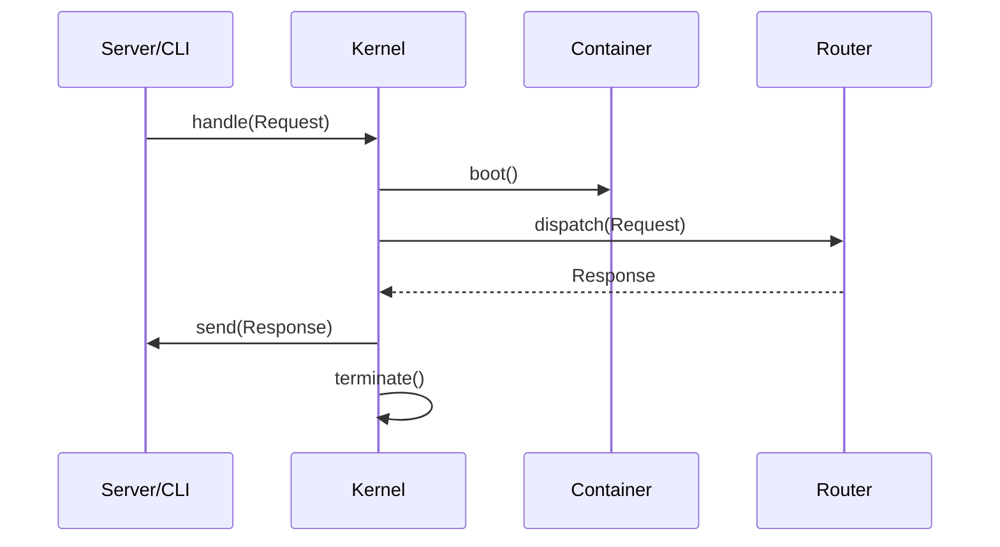

# PHASE CORE-18: Core Kernel & Lifecycle

## Tier
Core

## Component Name
The Sovereign Kernel

## Description
The final piece of the Core tier. The Kernel orchestrates the transition from a raw Request (CLI or Web) to a final Response. It manages the global lifecycle hooks and provides the high-level API for "running" the application.

## Context7 Research
- **Lifecycle Hooks**: Implements `before_boot`, `after_boot`, `before_request`, `after_request` events.

## Architectural Design
- **Kernel**: The main entry point.
- **Pipeline**: Passes the Request through Middleware, Router, and Controller.
- **Terminator**: Handles cleanup tasks (like flushing logs) after the response has been sent to the client.

### Lifecycle Diagram

## Integration Strategy
Combines all 17 previous phases into a single, cohesive "Application" object. This completes the Core tier.

## CI Verification Criteria
- **End-to-End**: A "Hello World" request must complete the entire cycle (Boot + Route + Response) in < 10ms.
- **Cleanliness**: The kernel must leave zero open resources (DB connections, file handles) after termination.

## SemVer Impact
**Major**. This marks the completion of the Core tier and the birth of a functional framework.