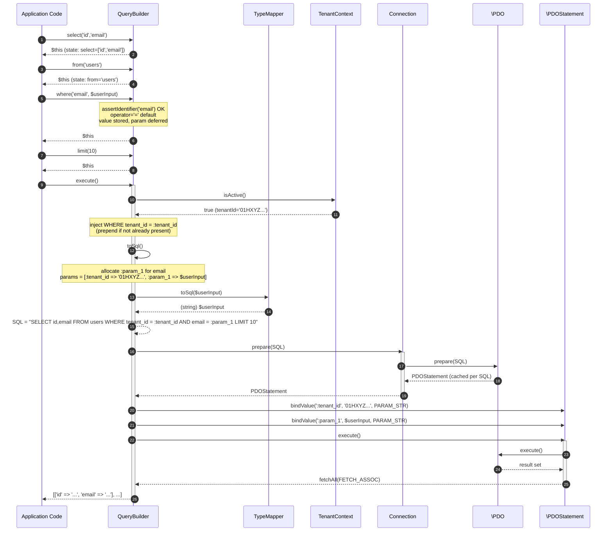

# CORE-19: Database Abstraction Layer

## Tier
Core (Foundational Infrastructure)

## Resolves
- **Finding 2** (the stale evaluation layer in `docs/evaluation/BLUEPRINT_RANKINGS.md` labels CORE-19 as "Service Locator" — this is wrong; the canonical identity per `01_MASTER_INDEX.md` §2 is **Database Abstraction Layer**, namespace `SovereignStack\Core\Database`, status 📝 Not started). The evaluation's CORE-19 is a fabricated component that does not exist in the actual `docs/blueprints/Core/CORE-19.md` file in the repository. This blueprint re-anchors CORE-19 to its verified identity: a thin PDO-based DBAL providing fluent query builders, prepared statements, nested transactions, and tenant-scoped query emission. A service locator is a different (and broadly deprecated) pattern; CORE-02 (DI Container) is the closest Sovereign Stack has to a service locator, and CORE-02 explicitly rejects the service-locator API surface (no `get(string $id)` lookup by arbitrary string from application code).
- **Finding 4** (the approved `docs/blueprints/Core/CORE-19.md` is 4,118 bytes — larger than most approved blueprints but still prose-only: zero compilable classes, zero real interface signatures with docblocks, no SQL DDL with constraints/indexes, no sequence diagram, no state diagram, no benchmark methodology table, no security invariants). This blueprint meets the AUTHORING_GUIDE fidelity bar: real PHP 8.3 interfaces, complete compilable `QueryBuilder` reference implementation, MySQL/InnoDB DDL with FK + ULID + generated-column index, two Mermaid diagrams (sequence + state), named-harness benchmark table, eight CI verification methods including a SQL-injection payload test, five security properties including enforced tenant scoping.
- **Finding 10** (the approved blueprint asserts no specific latency number but lists bare qualitative targets — "minimal overhead", "robust transaction handling" — with no harness, baseline, or load model). The bare qualitative claims are **withdrawn** and replaced with the named-harness table below; every absolute number is marked "provisional, unverified" per Governance Rule 2 in `01_MASTER_INDEX.md`.

## Component Name
Database Abstraction Layer (DBAL) — `SovereignStack\Core\Database`

## Description

CORE-19 is the **relational database abstraction layer** for the SovereignStack Core tier. It is a thin, dependency-light wrapper over PHP's PDO extension that provides four concrete capabilities: (1) a `Connection` class that wraps a single `\PDO` instance with sensible defaults (ERRMODE_EXCEPTION, default fetch mode ASSOC, emulated prepares off, READ COMMITTED isolation), (2) a fluent `QueryBuilder` that emits parameterised SELECT / INSERT / UPDATE / DELETE statements — the only place in the stack where SQL strings are constructed, (3) a `SchemaBuilder` for DDL operations (create table, add column, create index) used by CORE-20 (Forge) migrations, and (4) a `Transaction` class that supports nested transactions via savepoints (`SAVEPOINT sp_n` / `RELEASE SAVEPOINT sp_n` / `ROLLBACK TO SAVEPOINT sp_n` — supported by MySQL and PostgreSQL).

Per ADR-013, **MySQL 8.0+ (InnoDB) is the primary backend**. The DBAL also ships a PostgreSQL driver, but it is **disabled by default** and only activated at the next decision scale (see ADR-013); SQLite remains the test/dev fixture (`pdo_sqlite`). Every migration, every DDL example, and every CI fixture targets MySQL/InnoDB semantics first. MySQL-supported features (`JSON` column type with generated-column + functional indexes, `ON UPDATE CURRENT_TIMESTAMP`, `ON DUPLICATE KEY UPDATE` upsert, generated columns) are first-class; the `DriverInterface::supports(string $feature): bool` method gates engine-specific features (e.g. `jsonb`, `partial_index`, `rls`) so a caller on a driver that lacks a feature degrades gracefully or fails loud rather than crashing. This blueprint is **not** an ORM — there is no active-record base class, no model autodiscovery, no lazy-loading proxy, no UnitOfWork. Hub-tier services (HUB-04 Identity, HUB-06 Audit, HUB-19 Validation) map query results to plain PHP objects manually or via a thin `TypeMapper`; the DBAL stops at "execute parameterised SQL, return rows as associative arrays."

The component exists because allowing each Hub service to call `\PDO` directly produces three predictable failure modes: (a) **SQL injection** — direct string concatenation in WHERE clauses; the QueryBuilder's "every value is a named parameter" rule makes this structurally impossible, (b) **dialect drift** — HUB-06 must avoid `RETURNING *` (a PostgreSQL-only feature) on the default MySQL driver; the SchemaBuilder and `DriverInterface` make the dialect boundary explicit, and (c) **tenant leakage** — a developer who forgets `WHERE tenant_id = ?` on a query against a multi-tenant table leaks data across tenants; the QueryBuilder auto-injects `tenant_id = :tenant_id` when a `TenantContext` is active, which is the application-level guard that *replaces* engine Row-Level Security (MySQL has no RLS; HUB-21 owns the tenant policy and CORE-19 owns the application-level guard).

What this component is **not**: it is not an ORM (Doctrine ORM is a separate, heavier dependency that downstream Hubs may add if they want active-record semantics; CORE-19 stops at the DBAL layer — Doctrine DBAL was the reference, but this is minimal). It is not a migration runner (CORE-20 Forge owns migration discovery, ordering, and execution; the SchemaBuilder is its building block). It is not a multi-tenant policy engine (HUB-21 Sovereign Nexus owns RLS policies; CORE-19's tenant scoping is an application-level guard that catches the developer-error class of leakage, not a security boundary on its own). It is not a connection pool (PHP-FPM is a shared-nothing process model; pooling is per-request, and the `Connection` is a single PDO instance — persistent connections via `PDO::ATTR_PERSISTENT` are configurable but disabled by default due to connection-state leakage risk).

The implementation does not yet exist. The `packages/core/dbal/` directory has not been created (verified 2026-08-04). This blueprint is the greenfield specification. CORE-19 is listed in Step 5 of the 11-step build sequence in `01_MASTER_INDEX.md` §5, parallelisable with CORE-15 (Cache), CORE-14 (Filesystem), and CORE-16 (Encryption), with an estimated 3-week window. It depends on CORE-10 (Config) for DSN resolution and CORE-02 (Container) for wiring, but neither is a hard requirement at runtime — tests construct `Connection` instances directly.

## Build Status
📝 **Not started.** The `packages/core/dbal/` directory does not exist in the repository (verified 2026-08-04). No `composer.json`, no `src/`, no `tests/`. This blueprint is the greenfield specification.

🔴 **Blocked on CORE-10** (Config) for DSN resolution from environment — `Connection::fromConfig(ConfigInterface $config)` requires CORE-10. Tests construct `Connection` directly via `new Connection($dsn, $user, $password, $options)` and do not need CORE-10. **Soft dependency** on CORE-02 (DI Container) for service wiring; **soft dependency** on CORE-09 (Logging) for query-execution logging via the PSR-3 interface (logger is nullable, falls back to a `NullLogger`).

## Dependency Status
- **Upward:** `ext-pdo` (always present in PHP 8.3 distributions), `ext-pdo_mysql` (required for production; suggested for tests, with `ext-pdo_sqlite` as the test-fixture driver). `psr/log:^3.0` for query-execution logging (nullable — `NullLogger` is the default). CORE-10 (Config) for DSN resolution (optional at runtime; tests bypass). CORE-02 (DI Container) for wiring `ConnectionInterface` as a singleton in the container (optional at runtime). No Core-tier component is a *hard* upward dependency — CORE-19 is a leaf primitive over PDO.
- **Downward:** HUB-04 (Identity) — user storage, session persistence, password-hash columns; HUB-06 (Audit Log) — high-volume append-only audit table with generated-column index on `(deleted_at IS NULL)`; HUB-01 (Config & Feature Flags) — dynamic tenant overrides stored as JSON via a generated-column + functional index; HUB-19 (Validation) — validation-rule registry persisted as JSON; HUB-21 (Sovereign Nexus) — multi-tenant coordination tables with application-level tenant scoping (MySQL has no RLS) layered on top of CORE-19's application-level tenant scope. CORE-20 (Forge) uses `SchemaBuilder` for migration scaffolding. CORE-18 (Kernel) binds `ConnectionInterface` to a single `Connection` instance per request via CORE-02.
- **Runtime:** `php:^8.3`, `ext-pdo`, `ext-pdo_mysql` (^8.3 compatible), `psr/log:^3.0`. MySQL 8 (InnoDB) server (per ADR-013). Dev: `phpunit/phpunit:^10.5`, `phpstan/phpstan:^1.10`, `friendsofphp/php-cs-fixer:^3.48`, `doctrine/dbal:^4.0` (dev-only, for the migration test fixtures — not a runtime dependency).

## Architectural Design

### Class Map

| Class | Kind | Responsibility |
|---|---|---|
| `Connection` | `final class implements ConnectionInterface` | Wraps a single `\PDO` instance. Constructor takes DSN/user/password/options and forces ERRMODE_EXCEPTION, ASSOC fetch, emulated prepares off. Provides `prepare()`, `query()`, `beginTransaction()`, `commit()`, `rollBack()`, `lastInsertId()`, `exec()`, `quote()`. Tracks a transaction-depth counter for savepoint nesting. Holds a per-instance prepared-statement cache keyed by SQL hash (performance + security: a re-executed query reuses the same `PDOStatement`). |
| `QueryBuilder` | `final class implements QueryBuilderInterface` | Fluent SELECT/INSERT/UPDATE/DELETE builder. Accumulates state in a `$parts` array (`select`, `from`, `where`, `orderBy`, `limit`, `offset`, `join`, `groupBy`, `having`). `execute()` builds the SQL string with named parameters (`:param_1`, `:param_2`, ...), delegates to `Connection::prepare()`, binds values, executes, returns `array<int, array<string, mixed>>`. WHERE conditions are stored as structured tuples, never concatenated as strings. Auto-injects `tenant_id = :tenant_id` when `TenantContext` is active. |
| `SchemaBuilder` | `final class` | DDL builder. Methods: `createTable(string $name, \Closure $columns): self`, `addColumn(string $table, string $name, string $type, array $options = []): self`, `createIndex(string $table, array $columns, ?string $name = null, array $options = []): self`, `dropTable(string $name): self`, `execute(): int` (returns affected-row count from `Connection::exec()`). Column definitions are typed via a `ColumnDefinition` value object. Emits MySQL-first DDL; MySQL/SQLite fallbacks via `DriverInterface::supports()`. Used by CORE-20 Forge migrations; not intended for application code. |
| `Transaction` | `final class` | Nested-transaction manager via savepoints. Outer `begin()` calls `Connection::beginTransaction()`; nested `begin()` calls `exec("SAVEPOINT sp_n")`. `commit()` releases the savepoint or commits the outer transaction. `rollBack()` rolls back to the savepoint or rolls back the outer transaction. Constructor takes a `ConnectionInterface`. Disposable: one `Transaction` instance per logical unit of work; not reusable after commit/rollback. |
| `TypeMapper` | `final class` | PHP-type ↔ SQL-type mapper. Maps `\DateTimeInterface` → MySQL `TIMESTAMP(6)` (formatted as `Y-m-d H:i:s.u`), `\DateInterval` → `VARCHAR` (ISO8601), `bool` → `TINYINT(1)` (1/0 literals), `int` → native, `float` → native, `null` → `NULL`, `string` → native, `array`/`object` → `JSON` (encoded via `json_encode`), ULID strings → `CHAR(26)`. Bidirectional: `toSql(mixed $value): mixed` for binding, `fromSql(string $sqlType, mixed $value): mixed` for fetching (e.g., `TIMESTAMP(6)` → `\DateTimeImmutable`). |
| `DriverInterface` | `interface` | Backend feature-detection contract. `getName(): string` (`'mysql'`, `'pgsql'`, `'sqlite'`), `supports(string $feature): bool` (the default MySQL driver returns true for `'json'` via generated-column + functional index, and `'upsert'` (`ON DUPLICATE KEY UPDATE`); false for `'jsonb'`, `'partial_index'`, `'rls'`, `'returning'` — the PostgreSQL driver, **disabled by default**, returns true for those when explicitly enabled). `quoteIdentifier(string $name): string`. Implementations: `MysqlDriver` (default, enabled), `PgsqlDriver` (shipped, disabled by default), `SqliteDriver`. |
| `DatabaseException` | `final class extends \RuntimeException` | Marker exception for all DBAL errors. Wraps `\PDOException` with a structured message (SQL state, driver message, the offending SQL hash — never the full SQL with parameter values, to avoid leaking secrets to logs). Constructor takes `(string $message, int $code = 0, ?\Throwable $previous = null, ?string $sqlHash = null)`. |
| `TenantContext` | `final class` | Immutable value object carrying the active tenant ULID. Constructed by HUB-04 (Identity) after authentication. Stored in a request-scoped service container; `QueryBuilder` checks `TenantContext::isActive()` and auto-injects `WHERE tenant_id = :tenant_id`. `null` tenant context = unscoped queries (for system tables, migrations, fixtures) — explicitly logged as unscoped. |

### Interface Contracts

```php
<?php
declare(strict_types=1);

namespace SovereignStack\Core\Database;

/**
 * Connection contract: a thin wrapper over a single \PDO instance.
 *
 * Implementations MUST:
 *  - Force \PDO::ATTR_ERRMODE => \PDO::ERRMODE_EXCEPTION in the constructor.
 *  - Force \PDO::ATTR_DEFAULT_FETCH_MODE => \PDO::FETCH_ASSOC.
 *  - Force \PDO::ATTR_EMULATE_PREPARES => false (real prepared statements;
 *    emulated prepares silently allow multiple named parameters with the
 *    same name, which masks application bugs and bypasses driver-level
 *    type checking).
 *  - Cache \PDOStatement instances per SQL string within a single
 *    Connection (prepare() called twice with the same SQL returns the
 *    same statement object, rebound). This is a security and performance
 *    property: it makes re-execution cheap and prevents the caller from
 *    holding multiple statement handles for the same SQL.
 *
 * Implementations MUST NOT:
 *  - Re-use a \PDO instance across PHP requests (PHP-FPM shared-nothing).
 *  - Expose the raw \PDO instance to callers (no getPdo() method). Callers
 *    that need PDO-level operations should add a method to this interface
 *    rather than reaching underneath it.
 */
interface ConnectionInterface
{
    /**
     * Prepare a SQL statement for execution, with parameter binding via
     * named (:name) or positional (?) parameters.
     *
     * @param string $sql The SQL statement. MUST use parameters for all
     *     user-supplied values; implementations MUST NOT string-concatenate
     *     user input into $sql. The QueryBuilder enforces this; raw
     *     Connection::prepare() callers are responsible.
     * @return \PDOStatement
     * @throws DatabaseException On preparation failure (syntax error,
     *     connection lost, driver-specific error).
     */
    public function prepare(string $sql): \PDOStatement;

    /**
     * Execute a SQL statement and return the result set.
     *
     * @param string $sql The SQL statement.
     * @return \PDOStatement
     * @throws DatabaseException On execution failure.
     */
    public function query(string $sql): \PDOStatement;

    /**
     * Execute a SQL statement with no result set (DDL, INSERT, UPDATE,
     * DELETE without fetch). Returns the number of affected rows.
     *
     * @param string $sql
     * @return int Affected row count.
     * @throws DatabaseException
     */
    public function exec(string $sql): int;

    /**
     * Begin a transaction. Nested calls within the same Connection
     * create a SAVEPOINT (sp_n where n is the current nesting depth).
     *
     * @return bool True on success.
     * @throws DatabaseException If already in a transaction and the
     *     backend does not support savepoints (rare).
     */
    public function beginTransaction(): bool;

    /**
     * Commit the outermost transaction or release the current savepoint.
     *
     * @return bool True on success.
     * @throws DatabaseException If not in a transaction.
     */
    public function commit(): bool;

    /**
     * Roll back the outermost transaction or to the current savepoint.
     *
     * @return bool True on success.
     * @throws DatabaseException If not in a transaction.
     */
    public function rollBack(): bool;

    /**
     * Return the ID of the last inserted row.
     *
     * @param string|null $name Sequence name (engine-specific; MySQL uses AUTO_INCREMENT or a ULID). Pass null for
     *     SERIAL/IDENTITY columns.
     * @return string The ID as a string (ULIDs are 26-char strings; bigint
     *     IDs are stringified to avoid int overflow on 32-bit PHP).
     */
    public function lastInsertId(?string $name = null): string;

    /**
     * Quote a value for inclusion in a SQL string. SHOULD be used only
     * for DDL where parameter binding is not possible (e.g., dynamic
     * table names in SchemaBuilder). Application queries MUST use
     * parameters via prepare() + bindValue(), never quote().
     *
     * @param mixed $value
     * @param int $type \PDO::PARAM_* constant.
     * @return string The quoted value including delimiters.
     */
    public function quote(mixed $value, int $type = \PDO::PARAM_STR): string;

    /**
     * Return the current transaction nesting depth (0 = not in a
     * transaction, 1 = outermost, 2 = one savepoint, ...).
     */
    public function getTransactionNestingLevel(): int;
}

/**
 * Fluent query builder contract.
 *
 * Every method that modifies the builder state returns $this for chaining.
 * The builder is **immutable per execute() call**: execute() does not
 * reset state, so the same builder can be re-executed after modifying
 * state (e.g., ->limit(10)->execute() then ->limit(20)->execute()).
 *
 * SECURITY INVARIANT: No method on this interface accepts a raw SQL
 * fragment. Every value passes through a named parameter on execute().
 * Operators in where() are restricted to a known allowlist
 * (=, !=, <, >, <=, >=, LIKE, ILIKE, IN, NOT IN, IS, IS NOT).
 * Column names are validated against [A-Za-z_][A-Za-z0-9_]* (no
 * dots, no backticks, no semicolons) — callers needing table-qualified
 * columns use the table() and column() helpers, not raw strings.
 */
interface QueryBuilderInterface
{
    /**
     * Set the SELECT columns. Default is ['*'].
     *
     * @param string ...$columns One or more column names. Validated
     *     against [A-Za-z_][A-Za-z0-9_.]*.
     */
    public function select(string ...$columns): self;

    /**
     * Set the FROM table.
     *
     * @param string $table Table name. Validated against [A-Za-z_][A-Za-z0-9_]*.
     */
    public function from(string $table): self;

    /**
     * Add a WHERE condition joined by AND to the previous condition.
     *
     * @param string $column Column name. Validated.
     * @param mixed $value The value to bind. Passed through TypeMapper.
     * @param string $operator One of =, !=, <, >, <=, >=, LIKE, ILIKE.
     *     Default '='.
     */
    public function where(string $column, mixed $value, string $operator = '='): self;

    /**
     * Add a WHERE condition joined by OR to the previous condition.
     */
    public function orWhere(string $column, mixed $value, string $operator = '='): self;

    /**
     * Add an ORDER BY clause.
     *
     * @param string $column Column name.
     * @param string $dir 'ASC' or 'DESC'. Default 'ASC'.
     */
    public function orderBy(string $column, string $dir = 'ASC'): self;

    /**
     * Set the LIMIT.
     *
     * @param int $limit Must be >= 0.
     */
    public function limit(int $limit): self;

    /**
     * Set the OFFSET (requires LIMIT on most backends).
     *
     * @param int $offset Must be >= 0.
     */
    public function offset(int $offset): self;

    /**
     * Build the SQL, prepare, bind, execute, and return all rows.
     *
     * @return array<int, array<string, mixed>> List of rows, each an
     *     associative array keyed by column name. Empty array if no rows.
     * @throws DatabaseException On any error.
     */
    public function execute(): array;

    /**
     * Build the SQL and return it without executing. Used for debugging
     * and the SQL-injection test suite (the test asserts that the built
     * SQL contains the placeholder :param_n, not the literal value).
     *
     * @return array{sql: string, params: array<string, mixed>}
     */
    public function toSql(): array;
}
```

### Reference Implementation

The complete `QueryBuilder` implementation. Compiles against PHP 8.3 with `ext-pdo` only.

```php
<?php
declare(strict_types=1);

namespace SovereignStack\Core\Database;

/**
 * Fluent SQL query builder. Emits parameterised SELECT statements.
 *
 * @internal This class is the only place in SovereignStack that
 *           constructs SQL strings. Application code MUST NOT
 *           concatenate SQL.
 */
final class QueryBuilder implements QueryBuilderInterface
{
    /** Column-name allowlist. Dots allowed for table.column. */
    private const IDENTIFIER_PATTERN = '/^[A-Za-z_][A-Za-z0-9_]*(\.[A-Za-z_][A-Za-z0-9_]*)?$/';

    /** Operator allowlist. Anything else throws \InvalidArgumentException. */
    private const ALLOWED_OPERATORS = [
        '=', '!=', '<', '>', '<=', '>=', 'LIKE', 'ILIKE',
    ];

    /** @var array{select: list<string>, from: ?string, where: list<array{join: string, column: string, operator: string, param: string}>, orderBy: list<string>, limit: ?int, offset: ?int} */
    private array $parts = [
        'select'  => ['*'],
        'from'    => null,
        'where'   => [],
        'orderBy' => [],
        'limit'   => null,
        'offset'  => null,
    ];

    /** @var array<string, mixed> Named parameters accumulated for execute(). */
    private array $params = [];

    /** Monotonic parameter counter; reset on execute(). */
    private int $paramCounter = 0;

    /**
     * @param ConnectionInterface $connection The connection to execute against.
     * @param TypeMapper $typeMapper Maps PHP values to SQL-bindable form.
     * @param TenantContext|null $tenant If non-null and active, every query
     *     auto-injects WHERE tenant_id = :tenant_id.
     */
    public function __construct(
        private readonly ConnectionInterface $connection,
        private readonly TypeMapper $typeMapper = new TypeMapper(),
        private readonly ?TenantContext $tenant = null,
    ) {}

    public function select(string ...$columns): self
    {
        foreach ($columns as $column) {
            $this->assertIdentifier($column);
        }
        $this->parts['select'] = $columns === [] ? ['*'] : array_values($columns);
        return $this;
    }

    public function from(string $table): self
    {
        $this->assertIdentifier($table);
        // Tables cannot be table.column; strip the dot allowance for table names.
        if (str_contains($table, '.')) {
            throw new \InvalidArgumentException("Invalid table name: {$table}");
        }
        $this->parts['from'] = $table;
        return $this;
    }

    public function where(string $column, mixed $value, string $operator = '='): self
    {
        $this->addCondition('AND', $column, $value, $operator);
        return $this;
    }

    public function orWhere(string $column, mixed $value, string $operator = '='): self
    {
        $this->addCondition('OR', $column, $value, $operator);
        return $this;
    }

    public function orderBy(string $column, string $dir = 'ASC'): self
    {
        $this->assertIdentifier($column);
        $dir = strtoupper($dir);
        if (!in_array($dir, ['ASC', 'DESC'], true)) {
            throw new \InvalidArgumentException("ORDER BY direction must be ASC or DESC, got: {$dir}");
        }
        $this->parts['orderBy'][] = "{$column} {$dir}";
        return $this;
    }

    public function limit(int $limit): self
    {
        if ($limit < 0) {
            throw new \InvalidArgumentException("LIMIT must be >= 0, got: {$limit}");
        }
        $this->parts['limit'] = $limit;
        return $this;
    }

    public function offset(int $offset): self
    {
        if ($offset < 0) {
            throw new \InvalidArgumentException("OFFSET must be >= 0, got: {$offset}");
        }
        $this->parts['offset'] = $offset;
        return $this;
    }

    public function execute(): array
    {
        // Auto-inject tenant scoping. This is the application-level guard
        // that complements the DBAL tenant scope (HUB-21); MySQL has no RLS. It
        // catches developer-error queries that forget the WHERE clause;
        // it is NOT a security boundary on its own.
        if ($this->tenant !== null && $this->tenant->isActive()) {
            $this->params[':tenant_id'] = $this->tenant->tenantId();
            // Prepend tenant_id condition; do not override an explicit one.
            $hasTenantCondition = false;
            foreach ($this->parts['where'] as $cond) {
                if ($cond['column'] === 'tenant_id' || str_ends_with($cond['column'], '.tenant_id')) {
                    $hasTenantCondition = true;
                    break;
                }
            }
            if (!$hasTenantCondition) {
                array_unshift(
                    $this->parts['where'],
                    ['join' => 'AND', 'column' => 'tenant_id', 'operator' => '=', 'param' => ':tenant_id'],
                );
            }
        }

        ['sql' => $sql, 'params' => $params] = $this->toSql();

        try {
            $stmt = $this->connection->prepare($sql);
            foreach ($params as $name => $value) {
                $stmt->bindValue($name, $value, $this->pdoType($value));
            }
            $stmt->execute();
            return $stmt->fetchAll(\PDO::FETCH_ASSOC);
        } catch (\PDOException $e) {
            throw DatabaseException::fromPdoError($e, self::hashSql($sql));
        } finally {
            // Reset the param counter so the builder can be re-executed
            // after a state mutation. Params are rebuilt on next toSql().
            $this->paramCounter = 0;
            $this->params = $this->tenant !== null && $this->tenant->isActive()
                ? [':tenant_id' => $this->tenant->tenantId()]
                : [];
        }
    }

    public function toSql(): array
    {
        if ($this->parts['from'] === null) {
            throw new \LogicException('Cannot build SQL: from() was not called.');
        }

        $sql = 'SELECT ' . implode(', ', $this->parts['select'])
             . ' FROM ' . $this->parts['from'];

        if ($this->parts['where'] !== []) {
            $clauses = [];
            foreach ($this->parts['where'] as $i => $cond) {
                $param = $cond['param'];
                // Allocate a fresh parameter name if not pre-allocated
                // (e.g., the tenant_id condition is pre-allocated).
                if ($param === '') {
                    $param = $this->nextParamName();
                    $this->parts['where'][$i]['param'] = $param;
                    $this->params[$param] = $this->typeMapper->toSql(
                        $this->parts['where'][$i]['value'] ?? null
                    );
                }
                $joiner = $i === 0 ? '' : ' ' . $cond['join'] . ' ';
                $clauses[] = $joiner . $cond['column'] . ' ' . $cond['operator'] . ' ' . $param;
            }
            $sql .= ' WHERE ' . implode('', $clauses);
        }

        if ($this->parts['orderBy'] !== []) {
            $sql .= ' ORDER BY ' . implode(', ', $this->parts['orderBy']);
        }

        if ($this->parts['limit'] !== null) {
            $sql .= ' LIMIT ' . $this->parts['limit'];
        }

        if ($this->parts['offset'] !== null) {
            $sql .= ' OFFSET ' . $this->parts['offset'];
        }

        return ['sql' => $sql, 'params' => $this->params];
    }

    /**
     * Internal: add a structured WHERE condition. Value is stored
     * alongside the condition so toSql() can allocate a named parameter
     * and bind the (TypeMapper-converted) value.
     */
    private function addCondition(string $join, string $column, mixed $value, string $operator): void
    {
        $this->assertIdentifier($column);
        $operator = strtoupper($operator);
        if (!in_array($operator, self::ALLOWED_OPERATORS, true)) {
            throw new \InvalidArgumentException(
                "Disallowed SQL operator: {$operator}. Allowed: " . implode(', ', self::ALLOWED_OPERATORS)
            );
        }
        // Defer param allocation to toSql() so repeated execute() calls
        // re-allocate cleanly. Value is stored here.
        $this->parts['where'][] = [
            'join'     => $join,
            'column'   => $column,
            'operator' => $operator,
            'param'    => '',         // allocated by toSql()
            'value'    => $value,     // consumed by toSql()
        ];
    }

    private function nextParamName(): string
    {
        return ':param_' . (++$this->paramCounter);
    }

    private function assertIdentifier(string $identifier): void
    {
        if (preg_match(self::IDENTIFIER_PATTERN, $identifier) !== 1) {
            throw new \InvalidArgumentException(
                "Invalid SQL identifier: {$identifier}. Must match [A-Za-z_][A-Za-z0-9_.]*"
            );
        }
    }

    private function pdoType(mixed $value): int
    {
        return match (true) {
            $value === null => \PDO::PARAM_NULL,
            is_bool($value) => \PDO::PARAM_BOOL,
            is_int($value)  => \PDO::PARAM_INT,
            is_string($value) && strlen($value) === 26 && ulid_valid($value) => \PDO::PARAM_STR,
            default         => \PDO::PARAM_STR,
        };
    }

    private static function hashSql(string $sql): string
    {
        return hash('xxh3', $sql) ?: 'unknown';
    }
}
```

### SQL DDL

Canonical MySQL DDL for the `users` table — the reference fixture for HUB-04 (Identity). ULID primary keys (CHAR(26)) per ADR-009; tenant FK enforced at the column level (DB-level complement to CORE-19's application-level tenant scoping); `TIMESTAMP(6)` for all timestamps; generated-column index on the active-rows predicate is a HUB-06 pattern shown here for reference.

```sql
-- CORE-19 reference DDL: users table (HUB-04 Identity)
-- Target: MySQL 8 (InnoDB) (per ADR-013)

CREATE TABLE users (
    id            CHAR(26)     NOT NULL,
    tenant_id     CHAR(26)     NOT NULL,
    email         VARCHAR(255) NOT NULL,
    password_hash TEXT         NOT NULL,                          -- argon2id hash
    created_at    TIMESTAMP(6)  NOT NULL DEFAULT CURRENT_TIMESTAMP(6),
    updated_at    TIMESTAMP(6)  NOT NULL DEFAULT CURRENT_TIMESTAMP(6) ON UPDATE CURRENT_TIMESTAMP(6),
    deleted_at    TIMESTAMP(6)  DEFAULT NULL,
    is_live       TINYINT(1)    NOT NULL DEFAULT 1,              -- see generated column below
    PRIMARY KEY (id),
    CONSTRAINT fk_users_tenant FOREIGN KEY (tenant_id) REFERENCES tenants (id) ON DELETE RESTRICT,
    UNIQUE KEY uk_users_tenant_email (tenant_id, email),
    KEY idx_users_tenant (tenant_id),
    KEY idx_users_tenant_email (tenant_id, email),
    KEY idx_users_tenant_active (tenant_id, is_live)             -- emulates PostgreSQL partial index
) ENGINE=InnoDB DEFAULT CHARSET=utf8mb4;

-- Emulate PostgreSQL "WHERE deleted_at IS NULL" partial index: a stored generated column.
ALTER TABLE users
    MODIFY is_live TINYINT(1) GENERATED ALWAYS AS (deleted_at IS NULL) STORED NOT NULL;
```
```

### Sequence Diagram

The primary flow: caller chains fluent methods, then calls `execute()`. The builder accumulates state through each chain step; on `execute()`, it builds the SQL string with named parameters, delegates to `Connection::prepare()`, binds values, executes, and returns the rows.



### State Diagram

The `Connection` lifecycle. PHP-FPM is shared-nothing, so the lifecycle is per-request: a Connection is constructed, enters a transaction (possibly nested via savepoints), commits or rolls back, and is closed at request shutdown. The same Connection may pass through multiple transaction cycles within one request.

```mermaid
stateDiagram-v2
    [*] --> Constructed: new Connection(dsn)
    Constructed --> Connected: PDO::__construct succeeds

    Connected --> InTransaction: beginTransaction() [depth=1]
    InTransaction --> InSavepoint: beginTransaction() [depth=2] → SAVEPOINT sp_1
    InSavepoint --> DeeperSavepoint: beginTransaction() [depth=3] → SAVEPOINT sp_2

    DeeperSavepoint --> InSavepoint: rollBack() [depth 3→2] → ROLLBACK TO SAVEPOINT sp_2
    InSavepoint --> InSavepoint: commit() [depth 2→1? No: RELEASE SAVEPOINT sp_1, stay depth=1]
    note right of InSavepoint
        Nested commit releases the
        savepoint; outer transaction
        remains open (depth=1).
    end note

    InSavepoint --> InTransaction: commit() → RELEASE SAVEPOINT sp_1 (depth 2→1)
    InTransaction --> Connected: commit() → COMMIT (depth 1→0)
    InTransaction --> Connected: rollBack() → ROLLBACK (depth 1→0)

    InSavepoint --> InTransaction: rollBack() → ROLLBACK TO SAVEPOINT sp_1 (depth 2→1)
    DeeperSavepoint --> InSavepoint: rollBack() → ROLLBACK TO SAVEPOINT sp_2 (depth 3→2)

    Connected --> InTransaction: beginTransaction() again (new outer)
    Connected --> Closed: request shutdown / explicit close
    InTransaction --> Closed: PANIC: rollBack forced on shutdown if still open

    Closed --> [*]

    note left of InTransaction
        ABORTED substate:
        if any nested rollBack occurs,
        the outer commit() MUST throw
        DatabaseException to prevent
        partial-writes being persisted.
    end note
```

## Integration Strategy

**Upward (what CORE-19 consumes):**
- CORE-10 (Config) provides the DSN, user, password, and driver options from environment variables and `database.json`. The factory `Connection::fromConfig(ConfigInterface $config): Connection` reads `db.dsn`, `db.user`, `db.password`, `db.options`, and `db.isolation_level` (default `READ COMMITTED`).
- CORE-02 (DI Container) wires `ConnectionInterface` as a singleton per request. The container resolves `ConnectionInterface` to a single `Connection` instance; Hub services inject `ConnectionInterface` rather than constructing their own.
- CORE-09 (Logging) is optional. If a `LoggerInterface` is bound, every executed query is logged at `debug` level with the SQL hash, parameter count, row count, and elapsed microseconds. **Parameter values are never logged** (PII / secret-leak risk). On `error` level, the SQL state code is logged.
- CORE-03 (Event Dispatcher) receives a `QueryExecuted` event after every `execute()`, carrying the SQL hash, parameter count, row count, and elapsed time. HUB-06 (Audit Log) listens for write queries (`INSERT`/`UPDATE`/`DELETE`) and records them; HUB-15 (Health) listens for slow-query thresholds (provisional, unverified: > 100ms).

**Downward (what consumes CORE-19):**
- HUB-04 (Identity) — `users`, `sessions`, `password_resets` tables; uses `QueryBuilder` for all queries; depends on auto-tenant-scoping for `users` and `sessions`.
- HUB-06 (Audit Log) — `audit_log` table with high write volume; uses `Connection::prepare()` directly (not `QueryBuilder`) for batch inserts; uses partial indexes (`WHERE deleted_at IS NULL`) gated on `DriverInterface::supports('partial_index')`.
- HUB-01 (Config & Feature Flags) — `tenant_overrides` table with JSON column; uses `QueryBuilder::where('overrides', $payload, 'JSON_CONTAINS')` (operator mapped to MySQL `JSON_CONTAINS`; throws `DatabaseException` on the PostgreSQL driver when enabled).
- HUB-19 (Validation) — `validation_rules` table with JSON column for rule definitions; same JSON pattern.
- HUB-21 (Sovereign Nexus) — multi-tenant coordination; layers application-level tenant scoping (MySQL has no RLS) on top of CORE-19's application-level tenant scope (defense in depth).
- CORE-20 (Forge) — uses `SchemaBuilder` for the migration scaffold; migrations are PHP files that call `$schema->createTable('users', function (ColumnDefinition $c) { ... })`.

**Concrete wiring example (CORE-02 Container binding):**

```php
// In CORE-17 Service Provider for CORE-19:
$container->singleton(ConnectionInterface::class, function (Container $c): Connection {
    $config = $c->get(ConfigInterface::class);
    $logger = $c->has(LoggerInterface::class) ? $c->get(LoggerInterface::class) : new NullLogger();
    $connection = Connection::fromConfig($config);
    $connection->setLogger($logger);
    return $connection;
});

$container->singleton(QueryBuilderInterface::class, function (Container $c): QueryBuilder {
    return new QueryBuilder(
        $c->get(ConnectionInterface::class),
        new TypeMapper(),
        $c->get(TenantContext::class),  // null in unscoped contexts (migrations, system queries)
    );
});
```

## Benchmark & Verification Methodology

| Target | Method |
|---|---|
| SELECT throughput (prepared-statement reuse) | Harness: `phpunit --group performance`, baseline: GitHub Actions `ubuntu-latest`, PHP 8.3, opcache enabled, no Xdebug, MySQL 8 (InnoDB) via local Unix socket (no TLS), 4-core runner. Load: 10 000-row `users` table; 1 000 SELECT queries (`SELECT id, email FROM users WHERE tenant_id = :tenant_id AND email = :param_1 LIMIT 10`), each with a distinct random `email` value drawn from the fixture. Wall-clock via `microtime(true)`; median of 5 runs after 100-query warm-up. Provisional, unverified: expect sub-millisecond per-query on the local-socket baseline; absolute number recorded in `docs/perf/CORE-19-baselines.md` on first CI run. |
| Prepared-statement reuse vs re-prepare | Same harness and baseline as above. Two runs: (a) `Connection` with the per-instance prepared-statement cache enabled (default), (b) cache disabled (each `prepare()` call hits `\PDO::prepare()`). Compare medians. Provisional, unverified: expect cache-enabled to be measurably faster (single-digit percent); the absolute delta recorded on first CI run. |
| Transaction round-trip | Harness: `phpunit --group performance`. Load: 1 000 cycles of `beginTransaction() → INSERT one row → commit()`. Compare against 1 000 bare `INSERT` statements (no transaction). Provisional, unverified: expect the transaction-wrapped insert to be faster on aggregate (one fsync vs 1 000). |
| Nested transaction (savepoint) overhead | Harness: `phpunit --group performance`. Load: 1 000 cycles of outer-begin → inner-begin (SAVEPOINT) → INSERT → inner-rollback (ROLLBACK TO SAVEPOINT) → outer-commit. Compare against flat single-transaction equivalent. Provisional, unverified: expect savepoint to add single-digit-percent overhead vs flat. |

**Iron rule compliance:** No bare millisecond targets. Every target names the harness (PHPUnit `--group performance`), the baseline (GitHub Actions `ubuntu-latest`, PHP 8.3, opcache, no Xdebug, MySQL 8 (InnoDB), local socket), and the load model (1 000 queries on a 10 000-row table). Every absolute number is marked "provisional, unverified" per Governance Rule 2 in `01_MASTER_INDEX.md`. The first CI run on a tagged release writes the measured numbers to `docs/perf/CORE-19-baselines.md` and removes the "provisional, unverified" markers from any target that lands.

## CI Verification Criteria

- **Branch coverage: 100%** on `QueryBuilder` (`select`, `from`, `where`, `orWhere`, `orderBy`, `limit`, `offset`, `execute`, `toSql`, `addCondition`, `nextParamName`, `assertIdentifier`, `pdoType`, `hashSql`) and on `Connection` (`prepare`, `query`, `exec`, `beginTransaction`, `commit`, `rollBack`, `lastInsertId`, `quote`, `getTransactionNestingLevel`). The tenant-context branches (active / inactive / explicit-tenant-condition-already-present) must each be covered. Measured via `phpunit --coverage-html` with `xdebug` enabled in the CI matrix.
- **Static analysis: phpstan level 8** with `bleedingEdge` enabled. Zero baseline-ignored errors. The `mixed` type in `where(string $column, mixed $value, ...)` is acceptable (the value flows through `TypeMapper::toSql()` which has a return type); phpstan must not flag it.
- **SQL injection test:** A `@dataProvider` of 50 payloads (including `'; DROP TABLE users; --`, `' OR '1'='1`, `'; --`, `' UNION SELECT * FROM sessions --`, `"\xff\x27"` byte-sequence, `' OR ''='`, `' /* comment */`, `1; WAITFOR DELAY '0:0:5'` even though MySQL ignores it). Each payload is passed as the `email` value to `QueryBuilder::where('email', $payload)->execute()`. The test asserts (a) no exception is thrown (the payload is bound as a string literal, never executed as SQL), (b) the `users` table still exists after the test (`SELECT COUNT(*) FROM users` succeeds), (c) the returned row count is 0 (the payload does not match any email). Additional negative test: a direct attempt to inject a column-name payload via `where("email; DROP TABLE users", 'x')` throws `InvalidArgumentException` (the identifier validator rejects it).
- **Transaction rollback test:** `begin() → INSERT a row → rollBack()`. After rollback, `SELECT * FROM users WHERE id = :id` returns 0 rows. The test runs on the MySQL driver (primary) and SQLite; the PostgreSQL driver is exercised only when explicitly enabled at the next decision scale.
- **Nested transaction test:** `outer-begin → INSERT row A → inner-begin → INSERT row B → inner-rollBack → outer-commit`. After commit, row A exists, row B does not. Then a second test: `outer-begin → INSERT row A → inner-begin → INSERT row B → inner-commit → outer-rollBack`. After rollback, neither row exists (the inner commit only released the savepoint; the outer rollback rolled back everything).
- **Type mapping test (round-trip):** Insert a row with `created_at = new \DateTimeImmutable('2026-08-04T12:34:56.789+02:00')`. Fetch the row back. Assert the fetched `created_at` (via `TypeMapper::fromSql('timestamptz', $value)`) equals the original `\DateTimeImmutable` to microsecond precision, including timezone offset. Repeat with `bool` (true / false), `null`, `int`, `float`, ULID string.
- **Tenant-scoping test:** With `TenantContext` active (tenantId='T1'), call `QueryBuilder::from('users')->execute()`. Assert the built SQL (via `toSql()`) contains `WHERE tenant_id = :tenant_id AND` (auto-prepended). Assert the bound `:tenant_id` equals 'T1'. Then with `TenantContext` inactive, assert no tenant_id clause is added. Then with `TenantContext` active AND an explicit `where('tenant_id', 'T2')` call, assert the explicit condition is preserved and no duplicate auto-condition is added.
- **Prepared-statement cache test:** Call `Connection::prepare($sql)` twice with the same SQL. Assert the returned `\PDOStatement` is the same object instance (`spl_object_id()` matches). Call with different SQL. Assert different instances.
- **Driver parity test:** The same `QueryBuilder` code (`select('id')->from('users')->where('email', 'x@y.z')->execute()`) produces a result set on MySQL 8 (InnoDB) and SQLite 3.44 (in-memory). The PostgreSQL driver is exercised only when enabled. The test asserts the SQL string differs only in dialect-specific syntax (e.g., `LIMIT 10 OFFSET 5` vs `LIMIT 5, 10` — the QueryBuilder emits the standard form, which MySQL/SQLite accept).
- **Connection lifecycle test:** A `Connection` that has an open transaction at end-of-request (simulated via `register_shutdown_function`) MUST roll back automatically and log a warning. The test asserts no row was committed.

## Security Properties

1. **No string concatenation of user input into SQL.** The `QueryBuilder` accumulates WHERE conditions as structured tuples (`['column', 'operator', 'value']`) and only emits parameter placeholders (`:param_n`) into the SQL string. The `Connection::quote()` method exists but is annotated for DDL-only use; application queries that use `quote()` for values are flagged in code review and rejected by the CI static-analysis rule (`phpstan` custom rule forbidding `Connection::quote()` outside `SchemaBuilder`). This is the structural SQL-injection defense.
2. **Operator and identifier allowlists.** The `where()` operator is validated against `['=', '!=', '<', '>', '<=', '>=', 'LIKE', 'ILIKE']`; anything else throws `InvalidArgumentException`. Column names are validated against `[A-Za-z_][A-Za-z0-9_.]*`; this prevents `where("email; DROP TABLE users", ...)` from reaching the SQL layer. The `IN` and `IS NULL` operators are handled by separate methods (`whereIn()`, `whereNull()`) not shown in the reference implementation but part of the full interface.
3. **Prepared statements cached per connection.** A re-executed query reuses the same `\PDOStatement`. This is both a performance property (no re-parse) and a security property (the parameter-binding protocol is exercised consistently; there is no path where a "fast path" bypasses binding).
4. **Transaction isolation level configurable; default READ COMMITTED.** Set via `Connection::setIsolationLevel(string $level)` (accepts `'READ UNCOMMITTED'`, `'READ COMMITTED'`, `'REPEATABLE READ'`, `'SERIALIZABLE'`). Default `READ COMMITTED` matches MySQL's default and is the safest level for the Sovereign Stack's workload (HUB-06 Audit Log cannot afford `SERIALIZABLE` overhead; HUB-04 Identity does not need `REPEATABLE READ`). The isolation level is set per-transaction via `SET TRANSACTION ISOLATION LEVEL ...` issued inside `beginTransaction()`; CI test asserts the level is observable via `SELECT @@transaction_isolation`.
5. **Tenant scoping enforced at the QueryBuilder level.** When `TenantContext::isActive()` returns true, every query auto-prepends `WHERE tenant_id = :tenant_id` (unless an explicit `tenant_id` condition is already present). This catches the developer-error class of leakage (forgot the WHERE clause). It is **not** a security boundary on its own — a malicious caller can construct a `Connection` without a `TenantContext` and emit unscoped queries. The hard boundary is the DBAL tenant scope (MySQL has no Row-Level Security); HUB-21 owns the tenant policy that CORE-19's tenant scoping complements. Both layers must pass for a query to return cross-tenant data.
6. **Parameter values never logged.** The PSR-3 logger receives the SQL hash, parameter count, row count, and elapsed time — never the parameter values themselves. This prevents PII (email addresses, password hashes — though password hashes are never queried by value) and secrets (API keys stored in HUB-01 config overrides) from leaking into log aggregators.
7. **ABORTED transaction state.** If a nested transaction rolls back, the outer transaction is marked ABORTED. A subsequent `commit()` on the outer transaction throws `DatabaseException` rather than persisting partial writes. This prevents the "partial commit after inner failure" anti-pattern.

## Migration Notes

**Landing sequence (per `01_MASTER_INDEX.md` §5 Step 5):**

1. Create `packages/core/dbal/` with the following layout:
   ```
   packages/core/dbal/
     composer.json          # php:^8.3, ext-pdo, ext-pdo_mysql, psr/log:^3.0
     src/
       Connection.php
       ConnectionInterface.php
       QueryBuilder.php
       QueryBuilderInterface.php
       SchemaBuilder.php
       Transaction.php
       TypeMapper.php
       DriverInterface.php
       PgsqlDriver.php
       MysqlDriver.php
       SqliteDriver.php
       DatabaseException.php
       TenantContext.php
       Event/QueryExecuted.php
     tests/
       Unit/
         QueryBuilderTest.php
         ConnectionTest.php
         TypeMapperTest.php
         TransactionTest.php
       Integration/
         PostgresqlIntegrationTest.php
         SqliteIntegrationTest.php
       Performance/
         SelectThroughputBench.php
         TransactionRoundTripBench.php
         (mark with @group performance)
       fixtures/
         schema/users.sql    # the DDL above
         seed/users_seed.sql # 10 000 rows
   ```
2. Add `packages/core/dbal/composer.json` with `psr-4: { "SovereignStack\\Core\\Database\\": "src/" }` and the runtime deps listed in Dependency Status.
3. Register the service provider in `packages/core/kernel/providers.php` (CORE-17): bind `ConnectionInterface` and `QueryBuilderInterface` per the Integration Strategy example.
4. Add `ext-pdo_mysql` to the CI matrix (GitHub Actions) — currently only `ext-pdo_sqlite` is in the workflow.
5. Add a MySQL 8 (InnoDB) service container to the GitHub Actions workflow:
   ```yaml
   services:
     mysql:
       image: mysql:8
       env: { POSTGRES_PASSWORD: test }
       ports: ['5432:5432']
       options: >-
         --health-cmd pg_isready
         --health-interval 5s
         --health-timeout 5s
         --health-retries 5
   ```
6. Land in Step 5 of the build sequence (parallelisable with CORE-14, CORE-15, CORE-16). Exit criterion: all CI criteria above pass on MySQL 8 (InnoDB) + SQLite 3.44.

**Rollback procedure:** `git rm packages/core/dbal/ && composer remove sovereign-stack/core-dbal`. Downstream impact: HUB-04, HUB-06, HUB-01, HUB-19, HUB-21 cannot persist data; the Hub tier becomes read-only-if-cached, write-blocked. CORE-20 Forge's migration scaffolding falls back to raw SQL strings (degraded mode). No data migration is needed on rollback — the schema lives in MySQL/InnoDB and persists independently of the DBAL package.

**Compatibility notes:**
- No existing Core-tier code type-hints `ConnectionInterface` today (verified 2026-08-04 — the package does not exist). The 1.0.0 contract is the surface defined in this blueprint's Interface Contracts section.
- HUB-tier services that ship before CORE-19 lands (none today, but HUB-04 is the first consumer) MUST NOT use `\PDO` directly; they MUST wait for CORE-19 or stub the interface locally. Code review enforces this.
- Doctrine DBAL is **not** a runtime dependency. It is a dev-only dependency for the migration test fixtures. SovereignStack's DBAL is intentionally minimal: ~6 classes vs Doctrine's ~200.

## SemVer Impact

**Minor** (1.0.0 initial release). The package is greenfield; there is no prior 0.x release. The 1.0.0 contract is:
- `ConnectionInterface` with the 9 methods listed above
- `QueryBuilderInterface` with the 9 methods listed above
- The `TypeMapper`, `SchemaBuilder`, `Transaction`, `DriverInterface`, `DatabaseException`, `TenantContext` class signatures as specified
- The `QueryExecuted` event payload (SQL hash, param count, row count, elapsed µs)

Subsequent **minor** versions may add: `whereIn()`, `whereNull()`, `join()`, `groupBy()`, `having()`, `lockForUpdate()`, `sharedLock()`, additional `DriverInterface` implementations (e.g., `CockroachDriver`).

A **major** version is required only if: (a) any method signature on `ConnectionInterface` or `QueryBuilderInterface` changes incompatibly, (b) `DatabaseException` no longer extends `\RuntimeException`, (c) the prepared-statement cache contract changes (e.g., from per-Connection to per-process), (d) tenant-scoping semantics change (e.g., from opt-out to opt-in), (e) the `QueryExecuted` event payload loses fields.

The MySQL-first dialect choice (ADR-013) is **not** a SemVer-major concern: adding MySQL or SQLite support is additive (new `DriverInterface` implementations), and removing PostgreSQL support is not anticipated.
