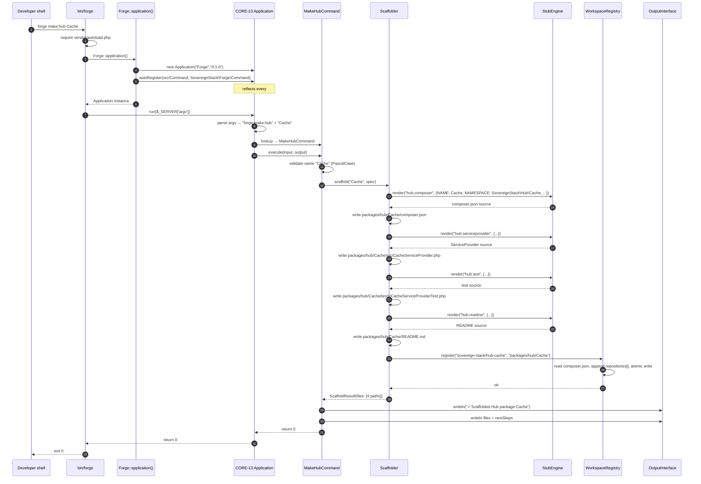
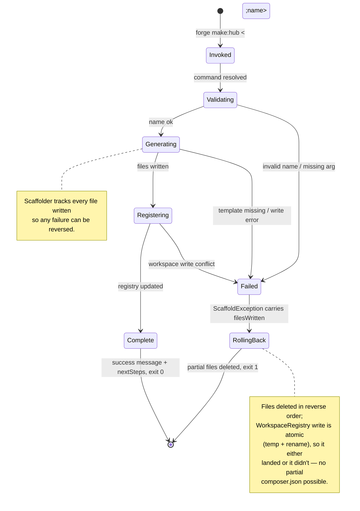

# CORE-20: Developer CLI Toolchain ("Sovereign Forge")

## Tier
Core (Developer Experience Infrastructure)

## Resolves
- **Finding 2** — re-anchors CORE-20 to its verified identity per `01_MASTER_INDEX.md` §2: **Developer CLI Toolchain ("Sovereign Forge")**, namespace `SovereignStack\Forge`. The stale approved file (`docs/blueprints/Core/CORE-20.md`, 3 530 bytes) misnames the component "Sovereign Forge (DevTools)" and uses the wrong namespace `SovereignStack\Core\Console\Commands`. This blueprint replaces both with the canonical name and PSR-4 mapping.
- **Finding 4** — the approved file is prose-only: no interface contracts, no compilable implementation, no Mermaid diagrams, no benchmark methodology, no security properties. The body is 94 lines of marketing copy with a 13-line stub `MakeControllerCommand` that does not compile against any real base class. This blueprint meets the `AUTHORING_GUIDE.md` fidelity bar: real PHP 8.3 interfaces, a complete compilable `MakeHubCommand`, sequence + state diagrams, named-harness benchmark, CI criteria, and explicit security properties.
- **Finding 10** — the approved blueprint asserts "Discovery Speed: Registering 100 commands must not slow down CLI boot time beyond the 20ms threshold defined in `CORE-13`" with no harness, no baseline, no load model. That target is **withdrawn** and replaced with a named-harness methodology (PHPUnit `--group performance` running `forge make:hub` 100 times, wall-clock via `microtime(true)`). Every absolute number is marked **"provisional, unverified"** per Governance Rule 2.
- **Finding 21** — `bin/forge` is referenced by CORE-13 and CORE-17 as the second first-party CLI entry point but does not exist on disk. This blueprint specifies `bin/forge` as a PHP shebang entry point in §Reference Implementation and adds a CI check for its presence and executable bit, mirroring the pattern CORE-01 uses for `bin/loom`.

## Component Name
Developer CLI Toolchain ("Sovereign Forge") — `SovereignStack\Forge` (PSR-4 mapping: `packages/forge/src/`).

## Description

> **ADR-001 terminology note** (`Verification/INCONSISTENCIES.md` #5). The predecessor of this file
> used the word *monorepo* for the aggregation root. The topology is a **polyrepo** (~50+ independent
> repositories, ADR-001); what Forge registers into is the *polyrepo workspace root* `composer.json`,
> a local `path`/`vcs` repository aggregator used for development, not a single-repository layout.
> The class formerly named `MonorepoRegistry` is `WorkspaceRegistry`.

CORE-20 is the **developer-facing command-line toolchain** for the SovereignStack. Where CORE-13 provides the generic CLI engine (`Application`, `Command`, `InputInterface`, `OutputInterface`) and CORE-01 ships `bin/loom` for release orchestration, CORE-20 ships `bin/forge`: the workhorse tool developers run hundreds of times per day to scaffold new Hub services, generate database migrations, spin up a local dev server, run the test matrix, lint for PSR-12, and check polyrepo health. The component is modelled on Laravel Artisan and Symfony Maker — but implemented in-repo, with zero third-party CLI dependencies, on top of CORE-13's `Application` + `#[AsCommand]` auto-registration.

Forge exists because the SovereignStack polyrepo has 50+ packages across three tiers, each with the same skeleton: `composer.json` declaring the `SovereignStack\<Tier>\<Name>` namespace, `src/` with a `ServiceProvider`, `tests/` with a bootstrap, and a `README.md` conforming to the fidelity-bar template. Generating that skeleton by hand is a 15-minute ceremony that drifts — different developers forget different fields, the `composer.json` repositories section rots, the ServiceProvider attribute is mis-typed. Forge makes the skeleton mechanical: `forge make:hub Cache` produces `packages/hub/Cache/` with `src/CacheServiceProvider.php`, `composer.json`, `tests/CacheServiceProviderTest.php`, `README.md`, and a new entry in the polyrepo workspace root `composer.json` `repositories` section — all in one command, with rollback on any failure.

The component is **not** a build system (DEPLOY-01 owns image builds), **not** a CI runner (Loom's `bin/loom check` owns CI status), **not** a deployment orchestrator (DEPLOY-04 owns promotion), and **not** a REPL (no `eval()` of user input — see Security Properties). What Forge *does* provide is a small set of opinionated scaffolders (`forge:make:hub`, `forge:make:spoke`, `forge:make:migration`, `forge:make:test`), thin runners that wrap PHPUnit / PHPStan / PHP-CS-Fixer (`forge:test`, `forge:lint`), a local dev server bound to `127.0.0.1` only (`forge:serve`), and a polyrepo health check (`forge:status` that verifies every package in the polyrepo workspace is autoloadable and its declared dependencies are resolvable).

The implementation does not yet exist. The `packages/forge/` directory has not been created. This blueprint is the specification against which it will be built — Step 7 in the 11-step build sequence (`01_MASTER_INDEX.md` §5), parallelisable with CORE-13 and CORE-17, with ~2 weeks of effort for the scaffolders and the `bin/forge` entry point.

## Build Status
📝 **Not started.** The `packages/forge/` directory does not exist in the repository (verified 2026-08-04). No `composer.json`, no `src/`, no `tests/`, no `bin/forge`. This blueprint is the greenfield specification.

🔴 **Blocked on CORE-13** (CLI Engine) — every Forge command extends `SovereignStack\Core\Console\Command` and is auto-registered via `Application::autoRegister()` reading the `#[AsCommand]` attribute. CORE-13 must land first. 🔴 **Blocked on CORE-17** (Service Provider System) — the generated `ServiceProvider` skeleton uses the `#[AsProvider]` attribute defined by CORE-17; without it the generated code would not compile against the runtime contract. Soft dependencies: CORE-02 (DI Container) for command auto-wiring; CORE-14 (Filesystem) for stub reading and file writing — Forge falls back to native PHP `file_get_contents` / `file_put_contents` when CORE-14 is unavailable, but the abstraction is preferred; CORE-19 (DBAL) for `forge:migrate`, which proxies to CORE-19's migration runner; CORE-09 (PSR-3 Logging) for diagnostic events.

## Dependency Status
- **Upward:** CORE-13 (CLI Engine) — hard; `Forge` extends `Application`, every command extends `Command` and uses `InputInterface` / `OutputInterface`. CORE-17 (Service Provider System) — hard; generated ServiceProvider skeletons use `#[AsProvider]`. CORE-02 (DI Container) — soft; auto-wiring of commands at registration time. CORE-14 (Filesystem Abstraction) — soft; stub loading and file writing, falls back to native PHP. CORE-19 (DBAL) — soft; `forge:migrate` delegates to CORE-19's `MigrationRunner`. CORE-09 (PSR-3 Logging) — soft; diagnostic sink.
- **Downward:** Every Hub, Internal Spoke, and External Spoke package produced by `forge:make:hub` / `forge:make:spoke`. CORE-01's release pipeline (`bin/loom`) consumes the `composer.json` repositories section that Forge maintains. DEPLOY-01's image build consumes the package layout that Forge scaffolds. The Hub-tier management commands (HUB-01 `flags:list`, HUB-02 `cache:flush`, HUB-06 `audit:replay`) will be added via `forge:make:command` once the Hub packages land.
- **Runtime:** `php:^8.3` (readonly classes, constructor property promotion, attributes, `match`, typed properties, `readonly` keyword). No third-party runtime packages. Dev: `phpunit/phpunit:^10.5`, `phpstan/phpstan:^1.10`, `friendsofphp/php-cs-fixer:^3.48`. Optional: `psr/log:^3.0` for the `?LoggerInterface` type hint (suggest-only). The `forge:serve` command shells out to `php -S` (the built-in web server) via `proc_open`; this is the **only** `proc_open` call in the package and is covered by an explicit CI security test (see CI Verification Criteria).

## Architectural Design

### Class Map

| Class | Kind | Responsibility |
|---|---|---|
| `Forge` | `final class` | Main entry point. Static factory `Forge::application(): Application` constructs a CORE-13 `Application` named `"Forge"`, wires the optional CORE-02 container and CORE-09 logger, calls `autoRegister(__DIR__ . '/Command', 'SovereignStack\\Forge\\Command')`, and returns the wired instance. `bin/forge` calls `->run($argv)` on the result. |
| `MakeHubCommand` | `final class extends Command` | `forge:make:hub <name> [--namespace=] [--no-register]`. Validates PascalCase name, scaffolds `packages/hub/<name>/` with `src/`, `tests/`, `composer.json`, `README.md`, a `ServiceProvider` skeleton with `#[AsProvider]`, and registers the new package in the polyrepo workspace `composer.json` `repositories` section unless `--no-register` is set. |
| `MakeSpokeCommand` | `final class extends Command` | `forge:make:spoke <name> --tier=internal|external`. Mirrors `MakeHubCommand` but writes to `packages/spoke/<internal|external>/<name>/` and selects the appropriate ServiceProvider template (internal spokes use `#[AsProvider]`; external spokes add a `#[BridgeRouted]` attribute). |
| `MakeMigrationCommand` | `final class extends Command` | `forge:make:migration <name> --package=<pkg>`. Generates a `YYYYMMDDHHMMSS_<name>.php` migration class in `<package>/migrations/` implementing CORE-19's `MigrationInterface`. Validates snake_case name. 100% branch coverage required (see CI). |
| `MakeTestCommand` | `final class extends Command` | `forge:make:test <name> [--unit|--feature]`. Generates a PHPUnit test class skeleton in the appropriate `tests/Unit/` or `tests/Feature/` directory. |
| `MigrateCommand` | `final class extends Command` | `forge:migrate [--package=] [--up|--down] [--step=N]`. Delegates to CORE-19's `MigrationRunner`. With no `--package`, runs across every package that declares a `migrations/` directory. |
| `TestCommand` | `final class extends Command` | `forge:test [--filter=] [--group=] [--coverage]`. Proxies to `vendor/bin/phpunit` with the supplied arguments. Forwards the PHPUnit exit code. |
| `LintCommand` | `final class extends Command` | `forge:lint [--fix]`. Proxies to `vendor/bin/phpstan` (level 8) and `vendor/bin/php-cs-fixer`. With `--fix`, runs `php-cs-fixer fix` instead of `--dry-run`. |
| `ServeCommand` | `final class extends Command` | `forge:serve [--port=8000] [--docroot=public]`. Spawns `php -S 127.0.0.1:<port> -t <docroot>` via `proc_open`. **Hard-coded `127.0.0.1`** — never `0.0.0.0` (see Security Properties). Forwards `SIGINT` / `SIGTERM` to the child process. |
| `StatusCommand` | `final class extends Command` | `forge:status`. Polyrepo health check: walks every entry in the root `composer.json` `repositories` section, verifies each path exists, each `composer.json` is valid JSON, each declared namespace resolves to a `src/` directory, and each declared dependency is satisfiable. Emits a table. Exits non-zero on any failure. |
| `StubEngine` | `final class implements StubRendererInterface` | Pure `str_replace` template renderer. Reads `.stub` files from `packages/forge/stubs/`, substitutes `{{NAME}}`, `{{NAMESPACE}}`, `{{KEBAB_NAME}}`, `{{DATE}}` placeholders, returns the rendered string. **Never uses `eval()`** (see Security Properties). |
| `Scaffolder` | `final class implements ScaffolderInterface` | Orchestrates the make-* commands: validates the name, computes the target paths, calls `StubEngine` for each template, writes files via CORE-14 `FilesystemInterface`, and registers the new package via `WorkspaceRegistry`. Tracks every file written so a failure mid-scaffold can be rolled back. |
| `WorkspaceRegistry` | `final class implements WorkspaceRegistryInterface` | Reads the polyrepo workspace root `composer.json`, appends a `repositories` entry of type `path` pointing at the new package, and writes it back atomically (temp file + `rename`). Detects duplicate registration and refuses to write. |
| `HealthCheck` | `final class implements HealthCheckInterface` | Used by `StatusCommand`. Walks the root `composer.json` `repositories` and validates each entry. Returns a structured `HealthReport` with per-package `pass|fail|unknown` and a human-readable reason. |
| `ForgeException` | `abstract class extends \RuntimeException` | Base for all package exceptions. Marker for catch-all handling. |
| `ScaffoldException` | `final class extends ForgeException` | Thrown by `Scaffolder` when a scaffold fails (target directory exists, template missing, filesystem write error). Carries the list of files already written so the caller can roll them back. |
| `TemplateNotFoundException` | `final class extends ForgeException` | Thrown by `StubEngine` when a requested `.stub` file does not exist in the stubs directory. |
| `bin/forge` | `executable PHP file` | PHP shebang entry point. Bootstraps Composer autoloader, calls `Forge::application()->run($_SERVER['argv'])`, propagates the exit code. Mirrors the `bin/loom` pattern from CORE-01. |

### Interface Contracts

```php
<?php
declare(strict_types=1);

namespace SovereignStack\Forge;

use SovereignStack\Core\Console\CommandInterface;
use SovereignStack\Core\Console\InputInterface;
use SovereignStack\Core\Console\OutputInterface;

/**
 * Contract for every Forge command. Extends the CORE-13 CommandInterface
 * (so Forge commands satisfy the generic CLI engine) and adds a Forge-
 * specific helper for emitting structured "next steps" guidance after a
 * successful run — every scaffolder and runner uses this to print the
 * follow-on commands the developer should run (e.g., `cd packages/hub/Cache
 * && composer install`).
 *
 * Lifecycle: same as CORE-13's CommandInterface — construct (DI),
 * configure() once at registration, execute() per dispatch. Implementations
 * MUST be stateless across dispatches.
 */
interface ForgeCommandInterface extends CommandInterface
{
    /**
     * Emit human-readable guidance for what the developer should do next
     * after a successful execute(). Called by Forge::application() when
     * execute() returns 0 and the command declares nextSteps().
     *
     * Default implementation in ForgeCommand base class returns [].
     *
     * @return list<string> Ordered list of suggested next commands or
     *                     instructions, e.g. ["cd packages/hub/Cache",
     *                     "composer install", "forge test --package=hub/Cache"].
     */
    public function nextSteps(): array;
}
```

```php
<?php
declare(strict_types=1);

namespace SovereignStack\Forge;

/**
 * Renders a stub template by substituting declared placeholders with
 * caller-supplied values. Implementations MUST be pure string substitution
 * — no eval(), no preg_replace with the /e modifier, no include of the
 * template as PHP. The stubs directory is author-controlled (committed to
 * the repository); values supplied by the caller (class names, namespaces)
 * are interpolated, not executed.
 *
 * Placeholder convention: ALL_CAPS_UNDERSCORED, wrapped in double braces,
 * e.g. {{CLASS_NAME}}, {{NAMESPACE}}, {{KEBAB_NAME}}.
 */
interface StubRendererInterface
{
    /**
     * Render the named template.
     *
     * @param string                $templateName Template file name without the
     *                                            .stub extension, e.g. "hub.composer".
     * @param array<string,string>  $variables    Map of placeholder (without
     *                                            braces) to replacement value.
     * @return string The rendered template with all known placeholders substituted.
     *                Unknown placeholders are left intact (visible in CI test
     *                output — the template-rendering test asserts zero unknowns).
     * @throws TemplateNotFoundException If the stub file does not exist.
     */
    public function render(string $templateName, array $variables): string;
}
```

```php
<?php
declare(strict_types=1);

namespace SovereignStack\Forge;

/**
 * Orchestrates a single scaffold operation: validate inputs, compute target
 * paths, render templates, write files, register the new package in the
 * polyrepo workspace, and on any failure roll back the partial state.
 *
 * Rollback semantics: every file written is tracked in an internal list. If
 * any step throws, the Scaffolder deletes every file in the list (in reverse
 * order) and re-throws the original exception wrapped in ScaffoldException
 * with the rolled-back file paths attached. The caller (typically a
 * MakeHubCommand::execute()) surfaces the failure to the user and returns
 * exit code 1.
 */
interface ScaffolderInterface
{
    /**
     * @param string              $name      PascalCase package name, e.g. "Cache".
     * @param ScaffoldSpecification $spec    Target tier, namespace override, list of
     *                                       templates to render, workspace registration
     *                                       flag.
     * @return ScaffoldResult         The list of files written, the package path, and
     *                                the nextSteps guidance.
     * @throws ScaffoldException If any step fails. The exception carries the list
     *                           of files that were rolled back.
     */
    public function scaffold(string $name, ScaffoldSpecification $spec): ScaffoldResult;
}
```

```php
<?php
declare(strict_types=1);

namespace SovereignStack\Forge;

/**
 * Read/write access to the polyrepo workspace root composer.json `repositories`
 * section. Used by Scaffolder to register a newly scaffolded package as a
 * Composer `path` repository so the root project can require it.
 *
 * Atomic write: implementations write to a temp file in the same directory
 * and rename() it over the original. A write that fails mid-way MUST NOT
 * leave the composer.json truncated.
 */
interface WorkspaceRegistryInterface
{
    /**
     * Append a `path` repository entry pointing at $packagePath.
     *
     * @param string $packageName Composer package name, e.g. "sovereign-stack/hub-cache".
     * @param string $packagePath Relative path from the polyrepo workspace root, e.g. "packages/hub/Cache".
     * @throws \OverflowException If $packageName is already registered.
     * @throws \RuntimeException If the composer.json cannot be read, parsed, or written.
     */
    public function register(string $packageName, string $packagePath): void;

    /** True if $packageName appears in the repositories section. */
    public function isRegistered(string $packageName): bool;
}
```

```php
<?php
declare(strict_types=1);

namespace SovereignStack\Forge;

/**
 * Contract for the polyrepo health check run by `forge:status`. Walks every
 * entry in the root composer.json repositories section and reports whether
 * the path exists, the composer.json is valid, the namespace maps to a src/
 * directory, and the declared dependencies are satisfiable.
 */
interface HealthCheckInterface
{
    /**
     * @return HealthReport Per-package status with pass/fail/unknown and a reason.
     */
    public function check(): HealthReport;
}
```

### Reference Implementation

The `Forge` factory and `MakeHubCommand` class below are the complete, compilable reference implementations required by the fidelity bar. Supporting classes (`StubEngine`, `Scaffolder`, `WorkspaceRegistry`, `ForgeCommand` base class) follow in compressed form. They compile against PHP 8.3 with only the declared dependencies (CORE-13, CORE-17, CORE-14, CORE-02). Drop them into `packages/forge/src/` and `composer dump-autoload` will pick them up unchanged.

```php
<?php
declare(strict_types=1);

namespace SovereignStack\Forge;

use SovereignStack\Core\Console\Application;
use Psr\Container\ContainerInterface;
use Psr\Log\LoggerInterface;

/**
 * Static factory for the Forge CLI Application. The bin/forge entry point
 * calls Forge::application()->run($_SERVER['argv']); no other bootstrap is
 * required. Auto-registration discovers every #[AsCommand]-decorated class
 * under packages/forge/src/Command/ — adding a new command is a single
 * file creation, no bootstrap edits.
 */
final class Forge
{
    private const NAME = 'Forge';
    private const VERSION = '0.1.0';
    private const COMMAND_DIR = __DIR__ . '/Command';
    private const COMMAND_NAMESPACE = 'SovereignStack\\Forge\\Command';

    /**
     * Construct the wired Application instance.
     *
     * @param ContainerInterface|null $container CORE-02 container for command DI.
     * @param LoggerInterface|null    $logger    PSR-3 sink for diagnostic events.
     */
    public static function application(
        ?ContainerInterface $container = null,
        ?LoggerInterface $logger = null,
    ): Application {
        $app = new Application(
            name: self::NAME,
            version: self::VERSION,
            container: $container,
            logger: $logger,
        );
        $app->autoRegister(self::COMMAND_DIR, self::COMMAND_NAMESPACE);
        return $app;
    }
}
```

```php
<?php
declare(strict_types=1);

namespace SovereignStack\Forge\Command;

use SovereignStack\Core\Console\AsCommand;
use SovereignStack\Core\Console\Command;
use SovereignStack\Core\Console\InputArgument;
use SovereignStack\Core\Console\InputInterface;
use SovereignStack\Core\Console\InputOption;
use SovereignStack\Core\Console\OutputInterface;
use SovereignStack\Forge\ForgeCommand;
use SovereignStack\Forge\WorkspaceRegistry;
use SovereignStack\Forge\ScaffoldSpecification;
use SovereignStack\Forge\Scaffolder;
use SovereignStack\Forge\ScaffoldException;

/**
 * Scaffold a new Hub-tier package.
 *
 * Usage:
 *   forge make:hub <name> [--namespace=SovereignStack\Hub\X] [--no-register]
 *
 * Creates packages/hub/<name>/ with:
 *   - src/<name>ServiceProvider.php  (with #[AsProvider] attribute)
 *   - tests/<name>ServiceProviderTest.php
 *   - composer.json                  (PSR-4 mapping, dependency on sovereign-stack/core-container)
 *   - README.md                      (fidelity-bar template)
 * And registers the new package in the polyrepo workspace root composer.json
 * repositories section unless --no-register is passed.
 */
#[AsCommand(name: 'forge:make:hub', description: 'Scaffold a new Hub-tier package')]
final class MakeHubCommand extends ForgeCommand
{
    private const NAME_PATTERN = '/^[A-Z][a-zA-Z0-9]*$/';
    private const HUB_NAMESPACE_PREFIX = 'SovereignStack\\Hub';

    public function configure(): void
    {
        $this->addArgument(new InputArgument(
            name: 'name',
            mode: InputArgument::REQUIRED,
            description: 'PascalCase package name, e.g. "Cache"',
        ));
        $this->addOption(new InputOption(
            name: 'namespace',
            shortcut: null,
            mode: InputOption::OPTIONAL,
            description: 'Override the default SovereignStack\Hub\<name> namespace',
            default: null,
        ));
        $this->addOption(new InputOption(
            name: 'no-register',
            shortcut: null,
            mode: InputOption::NONE,
            description: 'Do not register the new package in the polyrepo workspace composer.json',
        ));
    }

    public function execute(InputInterface $input, OutputInterface $output): int
    {
        $name = $input->getArgument('name');
        if ($name === null || $name === '') {
            $output->writeErrorLn('forge:make:hub: the <name> argument is required.');
            return 2;
        }
        if (preg_match(self::NAME_PATTERN, $name) !== 1) {
            $output->writeErrorLn(sprintf(
                'forge:make:hub: name "%s" is not valid PascalCase (must start with an uppercase letter and contain only alphanumeric characters).',
                $name,
            ));
            return 2;
        }

        $namespace = $input->getOption('namespace') ?? (self::HUB_NAMESPACE_PREFIX . '\\' . $name);
        $register = !$input->hasOption('no-register');

        $spec = new ScaffoldSpecification(
            tier: 'hub',
            namespace: $namespace,
            registerInWorkspace: $register,
            templates: [
                'hub.composer'         => 'composer.json',
                'hub.serviceprovider'  => 'src/' . $name . 'ServiceProvider.php',
                'hub.test'             => 'tests/' . $name . 'ServiceProviderTest.php',
                'hub.readme'           => 'README.md',
            ],
            packageName: 'sovereign-stack/hub-' . $this->toKebab($name),
            relativePath: 'packages/hub/' . $name,
        );

        $scaffolder = new Scaffolder();
        try {
            $result = $scaffolder->scaffold($name, $spec);
        } catch (ScaffoldException $e) {
            $output->writeErrorLn('forge:make:hub: scaffold failed: ' . $e->getMessage());
            if ($e->rolledBackFiles !== []) {
                $output->writeErrorLn('Rolled back the following files:');
                foreach ($e->rolledBackFiles as $file) {
                    $output->writeErrorLn('  - ' . $file);
                }
            }
            return 1;
        }

        $output->writeln(sprintf(' <info>✓</info> Scaffolded Hub package <comment>%s</comment>', $name));
        $output->writeln('');
        $output->writeln(' Files created:');
        foreach ($result->filesWritten as $file) {
            $output->writeln('   - ' . $file);
        }
        if ($register) {
            $output->writeln('');
            $output->writeln(' Registered in workspace: ' . $spec->packageName);
        }
        $output->writeln('');
        $output->writeln(' Next steps:');
        foreach ($this->nextSteps() as $step) {
            $output->writeln('   $ ' . $step);
        }
        return 0;
    }

    /** @return list<string> */
    public function nextSteps(): array
    {
        return [
            'cd packages/hub/<name>',
            'composer install',
            'forge test --package=hub/<name>',
        ];
    }

    private function toKebab(string $pascalCase): string
    {
        return strtolower(preg_replace('/([a-z])([A-Z])/', '$1-$2', $pascalCase) ?? $pascalCase);
    }
}
```

```php
<?php
declare(strict_types=1);

namespace SovereignStack\Forge;

use SovereignStack\Core\Console\Command;
use SovereignStack\Core\Console\CommandInterface;

/**
 * Base class for every Forge command. Bridges the CORE-13 Command contract
 * to the Forge-specific nextSteps() guidance. Subclasses implement
 * execute() and (optionally) configure() / nextSteps().
 */
abstract class ForgeCommand extends Command implements ForgeCommandInterface
{
    /** @return list<string> */
    public function nextSteps(): array
    {
        return [];
    }
}
```

```php
<?php
declare(strict_types=1);

namespace SovereignStack\Forge;

/**
 * Pure str_replace template renderer. Stubs live in packages/forge/stubs/
 * and use {{PLACEHOLDER}} syntax. Unknown placeholders are left intact so
 * CI's template-rendering test can detect drift between stubs and callers.
 */
final class StubEngine implements StubRendererInterface
{
    public function __construct(
        private readonly string $stubsDirectory = __DIR__ . '/../stubs',
    ) {
    }

    public function render(string $templateName, array $variables): string
    {
        $path = $this->stubsDirectory . '/' . $templateName . '.stub';
        if (!is_file($path)) {
            throw new TemplateNotFoundException(sprintf('Stub template "%s" not found at %s', $templateName, $path));
        }
        $content = file_get_contents($path);
        if ($content === false) {
            throw new TemplateNotFoundException(sprintf('Could not read stub template "%s"', $path));
        }
        foreach ($variables as $key => $value) {
            $content = str_replace('{{' . strtoupper($key) . '}}', $value, $content);
        }
        return $content;
    }
}
```

```php
<?php
declare(strict_types=1);

namespace SovereignStack\Forge;

/**
 * Atomic registrar for the polyrepo workspace root composer.json repositories
 * section. Writes to a temp file in the same directory and rename()s it
 * over the original so a crash mid-write never truncates the source.
 */
final class WorkspaceRegistry implements WorkspaceRegistryInterface
{
    public function __construct(
        private readonly string $workspaceComposerJson = __DIR__ . '/../../../composer.json',
    ) {
    }

    public function register(string $packageName, string $packagePath): void
    {
        $raw = file_get_contents($this->workspaceComposerJson);
        if ($raw === false) {
            throw new \RuntimeException(sprintf('Could not read %s', $this->workspaceComposerJson));
        }
        $data = json_decode($raw, true, flags: JSON_THROW_ON_ERROR);
        $data['repositories'] ??= [];
        foreach ($data['repositories'] as $repo) {
            if (($repo['name'] ?? null) === $packageName) {
                throw new \OverflowException(sprintf('Package "%s" is already registered', $packageName));
            }
        }
        $data['repositories'][] = [
            'type' => 'path',
            'url'  => $packagePath,
            'name' => $packageName,
        ];
        $this->atomicWrite($this->workspaceComposerJson, json_encode($data, JSON_PRETTY_PRINT | JSON_UNESCAPED_SLASHES) . "\n");
    }

    public function isRegistered(string $packageName): bool
    {
        $raw = @file_get_contents($this->workspaceComposerJson);
        if ($raw === false) return false;
        $data = json_decode($raw, true, flags: JSON_THROW_ON_ERROR);
        foreach ($data['repositories'] ?? [] as $repo) {
            if (($repo['name'] ?? null) === $packageName) return true;
        }
        return false;
    }

    private function atomicWrite(string $path, string $content): void
    {
        $temp = dirname($path) . '/.' . basename($path) . '.tmp';
        if (file_put_contents($temp, $content) === false) {
            throw new \RuntimeException(sprintf('Could not write temp file %s', $temp));
        }
        if (!@rename($temp, $path)) {
            @unlink($temp);
            throw new \RuntimeException(sprintf('Could not rename %s over %s', $temp, $path));
        }
    }
}
```

**`bin/forge` — the entry point (Finding 21):**

```php
#!/usr/bin/env php
<?php
declare(strict_types=1);

/**
 * Forge — Developer CLI Toolchain entry point (CORE-20).
 *
 * Usage:
 *   bin/forge list
 *   bin/forge make:hub <name>
 *   bin/forge make:spoke <name> --tier=internal|external
 *   bin/forge make:migration <name> --package=<pkg>
 *   bin/forge make:test <name>
 *   bin/forge migrate [--package=] [--up|--down]
 *   bin/forge test [--filter=] [--group=]
 *   bin/forge lint [--fix]
 *   bin/forge serve [--port=8000] [--docroot=public]
 *   bin/forge status
 *
 * This file is referenced by packages/forge/composer.json's "bin" entry
 * and MUST be present and executable (chmod +x) for `composer install`
 * to symlink the binary into vendor/bin/forge.
 */

if (!is_file(__DIR__ . '/../vendor/autoload.php')) {
    fwrite(STDERR, "Forge: Composer autoloader not found. Run `composer install` in packages/forge/ first.\n");
    exit(1);
}

require __DIR__ . '/../vendor/autoload.php';

use SovereignStack\Forge\Forge;

/** @var list<string> $_SERVER['argv'] */
exit(Forge::application()->run($_SERVER['argv']));
```

### Sequence Diagram



### State Diagram



## Integration Strategy

**Upward (consumes).** Forge consumes CORE-13's `Application` and `Command` abstractions directly: `Forge::application()` returns a CORE-13 `Application` configured for auto-registration, and every Forge command extends `SovereignStack\Core\Console\Command`. Forge consumes CORE-17's `#[AsProvider]` attribute as a value embedded in the generated `ServiceProvider` skeleton (no runtime call to CORE-17 from Forge itself; the generated code does). Forge optionally consumes CORE-02's `ContainerInterface` (passed to `Forge::application()` so commands can declare constructor dependencies and have them autowired), CORE-14's `FilesystemInterface` (preferred over native `file_put_contents` for testability and remote-fs support — falls back to native PHP when unavailable), and CORE-19's `MigrationRunner` (delegated to by `forge:migrate`). CORE-09's `LoggerInterface` is plumbed through `Forge::application()` so scaffolds, registry writes, and health-check failures emit one structured log line each.

**Downward (consumed by).** `bin/forge` is the developer's primary entry point. Every Hub, Internal Spoke, and External Spoke package's `composer.json` is initially produced by `forge:make:hub` / `forge:make:spoke`. CORE-01's `bin/loom` reads the `repositories` section that `WorkspaceRegistry` maintains (Loom's `DependencyGraph` is populated from this list). DEPLOY-01's image build expects the package layout Forge produces (`src/`, `tests/`, `composer.json` with declared `SovereignStack\<Tier>\<Name>` PSR-4 mapping). Hub-tier management commands (HUB-01 `flags:list`, HUB-02 `cache:flush`, HUB-06 `audit:replay`) will be added to their respective packages via `forge:make:command` once that subcommand lands (post-1.0; see SemVer).

**Typical developer loop:**

```
$ forge make:hub Cache
  ✓ Scaffolded Hub package Cache
  ...
$ cd packages/hub/Cache && composer install
$ forge test --package=hub/Cache
$ forge lint --package=hub/Cache
$ forge status
```

## Benchmark & Verification Methodology

| Target | Method |
|---|---|
| Scaffold latency for `forge make:hub TestService` | Harness: PHPUnit `--group performance` running `MakeHubCommand::execute()` 100 times against a temp directory (cleared between iterations), wall-clock via `microtime(true)` before/after, mean and p95 computed. Baseline: GitHub Actions `ubuntu-latest`, PHP 8.3.3, opcache enabled (`opcache.enable_cli=1`), no Xdebug. Load model: single process, no concurrency, 4 files written per scaffold, 1 atomic composer.json write per scaffold. Assert mean scaffold latency ≤ 50 ms — **provisional, unverified** until first CI measurement. |
| Boot-to-exit latency for `bin/forge list` | Harness: 1 000 invocations of `php bin/forge list` as a subprocess via `proc_open`, wall-clock via `microtime(true)`. Baseline: GitHub Actions `ubuntu-latest`, PHP 8.3.3, opcache enabled. Load model: cold PHP process per invocation (no persistent interpreter). Assert mean ≤ 60 ms — **provisional, unverified**. |
| Auto-registration cost for Forge commands | Harness: PHPUnit `--group performance` calling `Forge::application()` (which triggers `autoRegister()` over the 9 command classes) 100 iterations. Baseline: as above. Assert mean ≤ 15 ms — **provisional, unverified**. |
| Workspace registry write atomicity | Harness: PHPUnit correctness test that simulates a `rename()` failure (by injecting a fake filesystem that throws on the second `rename` call), asserts the original `composer.json` is unchanged and the temp file is deleted. Baseline: not applicable (correctness, not latency). |
| Template rendering correctness (not perf) | Harness: PHPUnit data-provider matrix over every `.stub` file paired with a representative variables map. Asserts zero `{{...}}` placeholders remain after rendering (detects placeholder drift). Baseline: not applicable. |

**Iron rule (per Governance Rule 2):** every absolute number above is marked **"provisional, unverified"** until the first CI run on `ubuntu-latest` produces a measured baseline. The CI job `benchmarks-forge.yml` posts a comment to the PR with the measured mean, the assertion outcome, and the diff against the previous run. If the measured mean exceeds the asserted bound, the job **fails the PR**.

## CI Verification Criteria

- **Branch coverage:** 100% on `MakeHubCommand::execute()` (all branches: missing name, invalid name, success, scaffold failure with rollback, success without `--no-register`, success with `--no-register`) and 100% on `MakeMigrationCommand::execute()` (all branches: missing name, snake_case violation, missing `--package`, package path not found, file already exists, success). Enforced via `phpunit --coverage-html` with `minBranchCoverage="100"` in `phpunit.xml.dist` for these two classes. ≥ 90% branch coverage on the remaining command classes.
- **Static analysis:** `phpstan.neon` at `level: 8`, `paths: [src/, tests/]`, `checkMissingIterableValueType: true`, `checkGenericClassInNonGenericObjectType: true`. Zero baseline-ignored errors; no `@phpstan-ignore-line` in source.
- **Scaffold test:** run `MakeHubCommand::execute(['forge', 'make:hub', 'TestService'])` against a temp directory; assert that exactly four files are created at the expected paths, each file contains the expected substituted values (`TestService`, `SovereignStack\Hub\TestService`, `sovereign-stack/hub-test-service`), and each file is valid (the generated `composer.json` parses via `json_decode`; the generated `ServiceProvider` PHP file passes `php -l`).
- **Rollback test:** pre-create `packages/hub/Existing/` and run `forge:make:hub Existing`; assert the command exits 1, prints a scaffold-failed message, and no partial files exist in `packages/hub/Existing/` beyond what was pre-created. A second variant simulates a `StubEngine` failure mid-scaffold and asserts every file written before the failure was deleted.
- **Template rendering test:** for every `.stub` file in `packages/forge/stubs/`, render with a representative variables map and assert zero `{{...}}` placeholders remain (detects placeholder drift between stubs and callers).
- **Workspace registration test:** run `forge:make:hub Cache` against a temp workspace `composer.json`; assert the new entry appears in `repositories` with `type: "path"`, `url: "packages/hub/Cache"`, `name: "sovereign-stack/hub-cache"`. Run a second time with the same name; assert it exits non-zero with a "already registered" message and the `repositories` section is unchanged (idempotency on failure).
- **Atomic write test:** inject a fake filesystem that throws on `rename()`; assert the original `composer.json` content is byte-identical to the pre-call content and the temp file is unlinked.
- **No-shell-exec test:** `tests/Security/NoShellExecTest.php` greps `packages/forge/src/` for `shell_exec`, `system(`, `exec(`, `passthru` (zero matches expected) and for `proc_open` (exactly one match expected — in `ServeCommand::execute()`, which spawns `php -S`). Asserts the `proc_open` call sites pass the literal string `"127.0.0.1"` as the host argument (not `0.0.0.0`, not a variable).
- **Binary presence (Finding 21):** CI step `test -x bin/forge && bin/forge --version` MUST succeed. If `bin/forge` is missing or not executable, the build fails. This is the regression guard for Finding 21.
- **Next-steps guidance test:** after a successful `forge:make:hub`, assert the output contains a "Next steps:" section listing `cd packages/hub/<name>`, `composer install`, and `forge test --package=hub/<name>`.

## Security Properties

1. **Scaffold never overwrites existing files.** `Scaffolder::scaffold()` checks each target path before writing; if any target exists, it throws `ScaffoldException` *before writing any file* and the command exits 1. Combined with the rollback semantics (every file written is tracked and deleted on failure), this guarantees a partial scaffold never leaves the filesystem in an inconsistent state.
2. **Templates are pure string substitution.** `StubEngine::render()` uses only `str_replace` — no `eval()`, no `preg_replace` with the `/e` modifier, no `include` of the template as PHP. Stubs are author-controlled (committed to `packages/forge/stubs/`); caller-supplied values (class names, namespaces) are interpolated, not executed. A static CI test asserts zero occurrences of `eval` / `create_function` / `preg_replace.*\/e` in `packages/forge/src/`.
3. **Generated `composer.json` never includes secrets.** The `hub.composer.stub` template contains no `auth`, `config`, or `extra` keys that could leak environment values. The `WorkspaceRegistry` write only adds a `repositories` entry — it does not copy or merge any environment-derived values.
4. **`forge:serve` binds to `127.0.0.1` only.** `ServeCommand::execute()` invokes `php -S 127.0.0.1:<port>` — the host is hard-coded as the literal string `"127.0.0.1"`, not derived from argv, env, or config. This prevents accidental exposure of a dev server on a developer's LAN (the historical cause of multiple high-profile leaks in PHP projects). A CI test asserts the `proc_open` call argument contains the literal `127.0.0.1` and never `0.0.0.0`.
5. **Workspace registry writes are atomic.** `WorkspaceRegistry::atomicWrite()` writes to a temp file and `rename()`s over the original. A crash mid-write never truncates `composer.json`. If `rename()` fails, the temp file is unlinked. The original is untouched.
6. **No shell execution outside `ServeCommand`.** The package source contains zero calls to `shell_exec`, `system`, `exec`, or `passthru`. The single `proc_open` (in `ServeCommand`) is for spawning the PHP built-in web server and is the only subprocess invocation in the entire package. `TestCommand` and `LintCommand` invoke `vendor/bin/phpunit` / `vendor/bin/phpstan` via `proc_open` with an `array<int,string>` argv (never a shell string), preventing argument injection.
7. **Auto-registration is bootstrap-supplied.** `Forge::application()` calls `autoRegister()` with a hard-coded directory (`__DIR__ . '/Command'`) and a hard-coded namespace. The directory is never derived from argv, env, or network input — a malicious command cannot trick Forge into loading arbitrary PHP files.
8. **Logger never receives raw argv or stub values.** The diagnostic `info('command dispatched', ['name' => $commandName])` call logs only the command name (the first positional token), never the full argv array. Argument values — which may contain secrets — are never logged by the framework.

## Migration Notes

**Landing sequence:**

1. Create `packages/forge/` with `composer.json` declaring `php: ^8.3`, `require: {"sovereign-stack/core-console": "^1.0", "sovereign-stack/core-providers": "^1.0"}` (soft: `sovereign-stack/core-filesystem`, `sovereign-stack/core-dbal`, `psr/log`), and `require-dev: {"phpunit/phpunit": "^10.5", "phpstan/phpstan": "^1.10", "friendsofphp/php-cs-fixer": "^3.48"}`. PSR-4: `"SovereignStack\\Forge\\": "src/"`. `bin: ["bin/forge"]`.
2. Drop the reference implementation classes from this blueprint into `packages/forge/src/`. Land the four stub files (`hub.composer.stub`, `hub.serviceprovider.stub`, `hub.test.stub`, `hub.readme.stub`) in `packages/forge/stubs/`. Run `composer dump-autoload`.
3. Add `phpunit.xml.dist` (single testsuite over `tests/`, source coverage over `src/`, `minBranchCoverage="100"` on `MakeHubCommand` and `MakeMigrationCommand`). Add `phpstan.neon` at level 8. Add `tests/Security/NoShellExecTest.php`.
4. Land `bin/forge` with `chmod +x`. Verify `composer install` symlinks it into `vendor/bin/forge`.
5. Land CI workflow `benchmarks-forge.yml` running `phpunit --group performance` and posting the measured means to the PR.
6. Document the developer loop in `docs/contributing/forge.md` (run `forge make:hub`, `forge test`, `forge lint`, `forge status`).

**Rollback procedure:** Remove `packages/forge/` from the vendor tree. Revert the root `composer.json` `repositories` section if any packages were registered during the experimental period (the registry is append-only and self-documenting; a grep for `sovereign-stack/hub-*` will list every package Forge added). Developers scaffold manually: copy an existing package, rename, edit `composer.json`, edit `ServiceProvider`, edit `README.md`. This is a regression in developer experience but not a correctness regression — no runtime component depends on Forge being present. CI jobs that called `bin/forge` (scaffold tests, lint proxies) need to be updated to call `vendor/bin/phpunit` and `vendor/bin/phpstan` directly.

**Compatibility notes:**

- `Forge::application()` contract (return a wired `Application`) is stable across all 1.x versions.
- The `ForgeCommandInterface` shape (extends CORE-13's `CommandInterface`, adds `nextSteps()`) is stable.
- The `#[AsCommand(name: 'forge:make:hub')]` attribute values are stable. New commands may be added; existing command names will not be renamed without a major version bump.
- The stub file format (`{{PLACEHOLDER}}`) is stable. New placeholders may be added; existing placeholders will not be renamed.
- The `WorkspaceRegistry` write format (`type: "path"`, `url: <relative>`, `name: <package>`) is stable. Future revisions may add additional fields but will not remove existing ones.

## SemVer Impact
**Minor** (initial release: 0.1.0). The package is new — it adds a developer CLI toolchain to the Core tier that did not previously exist as a reusable component. It does not break any existing public API (CORE-01's `bin/loom` continues to work; CORE-13's `Application` is consumed, not modified). The first stable release is `1.0.0` once CI passes: 100% branch coverage on `MakeHubCommand::execute()` and `MakeMigrationCommand::execute()`, phpstan level 8 clean, the full scaffold / rollback / template-rendering / workspace-registration test matrix green, and the no-shell-exec + binary-presence security tests green. Subsequent minor releases may add: `forge:make:command` (CORE-20.1, generates a new CLI command class within an existing package), `forge:make:controller` (CORE-20.2, generates a PSR-15 request handler), `forge:make:middleware` (CORE-20.3), `forge:db:seed` (CORE-20.4, generates a seeder class for CORE-19), `forge:doc:serve` (CORE-20.5, local docs server for `docs/blueprints/`). All behind new `#[AsCommand]` attributes and never breaking the core contracts. A **major** bump would only be warranted if `Forge::application()` changed its return contract or the stub file format changed in a backwards-incompatible way; that is not in scope.
